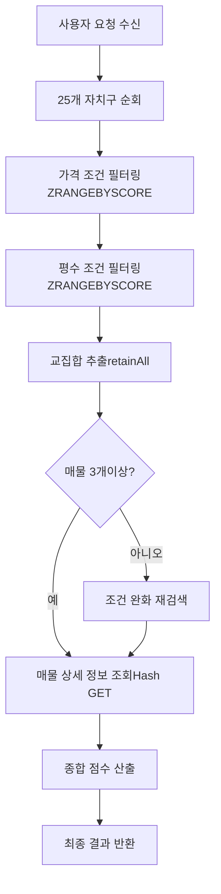
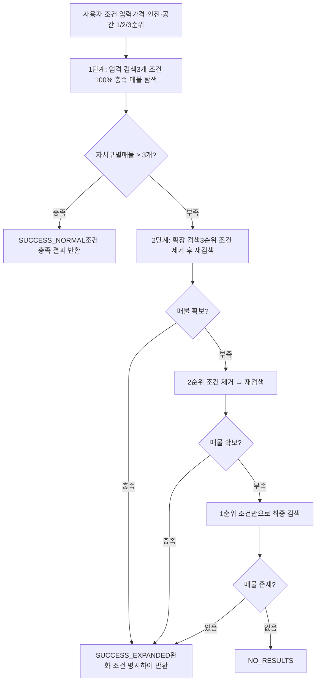
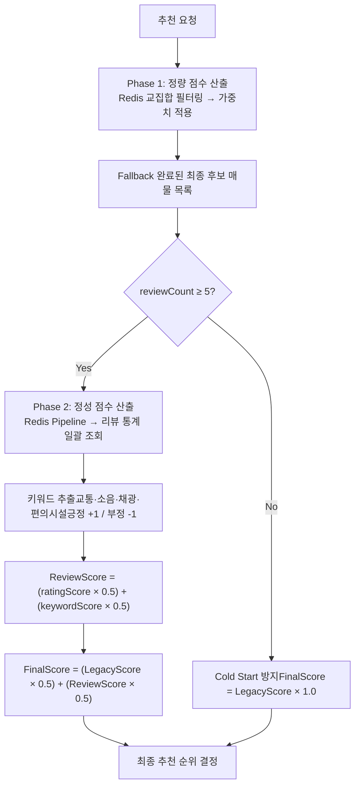
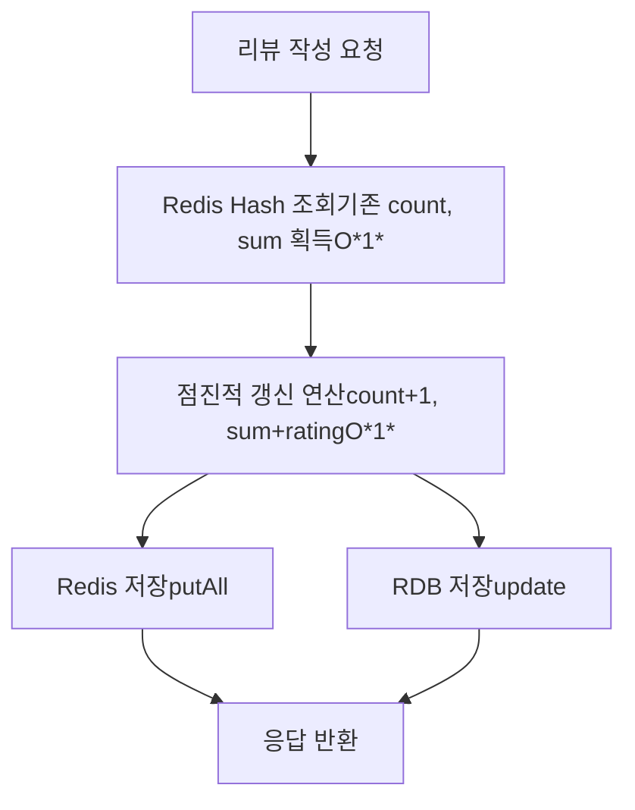

# WHEREHOUSE — MZ 세대 1인 가구 주거지 추천 서비스


> 서울시 25개 자치구 × 수만 건 매물 데이터에서, 사용자의 가치관(가격·안전·공간)에 맞는 최적 주거지를 실시간으로 추천하는 서비스.

---

## 목차

- [1. 프로젝트 개요](#1-프로젝트-개요)
- [2. 시스템 아키텍처](#2-시스템-아키텍처)
- [3. ERD 및 데이터 설계](#3-erd-및-데이터-설계)
- [4. 주요 구현 내역](#4-주요기술구현내역)
  - [4.1 Redis 기반 실시간 검색 엔진](#41-redis-기반-실시간-검색-엔진)
  - [4.2 2단계 Fallback 추천 로직](#42-2단계-fallback-추천-로직)
  - [4.3 리뷰 기반 하이브리드 추천 + Write-Through 동기화](#43-리뷰-기반-하이브리드-추천--write-through-동기화)
  - [4.4 외부 API 병목 해결 (CompletableFuture 병렬화)](#44-외부-api-병목-해결-completablefuture-병렬화)
  - [4.5 N+1 → Bulk Fetch → Chunk 최적화 3단계 진화](#45-n1--bulk-fetch--chunk-최적화-3단계-진화)
  - [4.6 LIKE 검색 Index 최적화](#46-like-검색-index-최적화)
  - [4.7 OOM 병목 Slice 청크 처리](#47-oom-병목-slice-청크-처리)
  - [4.8 Redis Pipeline RTT 최적화](#48-redis-pipeline-rtt-최적화)
- [5. Spring Security 인증 아키텍처](#5-spring-security-인증-아키텍처)

---

## 1. 프로젝트 개요

### 서비스 목적

2024년 기준 국내 1인가구는 750만을 돌파했고, 서울 거주 MZ세대의 과반이 월세·전세 임차인이다. 기존 부동산 플랫폼은 단순 조건 필터링만 제공할 뿐, 사용자의 가치관(가격·안전·공간 중 무엇을 우선하는지)을 반영하는 추천이 없다. 기존 시스템을 분석한 결과 세 가지 구조적 문제가 확인되었다.

첫째, 점수 이분법으로 사용자 의도 구분이 불가능했다. `safe_score > cvt_score` 단순 비교로 "안전 우선 vs 편의 우선" 이분법만 존재하여, 안전에 70점·편의에 65점을 부여한 사용자가 "안전 절대 우선"인지 "둘 다 중요하되 안전에 약간 더 비중"인지 구분할 수 없었다. 둘째, 매물 부족 시 빈 결과를 반환할 뿐 대안을 제시하지 못했다. 셋째, 추천 결과에 대한 근거를 전혀 제공하지 않아 사용자는 왜 해당 지역이 추천되었는지 알 수 없었다. 추가로 공공데이터(CCTV·범죄통계) 의존으로 실거주 체감 환경이 추천에 반영되지 않는 한계도 존재했다.

### 서비스 요구사항에서 기술적 제약 조건으로의 전환

이 서비스가 동작하려면 서울 25개 자치구 × 수만 건 매물에 대해 사용자별 가중치 기반 실시간 개인화 추천을 수행해야 한다. 매 요청마다 RDB에서 다중 조건 범위 검색(가격·평수·안전성)과 집계(리뷰 통계)를 수행하면, 디스크 I/O와 쿼리 실행 비용이 누적되어 실시간 응답이라는 서비스 요구사항을 충족할 수 없다. 동시에 외부 API(Kakao Map 15개 카테고리, 국토부 매물 데이터)에 대한 네트워크 I/O 의존이 크고, 리뷰 데이터의 무결성도 보장해야 한다.

이 구조적 한계가 CQRS 도입(읽기/쓰기 경로 분리), Redis 기반 검색 엔진 설계(디스크 I/O 제거), 외부 API 병렬화(네트워크 I/O 대기 해소), Write-Through 캐시 동기화(정합성 보장) 등 이후 모든 기술적 의사결정의 출발점이 되었다.

### 주요 구현 내역

| 주요 구현 내역 | 문제 정의 | 목표 |
|-----------|----------|------|
| 실시간 다중 조건 필터 | 25개 자치구 × 수만 건 매물 × 3개 우선순위 조건 | DB 조회 없이 빠른 응답 |
| 외부 API 순차 호출 | Kakao Map API 15종 카테고리 순차 호출 | 순차 호출을 병렬 호출로 개선하여 응답 지연 해결 |
| Oracle 쿼리 효율화 | N+1 패턴 발생 SQL 쿼리 구조 | Library Cache 재사용 + Index Scan 전환 |
| 추천 로직 고도화 | 점수 이분법 + 매물 부족 미대응 + 추천 근거 부재 | 우선순위 기반 Fallback + 리뷰 하이브리드 점수 |

### 핵심 기능 요약

사용자의 입력 조건에 대해 '가격, 안전, 공간' 우선순위 기반으로 60/30/10% 가중치를 반영하는 개인 맞춤형 추천 엔진을 구현하였다. Redis Sorted Set 기반 실시간 검색 엔진으로 DB 조회 없이 다중 조건 필터링을 수행하고, 2단계 Fallback 로직으로 매물 부족 시 사용자가 덜 중요하다고 명시한 조건부터 순차 완화하여 빈 결과 없이 대안을 제시한다. 리뷰 텍스트에서 키워드를 자동 추출하여 정량 점수와 정성 점수를 통합하는 하이브리드 추천을 적용하였다.

### 프로젝트 정보

**개발 기간:** 2023.09 ~ 2025.03 (18개월)

**참여 인원:** 3명

| 담당자 | 주요 역할 |
|--------|----------|
| **정범진** | Spring Boot 백엔드 아키텍처 설계, CQRS + Redis 추천 시스템 구현, JWT 인증/인가, 데이터 파이프라인, 성능 최적화 전체 |
| 이재서 | 상세지도 서비스 구현, Kakao Map API 연동 |
| 한준원 | 프론트엔드 UI 개발, 추천 결과 시각화 |

### 기술 스택

        

### 실행 방법

**환경 변수 설정:**

```bash
# 필수 환경 변수
export JWT_SECRET_KEY=
export KAKAO_API_KEY=
export MOLIT_RENT_API_SERVICE_KEY=
```

**배포:** [Wherehouse](https://wherehouse.it.kr/wherehouse/)

---

## 2. 시스템 아키텍처

### CQRS + Hybrid Storage 전략


### 설계 결정과 근거

**CQRS 패턴 (Read/Write 물리 분리)**

추천 조회 트래픽의 대부분이 읽기이고, 쓰기(리뷰)는 저빈도다. 두 경로의 성능 특성과 일관성 요구사항이 근본적으로 다르다. 읽기 경로는 지연 시간 최소화가 핵심이므로 Redis 메모리 기반 처리가 적합하고, 쓰기 경로는 리뷰 데이터의 무결성을 위해 RDB 트랜잭션의 ACID 보장이 필요하다. 이 차이로 인해 읽기와 쓰기를 물리적으로 분리하여 각 경로에 최적화된 저장소를 할당하는 CQRS 패턴을 적용하였다.

단일 RDB 유지 시 추천 조회마다 디스크 I/O가 발생하고, 단일 Redis로 통합하면 ACID 보장이 불가능하다. CQRS는 추천 조회(RecommendationService → Redis Only)에서 RDB 접근 0회를 달성하면서, 리뷰 작성(ReviewService → RDB → Redis Sync)에서 ACID를 유지한다. Redis와 RDB 간 정합성은 Write-Through 패턴으로 보장한다.

**Write-Through 캐시 동기화**

Redis Read Cache와 RDB 원본 간 정합성 보장이 필요했다. Cache-Aside(캐시 미스 시 RDB 조회 후 캐시 적재) 전략은 캐시 미스가 발생할 때마다 RDB 조회가 추천 응답 경로에 개입한다. 추천 조회가 고빈도이므로 캐시 미스 발생 자체를 방지하는 것이 유리하다고 판단하여, Write-Through(쓰기 시 RDB와 Redis에 즉시 동기화)를 선택하였다. 리뷰 통계 갱신을 매번 COUNT(\*), AVG() 집계 쿼리(O(N))로 수행하는 대신, Redis Hash에서 기존 count/sum을 조회한 뒤 산술연산으로 점진적 갱신(O(1))하는 방식으로 전환하였다. 리뷰 작성 시 전체 처리 시간이 7.13ms에서 1.10ms로 84.6% 감소하였다.

**외부 API 격리 (CompletableFuture + ThreadPoolExecutor)**

Kakao Map API 15개 카테고리 순차 호출 시 전체 응답의 92.2%가 외부 API 구간에서 소요되었다. 메인 스레드가 외부 API 응답을 기다리며 블로킹되는 것을 방지하기 위해, I/O 전용 ThreadPoolExecutor(20스레드)에서 CompletableFuture.supplyAsync()로 15개 카테고리를 동시 호출하고 allOf()로 결과를 병합하는 구조를 적용하였다. 이로써 외부 API 호출과 메인 스레드(요청 처리) 간의 Blocking 으로 인한 불필요한 대기 문제를 해결하여 총 응답 시간이 1,324ms에서 367ms로 72.3% 감소하였다.

**이벤트 기반 파이프라인**

기존 BatchScheduler는 국토부 API 수집과 RDB 적재가 하나의 메서드 내에서 강결합되어, 적재 실패 시 수집까지 롤백되는 구조였다. 이를 `DataCollectionCompletedEvent` 발행 구조로 분리하였다. BatchScheduler는 API 수집과 Redis 적재만 담당하고, RDB 적재는 `RdbSyncListener`가 이벤트를 비동기 구독하여 수행한다. 이 구조에서 RDB 적재 실패는 배치 전체로 전파되지 않으며, 후속 작업 추가 시 리스너만 확장하면 된다.

### 핵심 데이터 흐름

1. **추천 조회:** User → RecommendationService → Redis (RDB 무접근)
2. **리뷰 작성:** User → ReviewService → RDB → Redis 동기화
3. **배치 갱신:** BatchScheduler → 국토부 API → Redis 적재 → Event 발행 → RdbSyncListener → RDB 비동기 적재
4. **위치 분석:** User → Kakao API (CompletableFuture 병렬)

### 저장소 역할 분담

| 구분 | Oracle RDB | Redis |
|------|-----------|-------|
| 역할 | 데이터 원본 저장소 (Source of Truth) | Read Cache + 실시간 필터링 |
| 트랜잭션 | ACID 보장 | 단일 명령 원자성 |
| 사용 주체 | ReviewService, RdbSyncListener | RecommendationService |

---

## 3. ERD 및 데이터 설계


### 핵심 테이블 구조

```
PROPERTIES_CHARTER  ─── 전세 매물 (PROPERTY_ID PK, CHAR 32 BYTE)
PROPERTIES_MONTHLY  ─── 월세 매물 (PROPERTY_ID PK, CHAR 32 BYTE)
      │
      └─── (1) ◀──── (1) REVIEW_STATISTICS
      │
      └─── (1) ◀──── (N) REVIEWS ──▶ (1:N) REVIEW_KEYWORDS
```

### 설계 핵심 특징

**1. MD5 해시 식별자 전략**

국토교통부 API는 매물에 대한 고유 ID를 제공하지 않는다. 배치를 재실행하면 동일 매물이 새로운 행으로 중복 적재되고, 기존 리뷰 통계 테이블과의 FK 관계가 깨진다. 이 문제를 해결하기 위해 불변 속성 5개(SGG_CD, JIBUN, APT_NM, FLOOR, EXCLU_USE_AR)를 조합하여 MD5 32자 Hash를 PK로 사용하였다. 동일 매물은 배치를 몇 번 재실행하더라도 동일한 PROPERTY_ID를 생성하므로, REVIEW_STATISTICS 테이블과의 FK 관계가 보존된다.

**2. 전세/월세 테이블 분리**

월세는 보증금 + 월세금이라는 2개의 가격 컬럼을 가지고, 전세는 전세금 1개의 가격 컬럼만 가진다. 하나의 테이블에 통합하면 전세 행에서 월세금 컬럼이 항상 NULL이 되고, Redis 인덱스 구조도 임대 유형별로 분기가 필요해진다. 테이블을 분리함으로써 각 임대 유형의 스키마가 정규화되고, Redis 인덱스 구조도 최적화되었다. 전세는 2개 인덱스 교집합(가격 ∩ 평수), 월세는 3개 인덱스 교집합(보증금 ∩ 월세금 ∩ 평수)으로 필터링한다.

**3. 리뷰 테이블 그룹 3테이블 관계 구조**

REVIEWS 테이블은 사용자 작성 리뷰 원본을 저장한다. Redis에는 적재하지 않는다. 개별 조회 빈도가 낮고, 리뷰 목록은 페이징이 필수적인 패턴이므로 RDB에서 처리하는 것이 효율적이기 때문이다.

REVIEW_STATISTICS 테이블은 매물별 평점, 리뷰 수, 긍정·부정 키워드 수를 비정규화하여 저장한다. 매 추천 조회마다 REVIEWS 테이블에 COUNT(\*), AVG() 집계를 수행하면 O(N) 시간복잡도가 발생하므로, REVIEW_COUNT, AVG_RATING, POSITIVE_KEYWORD_COUNT, NEGATIVE_KEYWORD_COUNT를 사전 집계하였다. 이 테이블은 Redis `stats:{type}:{id}` Hash와 1:1 매핑되어, 리뷰 CUD 시 RDB 통계 갱신 후 Redis 즉시 동기화(Write-Through)를 수행한다. 추천 서비스는 Redis O(1) 조회만으로 통계에 접근한다.

REVIEW_KEYWORDS 테이블은 리뷰 텍스트에서 자동 추출된 키워드 태그를 감성 점수(±1)와 함께 저장한다. Redis에는 적재하지 않는다. 개별 키워드가 아닌 집계 결과(긍정/부정 카운트)만 REVIEW_STATISTICS에 반영하면 되기 때문이다.

---

## 4. 주요구현내역

### 4.1 Redis 기반 실시간 검색 엔진

**문제 인식**

추천 서비스의 핵심 연산은 "가격 범위 AND 평수 범위 AND 안전성 조건"과 같은 다중 조건 범위 검색이다. 사용자가 추천을 요청할 때마다 서울 25개 자치구 × 수만 건 매물에 대해 이 연산을 수행해야 한다. 초기 구조에서는 매 요청마다 Oracle 쿼리가 발생하여, 디스크 I/O와 복합 인덱스의 옵티마이저 의존성이 실시간 응답의 병목이 되었다. CQRS 도입으로 읽기 경로를 Redis로 이관하기로 결정한 뒤, Redis 내에서 다중 조건 범위 검색을 효율적으로 수행할 자료구조를 선택해야 했다.

**문제 정의**

Redis에서 "score가 min~max 범위인 멤버"를 추출하고, 복수 조건의 교집합을 구하는 연산이 필요하다. 자료구조 선택이 검색 시간복잡도와 메모리 효율에 직접 영향을 미친다.

**대안 검토 및 의사결정**

| 대안 | 장점 | 단점/기각 사유 |
|------|------|-------------|
| Hash 단독 (전체 스캔 후 필터) | 구현 단순 | 매물 수에 비례하여 O(N) 전체 스캔 필요, 범위 검색 미지원 |
| Sorted Set + ZRANGEBYSCORE | O(log N + M) 범위 검색 후 retainAll() 교집합 | 교집합을 애플리케이션에서 수행해야 함 (메모리 내이므로 성능 문제 없음) |

Hash 단독은 범위 검색 자체를 지원하지 않으므로 전체 매물을 스캔해야 한다. Sorted Set은 ZRANGEBYSCORE로 O(log N + M) 범위 검색을 수행한 뒤, 애플리케이션 레벨에서 retainAll() 교집합을 메모리 내에서 완료하므로, 디스크 I/O 없이 다중 조건 필터링이 가능하다.

Sorted Set을 선택하였다. 조건별(가격, 평수, 보증금, 월세금) 독립 Sorted Set을 구성하고, ZRANGEBYSCORE로 각 조건의 범위 검색을 수행한 뒤 retainAll()로 교집합을 메모리 내에서 완료하는 구조를 채택하였다.

**구현 상세 — Redis 데이터 모델링**

| 자료구조 | Key 패턴 | Score | 용도 |
|---------|---------|-------|------|
| Hash | property:charter:{id} | - | 매물 상세 정보 |
| Sorted Set | idx:charterPrice:{district} | 전세금 | 전세금 범위 검색 |
| Sorted Set | idx:area:{district}:전세 | 평수 | 평수 범위 검색 |
| Sorted Set | idx:deposit:{district} | 보증금 | 월세 보증금 검색 |
| Sorted Set | idx:monthlyRent:{district}:월세 | 월세금 | 월세금 범위 검색 |

**구현 상세 — 교집합 연산**

전세 검색은 2개 인덱스(가격 ∩ 평수), 월세 검색은 3개 인덱스(보증금 ∩ 월세금 ∩ 평수)의 교집합으로 조건 충족 매물 ID를 추출한다.

```java
// 조건별 매물 ID 조회
Set priceIds = redisTemplate.opsForZSet()
    .rangeByScore("idx:charterPrice:" + district, budgetMin, budgetMax);
Set areaIds = redisTemplate.opsForZSet()
    .rangeByScore("idx:area:" + district + ":전세", areaMin, areaMax);

// 메모리 내 교집합 → DB 조회 없이 필터링 완료
priceIds.retainAll(areaIds);
return new ArrayList<>(priceIds);
```

**배치 프로세스와의 연동:** BatchScheduler가 월 1회 국토교통부 API 데이터를 수집하여 Oracle RDB에 저장 후 Redis로 동기화한다. MD5 Hash 기반 영속적 식별자(불변 속성 5개 조합 → 32자)로 배치 재실행 시에도 리뷰 통계 FK 관계를 유지한다.

**검색 엔진 로직 순서도:**



**결론**

사용자 요청 시점에 디스크 I/O 없이 다중 조건 필터링이 완료된다. 서울 25개 자치구 × 수만 건 매물에 대해 Redis만으로 실시간 응답을 달성하였다.

---

### 4.2 2단계 Fallback 추천 로직

**문제 인식**

기존 시스템에서 사용자가 조건을 입력하면, 조건을 100% 충족하는 매물만 반환하고 그 외에는 빈 결과를 돌려주는 구조였다. 서울 특정 자치구에서 "전세 2억 이하 + 20평 이상 + 안전지수 상위"를 모두 만족하는 매물이 2개뿐이라면, 사용자는 아무런 대안 없이 빈 화면을 보게 된다. 동시에 `safe_score > cvt_score` 단순 비교로 "안전 우선 vs 편의 우선" 이분법만 존재하여, 안전에 70점·편의에 65점을 부여한 사용자가 "안전 절대 우선"인지 "둘 다 중요하되 안전에 약간 더 비중"인지 구분할 수 없었다. 추천 결과에 대한 근거도 전혀 제공하지 않았다.

**문제 정의**

세 가지 기술적 문제를 동시에 해결해야 했다. 첫째, 사용자 의도를 이분법이 아닌 연속적 우선순위로 포착해야 한다. 둘째, 매물 부족 시 빈 결과 대신 현실적 대안을 제시해야 한다. 셋째, 추천 결과에 "왜 이 지역인가"에 대한 근거를 함께 제공해야 한다.

**해결을 위한 고민 — 대안 검토**

요소별 개별 가중치 입력, 사전 정의 사용자 패턴 분류, 동일 조건 후 단순 재정렬 등을 검토했으나 각각 UI 복잡도·데이터 부재·개인화 부족 한계가 있었고, 공통적으로 매물 부족 시 빈 결과만 반환할 뿐 대안을 제시하지 못했다. 이에 "충분할 때는 단순하게, 부족할 때만 확장 로직을 적용"하는 적응적 복잡도 관리 원칙으로 2단계 Fallback을 설계하였다.

**해결 프로세스 — 2단계 Fallback 로직 설계**



**해결 과정 — 사용자 중심 양보 전략**

확장 검색 시 시스템이 임의로 조건을 완화하지 않고, 사용자가 명시한 우선순위에 따라 덜 중요한 조건부터 순차적으로 완화한다. 가격 우선형 사용자의 경우 예산 범위는 절대 확장하지 않고 안전성·평수 조건을 우선 완화한다. 이는 "예산은 초과할 수 없지만 다소 불편하거나 좁아도 괜찮다"는 가격 우선형 사용자의 심리를 반영한 것이다. 안전 우선형 사용자는 안전 기준을 절대 완화하지 않고 예산·평수에서 양보하며, 평수 우선형은 최소 평수를 유지하면서 예산·위치에서 타협한다.

**사용자 피드백 메시지 차별화:**

| 검색 결과 상태 | 사용자에게 표시되는 메시지 |
|-------------|----------------------|
| SUCCESS_NORMAL | "조건에 맞는 매물을 찾았습니다" |
| SUCCESS_EXPANDED | "조건을 일부 완화하여 대안을 찾았습니다" |
| NO_RESULTS | "조건에 맞는 매물이 없습니다" (최후) |

모든 추천 결과에 "왜 이 지역을 추천하는가"에 대한 근거를 제시하며, 확장 검색이 적용된 경우 어떤 조건이 어느 정도 완화되었는지를 명시적으로 안내하여 사용자의 합리적 의사결정을 지원한다.

**핵심 코드 구조:**

```java
// CharterRecommendationService.java
private SearchResult checkAndPerformCharterFallback(
        Map> districtProperties, Request request) {
    boolean hasInsufficientDistricts = districtProperties.values().stream()
        .anyMatch(list -> list.size() < MIN_PROPERTIES_THRESHOLD);
    if (!hasInsufficientDistricts) {
        return SearchResult.builder().searchStatus("SUCCESS_NORMAL").build();
    }
    // 부족한 자치구 대상으로 확장 검색 수행
    return performCharterExpandedSearch(request, districtProperties);
}
```

**결론**

사용자 의도를 1/2/3순위 연속 가중치(60/30/10%)로 포착하여 이분법 한계를 해소하였다. 매물 부족 시 덜 중요한 조건부터 순차 완화하여 "검색 실패" 대신 "현실적 대안 제시"로 전환하였다. 모든 추천 결과에 완화 조건을 명시하여 투명성을 확보하였다.

---

### 4.3 리뷰 기반 하이브리드 추천 + Write-Through 동기화

**문제 인식**

CCTV·범죄통계·교통 등 정량적 공공데이터만으로는 "살기 좋은 집"을 판별할 수 없다. 소음, 채광, 이웃 분위기 같은 실거주자만 아는 정성적 거주 환경이 추천에 반영되지 않아, 사용자가 체감하는 실제 환경과 추천 결과 사이에 괴리가 발생했다. 사용자 조건에 맞는 매물 중에서도 실거주 체감 품질이 낮은 매물이 상위 노출될 수 있었다.

**문제 정의**

두 가지 기술적 문제를 함께 해결해야 했다. 첫째, 정성 데이터(리뷰)를 기존 추천 프로세스(1차 엄격 검색 + 2단계 Fallback)에 사이드 이펙트 없이 통합해야 한다. 기존의 검증된 필터링·Fallback 로직을 블랙박스로 보존하면서, 리뷰 점수를 후처리(Post-processing) 레이어로만 개입시키는 비침해적 확장이 필요했다. 둘째, 리뷰 작성 시 Redis Read Cache와 RDB 원본 간의 정합성을 보장해야 한다. 추천 조회가 고빈도이므로 캐시 미스 발생 자체를 방지하는 것이 필요했다.

**해결을 위한 고민 — 캐시 동기화 전략 의사결정**

Redis Read Cache와 RDB 원본 간 정합성 보장 전략으로 두 가지를 검토하였다.

| 대안 | 장점 | 단점/기각 사유 |
|------|------|-------------|
| Write-Behind (비동기 일괄 반영) | 쓰기 성능 최고 (버퍼링 후 일괄 반영) | 버퍼 플러시 전 장애 시 데이터 유실 위험. 리뷰 통계의 정합성이 추천 품질에 직접 영향하므로 허용 불가. |
| Write-Through (쓰기 시 즉시 동기화) | 캐시 미스 발생 자체를 방지, Redis와 RDB가 항상 동기 상태 | 쓰기 시 Redis + RDB 이중 쓰기로 쓰기 지연 미세 증가 |

Write-Behind는 쓰기 성능이 최고이나 버퍼 플러시 전 장애 시 데이터 유실 위험이 있고, 리뷰 통계 정합성이 추천 품질에 직접 영향하므로 허용 불가하다.

Write-Through를 선택하였다. 리뷰 작성 시 RDB 트랜잭션 커밋과 동시에 Redis Hash에 통계 데이터를 즉시 동기화한다. 리뷰 통계 갱신을 COUNT(\*)/AVG() 집계 쿼리(O(N)) 대신 Redis Hash에서 기존 count/sum을 조회한 뒤 산술연산으로 점진적 갱신(O(1))하는 방식으로 전환하여 쓰기 지연도 최소화하였다.

**해결 과정 — 하이브리드 점수 산출 설계**



리뷰 텍스트에서 교통·소음·채광·편의시설 관련 키워드를 자동 추출하여, 긍정 키워드는 +1점, 부정 키워드는 -1점으로 점수화한다. 이를 별점 기반 평점과 50:50으로 합산하여 단순 별점만으로는 포착할 수 없는 거주 체감 품질을 반영한다.

리뷰 5개 미만인 매물은 소수 리뷰로 인한 편향을 방지하기 위해 리뷰 가중치를 0으로 처리하고 기존 정량 점수만 100% 반영한다(Cold Start 방지). 이를 통해 리뷰 데이터가 부족한 서비스 초기에도 기존 사용자 경험이 저하되지 않는다.

**해결 과정 — Write-Through 3단계 트랜잭션 흐름**



과정 1 — 통계 갱신: Redis Hash에서 기존 count, sum 조회 후 산술연산으로 점진적 갱신 (O(1))

과정 2 — 키워드 성향 집계: 리뷰 텍스트에서 추출된 긍정/부정 키워드 카운트를 REVIEW_STATISTICS에 반영

과정 3 — 이중 영속화: Redis Hash에 4가지 핵심 데이터(reviewCount, avgRating, positiveKeywordCount, negativeKeywordCount)를 즉시 동기화하고, RDB 트랜잭션 커밋으로 영속성을 보장

**핵심 코드 구조:**

```java
// CharterRecommendationService.java — 하이브리드 점수 산출
private double calculateHybridScore(double legacyScore, ReviewStatistics stats) {
    if (stats.getReviewCount() < COLD_START_REVIEW_COUNT) {
        return legacyScore;
    }
    return (legacyScore * 0.5) + (calculateReviewScore(stats) * 0.5);
}
```

```java
// ReviewWriteService.java — Write-Through O(1) 점진적 갱신
// 1. Redis에서 기존 통계 조회 (O(1))
Map stats = hashOps.entries(statsKey);
int currentCount = (Integer) stats.get("count");
long currentSum = (Long) stats.get("sum");

// 2. 점진적 갱신: 산술 연산으로 O(1) 달성
int newCount = currentCount + 1;
long newSum = currentSum + rating;
BigDecimal avgRating = divide(newSum, newCount);

// 3. Write-Through: Redis + RDB 이중 영속화
hashOps.putAll(statsKey, statsMap);    // Redis 즉시 반영
statistics.update(newCount, avgRating); // RDB Dirty Check
```

**결론 — 정량적 성과 (10건 순차 요청 기준):**

| 지표 | 개선 전 | 개선 후 | 개선율 |
|------|--------|--------|--------|
| 전체 처리시간 | 7.13ms | 1.10ms | -84.6% |
| 주요 I/O | 6.87ms (DB) | 0.79ms (Redis) | -88.5% |
| 시간복잡도 | O(N) | O(1) | - |

정량 점수(Redis 교집합 필터링 + 가중치)와 정성 점수(리뷰 통계)의 가중 합산으로 실거주 체감 환경을 추천에 반영하였다. Write-Through 동기화로 Redis-RDB 간 정합성을 보장하면서, O(1) 점진적 갱신으로 쓰기 지연을 84.6% 감소시켰다.

---

### 4.4 외부 API 병목 해결 (CompletableFuture 병렬화)

**문제 인식**

사용자가 지도에서 특정 위치를 클릭하면 주변 편의시설(병원, 마트, 카페 등) 정보를 Kakao Map API 15개 카테고리로 조회하여 표시한다. 지도 클릭 후 편의시설 정보가 표시되기까지 1.3초 이상 소요되었다. 사용자가 여러 지역을 비교 탐색하는 서비스 특성상, 클릭마다 1.3초 대기는 탐색 흐름을 끊는 직접적인 UX 저해 요소였다.

**문제 정의**

측정 결과 전체 응답 시간 1,324ms 중 외부 API 구간이 1,221ms(92.2%)를 차지했다. WebClient.block() 동기 방식으로 15개 API를 순차 실행하여, 각 호출의 네트워크 I/O 대기 시간이 직렬로 누적되는 구조가 원인이었다. 메인 스레드가 외부 API 응답을 기다리며 블로킹되므로, 15개 카테고리의 개별 응답 시간(평균 81ms)이 합산되어 1,221ms가 되는 구조였다.

**대안 검토 및 의사결정**

| 대안 | 장점 | 단점/기각 사유 |
|------|------|-------------|
| WebClient Reactive (Mono/Flux) | 논블로킹 I/O, 스레드 효율 최고 | 기존 동기 코드베이스 전면 리팩토링 필요, 학습 비용 과대. 서비스 계층 전체를 리액티브로 전환해야 하므로 프로젝트 일정 대비 과도한 비용. |
| CompletableFuture + ThreadPoolExecutor | 기존 동기 코드에 supplyAsync() 래핑만으로 적용 가능, allOf() 병합·exceptionally() 예외 처리 지원 | 스레드 풀 크기 설계 필요 |

WebClient Reactive는 성능 상한이 가장 높으나, 현재 코드베이스가 동기 기반이므로 서비스 계층 전체를 리팩토링해야 하며 프로젝트 일정 대비 과도한 비용이다. CompletableFuture는 기존 동기 코드에 supplyAsync() 래핑만으로 적용 가능하면서 15개 병렬 호출의 성능 요구를 충족한다.

CompletableFuture + ThreadPoolExecutor를 선택하였다. I/O Bound 전용 스레드 풀(20스레드)에서 15개 카테고리를 동시 호출하고 allOf()로 결과를 병합한다. 전용 스레드 풀로 격리하여 메인 스레드(요청 처리)와 외부 API 호출 간 장애 전파를 차단하였다.

**해결 과정 — 핵심 코드:**

```java
// CompletableFuture 병렬 처리 — 15개 카테고리 동시 조회
Map>> futures = new HashMap<>();

for (String cat : categories) {
    futures.put(cat,
        CompletableFuture.supplyAsync(
            () -> searchPlaces(lat, lng, cat, radius),
            EXECUTOR                // I/O 전용 스레드 풀
        ).exceptionally(ex -> emptyList())  // 장애 격리
    );
}

CompletableFuture.allOf(...).join();  // 전체 완료 대기

return futures.entrySet().stream()
    .collect(toMap(Entry::getKey, e -> e.getValue().join()));
```

**결론 — 정량적 성과:**

| 지표 | 개선 전 | 개선 후 | 개선율 |
|------|--------|--------|--------|
| 외부 API 호출 평균 | 1,221.0ms | 254.9ms | -79.1% |
| 외부 API 호출 p95 | 1,388.8ms | 782.9ms | -43.64% |
| 총 응답 시간 | 1,324.2ms | 366.9ms | -72.3% |

사용자 체감: 지도 클릭 후 주변 편의시설 정보 로딩 시간 1.3초 → 0.4초 단축. 15개 카테고리의 네트워크 I/O 대기가 직렬 누적에서 병렬 처리로 전환되어, 전체 응답 시간이 가장 느린 단일 카테고리 응답 시간에 수렴하는 구조가 되었다.

> 📄 상세 분석: [외부 API 병렬 처리 트러블슈팅 보고서](https://github.com/bumjinDev/wherehouse_SpringBoot/tree/master/docs)

---

### 4.5 N+1 → Bulk Fetch → Chunk 최적화 3단계 진화

**문제 인식**

추천 요청 시 서울 25개 자치구별로 리뷰 통계 데이터를 조회하는 과정에서, CharterRecommendationService가 자치구당 findAllById()를 호출하여 최대 25회 DB 호출이 발생하는 N+1 패턴이었다. 추천 요청이 들어올 때마다 Oracle에 25회 쿼리가 발생하고, HikariCP Connection Pool(Size 6)에 동시 요청이 집중되어 Connection 경합이 발생하는 상황이었다.

**문제 정의 — V\$SQL 기반 정량 분석**

Oracle V$SQL 동적 성능 뷰를 통해 N+1 패턴의 실제 영향을 정량 측정하였다.

| V$SQL 지표 | N+1 패턴 측정값 |
|-----------|---------------|
| SQL_ID 생성 (Hard Parse) | 78개 |
| EXECUTIONS | 340회 |
| 쿼리 실행 AVG_MS 범위 | 0.15ms ~ 61ms (400배 편차) |
| Cost 편차 | 6 ~ 594 (99배) |

바인드 변수 3~1,058개가 분산되어 78개 고유 SQL_ID가 생성되었다. 이로 인해 Library Cache에 동일 SQL을 재사용할 수 없어 매번 Hard Parsing이 발생했다. Pool Size 6 대비 동시 20요청 × N+1 호출로 Connection 경합(Waiting 최대 6)이 발생했다. 실행 계획 자체는 Full Table Scan이 아닌 INLIST ITERATOR → TABLE ACCESS BY INDEX ROWID → INDEX UNIQUE SCAN (PK_REVIEW_STATISTICS)으로 PK 인덱스를 활용하고 있었다.

**1단계 해결 — Bulk Fetch: N+1 호출을 단일 쿼리로 병합**

전체 ID를 병합하여 단일 Native Query로 조회하는 방식으로 N+1(최대 25회) → 1회 호출로 전환하였다.

```java
// Bulk Fetch: 전체 ID를 단일 쿼리로 조회
List allPropertyIds = districtProperties.values().stream()
    .flatMap(List::stream)
    .distinct()
    .collect(Collectors.toList());

List allStats =
    reviewStatisticsRepository.findAllByIdAll(allPropertyIds);
```

**1단계 성과:**

| 지표 | N+1 패턴 | Bulk Fetch | 개선율 |
|------|---------|-----------|--------|
| SQL_ID 생성 (Hard Parse) | 78개 | 20개 | -74.4% |
| EXECUTIONS | 340회 | 20회 | -94.1% |
| 요청당 RDB 호출 횟수 | 25회 | 1회 | -96% |
| Connection Waiting 최대 | 6 | 2 | -66.7% |
| 경합 지속 시간 | ~44ms | ~2ms | -95.5% |

**1단계 한계 발견 — 2단계의 출발점**

Bulk Fetch로 호출 횟수는 해소되었으나, V$SQL 분석 결과 모든 SQL이 EXECUTIONS=1로 측정되어 Library Cache 재사용이 전무(100% Hard Parse)했다. 매 요청마다 IN절 파라미터 개수가 54~1,000개로 상이하여 Oracle이 별개 SQL로 인식, Soft Parse 활용이 불가능했다. 즉 호출 횟수는 1회로 줄었으나, 그 1회 호출의 SQL이 매번 새로운 실행계획을 생성하는 비효율이 남아있었다.

**2단계 해결 — IN절 Chunking: SQL 템플릿 통일로 Library Cache 활성화**

Chunk 크기를 고정하여 SQL 템플릿을 통일하면, 동일한 Chunk 크기로 호출할 때 Oracle이 동일 SQL_ID로 인식하여 Library Cache에서 Soft Parse가 가능해진다. 이 가설을 검증하기 위해 3가지 Chunk 크기로 비교 실험을 설계하였다.

**실험 설계 — Chunk 크기 선정 근거:**

| Chunk 크기 | 선정 근거 |
|-----------|---------|
| 1000 | Oracle IN절 최대 허용 크기(1000)에 맞춰 단일 청크로 처리. SQL 호출 최소화 의도. |
| 22 | Oracle IN절 최적화 관련 문서에서 언급된 일반적 권장 크기. |
| 61 | 실제 데이터 분포에서 자치구별 평균 매물 수를 산출한 중앙값 기반 크기. |

**실험 결과:**

| 지표 | Bulk | Chk 1000 | Chk 22 | Chk 61 |
|------|------|----------|--------|--------|
| 실행계획 | - | Full Scan (Cost 191) | Index Scan (Cost 68) | Index Scan (Cost 68) |
| SQL 호출 | 20회 | 21회 | 381회 | 134회 |
| Hard Parse | - | 20 | 11 | 15 |
| Soft Parse 비율 | - | 4.8% | 96.8% | 88.5% |
| Connection 경합 | 최대 2 | 최대 1 | 최대 10 | 최대 4 |
| 심각 경합 비율 | 0% | 0% | 47.9% | 0% |
| 응답 시간 | 191ms | 178ms | 268ms | 318ms |

**실행계획 비교:**

Chunk 1000: SELECT STATEMENT → TABLE ACCESS FULL (Cost: 191)
Chunk 22/61: SELECT STATEMENT → INLIST ITERATOR → INDEX UNIQUE SCAN (Cost: 27/68)

**의사결정 — 트레이드오프 분석**

Chk 1000은 IN절 크기가 Oracle CBO의 Full Scan 전환 임계를 초과하여 Index가 무시된다. SQL 호출은 최소(21회)이나 데이터 증가 시 Full Scan 비용이 선형으로 증가하므로 확장성이 없다. 기각.

Chk 22는 Index Scan 유지 + Soft Parse 96.8%로 DBMS 계층 지표는 최고이나, SQL 호출이 381회로 급증하여 HikariCP Pool Size 6 대비 Connection 경합이 47.9%까지 상승한다. 운영 환경에서 동시 요청이 증가하면 Connection 고갈 위험이 있다. 기각.

Chk 61은 SQL 호출 134회로 Chk 22 대비 64.8% 감소하면서 Index Scan을 유지하고 경합을 0%로 해소한다. Soft Parse 88.5%로 Chk 22(96.8%) 대비 약간 낮으나 실용적 차이는 미미하다.

Chunk 61을 선택하였다. 확장성(데이터 증가 시에도 Index Scan 유지), 안정성(Connection 경합 47.9% → 0% 완전 해소)이 선택 근거다.

**결론 — 3단계 진화 종합 성과:**

Soft Parse 88.5%, Index Scan 유지, Connection 경합 0%, 심각 경합 비율 47.9% → 0%.

**HikariCP Connection Pool 경합 비교:**

| 지표 | N+1 패턴 | Chunk 61 | 개선율 |
|------|---------|----------|--------|
| Waiting 최대 (동시 대기) | 6 | 4 | -33.3% |
| 심각 경합 비율 | - | 0% | - |
| 경합 지속 시간 | ~44ms | ~2ms | -95.5% |

**회고 — 예상 외 발견과 후속 과제**

Chunk 61의 응답 시간(318ms)이 Chunk 1000(178ms)보다 느린 것은 예상과 달랐다. DBMS 계층 지표(Soft Parse, Index Scan, Connection 경합)는 모두 개선되었으나 전체 응답이 느린 것은, 애플리케이션 계층에서 Redis 순차 호출로 인한 RTT 누적 병목이 별도로 존재했기 때문이다. 이 발견이 주요 구현 내역 중 4.8(Redis Pipeline RTT 최적화)의 출발점이 되었다.

> 📄 상세 분석: [N+1 → Chunking V$SQL 분석 보고서](https://github.com/bumjinDev/wherehouse_SpringBoot/blob/master/docs/11.%20%EC%A3%BC%EA%B1%B0%EC%A7%80%20%EC%B6%94%EC%B2%9C%20%EC%84%9C%EB%B9%84%EC%8A%A4%20%EC%82%AC%EC%9A%A9%EC%9E%90%20%EA%B2%BD%ED%97%98%20%EB%B0%98%EC%98%81%20%EA%B0%9C%EC%84%A0/%EB%B3%91%EB%AA%A9%20%ED%98%84%EC%83%81%20%EC%8B%A4%EC%B8%A1/2.1.1%20%EB%B0%98%EB%B3%B5%EC%A0%81%20%EC%A7%91%EA%B3%84%20%EB%8D%B0%EC%9D%B4%ED%84%B0%20RDB%20%EC%A1%B0%ED%9A%8C%20(N%2B1%20%EB%B3%80%ED%98%95)/3.%203%EC%B0%A8%20%ED%85%8C%EC%8A%A4%ED%8A%B8/Chunk61_DBMS_%EB%B3%91%EB%AA%A9_%EC%8B%A4%EC%B8%A1_%EB%B6%84%EC%84%9D_%EB%B3%B4%EA%B3%A0%EC%84%9C_MD.md)

---

### 4.6 LIKE 검색 Index 최적화

**문제 인식**

사용자가 아파트명으로 매물을 검색하는 기능에서, 검색 결과가 표시되기까지의 응답 지연이 발생하였다. findPropertyIdsByName 쿼리가 전체 메서드 응답 시간의 66.3%~86.5%를 차지하고 있었으며, 쿼리 소요시간 평균 26.3ms, 전체 메서드 소요시간 45.7ms였다.

**문제 정의**

`LIKE '%keyword%'` 패턴으로 Full Table Scan이 발생하는 것이 원인이었다. 선행 와일드카드 `'%keyword%'`는 B-Tree 인덱스의 정렬 구조를 활용할 수 없다. B-Tree는 좌측 정렬(Left-most) 기반이므로 검색 시작점을 특정할 수 없어 인덱스가 무시된다. Oracle 실행계획: SELECT STATEMENT → TABLE ACCESS FULL + Filter Predicates (Cost: 137).

**대안 검토 및 의사결정**

| 대안 | 장점 | 단점/기각 사유 |
|------|------|-------------|
| Oracle Text (Full-Text Index) | 양방향 LIKE 대체 가능, 한글 형태소 분석 지원 | 별도 인덱스 구조 필요, 운영 복잡도 증가. 1인 프로젝트 운영 복잡도 대비 효과가 과도. |
| LIKE 'keyword%' (전방 일치 전환) | 기존 B-Tree 인덱스 활용 가능, 구현 단순 | 후방 검색 불가 (기능적 제약) |

아파트명 검색의 실제 사용 패턴을 분석하면, 사용자는 "래미안", "푸르지오" 등 아파트명의 앞부분을 입력하는 경우가 대다수이며, 중간 문자열로 검색하는 케이스는 극소수이다. 전방 일치 전환의 기능적 제약은 실제 사용자 경험에 미치는 영향이 미미하다고 판단하였다. Oracle Text는 정확도는 높으나, 운영 복잡도 대비 효과가 과도하다.

**해결 과정**

LIKE 패턴을 `'%keyword%'`에서 `'keyword%'`(전방 일치)로 변경하고, apt_nm 컬럼에 인덱스(IDX_CHARTER_APT_NM, IDX_MONTHLY_APT_NM)를 생성하였다.

```sql
-- 개선 전: Full Table Scan 발생
@Query(value =
    "SELECT property_id FROM properties_charter " +
    "WHERE apt_nm LIKE '%' || :name || '%'",
    nativeQuery = true)

-- 개선 후: Index Range Scan 활용
@Query(value =
    "SELECT property_id FROM properties_charter " +
    "WHERE apt_nm LIKE :name || '%'",
    nativeQuery = true)
```

**실행계획 비교:**

개선 전: SELECT STATEMENT → TABLE ACCESS FULL, Filter Predicates, Cost: 137
개선 후: SELECT STATEMENT → INDEX RANGE SCAN, Access Predicates, Cost: 5

**결론 — 정량적 성과:**

| 항목 | 개선 전 | 개선 후 | 개선율 |
|------|--------|--------|--------|
| 쿼리 소요시간 (평균) | 26.3ms | 6.0ms | -77.2% |
| 전체 메서드 소요시간 | 45.7ms | 22.4ms | -51.0% |
| 병목 비중 | 66.3% | 22.0% | -66.8% |

트레이드오프: 전방 일치로 변경하면 "중간 포함 검색"이 불가능해진다. 그러나 아파트명 검색의 실제 사용 패턴에서 중간 문자열 검색은 극소수이므로 수용 가능한 제약이다.

> 📄 상세 분석: [LIKE Index 전환 트러블슈팅 보고서](https://github.com/bumjinDev/wherehouse_SpringBoot/blob/master/docs/11.%20%EC%A3%BC%EA%B1%B0%EC%A7%80%20%EC%B6%94%EC%B2%9C%20%EC%84%9C%EB%B9%84%EC%8A%A4%20%EC%82%AC%EC%9A%A9%EC%9E%90%20%EA%B2%BD%ED%97%98%20%EB%B0%98%EC%98%81%20%EA%B0%9C%EC%84%A0/%EB%B3%91%EB%AA%A9%20%ED%98%84%EC%83%81%20%EC%8B%A4%EC%B8%A1/2.1.2%20%EC%9D%B8%EB%8D%B1%EC%8A%A4%20%EB%AF%B8%EC%A0%81%EC%9A%A9%20Full%20Table%20Scan/%EB%A1%9C%EA%B7%B8%20%ED%8C%8C%EC%9D%BC/%EA%B0%9C%EC%84%A0%ED%9B%84/Wherehouse_%EC%84%B1%EB%8A%A5%EA%B0%9C%EC%84%A0%EA%B2%B0%EA%B3%BC%EB%A6%AC%ED%8F%AC%ED%8A%B8_indexRangeScan.md)

---

### 4.7 OOM 병목 Slice 청크 처리

**문제 인식**

배치 프로세스(BatchScheduler)는 국토부 API에서 수집한 매물 데이터를 RDB에서 조회하여 Redis로 동기화하는 역할을 한다. 배치가 실패하면 Redis에 최신 매물 데이터가 적재되지 않으므로, 추천 서비스 전체가 구버전 데이터로 동작하게 된다. 이 배치가 11만 건을 findAll()로 일괄 로드하여 힙 피크 점유율이 64.4%에 달했으며, 데이터 증가 시 OOM 발생으로 배치 전체가 실패할 위험이 있었다.

**문제 정의**

JPA findAll()이 전체 ResultSet을 단일 List로 힙에 적재하며, Entity + 영속성 컨텍스트 메타데이터가 GC 불가 상태로 유지된다. 엔티티 메모리 합계 99.2MB(Charter 50.3 + Monthly 48.9)로, 데이터 비례 선형 증가 구조이므로 확장성이 부재했다.

**대안 검토 및 의사결정**

| 대안 | 장점 | 단점/기각 사유 |
|------|------|-------------|
| Slice\<T> 기반 청크 처리 | 청크 단위 처리 후 참조 해제 → GC 전환, 힙 피크 일정 | DB 로드 시간 증가 |
| Stream\<T> 기반 스트리밍 | JPA 5.0+ 지원, Lazy 로딩 가능 | 영속성 컨텍스트가 전체 세션 동안 유지, 메모리 절감 효과 제한적 |

Stream 기반은 영속성 컨텍스트 문제로 메모리 절감 효과가 제한적이다. Slice\<T>는 Pageable.ofSize(10,000)으로 청크 단위 처리 후 참조를 해제하여 GC 대상으로 전환한다. 힙 피크가 청크 크기에만 비례하므로 데이터 증가에도 안정적이다.

**해결 과정**

Slice\<T> 기반 청크 처리: Pageable.ofSize(10,000) 분할 조회. 청크 단위 처리 후 참조 해제 → GC 대상 전환으로 힙 피크를 억제.

**결론 — 정량적 성과:**

| 지표 | 개선 전 | 개선 후 | 개선율 |
|------|--------|--------|--------|
| 엔티티 메모리 합계 | 99.2 MB | 32.5 MB | -67.2% |
| 힙 피크 점유율 | 64.4% | 17.6% | -72.7% |
| 전세 엔티티 점유 메모리 | 50.3 MB | 17.2 MB | -65.8% |
| 월세 엔티티 점유 메모리 | 48.9 MB | 15.3 MB | -68.7% |

**트레이드오프 지표:**

| 지표 | 개선 전 | 개선 후 | 변화율 |
|------|--------|--------|--------|
| DB 로드 시간 | 1,727 ms | 3,553 ms | +105.7% |
| 배치 전체 시간 | 7,248 ms | 11,853 ms | +63.5% |

배치 작업 특성상 실행 시간 증가(7초 → 12초)는 허용 범위이며, OOM으로 인한 배치 전체 실패 vs 처리 시간 63% 증가는 명확한 트레이드오프다. 메모리 안정성을 우선하여 Slice 방식을 선택하였다.

> 📄 상세 분석: [OOM 방지 Slice 처리 트러블슈팅 보고서](https://github.com/bumjinDev/wherehouse_SpringBoot/blob/master/docs/11.%20%EC%A3%BC%EA%B1%B0%EC%A7%80%20%EC%B6%94%EC%B2%9C%20%EC%84%9C%EB%B9%84%EC%8A%A4%20%EC%82%AC%EC%9A%A9%EC%9E%90%20%EA%B2%BD%ED%97%98%20%EB%B0%98%EC%98%81%20%EA%B0%9C%EC%84%A0/%EB%B3%91%EB%AA%A9%20%ED%98%84%EC%83%81%20%EC%8B%A4%EC%B8%A1/2.2.1%20OOM%20%EB%B0%9C%EC%83%9D/OOM_%EB%B3%91%EB%AA%A9_2%EC%B0%A8%ED%85%8C%EC%8A%A4%ED%8A%B8_%EA%B2%B0%EA%B3%BC%EB%B3%B4%EA%B3%A0%EC%84%9C.md)

---

### 4.8 Redis Pipeline RTT 최적화

**문제 인식**

주요 구현 내역 중 4.5(N+1 → Chunk 최적화)의 회고에서, Chunk 61의 응답 시간(318ms)이 Chunk 1000(178ms)보다 느린 현상이 발견되었다. DBMS 계층 지표(Soft Parse, Index Scan, Connection 경합)는 모두 개선되었음에도 전체 응답이 느린 것은, DBMS가 아닌 애플리케이션 계층에서 별도의 병목이 존재한다는 것을 의미했다. 분석 결과, Redis에 대한 순차 동기 호출로 인한 RTT(Round-Trip Time) 누적이 그 병목의 실체였다.

**문제 정의**

주거지 추천 요청 시 서울 25개 자치구별로 보증금·월세·평수 3개 조건을 Redis Sorted Set에서 범위 검색(ZRANGEBYSCORE)하는 구조였다. 3개 Command를 순차 동기 호출하여 지역구당 3회 RTT가 발생하였고, 전체 75회 RTT가 누적되어 응답 수신 전까지 스레드가 블로킹되는 구조였다.

보증금·월세·평수 3개 조건의 Redis 범위 검색이 각각 31.3% / 35.8% / 32.9%로 편중 없이 균등하게 Latency를 분담하고 있었다. 특정 명령이 병목인 것이 아니라 3개 명령의 RTT 자체가 구조적으로 누적되는 것이 원인이었으므로, 3개 요청을 Pipeline으로 묶는 것이 구조적으로 타당한 접근이었다.

**대안 검토 및 의사결정**

| 대안 | 장점 | 단점/기각 사유 |
|------|------|-------------|
| Lua Script | 서버 사이드 실행, RTT 1회로 완전 통합 | 3개 명령이 서로 다른 Key 대상이므로 Redis Cluster 환경에서 호환성 제약, 디버깅 복잡도 증가 |
| Pipeline (executePipelined) | 기존 명령 구조 유지, RTT만 1/3로 절감, 구현 단순 | 원자성 미보장 (본 케이스는 읽기 전용이므로 원자성 불필요) |

본 케이스의 3개 명령은 모두 읽기 전용(ZRANGEBYSCORE)이므로 원자성이 불필요하다. Lua Script는 RTT를 1회로 완전 통합하지만 Redis Cluster 전환 시 호환성 제약과 디버깅 복잡도가 증가한다. Pipeline은 RTT를 3회 → 1회로 줄이면서 기존 명령 구조를 그대로 유지하므로, 구현 비용 대비 성능 개선 효율이 가장 높다.

**해결 과정 — 핵심 코드:**

```java
// 3개 ZRANGEBYSCORE를 단일 RTT로 일괄 전송
List results = redisTemplate.executePipelined(
    (RedisCallback) connection -> {
        connection.zRangeByScore(depositKey, min, max);
        connection.zRangeByScore(rentKey,    min, max);
        connection.zRangeByScore(areaKey,    min, max);
        return null;
    });

// 결과 추출: 인덱스 순서 = 명령 실행 순서
Set depositIds = (Set) results.get(0);
Set rentIds    = (Set) results.get(1);
Set areaIds    = (Set) results.get(2);
```

**검증 — Wireshark TCP 패킷 분석 (Layer 2 실측):**

| 측정 지표 | 순차 호출 (Before) | Pipeline (After) |
|---------|-----------------|-----------------|
| 단일 Req-Resp Latency | 38.5ms (평균) | 39.3ms (평균) |
| 요청 패킷 수 | 75개 | 25개 |
| 응답 패킷 수 / 바이트 | 3,852개 / 5.0MB | 3,856개 / 5.0MB |

Pipeline 1회 왕복 비용(39.3ms) ≈ 순차 3번 중 단일 명령 RTT(38.5ms). RTT 횟수만 1/3로 절감되고, 1회 왕복 비용 증가는 없음을 패킷 레벨에서 입증하였다.

**결론 — 정량적 성과:**

| 지표 | Before (순차 호출) | After (Pipeline) | 개선율 |
|------|------------------|-----------------|--------|
| 25개 자치구 전체 검색 시간 총합 | 6,540.6ms | 4,320.0ms | -34.0% |
| 지역구별 평균 응답 시간 (강남구 제외) | 128.95ms | 58.80ms | -54.4% |
| 네트워크 왕복 횟수 (RTT) | 75회 | 25회 | -66.7% |
| 지역구당 네트워크 대기 시간 (Wireshark 실측) | 38.5ms × 3 = 115.5ms | 39.3ms × 1 = 39.3ms | -66.0% |

**강남구 이상치 분석:**

103,470건(4.0MB) 응답 payload → MethodTime 3,429ms → 2,895ms (15.6% 감소). RTT 절감분(65.8ms)은 전체 대비 2.2%에 불과했다. 강남구의 병목 본질은 RTT가 아니라 payload 크기이며, 별도 알고리즘 개선(데이터 필터링, 페이징 등)이 필요하다.

**핵심 인사이트:** Pipeline은 RTT 횟수를 1/3로 줄이면서 1회 왕복 비용을 증가시키지 않는 구조적 개선이다. Layer 1(nanoTime) + Layer 2(Wireshark) 2계층 실측으로 입증하였다. 주요 구현 내역 4.5에서 발견된 "애플리케이션 계층 병목"이 이 최적화로 해소되어, DBMS 계층 최적화(Chunk 61)의 효과가 비로소 전체 응답 시간에 반영되는 결과를 얻었다.

---

## 5. Spring Security 인증 아키텍처

**문제 인식**

사용자 인증 정보(JWT)를 안전하게 관리해야 한다. LocalStorage에 JWT를 저장하면 XSS 공격으로 JavaScript가 토큰에 접근하여 계정 탈취가 가능하다. HTTP 평문 통신 시 공인망 내에서 중간자 공격으로 개인정보가 평문 노출될 위험이 있다.

**보안 설계 대응:**

| 고려 사항 | 대응 설계 | 검증 방법 |
|----------|---------|----------|
| 중간자 공격 | HTTPS + TLS 1.2 | Wireshark 패킷 분석 |
| XSS 토큰 탈취 | HttpOnly Cookie | JS 접근 불가 확인 |

### 주요 설계 지점

**Stateless JWT:** 세션 서버를 제거하여 서버 간 상태 공유 없이 인증을 처리한다. JWT 토큰 자체에 인증 정보를 포함하므로 수평 확장에 적합하다.

**HttpOnly Cookie:** JWT를 HttpOnly Cookie에 저장하여 JavaScript의 document.cookie 접근을 차단한다. XSS 공격으로 토큰이 탈취되는 경로를 원천 차단한다.

**FilterChain 분리:** `/login`, `/members/**`, `/boards/**` 등 주요 엔드포인트별로 독립된 SecurityFilterChain을 등록하여 서비스별 최적화된 보안 정책을 적용하였다.

**인증/인가 실패 처리 분리:** 인증 실패(401)는 커스텀 AuthenticationEntryPoint, 인가 실패(403)는 커스텀 AccessDeniedHandler로 분리하여 시나리오별 명확한 피드백을 제공한다.

### Spring Security Filter Chain 구조

```
Client (Browser)
  └─ Host Only Cookie (JWT 저장)
      └─ HTTPS / TLS 1.2
          └─ [Spring Security]
              └─ [Spring Filter Chain]
                  ├─ Login Filter → BCrypt + JWT 발급
                  └─ JWT Auth Filter → SecurityContext 설정
                      └─ Controller (API)
```

### HTTPS TLS 1.2 검증

Wireshark 패킷 분석으로 TLS 1.2 암호화 통신을 검증하였다. Application Data Protocol: Hypertext Transfer Protocol로 암호화된 HTTP 트래픽을 확인하였다.

> 📄 상세 분석: [HTTPS TLS 1.2 구조와 원리 검증](https://velog.io/@yhjj815/%EC%8B%A4%EC%A0%9C-%EC%84%9C%EB%B2%84%EC%97%90%EC%84%9C-%EC%A6%9D%EB%AA%85%ED%95%98%EB%8A%94-HTTPS%EC%9D%98-%EA%B5%AC%EC%A1%B0%EC%99%80-%EC%9B%90%EB%A6%ACTLS-1.2-ECDHE-ECDSA)

---

## 프로젝트 구조

<pre>
com.wherehouse
├── information/       # 지역구 위치 분석 (Kakao API + Geohash)
├── JWT/               # Spring Security + JWT 인증/인가
├── members/           # 회원 관리 (가입/로그인/프로필)
├── recommand/         # [핵심] 추천 엔진 + 배치 파이프라인
│   ├── batch/         #   BatchScheduler, RdbSyncListener, IdGenerator(MD5)
│   ├── controller     #   RecommendationController
│   ├── model          #   Request/Response DTO
│   └── service        #   CharterRecommendationService, MonthlyRecommendationService
├── redis/             # Redis 인프라 (Config, Handler, Service)
├── review/            # [핵심] 리뷰 시스템 (고도화)
│   ├── component      #   KeywordExtractor (키워드 자동 추출)
│   ├── domain         #   Review, ReviewStatistics, ReviewKeyword
│   ├── repository     #   ReviewRepository, ReviewStatisticsRepository
│   └── service        #   ReviewWriteService, ReviewQueryService
└── WhereHouse
</pre>