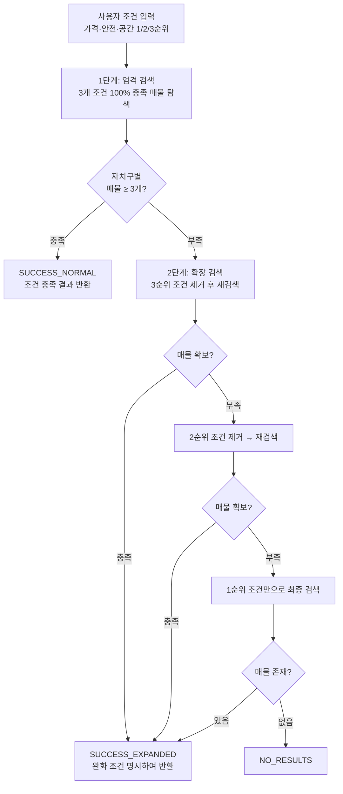
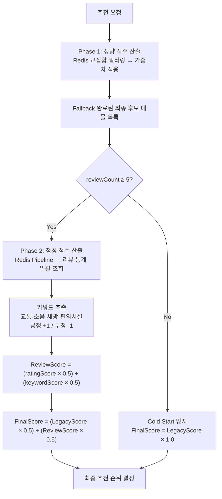

# WHEREHOUSE: 서울시 1인가구 주거지 추천 서비스


> 서울시 25개 자치구 × 수만 건 매물 데이터에서, 사용자의 가치관(가격·안전·공간)에 맞는 최적 주거지를 실시간으로 추천하는 서비스

---

## 📌 목차

- [프로젝트 배경 — 비즈니스 문제 정의](#프로젝트-배경--비즈니스-문제-정의)
- [핵심 성과 요약](#핵심-성과-요약)
- [작업 프로세스 개요](#작업-프로세스-개요)
- [프로젝트 정보](#프로젝트-정보)
- [서비스 소개 — 핵심 기능 UI](#서비스-소개--핵심-기능-ui)
- [시스템 아키텍처](#시스템-아키텍처)
- [핵심 서비스 상세](#핵심-서비스-상세)
  - [1. Redis 기반 실시간 검색 엔진](#1-redis-기반-실시간-검색-엔진)
  - [2. 2단계 Fallback 추천 로직](#2-2단계-fallback-추천-로직)
  - [3. 리뷰 기반 하이브리드 추천](#3-리뷰-기반-하이브리드-추천)
  - [4. Write-Through 캐시 동기화](#4-write-through-캐시-동기화)
- [ERD 및 데이터 설계](#erd-및-데이터-설계)
- [기술적 도전 및 해결 — 트러블슈팅](#기술적-도전-및-해결--트러블슈팅)
  - [TS#1: 외부 API 순차 호출 응답 지연 해결](#ts1-외부-api-순차-호출-응답-지연-해결)
  - [TS#2: N+1 쿼리 → Bulk Fetch → IN절 Chunking](#ts2-n1-쿼리--bulk-fetch--in절-chunking-2단계-해결)
  - [TS#3: LIKE 검색 Full Table Scan → Index Range Scan 전환](#ts3-like-검색-full-table-scan--index-range-scan-전환)
  - [TS#4: OOM 방지 Slice 기반 청크 처리](#ts4-oom-방지-slice-기반-청크-처리)
- [Spring Security 인증 아키텍처](#spring-security-인증-아키텍처)
- [프로젝트 구조](#프로젝트-구조)
- [기술 스택](#기술-스택)
- [상세 문서](#-상세-문서)

---

## 프로젝트 배경 — 비즈니스 문제 정의

2024년 기준 국내 1인가구는 750만을 돌파했고, 서울 거주 MZ세대의 과반이 월세·전세 임차인이다. 그러나 기존 부동산 플랫폼은 단순 조건 필터링만 제공할 뿐, 사용자의 가치관(가격·안전·공간 중 무엇을 우선하는지)을 반영하는 추천이 없다. 기존 시스템을 분석한 결과, 점수 이분법으로 사용자 의도 구분 불가, 매물 부족 시 빈 결과 반환, 추천 근거 미제공이라는 구조적 문제가 확인되었고, 공공데이터(CCTV·범죄통계) 의존으로 실거주 체감 환경이 추천에 반영되지 않는 한계도 존재했다.

**기술 도전 과제:**

| Challenge | 문제 정의 | 목표 |
|-----------|----------|------|
| 실시간 다중 조건 필터 | 25개 자치구 × 수만 건 매물 × 3개 우선순위 조건 | DB 조회 없이 빠른 응답 |
| 외부 API 순차 호출 | Kakao Map API 15종 카테고리 순차 호출 | 순차 호출을 병렬 호출로 개선하여 응답 지연 해결 |
| Oracle 쿼리 효율화 | N+1 패턴 발생 SQL 쿼리 구조 | Library Cache 재사용 + Index Scan 전환 |
| 추천 로직 고도화 | 점수 이분법 + 매물 부족 미대응 + 추천 근거 부재 | 우선순위 기반 Fallback + 리뷰 하이브리드 점수 |

> **해결 방향:** Redis Sorted Set 인덱싱 + CompletableFuture 병렬화 + V$SQL 기반 정량 분석으로 Chunk 크기 최적화 + 2단계 Fallback 추천 엔진 + 리뷰 기반 하이브리드 점수 통합

---

## 핵심 성과 요약

| 기술 챌린지 | 해결 방식 | 정량 성과 |
|-----------|---------|---------|
| 외부 API 15개 순차 호출 | CompletableFuture 병렬 처리 | 응답 시간 72.3% 단축 (1,324ms → 367ms) |
| N+1 쿼리 패턴 (25회 반복) | Bulk Fetch + IN절 Chunking | RDB 호출 96% 감소, 경합 47.9% → 0% |
| LIKE 검색 Full Table Scan | 전방 일치 + Index Range Scan | 쿼리 시간 77.2% 단축 (26.3ms → 6.0ms) |
| 배치 OOM 위험 (힙 64.4%) | Slice 기반 청크 처리 | 힙 피크 72.7% 감소 (64.4% → 17.6%) |

> ※ 측정 환경: 로컬 Oracle 19c + Redis 7.0, 약 5만 건 매물 데이터 기준. 운영 환경에서는 네트워크 레이턴시, 커넥션 풀 경합 등으로 수치가 달라질 수 있음.

**담당 역할:** Spring Boot 백엔드 아키텍처 설계, CQRS + Redis 추천 시스템 구현, JWT 인증/인가, 데이터 파이프라인, 성능 최적화 전체 (3인 팀)

---

## 작업 프로세스 개요

프로젝트는 다음 5단계로 순차 진행했다. 각 단계에서 발생한 기술적 의사결정과 트레이드오프는 후반부 트러블슈팅 섹션에서 V$SQL 측정 데이터와 함께 상세히 다룬다.

1. **데이터 파이프라인 안정화** — 국토부 API 수집 → MD5 식별자 기반 배치 적재 → 이벤트 발행 구조로 수집·적재 강결합 분리
2. **Redis 검색 엔진 구축** — RDB 의존 추천을 Redis Sorted Set 기반 실시간 필터링으로 전환, CQRS 읽기/쓰기 경로 분리
3. **추천 로직 고도화** — 2단계 Fallback + 리뷰 하이브리드 점수 통합으로 사용자 가치관 반영 및 빈 결과 문제 해결
4. **V$SQL 기반 성능 분석** — N+1 → Bulk Fetch → IN절 Chunking 2단계 해결, Hard Parse/Soft Parse 비용 정량 측정
5. **안정성 확보** — OOM 방지 Slice 청크 처리, LIKE Index 전환, CompletableFuture 병렬화

---

## 프로젝트 정보

**개발 기간:** 2023.09 ~ 2025.03 (18개월)

**참여 인원:** 3명

| 담당자 | 주요 역할 |
|--------|----------|
| **정범진** | Spring Boot 백엔드 아키텍처 설계, CQRS + Redis 추천 시스템 구현, JWT 인증/인가, 데이터 파이프라인, 성능 최적화 전체 |
| 이재서 | 상세지도 서비스 구현, Kakao Map API 연동 |
| 한준원 | 프론트엔드 UI 개발, 추천 결과 시각화 |

**배포:** 현재 정부 공공데이터 API 서버 점검으로 일시 중단

---

## 서비스 소개 — 핵심 기능 UI

사용자의 입력 조건에 대해 '가격, 안전, 공간' 우선순위 기반으로 가중치를 반영하는 개인 맞춤형 추천 엔진을 설계 및 구현하였다. 배치 프로세스와 Redis 기반 아키텍처로 대용량 데이터에서도 빠른 응답 속도를 설계하였다.

### 🎬 서비스 데모

### 과정 1: 주거지 추천 서비스 요청

단순한 필터링을 넘어, 사용자의 가치관을 정량화하는 3단계 입력 시스템을 설계했다.

- **핵심 조건 정의:** 임대 유형(전세/월세), 예산 범위, 평수 범위 설정
- **우선순위 가중치 부여:** 가격·안전·공간에 대해 1·2·3순위를 직접 선택하면 60/30/10% 가중치 자동 적용
- **유연성 설정:** 매물 부족 시 대비 예산 초과 허용 범위, 최소 안전 점수 등 Fallback 검색 기준 제어

### 과정 2: 주거지 추천 결과 응답

- **최적 지역구 3곳 추천:** 평균 점수 × log(매물 개수 + 1) 공식으로 매물의 질과 양을 모두 고려하여 순위 결정
- **추천 근거 요약:** 각 지역구가 사용자의 어떤 우선순위를 충족했는지 명확한 요약 텍스트 제공
- **지도 시각화:** 추천 지역구 경계를 카카오맵 폴리곤으로 시각화

### 과정 3: 주거지 추천 상세 조회

- **상세 점수 정보:** 매물 비율 점수, 평수 점수, 안전 점수를 시각화하여 추천 근거 확인
- **매물 목록:** 해당 지역구 내 상위 매물 목록과 점수 제공


---

## 시스템 아키텍처

**CQRS + Hybrid Storage 전략**


**CQRS 패턴:** 추천 조회 트래픽의 대부분이 읽기이고 쓰기(리뷰)와 일관성 요구 수준이 다르므로, 읽기와 쓰기 경로를 분리하여 각 경로에 최적화된 저장소를 할당했다. 읽기(추천) = RecommendationService → Redis Only, RDB 미접근. 쓰기(리뷰) = ReviewService → RDB Write → Redis Sync.

**Write-Through 캐시 패턴:** Cache-Aside는 캐시 미스 시 RDB 조회가 추천 응답 경로에 개입하므로, 추천 조회에서 RDB를 완전히 배제하기 위해 Write-Through를 선택했다. RDB 트랜잭션 커밋 직후 Redis 동기화로 데이터 정합성을 보장한다.

**외부 API 격리:** 전용 ThreadPoolExecutor로 Kakao API 호출을 메인 스레드에서 분리하여 병렬 수행.

**이벤트 기반 파이프라인:** 기존 BatchScheduler의 수집·적재 강결합을 `DataCollectionCompletedEvent` 발행 구조로 분리. RDB 적재는 `RdbSyncListener`가 비동기 구독하므로, 적재 실패가 배치에 전파되지 않고 후속 작업 추가 시 리스너만 확장하면 된다.

**핵심 데이터 흐름:**

1. 추천 조회: User → RecommendationService → Redis (RDB 무접근)
2. 리뷰 작성: User → ReviewService → RDB → Redis 동기화
3. 배치 갱신: BatchScheduler → 국토부 API → Redis 적재 → Event 발행 → RdbSyncListener → RDB 비동기 적재
4. 위치 분석: User → Kakao API (CompletableFuture 병렬)

| 구분 | Oracle RDB | Redis |
|------|-----------|-------|
| 역할 | 데이터 원본 저장소 (Source of Truth) | Read Cache + 실시간 필터링 |
| 트랜잭션 | ACID 보장 | 단일 명령 원자성 |
| 사용 주체 | ReviewService, RdbSyncListener | RecommendationService |

---

## 핵심 서비스 상세

### 1. Redis 기반 실시간 검색 엔진

**설계 목표:** 사용자 요청 시점에 Oracle DB 조회 없이 Redis만으로 가격/평수/안전성 다중 조건 필터링 수행.

**Redis Sorted Set 선택 근거:** 다중 조건 범위 검색이 핵심 요구사항이었다. RDB B-Tree 인덱스는 복합 조건 필터링 시 인덱스 교차(Index Merge)의 옵티마이저 의존성이 높고, 매 요청마다 디스크 I/O가 발생한다. Redis Sorted Set은 ZRANGEBYSCORE로 O(log N + M) 범위 검색 후 retainAll() 교집합을 메모리 내에서 수행하므로, 디스크 I/O 없이 다중 조건 필터링이 가능했다.

**Redis 데이터 모델링:**

| 자료구조 | Key 패턴 | Score | 용도 |
|---------|---------|-------|------|
| Hash | property:charter:{id} | - | 매물 상세 정보 |
| Sorted Set | idx:charterPrice:{district} | 전세금 | 전세금 범위 검색 |
| Sorted Set | idx:area:{district}:전세 | 평수 | 평수 범위 검색 |
| Sorted Set | idx:deposit:{district} | 보증금 | 월세 보증금 검색 |
| Sorted Set | idx:monthlyRent:{district}:월세 | 월세금 | 월세금 범위 검색 |

**검색 로직:** 전세는 2개 인덱스(가격 ∩ 평수), 월세는 3개 인덱스(보증금 ∩ 월세금 ∩ 평수)의 교집합으로 조건 충족 매물 ID를 추출한다.

**배치 프로세스와의 분리:** BatchScheduler가 월 1회 국토교통부 API 데이터를 수집하여 Oracle RDB에 저장 후 Redis로 동기화. MD5 Hash 기반 영속적 식별자(불변 속성 5개 조합 → 32자)로 배치 재실행 시에도 리뷰 통계 FK 관계를 유지한다.

---

### 2. 2단계 Fallback 추천 로직

사용자의 가치관(가격·안전·공간)을 1·2·3순위로 입력받아 60/30/10% 가중치를 적용하고, 조건 충족 매물이 부족할 경우 사용자가 덜 중요하다고 명시한 순위부터 순차적으로 완화하여 빈 결과 없이 대안을 제시하는 적응적 추천 시스템이다.



**해결하려는 문제:** 기존 시스템은 `safe_score > cvt_score` 단순 비교로 "안전 우선 vs 편의 우선" 이분법만 존재했다. 안전에 70점, 편의에 65점을 부여한 사용자가 "안전 절대 우선"인지 "둘 다 중요하되 안전에 약간 더 비중"인지 구분할 수 없었고, 조건 충족 매물이 부족하면 빈 결과를 반환할 뿐 대안을 제시하지 못했다. 추천 결과에 대한 근거도 전혀 제공하지 않아, 사용자는 왜 해당 지역이 추천되었는지 알 수 없었다.

**검토한 대안과 채택 근거:**

요소별 개별 가중치 입력, 사전 정의 사용자 패턴 분류, 동일 조건 후 단순 재정렬 등을 검토했으나 각각 UI 복잡도·데이터 부재·개인화 부족 한계가 있었고, 공통적으로 **매물 부족 시 빈 결과만 반환할 뿐 대안을 제시하지 못했다.** 이에 "충분할 때는 단순하게, 부족할 때만 확장 로직을 적용"하는 적응적 복잡도 관리 원칙으로 2단계 Fallback을 설계했다.

**사용자 중심 양보 전략:** 확장 검색 시 시스템이 임의로 조건을 완화하지 않고, 사용자가 명시한 우선순위에 따라 덜 중요한 조건부터 순차적으로 완화한다. 가격 우선형 사용자의 경우 예산 범위는 절대 확장하지 않고 안전성·평수 조건을 우선 완화하는데, 이는 "예산은 초과할 수 없지만 다소 불편하거나 좁아도 괜찮다"는 가격 우선형 사용자의 심리를 반영한 것이다. 반대로 안전 우선형 사용자는 안전 기준을 절대 완화하지 않고 예산·평수에서 양보하며, 평수 우선형은 최소 평수를 유지하면서 예산·위치에서 타협한다.

**추천 근거 투명성:** 모든 추천 결과에 "왜 이 지역을 추천하는가"에 대한 근거를 제시하며, 확장 검색이 적용된 경우 어떤 조건이 어느 정도 완화되었는지를 명시적으로 안내하여 사용자의 합리적 의사결정을 지원한다.

---

### 3. 리뷰 기반 하이브리드 추천

공공데이터(CCTV·범죄통계) 기반 정량 점수만으로는 포착할 수 없는 실거주 체감 품질(소음·채광·이웃 분위기)을 리뷰 텍스트에서 자동 추출하여, 기존 추천 파이프라인에 사이드 이펙트 없이 후처리 레이어로 통합하는 하이브리드 점수 시스템이다.



**해결하려는 문제:** CCTV·범죄통계·교통 등 정량적 공공데이터만으로는 "살기 좋은 집" 판별이 불가능하다. 소음, 채광, 이웃 분위기 같은 실거주자만 아는 정성적 거주 환경이 추천에 반영되지 않아, 사용자가 체감하는 실제 환경과 추천 결과 사이에 괴리가 발생했다. 사용자 조건에 맞는 매물 중에서도 실거주 체감 품질이 낮은 매물이 상위 노출될 수 있었다.

**설계 제약 — 비침해적 확장 원칙:** 리뷰 시스템은 기존의 검증된 추천 프로세스(1차 엄격 검색 + 2단계 Fallback)의 실행 흐름에 어떠한 사이드 이펙트도 발생시키지 않도록 설계했다. 기존 필터링·Fallback 로직을 블랙박스로 보존하고, 리뷰 점수 반영은 필터링이 완전히 종료된 최종 후보 매물에 대한 후처리(Post-processing) 레이어로만 개입한다.

리뷰 텍스트에서 교통·소음·채광·편의시설 관련 키워드를 자동 추출하여, 긍정 키워드는 +1점, 부정 키워드는 -1점으로 점수화한다. 이를 별점 기반 평점과 50:50으로 합산하여 단순 별점만으로는 포착할 수 없는 거주 체감 품질을 반영한다.

**Cold Start 방지:** 리뷰 5개 미만인 매물은 소수 리뷰로 인한 편향을 방지하기 위해 리뷰 가중치를 0으로 처리하고 기존 정량 점수만 100% 반영한다. 이를 통해 리뷰 데이터가 부족한 서비스 초기에도 기존 사용자 경험이 저하되지 않는다.

---

### 4. Write-Through 캐시 동기화

**해결하려는 문제:** 리뷰 작성 시마다 COUNT(\*), AVG() 집계 쿼리를 실행하면 리뷰 테이블 Full Scan → O(N) 시간복잡도가 발생하고, 데이터 증가에 따라 응답 시간이 선형 증가한다.

**3단계 Write-Through 트랜잭션 흐름:**

- 과정 1 — 통계 갱신: Redis Hash에서 기존 count, sum 조회 후 산술연산으로 점진적 갱신 (O(1))
- 과정 2 — 키워드 성향 집계: 리뷰 텍스트에서 추출된 긍정/부정 키워드 카운트를 REVIEW_STATISTICS에 반영
- 과정 3 — 이중 영속화: RDB 트랜잭션 커밋 직후 Redis Hash에 4가지 핵심 데이터(reviewCount, avgRating, positiveKeywordCount, negativeKeywordCount)를 즉시 동기화

---

## ERD 및 데이터 설계


**설계 핵심 특징:**

**1. MD5 해시 식별자 전략:** 국토부 API가 고유 ID를 미제공하므로, 불변 속성 5개(SGG_CD, JIBUN, APT_NM, FLOOR, EXCLU_USE_AR) 조합 → MD5 32자 Hash를 PK로 사용한다. 배치 재실행 시에도 동일 매물은 동일 ID를 유지하여 리뷰 통계 테이블과의 FK 관계를 보존한다.

**2. 전세/월세 테이블 분리:** 월세는 보증금 + 월세금 2개 가격 컬럼, 전세는 전세금 1개 가격 컬럼으로 스키마 차이가 있다. 이를 분리하여 임대 유형별 Redis 인덱스 구조를 최적화했다(전세 = 2개 인덱스 교집합, 월세 = 3개 인덱스 교집합).

**3. 리뷰 테이블 그룹 3테이블 관계 구조:**

```
PROPERTIES_* (1) ◀──── (1) REVIEW_STATISTICS
      │
      └─── (1) ◀──── (N) REVIEWS ──▶ (1:N) REVIEW_KEYWORDS
```

- REVIEWS: 사용자 작성 리뷰 원본(CLOB). Redis 미적재 — CLOB 메모리 비용 대비 조회 빈도가 낮고 페이징 필수 패턴에서 RDB가 효율적
- REVIEW_STATISTICS: 평점/리뷰 수/긍정·부정 키워드 수 비정규화 저장 → Redis `stats:{type}:{id}` Hash와 1:1 매핑
- REVIEW_KEYWORDS: 리뷰 텍스트에서 자동 추출된 키워드 태그(감성 점수 ±1). Redis 미적재 — 집계 결과만 REVIEW_STATISTICS에 반영

**4. REVIEW_STATISTICS 비정규화:** 매 추천 조회마다 REVIEWS 테이블에 COUNT(\*), AVG() 집계 시 O(N) 시간복잡도가 발생하므로, REVIEW_COUNT, AVG_RATING, POSITIVE_KEYWORD_COUNT, NEGATIVE_KEYWORD_COUNT를 사전 집계 저장한다. 리뷰 CUD 시 RDB 통계 갱신 후 Redis 즉시 동기화(Write-Through)로 추천 서비스는 Redis O(1) 조회만으로 통계에 접근한다.


## 기술적 도전 및 해결 — 트러블슈팅

### TS#1: 외부 API 순차 호출 응답 지연 해결

**문제 정의:** Kakao Map API 15개 카테고리 호출 시 전체 응답 시간의 92.2%가 외부 API 구간에서 소요되었다. WebClient.block() 동기 방식으로 15개 API를 순차 실행하여, 외부 API 호출 시간 1,221ms / 애플리케이션 전체 응답 시간 1,324ms로 응답 시간이 길었다.

**원인 분석:** WebClient.block()이 각 호출의 응답을 기다린 뒤 다음 호출을 수행하므로, 15개 카테고리의 네트워크 I/O 대기 시간이 직렬로 누적되는 구조였다.

**해결:** CompletableFuture + ThreadPoolExecutor — I/O Bound 전용 스레드 풀(20개)에서 15개 카테고리를 동시 호출하고 allOf()로 결과 병합.

**정량적 결과:**

| 지표 | 개선 전 | 개선 후 | 개선율 |
|------|--------|--------|--------|
| 외부 API 호출 평균 | 1,221.0ms | 254.9ms | -79.1% |
| 외부 API 호출 p95 | 1,388.8ms | 782.9ms | -43.64% |
| 총 응답 시간 | 1,324.2ms | 366.9ms | -72.3% |

**사용자 경험 개선:** 지도 클릭 후 주변 편의시설 정보 로딩 시간 1.3초 → 0.4초 단축

> 📄 상세 분석: [외부 API 병렬화 트러블슈팅 보고서](<!-- TODO: 링크 추가 -->)

---

### TS#2: N+1 쿼리 → Bulk Fetch → IN절 Chunking (2단계 해결)

CharterRecommendationService에서 25개 자치구 순회 시 자치구당 findAllById() 호출로 최대 25회 DB 호출이 발생하는 N+1 패턴이었다. Bulk Fetch로 1차 해결한 뒤 Library Cache 재사용 불가 한계를 발견하여, IN절 Chunking으로 2차 해결했다.

**1단계 원인 분석 (V$SQL 측정):**

| V$SQL 지표 | N+1 패턴 측정값 |
|-----------|---------------|
| SQL_ID 생성 (Hard Parse) | 78개 |
| EXECUTIONS | 340회 |
| 쿼리 실행 AVG_MS 범위 | 0.15ms ~ 61ms (400배 편차) |
| Cost 편차 | 6 ~ 594 (99배) |

바인드 변수 3~1,058개 분산으로 78개 고유 SQL_ID가 생성되어 Library Cache 낭비 및 Hard Parsing 오버헤드가 발생했고, Pool Size 6 대비 동시 20요청 × N+1 호출로 Connection 경합(Waiting 최대 6)이 발생했다.

**실행 계획:** Full Table Scan 없음. INLIST ITERATOR → TABLE ACCESS BY INDEX ROWID → INDEX UNIQUE SCAN (PK_REVIEW_STATISTICS)으로 PK 인덱스를 활용하고 있었다.

**1단계 해결 — Bulk Fetch:** 전체 ID를 병합하여 단일 Native Query로 조회 → N+1(최대 25회) → 1회 호출로 개선.

**1단계 결과:**

| 지표 | N+1 패턴 | Bulk Fetch | 개선율 |
|------|---------|-----------|--------|
| SQL_ID 생성 (Hard Parse) | 78개 | 20개 | -74.4% |
| EXECUTIONS | 340회 | 20회 | -94.1% |
| 요청당 RDB 호출 횟수 | 25회 | 1회 | -96% |
| Connection Waiting 최대 | 6 | 2 | -66.7% |

**1단계 한계 → 2단계 출발점:** 모든 SQL이 EXECUTIONS=1로 측정되어 Library Cache 재사용이 전무(100% Hard Parse)했다. 매 요청마다 IN절 파라미터 개수가 54~1,000개로 상이하여 Oracle이 별개 SQL로 인식, SoftParsing 활용이 불가능했다.

**2단계 해결 — IN절 Chunking:** Chunk 크기를 고정하여 SQL 템플릿을 통일. 3가지 크기(1000/22/61)로 비교 실험을 수행했다.

**2단계 실험 결과:**

| 지표 | Bulk | Chk1000 | Chk22 | Chk61 |
|------|------|---------|-------|-------|
| 실행계획 | - | Full | Index | Index |
| SQL 호출 | 20회 | 21회 | 381회 | 134회 |
| 심각 경합 비율 | 0% | 0% | 47.9% | 0% |
| Soft Parse 비율 | - | 4.8% | 96.8% | 88.5% |
| 응답 시간 | 191ms | 178ms | 268ms | 318ms |

**최종 결론 — Chunk 61 선택:** Index Scan 유지(확장성) + 심각 경합 47.9% → 0% 완전 해소(안정성). Chk61(318ms)이 Chk1000(178ms)보다 DBMS 단위 응답은 느리나, Connection 경합과 실행 계획 안정성을 고려한 선택이다.

> 📄 상세 분석: [N+1 → Chunking V$SQL 분석 보고서](<!-- TODO: 링크 추가 -->)

---

### TS#3: LIKE 검색 Full Table Scan → Index Range Scan 전환

findPropertyIdsByName 쿼리가 전체 응답 시간의 66.3%~86.5%를 차지했다. 원인은 `LIKE '%keyword%'` 패턴으로 인한 Full Table Scan(Cost: 137)이었다. 선행 와일드카드를 제거하여 `LIKE 'keyword%'`(전방 일치)로 변경하고 apt_nm 컬럼에 인덱스를 생성하여 Index Range Scan(Cost: 5)으로 전환했다. 쿼리 소요시간 26.3ms → 6.0ms(77.2% 단축). 단, 전방 일치로 변경하면 "중간 포함 검색"이 불가능해지는 트레이드오프가 있다.

> 📄 상세 분석: [LIKE Index 전환 트러블슈팅 보고서](<!-- TODO: 링크 추가 -->)

---

### TS#4: OOM 방지 Slice 기반 청크 처리

**문제 정의:** BatchScheduler가 11만 건을 findAll()로 일괄 로드하여 힙 피크 점유율이 64.4%에 달했다. 엔티티 메모리 합계 99.2MB(Charter 50.3 + Monthly 48.9)로 데이터 증가 시 OOM 발생 위험이 있었다.

**원인 분석:** JPA findAll()이 전체 ResultSet을 단일 List로 힙에 적재하며, Entity + 영속성 컨텍스트 메타데이터가 GC 불가 상태로 유지되어 데이터 비례 선형 증가 → 확장성이 부재했다.

**해결책:** Slice\<T> 기반 청크 처리(Pageable.ofSize(10,000) 분할 조회). 청크 단위 처리 후 참조 해제 → GC 대상 전환으로 힙 피크를 억제했다.

**정량적 성과:**

| 지표 | 개선 전 | 개선 후 | 개선율 |
|------|--------|--------|--------|
| 엔티티 메모리 합계 | 99.2 MB | 32.5 MB | -67.2% |
| 힙 피크 점유율 | 64.4% | 17.6% | -72.7% |

**트레이드오프:**

| 지표 | 개선 전 | 개선 후 | 변화율 |
|------|--------|--------|--------|
| DB 로드 시간 | 1,727 ms | 3,553 ms | +105.7% |
| 배치 전체 시간 | 7,248 ms | 11,853 ms | +63.5% |

**결론:** OOM 발생 시 전체 배치 실패 vs 처리 시간 63% 증가는 명확한 트레이드오프다. 배치 작업 특성상 시간 증가보다 메모리 안정성 확보가 우선이며, 배치 7초→12초 증가는 운영 영향이 미미하다.

> 📄 상세 분석: [OOM 방지 Slice 처리 트러블슈팅 보고서](<!-- TODO: 링크 추가 -->)

---

## Spring Security 인증 아키텍처

**해결하려는 문제:** LocalStorage JWT 취약점(XSS 공격으로 JavaScript가 토큰에 접근 시 계정 탈취 위험)과 중간자 공격(HTTP 평문 통신 시 개인정보 평문 노출).

| 고려 사항 | 대응 설계 | 검증 방법 |
|----------|---------|----------|
| 중간자 공격 | HTTPS + TLS 1.2 | Wireshark 패킷 분석 |
| XSS 토큰 탈취 | HttpOnly Cookie | JS 접근 불가 확인 |

**주요 설계 지점:** Stateless JWT(세션 서버 제거), HttpOnly Cookie(XSS 차단), FilterChain 분리(도메인별 정책). `/login`, `/members/**`, `/boards/**` 등 주요 엔드포인트별로 독립된 SecurityFilterChain을 등록하여 서비스별 최적화된 보안 정책을 적용했다. 인증 실패(401)는 커스텀 AuthenticationEntryPoint, 인가 실패(403)는 커스텀 AccessDeniedHandler로 분리하여 시나리오별 명확한 피드백을 제공한다.

---

## 프로젝트 구조

<pre>
com.wherehouse
├── information/       # 지역구 위치 분석 (Kakao API + Geohash)
├── JWT/               # Spring Security + JWT 인증/인가
├── members/           # 회원 관리 (가입/로그인/프로필)
├── recommand/         # ★ 추천 엔진 + 배치 파이프라인
│   ├── batch/         #   BatchScheduler, RdbSyncListener, IdGenerator(MD5)
│   ├── controller     #   RecommendationController
│   ├── model          #   Request/Response DTO
│   └── service        #   CharterRecommendationService, MonthlyRecommendationService
├── redis/             # Redis 인프라 (Config, Handler, Service)
├── review/            # ★ 리뷰 시스템 (고도화)
│   ├── component      #   KeywordExtractor (키워드 자동 추출)
│   ├── domain         #   Review, ReviewStatistics, ReviewKeyword
│   ├── repository     #   ReviewRepository, ReviewStatisticsRepository
│   └── service        #   ReviewWriteService, ReviewQueryService
└── WhereHouseApplication
</pre>

---

## 기술 스택

        

---

## 📚 상세 문서

| 카테고리 | 문서 |
|---------|------|
| 주거지 추천 서비스 설계 | [프로젝트 기획서](<!-- TODO: 링크 추가 -->) · [2단계 폴백 시스템 설계 근거](<!-- TODO: 링크 추가 -->) |
| 리뷰 시스템 | [사용자 경험 반영 개선 기획서](<!-- TODO: 링크 추가 -->) · [고도화 요구사항 명세서](<!-- TODO: 링크 추가 -->) |
| 사용자 경험 반영 설계 | [비즈니스 로직 설계 명세서](<!-- TODO: 링크 추가 -->) |
