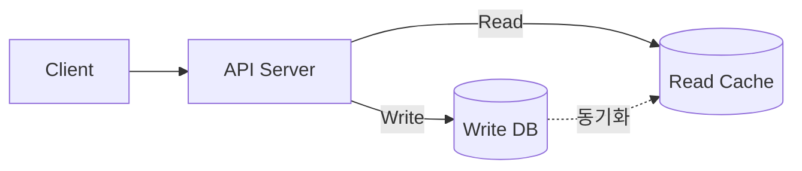
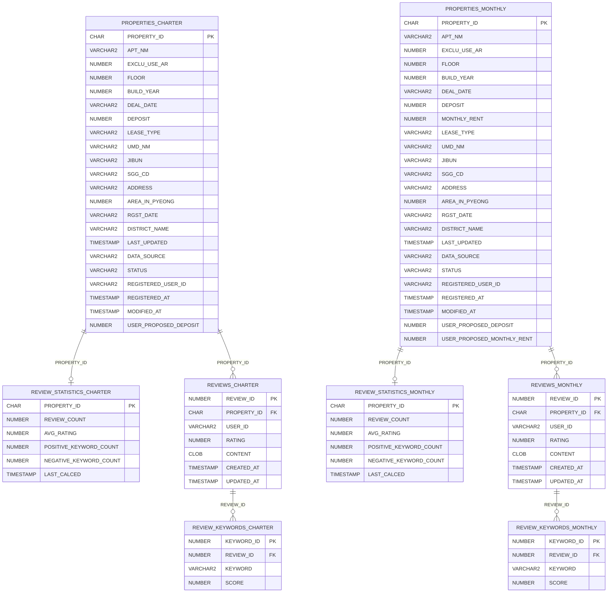
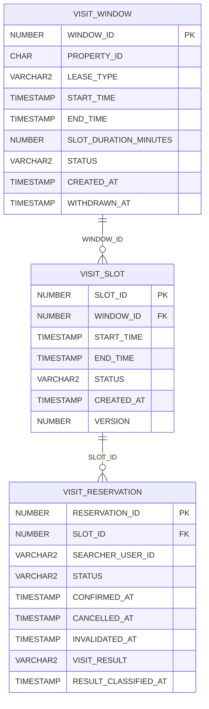

<!--
============================================================
  백엔드 웹 개발자 포트폴리오 README 정석 양식
  - 각 섹션의 <!-- 가이드 --> 주석을 읽고 그 자리에 내용을 채운 뒤 주석은 삭제할 것
  - { } 는 치환 대상 placeholder
  - 측정값·근거가 없는 항목은 비워두거나 "미측정"으로 표기 (임의 추정값 삽입 금지)
  - 기능은 내부 식별번호가 아니라 실제 기능명(매물 등록, 슬롯 예약 등)으로 지칭
  - 용어 정확성: 측정으로 입증되지 않은 단정 표현 금지.
    "병목" 같은 통칭 대신 실제로 한 작업("쿼리 구조 개선", "쿼리 효율화")으로 기술.
  - 과장·AI 문체 금지: "초고속", "지능적인", "혁신적" 등 형용 과잉 표현 배제.
    수치와 동작으로 입증하고 형용사로 포장하지 말 것.
  - 분량: 면접관은 앞 1~2문단에서 통과 여부를 판단한다. 핵심 맥락 위주로 압축하고
    장황한 서술을 피한다. 모든 기재 항목은 꼬리질문 대상이므로, 답변 가능한 범위만 적는다.
============================================================
-->

# Wherehouse

<!--
  한 줄 소개: 이 서비스가 "누구의 / 무슨 문제를 / 어떻게" 해결하는지 한 문장.
  추상 표현 금지. 대상 사용자와 해결 문제를 구체적으로.
-->
> 서울 1인 가구가 가격·안전·생활편의를 한 화면에서 비교하도록, 흩어진 공공데이터와 카카오맵 API를 안전·편의·가격 점수로 정규화·가중합산하고 실거주 리뷰 별점을 같은 점수 체계에 합류시킨 주거지 추천 서비스.

<!--
  배지(badge)는 선택. 사용 시 기술 스택/버전/라이선스/배포상태 정도만.
  과도한 배지 나열 금지. 예시:
-->


| 항목 | 내용 |
| --- | --- |
| 배포 URL | https://wherehouse.it.kr/wherehouse/ |
| 개발 인원 | 1인 단독 |
| 개발 기간 | 2023.09 ~ 2025.03 (18개월) |
| 담당 역할 | {설계·개발·인프라·배포 전 영역 단독 등} |

<!--
  ★ 앞단 임팩트 (피드백 핵심 반영 항목)
  면접관은 다수 문서를 빠르게 훑으며 앞 1~2문단에서 통과 여부를 판단한다.
  일반적 서술("1인 가구의 주거 문제 해결")로 시작하면 넘겨진다.
  이 블록에서 즉시 보여야 하는 것:
    - 임팩트가 큰 핵심 성과 2~4개 (정량 수치가 있으면 측정 환경을 함께 명시. 환경 없는 수치는 신뢰도 하락 근거가 됨)
    - 단순 "빠르게 만듦"보다, 다중 후보를 실측 비교해 선택한 의사결정·정합성 보장 사례를 우선
  추상 표현·과장 금지. 측정값이 없으면 그 줄은 비워둔다.
-->
### 핵심 성과
- 주거지 추천 쿼리에서 자치구별로 반복되던 리뷰 통계 조회(N+1)를 제거하고 Chunk 분할 조회로 전환해, 요청당 RDB 호출을 327회에서 144회로 줄임
- 주거지 추천의 Redis 조건 조회를 순차 호출에서 Pipeline으로 묶어, 자치구당 평균 응답 시간을 54% 단축
- 동시 예약에서 슬롯당 정확히 1건만 확정되도록, 무제어·조건부 UPDATE·비관적 락·낙관적 락을 비교한 뒤 조건부 UPDATE를 채택

---

<!--
  실행 화면 (동작 증명용).
  목적: "문서만 만든 게 아니라 실제로 동작하는 시스템"임을 의심 품기 전에 보여준다.
  - 서비스 전체를 보여주는 대표 1~2장이면 여기 독립 블록으로 둔다.
  - 각 화면이 특정 기능을 하나씩 보여주는 형태라면, 이 블록 대신
    위 "주요 기능" 항목마다 해당 화면을 끼워 넣는 편이 낫다(설명 옆에 화면).
  - 라이브 데모 링크가 가능하면 함께 건다. 배포 중지 상태면 정지 전/로컬 구동 캡처 사용.
  - 캡처가 어떤 환경(배포/로컬, 시점)에서 찍힌 것인지 한 줄로 명시한다.
    환경 미표기 자료는 신뢰도 근거가 약해진다.
-->
## 실행 화면


*상세 지도 위치 분석: 지도에서 선택한 좌표의 CCTV 수, 가까운 파출소까지의 거리, 인근 편의시설을 조회하고 안전·편의·종합 점수로 환산해 보여준다.*

> 데모: https://wherehouse.it.kr/wherehouse/
> 캡처 환경: {배포 / 로컬 · 시점 — 확인 필요}
> 운영 상태: {확인 필요}

---

## 목차

<!-- 문서가 길 때만 유지. 앵커 링크는 소문자·공백→하이픈 규칙을 따름 -->

1. [프로젝트 개요](#프로젝트-개요)
2. [주요 기능](#주요-기능)
3. [기술 스택](#기술-스택)
4. [시스템 아키텍처](#시스템-아키텍처)
5. [기술적 의사결정](#기술적-의사결정)
6. [데이터베이스 설계](#데이터베이스-설계)
7. [API 명세](#api-명세)
8. [디렉토리 구조](#디렉토리-구조)
9. [배포](#배포)

---

## 프로젝트 개요

<!--
  여기가 평가의 출발점. "기능 나열"이 아니라 "왜 만들었는가"를 먼저.
  - 배경/문제 정의: 어떤 상황에서 어떤 결핍·불편이 있었는가 (구체적 수치/사례)
  - 목적: 그 문제를 어떤 방향으로 해결하려 했는가
  - 범위: 이 프로젝트가 다루는 것과 다루지 않는 것의 경계
  - 프로젝트 출발점이 팀 초기버전 → 단독 리팩토링이라면 그 맥락을 숨기지 말 것.
    빠지면 "처음부터 잘못 설계했다"로 오해받는다. 능동 프레이밍으로 기술:
    "초기 버전은 팀으로 개발했고, 이후 단독으로 성능을 분석하는 과정에서
     N+1 패턴을 발견·정량 측정·해결했다" 처럼 발견·분석·해결에 초점.
    "당시엔 몰랐다"가 아니라 "측정으로 찾아내 고쳤다"가 드러나게.
-->

### 프로젝트 출발점
Wherehouse는 국비 교육 과정의 팀 프로젝트로 시작했다. 초기 버전은 서울 1인 가구를 대상으로 자치구·동 단위 평균 가격과 치안·편의 종합 점수를 제공하는 추천 서비스였다. 교육 과정 종료 후 이 프로젝트를 단독으로 인수해, 비즈니스 로직과 시스템 아키텍처를 다시 설계하고 기능을 확장했다. 현재 저장소의 코드와 설계는 이 단독 작업의 결과다.

### 배경 및 문제 정의
서울 1인 가구가 주거지를 고를 때, 기존 부동산 서비스로는 해결되지 않는 두 가지 문제가 있다.

첫째, 가격·안전·생활편의를 한 화면에서 종합 비교할 수단이 없다. 직방·다방은 매물 가격 중심이고 네이버 부동산은 실거래가 중심이라, 사용자가 가격·안전·편의 정보를 직접 모아 비교해야 한다.

둘째, 사용자는 통계 점수만이 아니라 실제 그 매물에 살아본 사람들의 리뷰와 평가도 함께 보고 싶어 한다. 기존 서비스는 공공데이터 기반 통계 점수만 제공할 뿐, 실거주자가 남긴 별점과 리뷰를 같은 기준으로 참고할 수단이 없다.

### 목적
이 프로젝트가 사용자에게 이루려는 것은 다음과 같다.

첫째, 가격·안전·생활편의를 따로 찾아 비교하지 않아도 되도록, 흩어진 정보를 하나의 추천 점수로 종합해 조건에 맞는 주거지를 제시한다. 조건을 만족하는 매물이 부족하더라도 빈 결과 대신 조건을 완화한 대안을 제시한다.

둘째, 통계 점수만이 아니라 실제 그 매물에 살아본 사람들의 리뷰·평가를 같은 화면에서 함께 보고 추천에 반영되도록 한다.

셋째, 매물 추천에서 멈추지 않고, 사용자가 마음에 든 매물의 방문 일정을 서비스 안에서 확보할 수 있도록 한다.

### 프로젝트 범위
포함 범위는 위치 기반 안전·편의 분석, 정량 점수와 리뷰를 결합한 하이브리드 추천, 사용자 매물 등록·수정·상태변경, 방문 예약 슬롯·구독·알림이다. 백엔드 설계·구현부터 인프라·배포까지 단독으로 수행했다.

제외 범위는 실제 결제와 계약 체결, 실명 기반 임대인 검증(포트폴리오 특성상 누구나 매물을 등록할 수 있는 구조로 한정), 가격 제안·리뷰 반박 같은 사용자 간 양방향 상호작용(백엔드 1인 범위를 초과하여 제외), 방문 예약 시 이동 시간 타당성 판단(시간 구간의 직접적 겹침만 검사)이다.

---

## 주요 기능

<!--
  범위 스캔용 섹션. 면접관이 3초 안에 시스템 전체 범위를 훑게 하는 것이 목적.
  기능당 한 줄. "왜 필요한가" 서술이나 구현 방식은 여기 적지 않는다.
  배경은 개요, 깊이(설계 판단·동시성·정합성)는 기술적 의사결정·아키텍처에서 다룬다.
  내부 식별번호(F001 등) 노출 금지.
-->

- **조건별 주거지 추천**: 예산·평수·우선순위로 서울 자치구를 순위 추천(정량 점수 + 리뷰 점수 가중 합산, 매물 부족 시 조건 완화 재검색)
- **상세 지도 위치 분석**: 임의 좌표의 안전성·편의성을 여러 데이터 소스 병렬 조회로 점수화
- **실거주자 리뷰**: 별점·텍스트 리뷰 작성·조회, 텍스트 키워드 자동 추출, 통계 추천 반영
- **사용자 매물 등록**: 사용자 직접 등록·수정·거래완료(추천 검색 즉시 반영, 동일 매물 중복 판별)
- **매물 방문 예약**: 시간 슬롯 공개·예약·취소, 동시 예약 시 슬롯당 1명 확정, 재개방 알림

---

## 기술 스택

<!--
  분류별로 정리. 각 항목에 "선택 이유"를 별도 의사결정 섹션에서 다룰 것이므로
  여기서는 사용 기술과 버전만 정확히 기재. 추정 버전 기입 금지.
-->

| 구분 | 기술 |
| --- | --- |
| Language | Java |
| Framework | Spring Boot, Spring Security, Spring Data JPA |
| Database (Write) | Oracle |
| Cache / Read Store | Redis |
| 인증·보안 | JWT, BCrypt, HttpOnly Cookie, HTTPS/TLS 1.2 |
| 외부 API | Kakao Map API, 국토교통부 실거래가 API |
| Infra / 배포 | Ubuntu Server, Docker, Jenkins |
| 형상관리 | Git, GitHub |
| 측정·분석 | Wireshark, JMeter, HikariCP, Oracle 동적 성능 뷰(V$SQL·V$SYSSTAT·V$SQL_PLAN) |

---

## 시스템 아키텍처

<!--
  다이어그램(이미지 또는 mermaid) + 텍스트 설명을 함께.
  구성요소 간 "데이터 흐름"과 "책임 분리"가 한눈에 보이게.
  CQRS·캐시 구조라면 Write 경로와 Read 경로를 분리해서 표현할 것.
-->

```
{아키텍처 다이어그램 이미지 삽입 또는 아래 mermaid 사용}
```


```mermaid
flowchart LR
  Client --> API[API Server]
  API -->|Write| WriteDB[(Write DB)]
  API -->|Read| Cache[(Read Cache)]
  WriteDB -.동기화.-> Cache
```

### 구성 요소 설명
- **{컴포넌트명}**: {역할과 책임}
- **{데이터 흐름}**: {Write 경로 / Read 경로가 각각 어떻게 흐르는지}

---

## 기술적 의사결정

<!--
  ★ 백엔드 주니어 평가의 핵심 섹션. 기능보다 "판단 과정"을 본다.
  피드백 반영: "왜 이것인가"와 "다른 방법은 검토했나"에 답하지 못하면 역효과.
  각 결정 = 제목(결정 내용을 먼저 명시) + 짧은 산문. 라벨 나열(Why/Options 등) 쓰지 않는다.
  산문 흐름: 어떤 문제·제약이 결정을 강제했는가 / 어떤 대안을 무엇으로 비교했고
    무엇을 측정해 어떤 대안을 왜 배제했는가(배제 대안과 사유 필수) / 그래서 무엇을 골랐고 결과는 어떠한가.
  검토하지 않은 대안을 지어내지 말 것. 측정값은 실측만 쓰고 추정 금지.
  스키마 단위 결정은 대상 테이블을 본문에 한 줄로 명시(ERD는 아래 레퍼런스 층).
  내부 식별번호(F001 등) 노출 금지.
-->

### 1. 반복 집계 조회(N+1): Chunk 61 분할 조회로 전환

**리뷰 통계를 자치구별로 개별 조회해 요청당 최대 25회 RDB 호출과 커넥션 경합 발생. 요청당 호출을 327회에서 144회로 줄임.**

| 후보 | 측정에서 드러난 것 (20 동시 요청) | 판정 |
|---|---|---|
| N+1 (원형) | 호출 327회, Hard Parse | 문제 출발점 |
| Bulk Fetch | 호출 20회로 감소했으나 가변 IN절로 SQL 재사용 실패(Hard Parse) | 배제 |
| Chunk 1000 | 분할 미발동, Full Scan | 배제 |
| Chunk 22 | 호출 381회·커넥션 대기 10, 경합 폭증 | 배제 |
| **Chunk 61** | **호출 144회·대기 4, Soft Parse 88.7%, INLIST Cost 68** | **채택** |

IN절 크기를 고정해 SQL 재사용·실행계획·경합이 균형을 이루는 지점이 61이었다. 측정 계층: V$SYSSTAT·V$SQL·V$SQL_PLAN·애플리케이션 병목 로그·HikariCP.

### 2. Redis 조건 조회의 직렬 RTT: Pipeline 일괄 호출로 전환

**자치구당 3개 조건(보증금·월세·평수)을 순차 호출해 RTT가 3회 누적, 응답 시간의 99.71%가 I/O 대기. 자치구당 평균 응답을 128.95ms에서 58.80ms로 단축(−54.4%).**

| 방식 | 측정에서 드러난 것 (강남구 제외) | 판정 |
|---|---|---|
| 순차(동기) 호출 | 자치구당 총 RTT 115.5ms 누적, I/O 대기 99.71% | 문제 |
| **Pipeline 일괄** | **총 RTT 38.9ms(−66.3%), 1회 왕복 비용은 0.8ms 차로 불변** | **채택** |

3개 조건은 결합 의존성이 없어 한 번에 보낼 수 있고, Pipeline은 왕복 횟수만 줄일 뿐 1회 비용을 키우지 않아 구조적 개선이다. 측정: 애플리케이션 nanoTime + Wireshark TCP. 강남구는 payload 4.0MB가 병목 본질이라 효과 제한적(−15.6%).

### 3. 방문 예약 슬롯 동시성: 조건부 UPDATE로 제어

**한 슬롯에 동시 예약이 몰려도 정확히 한 명만 확정해야 함. 5개 동시 요청에서 확정 1건·거부 4건, 이중 예약 0건.**

| 후보 | 측정에서 드러난 것 (한 슬롯 5개 동시 요청) | 판정 |
|---|---|---|
| 무제어 | 확정 5건, 중복 발생 | 배제 |
| 비관적 락 | 확정 1건이나 읽기 단계에서 대기 73~128ms | 배제 |
| 낙관적 락 | 확정 1건이나 예약 등록까지 진행 후 커밋에서 롤백 | 배제 |
| **조건부 UPDATE** | **확정 1건, 쓰기 시점 차단으로 거부 비용 없음** | **채택** |

정합성은 무제어를 뺀 셋이 같았고, 거부될 요청을 어느 단계에서 처리하는가가 갈랐다. 조건부 UPDATE는 확인과 점유를 한 갱신으로 묶어 경합 구간을 없애고 잠금 구간이 가장 짧다.

### 4. 사용자 매물 중복 등록 동시성: 데이터베이스 키 단위 락으로 제어

**두 사용자가 같은 매물을 동시 등록 시 둘 다 미등록 확인 후 중복 저장 위험. 충돌 없는 등록은 병렬, 동일 매물 충돌만 직렬화, 동시 등록 중복 0건.**

| 후보 | 측정에서 드러난 것 (혼합 부하 10건) | 판정 |
|---|---|---|
| 애플리케이션 단일 락 | 매물 종류 무관 전체 직렬화, 충돌 없는 요청까지 +47ms 계단식 대기 | 배제 |
| **데이터베이스 키 단위 락** | **동일 매물만 경합, 충돌 없는 등록 병렬(24~26ms)** | **채택** |

비즈니스 충돌은 동일 매물 등록 사이에서만 생기므로, 직렬화 범위가 충돌 범위와 일치하는 키 단위 락을 택했다. 동일 매물 5건만 보면 두 후보가 동등(135~138ms 대 149~153ms)이라, 차이는 다른 매물이 섞인 혼합 부하에서만 드러났다.

### 5. 외부 API 순차 호출: 비동기 병렬로 전환

**편의시설 15개 카테고리를 카카오맵 API로 동기 순차 호출, 외부 호출 구간이 전체 응답의 92.2% 점유. 동작 전체 평균을 1,221ms에서 255ms로 단축(−79.1%).**

| 방식 | 측정·근거 | 판정 |
|---|---|---|
| 동기 순차 | 외부 호출 구간 평균 1,107ms, 응답 대기 선형 누적 | 문제 |
| ForkJoinPool | CPU 연산 분할용 구조라 I/O 대기의 동시 호출 수 요건과 불일치 | 배제 |
| **ThreadPoolExecutor + CompletableFuture** | **편의시설 구간 144ms(−87.0%)** | **채택** |

15개 호출은 의존성이 없어 동시 실행이 가능하고, 작업이 I/O 대기이므로 풀 크기를 동시 호출 수에 맞춘 ThreadPoolExecutor가 부합했다.

### 6. 매물 검색 쿼리: 전방 일치 + B-Tree 인덱스로 전환

**매물명 양방향 LIKE 패턴이 B-Tree를 못 써 Full Table Scan, 이 쿼리가 전체 응답의 66.3% 점유. 쿼리 평균을 26.3ms에서 6.0ms로 단축(−77.2%), 슬로우 쿼리 103건을 0건으로.**

| 방식 | 측정·근거 | 판정 |
|---|---|---|
| 양방향 LIKE (선행 와일드카드) | 인덱스 미사용, Cost 137 Full Scan, 슬로우 쿼리 103건 | 문제 |
| **전방 일치 + apt_nm B-Tree** | **Cost 3~5 INDEX RANGE SCAN, 슬로우 쿼리 0건** | **채택** |

부분 일치를 포기하는 트레이드오프('삼성'으로 '래미안삼성' 매칭 불가)가 있으나, 매물명 검색은 앞부분 입력이 일반적이라 전방 일치가 검색 의도에 부합한다고 보고 수용했다(요구사항 재검토 동반).

---

<!--
============================================================
  이하 레퍼런스 층: 평가 신호보다 "필요할 때 찾아보는" 정보.
  위 본문(개요~기술적 의사결정)에서 흥미와 판단 증명을 끝내고,
  여기서는 검증·재현에 필요한 상세를 제공한다.
============================================================
-->

## 데이터베이스 설계

이 데이터베이스의 테이블은 매물·리뷰와 방문 예약 두 영역으로 나뉜다.

매물은 전세와 월세를 서로 다른 테이블에 나눠 저장한다(전세 `PROPERTIES_CHARTER`, 월세 `PROPERTIES_MONTHLY`). 두 테이블의 구조는 같고, 월세 쪽에만 월세 금액 관련 컬럼이 더 있다.

리뷰는 매물마다 별점·본문, 집계 통계, 키워드 세 갈래로 나눠 저장한다. 한 사용자는 같은 매물에 리뷰를 1건만 남길 수 있다.

매물 식별자(`PROPERTY_ID`)는 매물의 불변 속성을 조합해 만든 32자 MD5 해시 값이다. 식별자가 매물 내용에서 도출되므로, 배치로 매물을 다시 수집해도 같은 매물은 같은 식별자를 유지한다.

### 매물·리뷰 도메인


```mermaid
erDiagram
    PROPERTIES_CHARTER ||--o| REVIEW_STATISTICS_CHARTER : PROPERTY_ID
    PROPERTIES_CHARTER ||--o{ REVIEWS_CHARTER           : PROPERTY_ID
    REVIEWS_CHARTER    ||--o{ REVIEW_KEYWORDS_CHARTER   : REVIEW_ID
    PROPERTIES_MONTHLY ||--o| REVIEW_STATISTICS_MONTHLY : PROPERTY_ID
    PROPERTIES_MONTHLY ||--o{ REVIEWS_MONTHLY           : PROPERTY_ID
    REVIEWS_MONTHLY    ||--o{ REVIEW_KEYWORDS_MONTHLY   : REVIEW_ID

    PROPERTIES_CHARTER {
        CHAR      PROPERTY_ID           PK
        VARCHAR2  APT_NM
        NUMBER    EXCLU_USE_AR
        NUMBER    FLOOR
        NUMBER    BUILD_YEAR
        VARCHAR2  DEAL_DATE
        NUMBER    DEPOSIT
        VARCHAR2  LEASE_TYPE
        VARCHAR2  UMD_NM
        VARCHAR2  JIBUN
        VARCHAR2  SGG_CD
        VARCHAR2  ADDRESS
        NUMBER    AREA_IN_PYEONG
        VARCHAR2  RGST_DATE
        VARCHAR2  DISTRICT_NAME
        TIMESTAMP LAST_UPDATED
        VARCHAR2  DATA_SOURCE
        VARCHAR2  STATUS
        VARCHAR2  REGISTERED_USER_ID
        TIMESTAMP REGISTERED_AT
        TIMESTAMP MODIFIED_AT
        NUMBER    USER_PROPOSED_DEPOSIT
    }
    PROPERTIES_MONTHLY {
        CHAR      PROPERTY_ID           PK
        VARCHAR2  APT_NM
        NUMBER    EXCLU_USE_AR
        NUMBER    FLOOR
        NUMBER    BUILD_YEAR
        VARCHAR2  DEAL_DATE
        NUMBER    DEPOSIT
        NUMBER    MONTHLY_RENT
        VARCHAR2  LEASE_TYPE
        VARCHAR2  UMD_NM
        VARCHAR2  JIBUN
        VARCHAR2  SGG_CD
        VARCHAR2  ADDRESS
        NUMBER    AREA_IN_PYEONG
        VARCHAR2  RGST_DATE
        VARCHAR2  DISTRICT_NAME
        TIMESTAMP LAST_UPDATED
        VARCHAR2  DATA_SOURCE
        VARCHAR2  STATUS
        VARCHAR2  REGISTERED_USER_ID
        TIMESTAMP REGISTERED_AT
        TIMESTAMP MODIFIED_AT
        NUMBER    USER_PROPOSED_DEPOSIT
        NUMBER    USER_PROPOSED_MONTHLY_RENT
    }
    REVIEWS_CHARTER {
        NUMBER    REVIEW_ID    PK
        CHAR      PROPERTY_ID  FK
        VARCHAR2  USER_ID
        NUMBER    RATING
        CLOB      CONTENT
        TIMESTAMP CREATED_AT
        TIMESTAMP UPDATED_AT
    }
    REVIEWS_MONTHLY {
        NUMBER    REVIEW_ID    PK
        CHAR      PROPERTY_ID  FK
        VARCHAR2  USER_ID
        NUMBER    RATING
        CLOB      CONTENT
        TIMESTAMP CREATED_AT
        TIMESTAMP UPDATED_AT
    }
    REVIEW_STATISTICS_CHARTER {
        CHAR      PROPERTY_ID            PK
        NUMBER    REVIEW_COUNT
        NUMBER    AVG_RATING
        NUMBER    POSITIVE_KEYWORD_COUNT
        NUMBER    NEGATIVE_KEYWORD_COUNT
        TIMESTAMP LAST_CALCED
    }
    REVIEW_STATISTICS_MONTHLY {
        CHAR      PROPERTY_ID            PK
        NUMBER    REVIEW_COUNT
        NUMBER    AVG_RATING
        NUMBER    POSITIVE_KEYWORD_COUNT
        NUMBER    NEGATIVE_KEYWORD_COUNT
        TIMESTAMP LAST_CALCED
    }
    REVIEW_KEYWORDS_CHARTER {
        NUMBER    KEYWORD_ID  PK
        NUMBER    REVIEW_ID   FK
        VARCHAR2  KEYWORD
        NUMBER    SCORE
    }
    REVIEW_KEYWORDS_MONTHLY {
        NUMBER    KEYWORD_ID  PK
        NUMBER    REVIEW_ID   FK
        VARCHAR2  KEYWORD
        NUMBER    SCORE
    }
```

### 방문 예약 도메인


```mermaid
erDiagram
    VISIT_WINDOW ||--o{ VISIT_SLOT        : WINDOW_ID
    VISIT_SLOT   ||--o{ VISIT_RESERVATION : SLOT_ID

    VISIT_WINDOW {
        NUMBER    WINDOW_ID             PK
        CHAR      PROPERTY_ID
        VARCHAR2  LEASE_TYPE
        TIMESTAMP START_TIME
        TIMESTAMP END_TIME
        NUMBER    SLOT_DURATION_MINUTES
        VARCHAR2  STATUS
        TIMESTAMP CREATED_AT
        TIMESTAMP WITHDRAWN_AT
    }
    VISIT_SLOT {
        NUMBER    SLOT_ID     PK
        NUMBER    WINDOW_ID   FK
        TIMESTAMP START_TIME
        TIMESTAMP END_TIME
        VARCHAR2  STATUS
        TIMESTAMP CREATED_AT
        NUMBER    VERSION
    }
    VISIT_RESERVATION {
        NUMBER    RESERVATION_ID       PK
        NUMBER    SLOT_ID              FK
        VARCHAR2  SEARCHER_USER_ID
        VARCHAR2  STATUS
        TIMESTAMP CONFIRMED_AT
        TIMESTAMP CANCELLED_AT
        TIMESTAMP INVALIDATED_AT
        VARCHAR2  VISIT_RESULT
        TIMESTAMP RESULT_CLASSIFIED_AT
    }
```

방문 가능 시간대(`VISIT_WINDOW`)는 매물 하나에 연결되지만, 매물을 향한 데이터베이스 외래키 제약은 없다. 매물이 전세·월세 두 테이블로 나뉘어 하나의 외래키로 묶을 수 없기 때문이다. 대신 매물 식별자와 임대 유형(`PROPERTY_ID`, `LEASE_TYPE`)의 조합으로 매물을 찾는 논리 참조다.

### 핵심 테이블
| 테이블 | 역할 |
| --- | --- |
| PROPERTIES_CHARTER | 전세 매물(배치 수집 + 사용자 등록 통합) |
| PROPERTIES_MONTHLY | 월세 매물(전세와 동일 구조 + `MONTHLY_RENT`·`USER_PROPOSED_MONTHLY_RENT`) |
| REVIEWS_CHARTER | 전세 매물 리뷰(별점·본문) |
| REVIEWS_MONTHLY | 월세 매물 리뷰 |
| REVIEW_STATISTICS_CHARTER | 전세 리뷰 집계(건수·평균 평점·키워드 카운트) |
| REVIEW_STATISTICS_MONTHLY | 월세 리뷰 집계 |
| REVIEW_KEYWORDS_CHARTER | 전세 리뷰 추출 키워드 |
| REVIEW_KEYWORDS_MONTHLY | 월세 리뷰 추출 키워드 |
| VISIT_WINDOW | 등록자가 공개한 방문 가능 시간대 |
| VISIT_SLOT | 윈도우를 분할한 예약 단위 슬롯 |
| VISIT_RESERVATION | 슬롯 예약과 방문 결과 |

---

## API 명세

설계 명세서 5종에서 확인된 엔드포인트다. 경로 접두사는 도메인별로 다르다(추천 `/api/recommendations`, 위치 분석 `/api/location-analysis`, 그 외 `/api/v1/*`). 인증 표기는 다음을 뜻한다 — **필수**: JWT 보호 경로, **불필요**: 공개, **선택**: 미인증도 동작하되 인증 시 본인 식별 정보를 추가 활용.

### 주거지 추천
| Method | Endpoint | 설명 | 인증 |
| --- | --- | --- | --- |
| POST | /api/recommendations/charter-districts | 전세 조건·우선순위로 서울 자치구 순위 추천 | 선택 |
| POST | /api/recommendations/monthly-districts | 월세 조건·우선순위로 서울 자치구 순위 추천 | 선택 |
| GET | /api/recommendations/health | 로드밸런서 헬스 체크 | 불필요 |

### 상세 지도 위치 분석
| Method | Endpoint | 설명 | 인증 |
| --- | --- | --- | --- |
| POST | /api/location-analysis | 단일 좌표의 안전·편의를 여러 소스 병렬 조회로 점수화 | 명세 외(미확인) |

### 실거주자 리뷰
| Method | Endpoint | 설명 | 인증 |
| --- | --- | --- | --- |
| POST | /api/v1/reviews | 매물 리뷰 작성(별점·텍스트, 통계 갱신) | 필수 |
| GET | /api/v1/reviews/list | 리뷰 목록 페이징 조회(매물명 검색) | 불필요 |
| GET | /api/v1/reviews/{reviewId} | 리뷰 단건 상세 조회 | 불필요 |
| POST | /api/v1/reviews/update | 리뷰 수정(작성자 본인, 키워드·통계 재계산) | 필수 |
| DELETE | /api/v1/reviews/{reviewId} | 리뷰 삭제(작성자 본인, 통계 차감) | 필수 |
| GET | /api/v1/properties/search | 매물명 검색·자동완성 | 불필요 |

### 사용자 매물 등록·수정·조회
| Method | Endpoint | 설명 | 인증 |
| --- | --- | --- | --- |
| POST | /api/v1/properties/charter | 전세 매물 등록 | 필수 |
| POST | /api/v1/properties/monthly | 월세 매물 등록 | 필수 |
| PATCH | /api/v1/properties/charter/{propertyId} | 전세 매물 수정 | 필수 |
| PATCH | /api/v1/properties/monthly/{propertyId} | 월세 매물 수정 | 필수 |
| PATCH | /api/v1/properties/charter/{propertyId}/status | 전세 매물 상태 변경(거래완료·삭제) | 필수 |
| PATCH | /api/v1/properties/monthly/{propertyId}/status | 월세 매물 상태 변경(거래완료·삭제) | 필수 |
| GET | /api/v1/properties | 배치·사용자 매물 통합 목록 조회 | 불필요 |
| GET | /api/v1/properties/{propertyId} | 매물 상세 조회 | 불필요 |

### 매물 방문 예약
| Method | Endpoint | 설명 | 인증 |
| --- | --- | --- | --- |
| GET | /api/v1/visit/properties/{propertyId}/slots | 매물 방문 슬롯 조회 | 불필요 |
| POST | /api/v1/visit/windows | 방문 가능 시간대(윈도우) 공개 | 필수 |
| DELETE | /api/v1/visit/windows/{windowId} | 윈도우 철회 | 필수 |
| POST | /api/v1/visit/reservations | 슬롯 예약(슬롯당 1명 확정) | 필수 |
| DELETE | /api/v1/visit/reservations/{reservationId} | 예약 취소 | 필수 |
| POST | /api/v1/visit/slots/{slotId}/subscriptions | 재개방 알림 구독 신청 | 필수 |
| DELETE | /api/v1/visit/slots/{slotId}/subscriptions | 재개방 알림 구독 해제 | 필수 |
| PATCH | /api/v1/visit/reservations/{reservationId}/result | 방문 결과 분류(등록자) | 필수 |
| GET | /api/v1/visit/searcher/reservations | 탐색자 예약 현황 조회 | 필수 |
| GET | /api/v1/visit/searcher/subscriptions | 탐색자 구독 현황 조회 | 필수 |
| GET | /api/v1/visit/registrant/properties/{propertyId}/slots | 등록자 슬롯 현황 조회 | 필수 |
| GET | /api/v1/visit/notifications | 방문 예약 알림 조회 | 필수 |
| PATCH | /api/v1/visit/notifications/{notificationId}/read | 알림 읽음 처리 | 필수 |

> 전체 요청·응답 스키마: {Swagger UI / 문서 링크 — 미확보}

---

## 디렉토리 구조

<!--
  주요 패키지/레이어 구조만. 전체 파일 트리 나열 금지.
  레이어드/헥사고날 등 구조 의도가 드러나게.
-->

```
src
└── main
    ├── java/{...}
    │   ├── controller   # {역할}
    │   ├── service      # {역할}
    │   ├── repository   # {역할}
    │   └── domain       # {역할}
    └── resources
        └── application.yml
```

---

## 배포

<!-- 빌드→테스트→배포 파이프라인 단계 서술은 원본에 없음. 단계가 확보되면 여기에 추가. -->

- **배포 주소**: https://wherehouse.it.kr/wherehouse/
- **배포 환경**: Ubuntu Server
- **사용 도구**: Jenkins, Docker