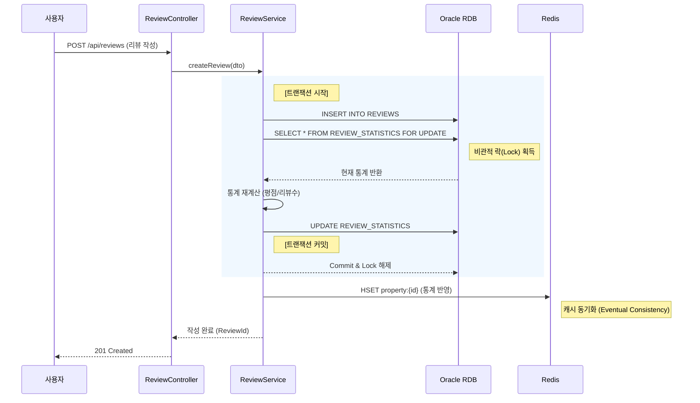

# [주거지 추천 서비스 고도화] 설계 명세서

프로젝트명: 주거지 추천 서비스 고도화 (Phase 2: Review System Integration)  
문서 버전: v1.0  
작성일: 2025년 11월 27일  
작성자: 정범진 (Back-end Engineer)

---

## 목차

1. [개요](#1-개요)
2. [시스템 전체 개요](#2-시스템-전체-개요)
3. [일반 요구사항](#3-일반-요구사항)
4. [기존 시스템 분석](#4-기존-시스템-분석)
5. [시스템 아키텍처](#5-시스템-아키텍처)
6. [API 명세](#6-api-명세)
7. [데이터 모델](#7-데이터-모델)
8. [핵심 비즈니스 로직](#8-핵심-비즈니스-로직)
9. [배치 처리 명세](#9-배치-처리-명세)
10. [실시간 서비스 명세](#10-실시간-서비스-명세)
11. [구현 기술 스택](#11-구현-기술-스택)
12. [부록](#12-부록)

---

## 1. 개요

### 1.1 목적

본 문서는 '주거지 추천 서비스 고도화' 프로젝트의 상세 설계를 정의한다. 기존 서비스는 정량적 공공데이터(가격, 범죄율 등)에만 의존하여 사용자가 체감하는 실제 거주 환경(소음, 이웃 등)을 반영하지 못하는 한계가 있었다. 또한, 데이터 저장소가 인메모리(Redis) 단일 구조로 되어 있어 데이터 휘발성 및 참조 무결성 관리에 취약점이 존재했다.

이에 본 시스템은 실거주자 리뷰 시스템을 도입하여 정성적 경험 데이터를 추천 로직에 통합하고, **하이브리드 저장소 아키텍처(Redis + Oracle RDB)**를 구축하여 데이터의 영속성과 조회 성능을 동시에 확보하는 것을 목적으로 한다. 특히 외부 데이터의 식별자 부재 문제를 해결하기 위한 고유 식별자(Business Key) 생성 전략을 포함한다.

### 1.2 범위

본 설계 명세서는 다음의 기능을 포함한다.

**리뷰 관리 시스템**: 리뷰 작성, 조회, 수정, 삭제 및 키워드 자동 추출 로직 구현

**데이터베이스 고도화**: Redis(Cache/Read)와 Oracle RDB(Persistence/Write)의 이원화 설계 및 동기화 로직 구현

**식별자 관리**: 외부 API 데이터 기반의 불변형 고유 식별자(MD5 Hash) 생성 및 중복 제거 로직 구현

**추천 알고리즘 확장**: 기존 정량적 점수에 리뷰 기반 점수를 가중 합산하는 하이브리드 추천 로직 구현

**배치 프로세스 개선**: 데이터 수집과 적재 로직의 결합도를 낮추는 이벤트 기반 파이프라인 구축

---

## 2. 시스템 전체 개요

### 2.1 핵심 아키텍처 요약

본 시스템은 대규모 데이터의 영속성(Persistence)과 실시간 추천 서비스의 고성능(High Performance)을 동시에 달성하기 위해 CQRS(Command and Query Responsibility Segregation) 패턴에 기반한 하이브리드 아키텍처로 설계되었다.

**주요 구성요소**

**데이터 수집 및 식별 계층 (Data Ingestion & Identification)**: BatchScheduler는 국토교통부 API의 휘발성 데이터를 수집하고, MD5 해시 알고리즘을 통해 매물의 불변 속성(주소, 면적 등)을 기반으로 고유 식별자(Business Key)를 생성한다. 이를 통해 외부 데이터의 변동에도 흔들리지 않는 데이터 영속성을 보장한다.

**영속성 계층 (Write Model / Source of Truth)**: Oracle RDB는 시스템의 원본 데이터 저장소 역할을 수행한다. 매물 정보와 리뷰 데이터 간의 참조 무결성(Referential Integrity)을 강제하며, 리뷰 작성 및 수정 시 트랜잭션(ACID) 관리를 통해 데이터 정합성을 보장한다.

**서비스 계층 (Read Model / Cache)**: Redis는 실시간 추천 알고리즘 연산과 데이터 조회를 전담한다. RDB에서 변경된 매물 통계(평점, 리뷰 수)는 이벤트 기반으로 즉시 Redis에 동기화되어, 복잡한 조인 연산 없이 고속 조회를 지원한다.

**핵심 처리 흐름**

데이터는 배치 프로세스를 통해 수집되어 식별자가 부여된 후 RDB에 '없으면 생성, 있으면 갱신(Upsert)'된다. 사용자가 작성한 리뷰는 RDB에 안전하게 저장됨과 동시에 통계 데이터로 가공되어 Redis에 실시간 반영된다. 최종적으로 추천 서비스는 Redis의 최신화된 데이터를 활용하여 사용자에게 응답한다.

**아키텍처 특징**

- **하이브리드 영속성**: 읽기 성능(Redis)과 데이터 무결성(RDB)의 역할을 물리적으로 분리하여 최적화.
- **논리적 식별자 전략**: 외부 데이터 소스의 구조적 한계(ID 부재)를 극복하기 위한 자체 해시 ID 전략 적용.
- **느슨한 결합**: 배치 로직과 데이터 적재 로직, RDB와 Redis 간의 동기화 로직을 이벤트 및 비동기 처리로 분리.

### 2.2 전체 데이터 처리 흐름도

시스템의 데이터 수집부터 최종 사용자 서비스 제공까지의 End-to-End 데이터 흐름은 다음과 같다.

```mermaid
flowchart TD
    %% 외부 시스템
    subgraph External [외부 데이터 소스]
        MolitAPI[국토교통부 실거래가 API]
    end

    %% 배치 및 수집 시스템
    subgraph BatchSystem [배치 및 식별 시스템]
        Scheduler[BatchScheduler]
        IDGen[ID Generator (MD5 Hash)]
        EventPub[Event Publisher]
    end

    %% 저장소 계층
    subgraph Persistence [하이브리드 저장소]
        RDB[(Oracle RDB - Write Master)]
        Redis[(Redis - Read Cache)]
    end

    %% 서비스 계층
    subgraph ServiceLayer [서비스 계층]
        ReviewSvc[ReviewService]
        RecomSvc[RecommendationService]
        SyncListener[RdbSyncListener]
    end

    %% 흐름 연결
    MolitAPI -->|1. Raw 데이터 수집| Scheduler
    Scheduler -->|2. 불변 속성 추출 및 ID 생성| IDGen
    IDGen -->|3. Business Key 반환| Scheduler
    Scheduler -->|4. 수집 완료 이벤트 발행| EventPub
    
    EventPub -->|5. 이벤트 구독 (Async)| SyncListener
    SyncListener -->|6. 매물 데이터 UPSERT| RDB
    
    User((사용자)) -->|7. 리뷰 작성 요청| ReviewSvc
    ReviewSvc -->|8. 트랜잭션 처리 (Insert/Update)| RDB
    ReviewSvc -.->|9. 통계 데이터 동기화 (Write-Through)| Redis
    
    User -->|10. 추천/조회 요청| RecomSvc
    RecomSvc -->|11. 고속 조회| Redis
    Redis -- 12. 데이터 반환 --> RecomSvc
    RecomSvc -->|13. 응답| User

    style External fill:#f9f,stroke:#333
    style BatchSystem fill:#ff9,stroke:#333
    style Persistence fill:#9f9,stroke:#333
    style ServiceLayer fill:#99f,stroke:#333
```

**흐름도 설명**

1. **[수집 및 식별]**: 배치 스케줄러가 외부 데이터를 수집하고, ID Generator를 통해 불변의 해시 ID를 생성하여 데이터에 부여한다.

2. **[영속화 (Upsert)]**: 수집된 데이터는 이벤트 리스너를 통해 Oracle RDB에 저장된다. 기존에 존재하는 ID라면 최신 정보로 갱신하고, 없으면 신규 생성하여 리뷰가 연결될 매물 마스터 데이터를 영구 보존한다.

3. **[리뷰 동기화]**: 사용자의 리뷰 작성으로 인해 RDB의 데이터가 변경되면, 변경된 통계 정보(평점 등)는 즉시 Redis에 반영되어 데이터 일관성을 유지한다.

4. **[서비스 제공]**: 추천 서비스는 RDB에 부하를 주지 않고 Redis의 인덱스와 캐시 데이터를 활용하여 서비스를 제공한다.

### 2.3 주요 컴포넌트 간 상호작용

데이터 정합성이 가장 중요한 '리뷰 작성 및 통계 갱신' 프로세스의 컴포넌트 간 상호작용이다.



**상호작용 설명**

- **비관적 락(Locking)**: ReviewService는 동시성 이슈를 원천 차단하기 위해 통계 테이블 조회 시 FOR UPDATE를 사용하여 RDB 레벨의 잠금을 획득한다.

- **캐시 동기화(Sync)**: RDB 트랜잭션이 성공적으로 커밋된 직후, 변경된 통계 정보를 Redis에 덮어써서 읽기 모델(Redis)과 쓰기 모델(RDB) 간의 데이터 일관성을 맞춘다.

### 2.4 장애 복구 및 초기화 전략 (Resilience & Warm-up Strategy)

본 시스템은 Redis를 주 조회 저장소로 사용하므로, Redis 서버의 재시작이나 데이터 유실(Eviction) 발생 시 서비스 장애로 직결될 수 있다. 이를 방지하기 위해 RDB 기반의 캐시 재구축(Warm-up) 메커니즘을 정의한다.

**캐시 웜업(Warm-up) 프로세스**

* **목적**: Redis 데이터 소실 시, 원본 저장소(Oracle RDB)의 데이터를 기반으로 캐시를 빠르게 복구하여 서비스 정상화 시간을 단축한다.
* **실행 시점**: 시스템 배포 직후, Redis 서버 재기동 시, 또는 관리자의 수동 요청 시.
* **처리 로직**:
   1. Source of Truth 조회: `Property` 테이블과 `ReviewStatistics` 테이블을 조인하여 유효한 매물 및 통계 데이터를 일괄 조회한다.
   2. Bulk Insert: 조회된 데이터를 Redis Pipeline을 사용하여 대량으로 적재(`HSET`)한다.
   3. 인덱스 재생성: 전세/월세 가격 및 평수 정보를 기반으로 `Sorted Set` 인덱스를 재구축한다.

### 2.5 데이터 정합성 보장 및 실패 대응 (Consistency & Failure Handling)

하이브리드 저장소 구조에서 RDB(쓰기)와 Redis(읽기) 간의 데이터 불일치를 방지하기 위한 최종 일관성(Eventual Consistency) 보장 전략을 수립한다.

**동기화 실패 시나리오 대응**

* **상황**: 리뷰 작성 트랜잭션(RDB Commit)은 성공했으나, 네트워크 일시 장애 등으로 Redis 캐시 갱신에 실패한 경우.
* **보상 프로세스 (Compensation Flow)**:
   1. 실패 감지: `ReviewService`에서 Redis 연결 예외(Exception) 발생 시 이를 포착한다.
   2. 로깅 및 큐잉: 실패한 매물 ID(`propertyId`)와 작업 유형을 `SYNC_RETRY_LOG` 테이블 또는 메시지 큐에 기록한다.
   3. 비동기 재시도: 별도의 백그라운드 스레드(또는 배치)가 주기적으로 실패 로그를 조회하여 Redis 동기화를 재수행한다.
   4. 자가 치유 (Self-Healing): 추천 서비스 조회 시 캐시 미스(Cache Miss)가 발생하면, 즉시 RDB에서 최신 데이터를 조회하여 응답하고 캐시를 갱신한다(Lazy Loading).

**정합성 검증 (Reconciliation)**

* **주기적 검증**: 매일 야간 배치(`BatchScheduler`) 실행 시, RDB의 통계 데이터(`REVIEW_STATISTICS`)와 Redis의 캐시 데이터를 무작위 샘플링하여 비교 검증하고, 불일치 발견 시 RDB 기준으로 강제 동기화한다.

---

## 3. 일반 요구사항

### 3.1 기술 요구사항

**데이터 교환 형식**
* 모든 API의 요청(Request) 및 응답(Response) 본문(Body)은 JSON (application/json) 형식을 엄격히 준수한다.
* 날짜 및 시간 데이터는 `ISO 8601` 형식(예: `yyyy-MM-dd'T'HH:mm:ss`)을 문자열로 직렬화하여 교환한다.

**문자 인코딩**
* 시스템 전반의 문자 집합(Character Set)은 UTF-8을 표준으로 사용한다.
* 외부 API(국토교통부) 연동 시 발생하는 인코딩 이슈는 `BatchScheduler` 내부에서 UTF-8로 정규화하여 처리한다.

**인증 및 인가 (Authentication & Authorization)**
* 읽기 요청 (GET): 추천 서비스 및 리뷰 조회 API는 별도의 인증 토큰 없이 접근 가능한 Public API로 구성한다.
* 쓰기 요청 (POST/PUT/DELETE): 리뷰 작성, 수정, 삭제 API는 `Authorization` 헤더에 유효한 `Bearer {Token}`(JWT 또는 세션 ID)을 포함해야만 요청이 승인된다.

**API 주소 체계**
* 모든 API는 `/api`를 루트 컨텍스트(Root Context)로 사용한다.
* 하위 호환성 보장을 위해 버전 관리 체계를 적용하며, 본 고도화 프로젝트의 신규 API는 `/api/v1`을 기본 경로로 한다.

### 3.2 성능 요구사항

**응답 속도 (Latency)**
* 조회 트래픽 (Read): 추천 서비스 및 리뷰 목록 조회는 Redis 캐시 히트(Cache Hit) 시 밀리초 단위의 빠른 응답 속도를 보장해야 한다.
* 쓰기 트래픽 (Write): 리뷰 작성 및 수정은 Oracle RDB 트랜잭션 처리와 비관적 락(Lock) 대기를 포함하더라도 신속한 처리를 완료해야 한다.

**데이터 일관성 (Consistency)**
* 즉시 일관성 (Strong Consistency): 리뷰 작성자가 본인이 작성한 내용을 조회할 때는 RDB를 직접 참조하거나 캐시 갱신 직후의 데이터를 반환하여 즉시 확인 가능해야 한다 (Read Your Own Writes).
* 최종 일관성 (Eventual Consistency): 매물 목록에 표시되는 집계 데이터(평균 별점, 총 리뷰 수)는 RDB 커밋 후 Redis 캐시와 동기화되어야 한다.

**가용성 (Availability)**
* 국토교통부 외부 API의 응답 지연이나 장애 발생 시에도, 시스템 내부에 적재된 매물 데이터와 리뷰 데이터를 활용하여 추천 서비스는 중단 없이 제공되어야 한다.

---

## 4. 기존 시스템 분석

### 4.1 기존 아키텍처 분석

현재 시스템은 인메모리 기반의 단일 저장소 전략을 취하고 있으며, 데이터의 생명주기가 배치 주기에 종속되는 구조적 특징을 가진다.

**컨트롤러 구조**

**RecommendationController**: 전세(Charter)와 월세(Monthly) 추천 요청을 처리하는 단일 진입점(Entry Point)이다.

**입력 검증**: RequestDto 내의 JSR-303 어노테이션(@NotNull, @Min, @Pattern)을 통해 예산, 평수, 우선순위 값의 유효성을 검증하며, 실패 시 GlobalExceptionHandler가 표준 에러 포맷(ErrorResponseDto)을 반환한다.

**서비스 레이어 구조**

**서비스 분리**: CharterRecommendationService와 MonthlyRecommendationService로 임대 유형별 비즈니스 로직이 완전히 분리되어 있다.

**Redis 의존성**: 데이터 접근 계층(DAO/Repository)이 별도로 존재하지 않고, RedisHandler 유틸리티 클래스를 통해 비즈니스 로직 내에서 직접 Redis 명령어를 수행하는 구조다.

**데이터베이스 구조 (AS-IS)**

**Redis (Main Store - Volatile)**: 실시간 매물 데이터(Hash)와 검색 인덱스(Sorted Set)가 저장되는 핵심 저장소다. 하지만 배치 실행 시 전체 데이터 삭제(Flush) 후 재적재되는 휘발성 구조를 가지고 있어, 리뷰와 같은 영속적 관계형 데이터를 저장하기에 부적합하다.

**Oracle RDB (Auxiliary - Static)**: AnalysisEntertainment, AnalysisCrime, AnalysisPopulationDensity 등 통계 분석용 정적 데이터 저장 용도로만 제한적으로 사용된다.

### 4.2 기존 비즈니스 로직의 상세 분석

**[1. 추천 검색 로직 (Recommendation Service)]**

기존 추천 로직은 **'필터링(Filtering) -> 폴백(Fallback) -> 정량 점수 산출(Scoring)'**의 3단계 파이프라인으로 구성된다.

```java
// Step 1: 1차 엄격 검색 (Strict Search)
// Redis ZSet의 교집합(InterSection) 연산을 활용하여 모든 조건을 만족하는 매물 ID 추출
// Key Pattern: idx:deposit:{구} ∩ idx:area:{구}:전세
Map<String, List<String>> results = strictSearch(request);

// Step 2: 폴백 처리 (Fallback Search)
// 검색된 매물이 임계치(3건) 미만인 지역구에 대해 조건 완화 수행
if (checkInsufficient(results)) {
    // 3순위 조건 완화 -> 결과 부족 시 -> 2순위 조건까지 추가 완화 (확장 검색)
    results = expandSearchWithRelaxedConditions(request);
}

// Step 3: 정량적 점수 산출 (Quantitative Scoring)
// 검색된 최종 후보 매물들에 대해 가격, 평수, 안전성 점수(0~100)를 계산하여 가중 합산
// FinalScore = (PriceScore * w1) + (SpaceScore * w2) + (SafetyScore * w3)
calculateQuantitativeScores(results);
```

**[2. 배치 데이터 처리 로직 (Batch Scheduler)]**

데이터 수집과 적재가 강하게 결합되어 있으며, 데이터 식별자의 비영속성 문제가 존재한다.

```java
// Step 1: 데이터 수집 (Data Collection)
// 국토교통부 API로부터 전월 기준 서울시 25개 자치구 매물 데이터 수집
List<Property> properties = collectFromOpenApi();

// Step 2: 저장소 초기화 (Critical Issue)
// 기존 적재된 모든 매물 데이터와 인덱스를 삭제 (데이터 휘발 발생)
redisHandler.clearCurrentRedisDB();

// Step 3: 데이터 적재 (Data Loading)
// 매번 UUID.randomUUID()를 통해 새로운 임의 식별자를 생성하여 적재
// 이로 인해 어제의 매물과 오늘의 매물이 논리적으로 연결되지 않음
storeToRedisWithRandomID(properties);
```

### 4.3 데이터 처리 흐름 분석

**AS-IS 데이터 파이프라인 흐름도**

```mermaid
flowchart TD
    subgraph Data_Source
        MolitAPI[국토교통부 API]
    end

    subgraph Batch_Process
        Scheduler[BatchScheduler]
        UUID[UUID 생성기]
    end

    subgraph Storage
        Redis[(Redis In-Memory)]
    end

    subgraph Service
        Client[사용자]
        Service[RecommendationService]
    end

    %% 배치 흐름
    MolitAPI -->|1. Raw Data| Scheduler
    Scheduler -->|2. Random ID 생성| UUID
    Scheduler -->|3. FLUSHALL (전체 삭제)| Redis
    Scheduler -->|4. 데이터 재적재| Redis

    %% 서비스 흐름
    Client -->|5. 추천 요청| Service
    Service -->|6. ZINTERSTORE (교집합)| Redis
    Redis -->|7. 매물 리스트| Service
    Service -->|8. 응답| Client
```

**흐름 분석 및 문제점 도출**

**배치 타임**: 매일 새벽 4시, 기존 데이터를 모두 지우고(Flush) 새로운 랜덤 ID로 데이터를 덮어쓴다. 이 과정에서 기존 매물에 연결된 정보가 있다면 모두 유실된다.

**서비스 타임**: 추천 서비스는 Redis에 전적으로 의존한다. Redis 장애 발생 시 데이터 원본이 없어 복구가 불가능하며 서비스가 중단된다.

**확장성 한계**: RDB를 단순 통계용으로만 사용하고 있어, 리뷰, 찜하기, 유저 등 관계형 데이터 모델을 확장하기 어려운 구조다.

---

## 5. 시스템 아키텍처

### 5.1 아키텍처 개요

본 시스템은 **데이터의 영속성(Persistence)**과 **대규모 조회 트래픽의 고속 처리(High Performance)**라는 상충되는 요구사항을 동시에 만족시키기 위해 CQRS(Command and Query Responsibility Segregation) 패턴을 차용한 하이브리드 저장소 아키텍처로 설계되었다.

**Write Layer (Oracle RDB)**: 시스템의 SSOT(Single Source of Truth) 역할을 수행한다. 매물 데이터의 영구 저장, 리뷰 데이터와의 참조 무결성(FK) 보장, 트랜잭션(ACID) 관리를 전담하여 데이터의 신뢰성을 확보한다.

**Read Layer (Redis)**: RDB로부터 동기화된 데이터를 기반으로 실시간 추천 알고리즘 연산과 목록 조회를 수행한다. 인메모리 구조의 이점을 활용하여 복잡한 연산에도 밀리초(ms) 단위의 응답 속도를 보장한다.

**Sync Layer (Event-Driven)**: 배치 프로세스 및 리뷰 작성으로 인한 데이터 변경 사항을 이벤트 기반으로 비동기 처리하여, 쓰기 저장소(RDB)와 읽기 저장소(Redis) 간의 **최종 일관성(Eventual Consistency)**을 유지한다.

### 5.2 시스템 구성 요소

| 구성 요소 | 역할 및 책임 | 주요 기술 |
|----------|------------|----------|
| Batch Scheduler | 국토교통부 API 데이터 수집, 비즈니스 키(MD5) 생성, 수집 완료 이벤트 발행 | Spring Scheduler |
| ID Generator | 매물의 불변 속성(시군구, 지번, 아파트명, 층, 면적)을 해싱하여 고유 식별자 생성 | Apache Commons Codec |
| RdbSyncListener | 수집 완료 이벤트를 구독하여 매물 데이터를 RDB에 Upsert(생성/갱신) 처리 | Spring Event, JPA |
| Review Service | 리뷰 작성/수정/삭제 트랜잭션 관리, 비관적 락(Lock)을 통한 통계 정합성 보장 | Spring Service, JPA |
| Recommendation Service | Redis 인덱스(Sorted Set) 기반 검색 및 하이브리드 점수 산출 로직 수행 | Spring Service |
| Hybrid Repository | RDB(Review/Property)와 Redis(Cache) 접근을 추상화하여 비즈니스 로직과 분리 | JPA Repository, RedisTemplate |

### 5.3 데이터 흐름 (Data Flow) - [수정됨]

시스템의 데이터 흐름은 쓰기 경로(Write Path), 동기화 경로(Sync Path), **읽기 경로(Read Path)**로 명확히 분리된다.

```mermaid
flowchart TD
    User((사용자))
    
    subgraph Write_Layer [Write Layer: 데이터 영속화 및 트랜잭션]
        direction TB
        Batch[Batch Scheduler<br/>(Logic 개선)]
        ReviewAPI[Review Service]
        RDB[(Oracle RDB)]
        
        Batch -->|1. 매물 테이블(PROPERTIES) UPSERT| RDB
        ReviewAPI -->|2. 리뷰 테이블(REVIEWS) INSERT| RDB
    end
    
    subgraph Sync_Layer [Sync Layer: 데이터 동기화]
        Sync[Sync Logic]
        RDB -.->|3. 변경 감지 (Commit)| Sync
        Sync -->|4. 통계/매물 정보 반영| Cache
    end
    
    subgraph Read_Layer [Read Layer: 고속 조회 및 추천]
        direction TB
        RecomAPI[Recommendation Service]
        Cache[(Redis Cache)]
        
        User -->|5. 추천/조회 요청| RecomAPI
        RecomAPI -->|6. 인덱스 검색 & 조회| Cache
        Cache -- 7. 데이터 반환 --> RecomAPI
    end

    User --> ReviewAPI
```

**흐름 상세 설명**

1. **[배치] 매물 마스터 데이터 동기화 (Upsert)**: 기존 `BatchScheduler`의 로직을 개선하여, 국토부 API에서 수집한 데이터를 RDB의 매물(PROPERTIES) 테이블에 동기화한다.
   * ID 생성: `MD5(주소+면적+층)` 해시를 통해 불변 ID를 생성한다.
   * UPSERT 수행: 생성된 ID가 DB에 없으면 **신규 생성(Insert)**하고, 이미 존재하면 가격 등 변동 사항만 **갱신(Update)**한다.
   * 목적: 리뷰 데이터(`REVIEWS` 테이블)가 참조하는 부모 데이터(FK)의 영속성을 보장하여, 배치 실행 후에도 리뷰 연결이 끊어지지 않도록 한다.

2. **[리뷰] 트랜잭션 처리**: 사용자의 리뷰 작성 요청은 RDB의 리뷰(REVIEWS) 테이블에 저장된다. 이때 데이터 정합성을 위해 통계(REVIEW_STATISTICS) 테이블에 대해 비관적 락(Pessimistic Lock)을 걸고 평점과 개수를 갱신한다.

3. **[동기화] 캐시 갱신 (Write-Through)**: RDB 트랜잭션이 커밋(Commit)되는 즉시, 변경된 매물 통계 정보(평점, 리뷰 수)를 Redis의 매물 정보(`Hash`)에 덮어씌워(Overwrite), 읽기 전용 저장소(Redis)가 항상 최신 상태를 유지하도록 한다.

4. **[추천] 고속 조회**: 추천 서비스는 RDB에 부하를 주지 않고, Redis에 미리 적재된 인덱스와 캐싱된 통계 데이터를 사용하여 요청을 처리한다.

### 5.4 장애 복구 및 초기화 전략 (Resilience Strategy)

Redis의 데이터 휘발성 특성을 보완하기 위해 다음과 같은 복구 메커니즘을 포함한다.

**캐시 웜업(Warm-up)**: 시스템 배포 또는 Redis 장애 복구 시, Oracle RDB에 저장된 원본 데이터(매물+통계)를 일괄 조회하여 Redis 캐시와 검색 인덱스를 재구축한다.

**실패 보상(Compensation)**: 리뷰 작성 후 Redis 동기화가 실패할 경우, 해당 이벤트를 로그에 기록하고 별도의 백그라운드 프로세스가 재동기화를 수행하여 최종 일관성을 보장한다.

---

## 6. API 명세

본 명세서는 **리뷰 관리(작성/조회/수정/삭제)**를 위한 신규 API와, 리뷰 데이터가 반영되어 응답 구조가 변경되는 기존 추천 API를 정의한다.

### 6.1 공통 사항

**프로토콜**: HTTP/1.1

**데이터 포맷**: application/json; charset=UTF-8

**인증 방식**:

* Public API: 인증 불필요 (리뷰 조회, 추천 요청)
* Protected API: Authorization: Bearer {Access_Token} 헤더 필수 (리뷰 작성, 수정, 삭제)

**에러 응답**: GlobalExceptionHandler를 통해 표준 ErrorResponseDto 포맷 반환.

### 6.2 리뷰 작성 API

| 항목 | 내용 |
|------|------|
| **기능 설명** | 사용자가 특정 매물(Property)에 대해 별점과 텍스트 리뷰를 등록한다. 작성 성공 시 RDB에 저장되고 통계 데이터가 갱신된다. |
| **HTTP Method** | POST |
| **Endpoint URL** | /api/v1/reviews |
| **인증 여부** | 필수 (Protected) |

#### 6.2.1 요청 (Request)

**Request Body**

| 필드 | 타입 | 필수 | 설명 | 예시 |
|------|------|------|------|------|
| propertyId | String | ✓ | 매물 식별자 (32자 MD5 Hash) | "5d41402abc..." |
| userId | String | ✓ | 작성자 ID | "user_1234" |
| rating | Integer | ✓ | 별점 (1~5 정수) | 5 |
| content | String | ✓ | 리뷰 내용 (20자 이상 1000자 이하) | "채광이 좋고..." |

**Request 예시**

```json
{
  "propertyId": "5d41402abc4b2a76b9719d911017c592",
  "userId": "user_1234",
  "rating": 5,
  "content": "남향이라 채광이 정말 좋고, 관리비도 저렴한 편입니다. 다만 주차 공간이 조금 협소해요."
}
```

#### 6.2.2 응답 (Response)

**성공 응답: 201 Created**

```json
{
  "reviewId": 1052,
  "createdAt": "2025-11-27T10:30:00"
}
```

### 6.3 리뷰 목록 조회 API (통합)

| 항목 | 내용 |
|------|------|
| **기능 설명** | 조건에 따라 리뷰 목록을 페이징 조회한다. propertyId 파라미터 유무에 따라 **'특정 매물 리뷰(모달용)'**와 '전체 최신 리뷰(게시판용)' 기능을 통합 제공한다. |
| **HTTP Method** | GET |
| **Endpoint URL** | /api/v1/reviews |
| **인증 여부** | 불필요 (Public) |

#### 6.3.1 요청 (Request)

**Request Parameters (Query String)**

| 파라미터 | 타입 | 필수 | 설명 | 동작 방식 |
|----------|------|------|------|----------|
| propertyId | String | ✗ | 매물 식별자 (MD5) | 포함 시: 해당 매물의 리뷰만 필터링 (모달용)<br/>미포함 시: 전체 리뷰 최신순 조회 (게시판용) |
| page | Integer | ✗ | 페이지 번호 | Default: 1 |
| size | Integer | ✗ | 페이지당 항목 수 | Default: 10 |
| sort | String | ✗ | 정렬 기준 | latest(기본), rating_desc, rating_asc |
| keyword | String | ✗ | 검색어 | 매물명 또는 리뷰 내용 검색 |
| searchType | String | ✗ | 검색 조건 | all(기본), content, tag |

#### 6.3.2 응답 (Response)

**성공 응답: 200 OK**

| 필드 | 타입 | 설명 |
|------|------|------|
| filterMeta | Object | 필터링 메타 정보 (propertyId 요청 시에만 값 존재) |
| filterMeta.propertyAvgRating | Double | 해당 매물의 평균 평점 |
| reviews | Array | 리뷰 데이터 리스트 (요약본) |
| reviews[].reviewId | Long | 리뷰 ID (상세 조회 Key) |
| reviews[].propertyId | String | 매물 ID |
| reviews[].propertyName | String | 아파트/매물명 |
| reviews[].userId | String | 작성자 ID (마스킹 처리) |
| reviews[].rating | Integer | 별점 |
| reviews[].summary | String | 내용 요약 (100자 이내) |
| reviews[].tags | Array | 키워드 태그 |
| pagination | Object | 페이징 정보 |

**Response 예시 (특정 매물 조회 시)**

```json
{
  "filterMeta": {
    "targetPropertyId": "5d41402abc...",
    "propertyAvgRating": 4.5
  },
  "reviews": [
    {
      "reviewId": 1052,
      "propertyId": "5d41402abc...",
      "propertyName": "래미안그레이튼",
      "userId": "user****",
      "rating": 5,
      "summary": "남향이라 채광이 좋고...",
      "tags": ["채광"],
      "createdAt": "2025-11-27T10:30:00"
    }
  ],
  "pagination": { ... }
}
```

### 6.4 리뷰 단건 상세 조회 API

| 항목 | 내용 |
|------|------|
| **기능 설명** | 특정 리뷰의 전체 내용(Full Text)을 조회한다. |
| **HTTP Method** | GET |
| **Endpoint URL** | /api/v1/reviews/{reviewId} |

#### 6.4.1 응답 (Response)

**성공 응답: 200 OK**

```json
{
  "reviewId": 1052,
  "propertyId": "5d41402abc...",
  "userId": "user_1234",
  "rating": 5,
  "content": "남향이라 채광이 정말 좋고, 관리비도 저렴한 편입니다. (전체 원문 반환)...",
  "tags": ["채광", "관리비"],
  "createdAt": "2025-11-27T10:30:00",
  "updatedAt": null
}
```

### 6.5 리뷰 수정 API

| 항목 | 내용 |
|------|------|
| **기능 설명** | 사용자가 본인이 작성한 리뷰를 수정한다. 수정 시 통계 데이터가 재계산된다. |
| **HTTP Method** | PUT |
| **Endpoint URL** | /api/v1/reviews/{reviewId} |
| **인증 여부** | 필수 (Protected) - 작성자 본인만 가능 |

#### 6.5.1 요청 (Request)

**Request Body**

```json
{
  "rating": 4,
  "content": "살다 보니 주차 문제는 조금 있네요. 별점 수정합니다."
}
```

#### 6.5.2 응답 (Response)

**성공 응답: 200 OK**

```json
{
  "reviewId": 1052,
  "updatedAt": "2025-11-28T09:00:00"
}
```

### 6.6 리뷰 삭제 API

| 항목 | 내용 |
|------|------|
| **기능 설명** | 사용자가 본인이 작성한 리뷰를 삭제한다. 삭제 시 해당 매물의 통계가 차감된다. |
| **HTTP Method** | DELETE |
| **Endpoint URL** | /api/v1/reviews/{reviewId} |
| **인증 여부** | 필수 (Protected) - 작성자 본인만 가능 |

#### 6.6.1 응답 (Response)

**성공 응답: 204 No Content (Body 없음)**

### 6.7 추천 결과 조회 API (변경사항)

기존 추천 API (/api/recommendations/*)의 응답 DTO 구조가 변경된다.

**변경된 Response DTO 구조 (TopPropertyDto)**

| 필드 | 타입 | 설명 | 비고 |
|------|------|------|------|
| propertyId | String | 매물 식별자 | MD5 Hash로 변경됨 |
| reviewCount | Integer | 리뷰 개수 | 신규 추가 |
| avgRating | Double | 평균 별점 | 신규 추가 |
| finalScore | Double | 최종 추천 점수 | 산출 로직 변경 (리뷰 가중치 반영) |

### 6.8 공통 에러 코드 (Error Codes)

시스템 전반에서 발생하는 주요 에러 코드는 다음과 같다.

| HTTP 코드 | 에러 코드 | 상황 | 메시지 예시 |
|-----------|----------|------|-------------|
| 400 | E4001 | 유효성 검증 실패 | "요청 파라미터가 유효하지 않습니다" |
| 401 | E4101 | 인증 토큰 누락/만료 | "인증이 필요합니다" |
| 403 | E4003 | 권한 없음 (타인의 글 수정/삭제) | "해당 리소스에 대한 접근 권한이 없습니다" |
| 404 | E4201 | 데이터 없음 | "요청한 데이터를 찾을 수 없습니다" |
| 409 | E4104 | 중복 데이터 (이미 작성함) | "이미 해당 매물에 대한 리뷰를 작성하셨습니다" |

---

## 7. 데이터 모델

### 7.1 데이터베이스 스키마 (Oracle RDB)

데이터의 원본(Source of Truth)을 저장하며, 엄격한 참조 무결성(Referential Integrity)과 트랜잭션 관리를 담당한다.

#### 7.1.1 PROPERTIES (매물 마스터)

**용도**: 리뷰 데이터가 참조할 매물의 기준 정보를 저장한다. BatchScheduler에 의해 생성된 불변 ID(MD5)를 PK로 사용하여 데이터의 영속성을 보장한다.

| 컬럼명 | 데이터 타입 | 제약조건 | 설명 |
|--------|------------|---------|------|
| PROPERTY_ID | CHAR(32) | PK | MD5 Hash Key (고정 길이 식별자) |
| SGG_CD | VARCHAR2(10) | NOT NULL | 시군구코드 (해시 생성 요소) |
| JIBUN | VARCHAR2(50) | NOT NULL | 지번 (해시 생성 요소) |
| APT_NM | VARCHAR2(100) | NOT NULL | 아파트/건물명 (해시 생성 요소) |
| FLOOR | NUMBER(3) | NOT NULL | 층수 (해시 생성 요소) |
| EXCLU_USE_AR | NUMBER(10,4) | NOT NULL | 전용면적 (해시 생성 요소) |
| DEPOSIT | NUMBER(15) |  | 보증금 (가변 정보, 배치 시 갱신) |
| MONTHLY_RENT | NUMBER(10) |  | 월세 (가변 정보, 배치 시 갱신) |
| LAST_UPDATED | TIMESTAMP |  | 최종 동기화 일시 |

**인덱스**

* IDX_PROP_MD5: PROPERTY_ID (조회 최적화)

#### 7.1.2 REVIEWS (리뷰)

**용도**: 사용자가 작성한 리뷰 원본 데이터를 저장한다.

| 컬럼명 | 데이터 타입 | 제약조건 | 설명 |
|--------|------------|---------|------|
| REVIEW_ID | NUMBER(19) | PK | 리뷰 고유 식별자 (Sequence 사용) |
| PROPERTY_ID | CHAR(32) | FK | 매물 참조 (ON DELETE CASCADE 미사용, 보존 정책 따름) |
| USER_ID | VARCHAR2(50) | NOT NULL | 작성자 ID |
| RATING | NUMBER(1) | NOT NULL | 별점 (1~5) |
| CONTENT | CLOB | NOT NULL | 리뷰 내용 (텍스트) |
| CREATED_AT | TIMESTAMP | NOT NULL | 작성 일시 |
| UPDATED_AT | TIMESTAMP |  | 수정 일시 |

**인덱스**

* IDX_REVIEW_PROP_DT: PROPERTY_ID, CREATED_AT DESC (매물별 최신순 조회 최적화)

#### 7.1.3 REVIEW_STATISTICS (리뷰 통계)

**용도**: 실시간 조회 및 정렬을 위한 반정규화(Denormalization) 테이블로, 비관적 락(Lock)의 대상이 된다.

| 컬럼명 | 데이터 타입 | 제약조건 | 설명 |
|--------|------------|---------|------|
| PROPERTY_ID | CHAR(32) | PK, FK | 매물 ID (1:1 관계) |
| REVIEW_COUNT | NUMBER(10) | DEFAULT 0 | 총 리뷰 개수 |
| AVG_RATING | NUMBER(3,2) | DEFAULT 0.0 | 평균 별점 |
| POSITIVE_KEYWORD_COUNT | NUMBER(10) | DEFAULT 0 | [신규] 긍정 키워드 누적 개수
| NEGATIVE_KEYWORD_COUNT | NUMBER(10) | DEFAULT 0 | [신규] 부정 키워드 누적 개수
| LAST_CALCED | TIMESTAMP |  | 최종 집계 일시 |

#### 7.1.4 REVIEW_KEYWORDS (리뷰 키워드)

**용도**: 리뷰 텍스트 분석을 통해 추출된 키워드 태그 정보를 저장한다.

| 컬럼명 | 데이터 타입 | 제약조건 | 설명 |
|--------|------------|---------|------|
| KEYWORD_ID | NUMBER(19) | PK | 키워드 식별자 |
| REVIEW_ID | NUMBER(19) | FK | 참조 리뷰 ID |
| KEYWORD | VARCHAR2(50) | NOT NULL | 키워드 (예: "채광", "소음") |
| SCORE | NUMBER(1) |  | 감성 점수 (긍정:1, 부정:-1) |

### 7.2 Redis 데이터 구조

조회 성능을 극대화하기 위해 RDB의 데이터를 가공하여 캐싱한다.

#### 7.2.1 매물 상세 정보 (Hash)

**Key Pattern**: property:{leaseType}:{propertyId}

**용도**: 매물 상세 정보 및 리뷰 통계 조회

| 필드 | 설명 | 비고 |
|------|------|------|
| propertyId | 매물 ID (MD5) |  |
| aptNm, address... | 매물 기본 정보 | 기존 필드 유지 |
| deposit, monthlyRent | 가격 정보 |  |
| reviewCount | 총 리뷰 수 | 신규 추가 (Sync from RDB) |
| avgRating | 평균 별점 | 신규 추가 (Sync from RDB) |

#### 7.2.2 검색 인덱스 (Sorted Set)

**Key Pattern**: idx:{criteria}:{district}

**용도**: 조건 검색 및 정렬 (기존 구조 유지)

| 필드 | 설명 |
|------|------|
| Member | propertyId (MD5) |
| Score | 정렬 기준 값 (가격, 면적 등) |

### 7.3 DTO 구조

API 통신에 사용되는 주요 데이터 전송 객체 정의.

#### 7.3.1 PropertyDto (확장)

**용도**: 매물 정보 조회 시 반환되는 객체.

```java
public class PropertyDto {
    private String propertyId;       // MD5 Hash Key (String 변경)
    private String propertyName;     // 아파트명
    // ... 기존 필드 생략 ...
    
    // [신규 추가 필드]
    private Integer reviewCount;     // 리뷰 개수
    private Double avgRating;        // 평균 별점
    private Double finalScore;       // 리뷰 가중치가 반영된 최종 점수
}
```

#### 7.3.2 ReviewDto (신규)

**용도**: 리뷰 조회 및 작성 시 사용.

```java
public class ReviewDto {
    private Long reviewId;           // 리뷰 ID
    private String propertyId;       // 매물 ID
    private String userId;           // 작성자 ID
    private Integer rating;          // 별점
    private String content;          // 내용
    private List<String> tags;       // 키워드 태그 목록
    private String createdAt;        // 작성일
}
```

---

## 8. 핵심 비즈니스 로직

### 8.1 하이브리드 추천 점수 산출 (Hybrid Recommendation Scoring)

#### 8.1.1 개요

기존 공공데이터 기반의 정량적 점수(Legacy Score)와 사용자 리뷰 기반의 정성적 점수(Review Score)를 **동등한 가중치(5:5)**로 합산하여 최종 추천 랭킹을 산정한다. 이는 정량적 지표와 실제 거주 경험의 균형을 맞추기 위함이다.

#### 8.1.2 점수 산출 공식

```
FinalScore = (LegacyScore \times 0.5) + (ReviewScore \times 0.5)
```

**변수 정의**

* **LegacyScore**: 가격, 평수, 안전성 점수의 가중 합 (기존 로직 유지, 100점 만점).
* **ReviewScore**: 사용자 평균 별점을 100점 척도로 정규화한 값.
   * 공식: `(AverageRating / 5.0) * 100`

#### 8.1.3 예외 처리 (Cold Start 대응)

리뷰 데이터가 부족하여 통계적 신뢰도가 확보되지 않은 매물에 대한 방어 로직을 적용한다.

* **조건**: 해당 매물의 리뷰 개수가 5개 미만인 경우
* **처리**: 리뷰 점수 가중치를 0으로 처리하고, 기존 점수를 100% 반영한다.
   * `FinalScore = LegacyScore`

### 8.2 키워드 자동 추출 로직 (Keyword Extraction Logic)

#### 8.2.1 개요

사용자가 작성한 비정형 텍스트 리뷰를 분석하여 거주 환경과 관련된 핵심 속성(소음, 채광, 교통 등)을 구조화된 태그 데이터로 변환한다.

#### 8.2.2 처리 프로세스

1. **토크나이징 및 정규화**: 리뷰 텍스트에서 특수문자를 제거하고 공백 기준으로 토큰화한다.
2. **사전 기반 매칭 (Dictionary Matching)**: 정의된 카테고리별 키워드 사전과 대조하여 매칭되는 항목을 추출한다.
   * 소음 (Noise): "방음", "층간", "조용", "시끄럽"
   * 채광 (Light): "남향", "햇빛", "채광", "밝다", "어둡다"
   * 교통 (Traffic): "역세권", "버스", "지하철", "언덕", "평지"
3. **점수화 및 저장**:
   * 추출된 키워드와 인접한 서술어(좋다/나쁘다)를 분석하여 긍정(+1) 또는 부정(-1) 점수를 부여한다.
   * 결과는 `REVIEW_KEYWORDS` 테이블에 저장되어 향후 필터링 검색에 활용된다.

### 8.3 리뷰 트랜잭션 및 동기화 (Transaction & Synchronization)

#### 8.3.1 개요

다수의 사용자가 동시에 리뷰를 작성하는 환경에서 통계 데이터(평점, 리뷰 수)의 정합성을 보장하고, RDB의 변경 사항을 Redis 캐시에 즉시 반영한다.

#### 8.3.2 상세 트랜잭션 흐름 (Detailed Transaction Flow)

리뷰 작성 요청 시, RDB의 데이터 무결성을 최우선으로 보장하며, 변경된 모든 통계 지표(평점, 리뷰 수, 키워드 성향)를 원자적(Atomic)으로 갱신한다.

**1. 비관적 락 획득 (Pessimistic Locking)**

* 트랜잭션 시작 직후, `REVIEW_STATISTICS` 테이블의 해당 매물 레코드를 `SELECT ... FOR UPDATE` 구문으로 조회하여 쓰기 잠금(Exclusive Lock)을 획득한다.
* 목적: 동시성 이슈(Race Condition)로 인한 갱신 손실(Lost Update)을 원천 차단한다.

**2. 평점 및 리뷰 수 갱신 (Update Basic Stats)**

* 전체 리뷰 테이블을 스캔(`COUNT`, `AVG`)하는 부하를 방지하기 위해, 증분 공식을 사용한다.
* 공식:

$$NewAvg = \frac{(OldAvg \times OldCount) + NewRating}{OldCount + 1}$$

* 리뷰 수(`REVIEW_COUNT`)를 `+1` 증가시킨다.

**3. 키워드 성향 집계 (Update Keyword Sentiment)**

* 작성된 리뷰 텍스트에서 추출된 키워드 리스트를 분석하여 성향(Sentiment)을 분류한다.
* 산출된 `긍정 키워드 개수(pCount)`와 `부정 키워드 개수(nCount)`를 통계 테이블에 반영한다.
* 쿼리 예시:

```sql
UPDATE REVIEW_STATISTICS
SET POSITIVE_KEYWORD_COUNT = POSITIVE_KEYWORD_COUNT + :pCount,
    NEGATIVE_KEYWORD_COUNT = NEGATIVE_KEYWORD_COUNT + :nCount
WHERE PROPERTY_ID = :propertyId
```
**4. 캐시 동기화 (Write-Through)**

* RDB 트랜잭션이 성공적으로 커밋(Commit)된 직후, 갱신된 4가지 핵심 데이터(`평점`, `리뷰 수`, `긍정 수`, `부정 수`)를 Redis의 매물 정보(`Hash`)에 덮어쓴다.


### 8.4 평점 및 리뷰 수 재산출 상세 로직 (Rating & Count Recalculation Logic)

#### 8.4.1 개요

리뷰의 수정 또는 삭제 작업 발생 시, 전체 데이터를 재조회하지 않고 기존 통계 데이터만을 활용하여 변경분을 반영하는 역산(Inverse Calculation) 알고리즘을 적용한다. 이를 통해 데이터 규모와 무관하게 일정한 성능(`O(1)`)을 보장한다.

#### 8.4.2 리뷰 수정 시 (Update Rating Process)

사용자가 기존에 부여한 별점을 변경할 때, 전체 데이터를 재조회하지 않고 기존 통계 데이터만을 활용하여 변경분을 반영한다.

**Step 1: 기존 총점 역산출 (Reverse Calculation of Total Score)**

현재 DB에 저장된 `평균 평점(AverageRating)`과 `총 리뷰 수(ReviewCount)`를 곱하여, 현재까지 누적된 `총점(Current Total Score)`을 산출한다.

* 논리: `Current Total = AverageRating × ReviewCount`

**Step 2: 점수 보정 (Score Adjustment)**

산출된 `총점`에서 **'수정 전 기존 별점(Old Rating)'**을 차감하고, 사용자가 입력한 **'새로운 별점(New Rating)'**을 가산한다. 이 과정을 통해 수정된 내용이 반영된 `새로운 총점(New Total Score)`이 확정된다.

**Step 3: 평균 재확정 (Finalizing Average)**

`새로운 총점`을 변동 없는 `현재 리뷰 수`로 나누어 `새로운 평균 평점`을 최종 확정한다. 나눗셈 결과는 소수점 둘째 자리까지 반올림하여 저장한다.

#### 8.4.3 리뷰 삭제 시 (Delete Review Process)

리뷰 삭제 요청 시, 해당 리뷰가 통계에 기여했던 점수분만을 제거하고 모집단 수를 줄여 평균을 재조정한다.

**Step 1: 기존 총점 역산출 (Reverse Calculation)**

수정 로직과 동일하게 현재의 `평균 평점`과 `총 리뷰 수`를 곱하여 `현재 총점(Current Total Score)`을 확보한다.

**Step 2: 기여분 제거 및 모집단 감소 (Subtraction & Decrement)**

`현재 총점`에서 삭제 대상 리뷰의 `별점(Target Rating)`을 차감하여 `보정된 총점`을 구한다. 동시에 `총 리뷰 수`에서 1을 차감하여 `새로운 모집단 수(New Count)`를 확정한다.

**Step 3: 예외 검증 (Zero Division Check)**

계산된 `New Count`가 0인지 확인한다.

* **Case A (0인 경우)**: 마지막 리뷰가 삭제된 것이므로, `평균 평점`을 강제로 0.0으로 초기화하여 나눗셈 오류(Divide By Zero)를 방지한다.
* **Case B (0이 아닌 경우)**: `보정된 총점`을 `New Count`로 나누어 새로운 평균을 산출한다.

**Step 4: 데이터 영속화 (Persistence)**

계산된 `New Count`와 `New Average` 값을 `REVIEW_STATISTICS` 테이블에 `UPDATE` 처리하여 영구 저장한다.

#### 8.4.4 키워드 통계 재산출 로직 (Keyword Statistics Recalculation)

리뷰 본문의 수정이나 삭제 시, **개별 키워드 빈도(Frequency)**와 **전체 성향 카운트(Sentiment Count)**를 모두 재계산하여 반영한다.

**1. 리뷰 수정 시 (Update Content)**

기존 리뷰(`Old`)와 수정 리뷰(`New`)의 키워드 목록을 비교하여 변동분을 계산한다.

* **키워드 빈도 보정**: 차집합 연산을 통해 삭제된 키워드는 빈도 수 `-1`, 추가된 키워드는 빈도 수 `+1`, 유지된 키워드는 변동 없음 처리한다.
* **성향 카운트 보정**: 긍정/부정 키워드 개수의 차이(Delta)만큼 `REVIEW_STATISTICS`의 성향 카운트 컬럼을 가감한다.

**2. 리뷰 삭제 시 (Delete Content)**

삭제 대상 리뷰가 가지고 있던 키워드 데이터를 통계에서 제거한다.

* **키워드 빈도 차감**: 삭제되는 리뷰에 포함된 모든 개별 키워드의 빈도 수를 `-1` 차감한다.
* **성향 카운트 차감**: 삭제되는 리뷰의 긍정/부정 키워드 개수만큼 `REVIEW_STATISTICS` 테이블에서 차감한다. 차감 결과가 음수가 될 경우 0으로 보정한다.

### 8.5 리뷰 중복 작성 방지 로직 (Duplicate Prevention Strategy)

#### 8.5.1 개요

네트워크 지연으로 인한 사용자의 중복 클릭(Double Click)이나 악의적인 API 반복 호출(Abuse)로 인해, 동일인이 동일 매물에 대해 중복 리뷰를 생성하는 것을 원천 차단한다. 이는 통계 데이터의 왜곡을 방지하고 리뷰 시스템의 신뢰도를 확보하기 위한 필수 무결성 규칙이다.

#### 8.5.2 방어 메커니즘 (Multi-Layer Defense)

시스템은 애플리케이션 계층과 데이터베이스 계층의 이중 방어 체계를 통해 중복 작성을 방지한다.

**1. 애플리케이션 레벨 검증 (Fail-Fast)**

* **검증 시점**: 리뷰 작성 요청이 ReviewService에 진입한 직후, 트랜잭션 시작 전에 수행한다.
* **검증 로직**: REVIEWS 테이블을 조회하여 해당 매물 ID와 사용자 ID 조합의 레코드가 이미 존재하는지 확인한다.
* **처리 결과**: 중복이 확인될 경우, DB 트랜잭션을 시작하지 않고 즉시 409 Conflict 예외를 발생시켜 불필요한 리소스 소모를 방지한다.

**2. 데이터베이스 레벨 검증 (Hard Constraint)**

* **검증 시점**: 실제 INSERT 쿼리가 실행되는 시점.
* **구현 방식**: REVIEWS 테이블에 매물 ID(PROPERTY_ID)와 사용자 ID(USER_ID)를 결합한 **복합 유니크 인덱스(Composite Unique Index)**를 설정하여 물리적으로 중복 저장을 차단한다.
* **효과**: 동시성 이슈로 인해 1단계 검증을 동시에 통과한 요청이 발생하더라도, DB 엔진 레벨에서 무결성 제약 조건 위반(Data Integrity Violation) 예외를 발생시켜 데이터 오염을 완벽하게 방어한다.

---