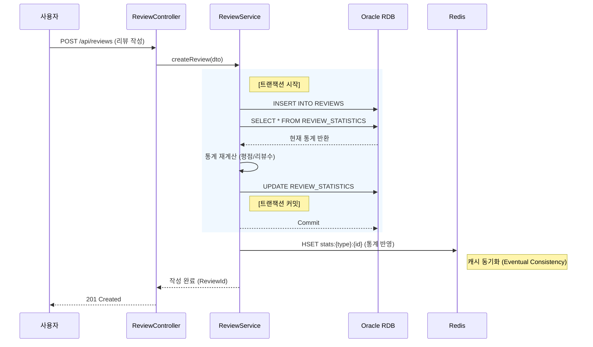

# [주거지 추천 서비스 고도화] 설계 명세서

프로젝트명: 주거지 추천 서비스 고도화 (Phase 2: Review System Integration)  
문서 버전: v1.0  
작성일: 2025년 11월 27일  
작성자: 정범진 (Back-end Engineer)

---

## 목차

1. [개요](#1-개요)
2. [시스템 전체 개요](#2-시스템-전체-개요)
3. [일반 요구사항](#3-일반-요구사항)
4. [기존 시스템 분석](#4-기존-시스템-분석)
5. [시스템 아키텍처](#5-시스템-아키텍처)
6. [API 명세](#6-api-명세)
7. [데이터 모델](#7-데이터-모델)
8. [핵심 비즈니스 로직](#8-핵심-비즈니스-로직)
9. [배치 처리 명세](#9-배치-처리-명세)
10. [실시간 서비스 명세](#10-실시간-서비스-명세)
11. [구현 기술 스택](#11-구현-기술-스택)
12. [부록](#12-부록)

---

## 1. 개요

### 1.1 목적

본 문서는 '주거지 추천 서비스 고도화' 프로젝트의 상세 설계를 정의한다. 기존 서비스는 정량적 공공데이터(가격, 범죄율 등)에만 의존하여 사용자가 체감하는 실제 거주 환경(소음, 이웃 등)을 반영하지 못하는 한계가 있었다. 또한, 데이터 저장소가 인메모리(Redis) 단일 구조로 되어 있어 데이터 휘발성 및 참조 무결성 관리에 취약점이 존재했다.

이에 본 시스템은 실거주자 리뷰 시스템을 도입하여 정성적 경험 데이터를 추천 로직에 통합하고, **하이브리드 저장소 아키텍처(Redis + Oracle RDB)**를 구축하여 데이터의 영속성과 조회 성능을 동시에 확보하는 것을 목적으로 한다. 특히 외부 데이터의 식별자 부재 문제를 해결하기 위한 고유 식별자(Business Key) 생성 전략을 포함한다.

### 1.2 범위

본 설계 명세서는 다음의 기능을 포함한다.

**리뷰 관리 시스템**: 리뷰 작성, 조회, 수정, 삭제 및 키워드 자동 추출 로직 구현

**데이터베이스 고도화**: Redis(Cache/Read)와 Oracle RDB(Persistence/Write)의 이원화 설계 및 동기화 로직 구현

**식별자 관리**: 외부 API 데이터 기반의 불변형 고유 식별자(MD5 Hash) 생성 및 중복 제거 로직 구현

**추천 알고리즘 확장**: 기존 정량적 점수에 리뷰 기반 점수를 가중 합산하는 하이브리드 추천 로직 구현

**배치 프로세스 개선**: 데이터 수집과 적재 로직의 결합도를 낮추는 이벤트 기반 파이프라인 구축

---

## 2. 시스템 전체 개요

### 2.1 핵심 아키텍처 요약

본 시스템은 대규모 데이터의 영속성(Persistence)과 실시간 추천 서비스의 고성능(High Performance)을 동시에 달성하기 위해 CQRS(Command and Query Responsibility Segregation) 패턴에 기반한 하이브리드 아키텍처로 설계되었다.

**주요 구성요소**

**데이터 수집 및 식별 계층 (Data Ingestion & Identification)**: BatchScheduler는 국토교통부 API의 휘발성 데이터를 수집하고, MD5 해시 알고리즘을 통해 매물의 불변 속성(주소, 면적 등)을 기반으로 고유 식별자(Business Key)를 생성한다. 이를 통해 외부 데이터의 변동에도 흔들리지 않는 데이터 영속성을 보장한다.

**영속성 계층 (Write Model / Source of Truth)**: Oracle RDB는 시스템의 원본 데이터 저장소 역할을 수행한다. 매물 정보와 리뷰 데이터 간의 참조 무결성(Referential Integrity)을 강제하며, 리뷰 작성 및 수정 시 트랜잭션(ACID) 관리를 통해 데이터 정합성을 보장한다.

**서비스 계층 (Read Model / Cache)**: Redis는 실시간 추천 알고리즘 연산과 데이터 조회를 전담한다. RDB에서 변경된 매물 통계(평점, 리뷰 수)는 이벤트 기반으로 즉시 Redis에 동기화되어, 복잡한 조인 연산 없이 고속 조회를 지원한다.

**핵심 처리 흐름**

데이터는 배치 프로세스를 통해 수집되어 식별자가 부여된 후 RDB에 '없으면 생성, 있으면 갱신(Upsert)'된다. 사용자가 작성한 리뷰는 RDB에 안전하게 저장됨과 동시에 통계 데이터로 가공되어 Redis에 실시간 반영된다. 최종적으로 추천 서비스는 Redis의 최신화된 데이터를 활용하여 사용자에게 응답한다.

**아키텍처 특징**

- **하이브리드 영속성**: 읽기 성능(Redis)과 데이터 무결성(RDB)의 역할을 물리적으로 분리하여 최적화.
- **논리적 식별자 전략**: 외부 데이터 소스의 구조적 한계(ID 부재)를 극복하기 위한 자체 해시 ID 전략 적용.
- **느슨한 결합**: 배치 로직과 데이터 적재 로직, RDB와 Redis 간의 동기화 로직을 이벤트 및 비동기 처리로 분리.

### 2.2 전체 데이터 처리 흐름도

시스템의 데이터 수집부터 최종 사용자 서비스 제공까지의 End-to-End 데이터 흐름은 다음과 같다.

```mermaid
flowchart TD
    %% 외부 시스템
    subgraph External [외부 데이터 소스]
        MolitAPI[국토교통부 실거래가 API]
    end

    %% 배치 및 수집 시스템
    subgraph BatchSystem [배치 및 식별 시스템]
        Scheduler[BatchScheduler]
        IDGen[ID Generator (MD5 Hash)]
        EventPub[Event Publisher]
    end

    %% 저장소 계층
    subgraph Persistence [하이브리드 저장소]
        RDB[(Oracle RDB - Write Master)]
        Redis[(Redis - Read Cache)]
    end

    %% 서비스 계층
    subgraph ServiceLayer [서비스 계층]
        ReviewSvc[ReviewService]
        RecomSvc[RecommendationService]
        SyncListener[RdbSyncListener]
    end

    %% 흐름 연결
    MolitAPI -->|1. Raw 데이터 수집| Scheduler
    Scheduler -->|2. 불변 속성 추출 및 ID 생성| IDGen
    IDGen -->|3. Business Key 반환| Scheduler
    Scheduler -->|4. 수집 완료 이벤트 발행| EventPub
    
    EventPub -->|5. 이벤트 구독 (Async)| SyncListener
    SyncListener -->|6. 매물 데이터 UPSERT| RDB
    
    User((사용자)) -->|7. 리뷰 작성 요청| ReviewSvc
    ReviewSvc -->|8. 트랜잭션 처리 (Insert/Update)| RDB
    ReviewSvc -.->|9. 통계 데이터 동기화 (Write-Through)| Redis
    
    User -->|10. 추천/조회 요청| RecomSvc
    RecomSvc -->|11. 고속 조회| Redis
    Redis -- 12. 데이터 반환 --> RecomSvc
    RecomSvc -->|13. 응답| User

    style External fill:#f9f,stroke:#333
    style BatchSystem fill:#ff9,stroke:#333
    style Persistence fill:#9f9,stroke:#333
    style ServiceLayer fill:#99f,stroke:#333
```

**흐름도 설명**

1. **[수집 및 식별]**: 배치 스케줄러가 외부 데이터를 수집하고, ID Generator를 통해 불변의 해시 ID를 생성하여 데이터에 부여한다.

2. **[영속화 (Upsert)]**: 수집된 데이터는 이벤트 리스너를 통해 Oracle RDB에 저장된다. 기존에 존재하는 ID라면 최신 정보로 갱신하고, 없으면 신규 생성하여 리뷰가 연결될 매물 마스터 데이터를 영구 보존한다.

3. **[리뷰 동기화]**: 사용자의 리뷰 작성으로 인해 RDB의 데이터가 변경되면, 변경된 통계 정보(평점 등)는 즉시 Redis에 반영되어 데이터 일관성을 유지한다.

4. **[서비스 제공]**: 추천 서비스는 RDB에 부하를 주지 않고 Redis의 인덱스와 캐시 데이터를 활용하여 서비스를 제공한다.

### 2.3 주요 컴포넌트 간 상호작용

데이터 정합성이 가장 중요한 '리뷰 작성 및 통계 갱신' 프로세스의 컴포넌트 간 상호작용이다.



**상호작용 설명**

- **트랜잭션 처리(Transaction)**: 리뷰 작성 시 ReviewService는 RDB 트랜잭션 내에서 리뷰 삽입과 통계 갱신을 원자적으로 처리하여 데이터 정합성을 보장한다.

- **캐시 동기화(Sync)**: RDB 트랜잭션이 성공적으로 커밋된 직후, 변경된 통계 정보를 Redis에 덮어써서 읽기 모델(Redis)과 쓰기 모델(RDB) 간의 데이터 일관성을 맞춘다.

---

## 3. 일반 요구사항

### 3.1 기술 요구사항

**데이터 교환 형식**
* 모든 API의 요청(Request) 및 응답(Response) 본문(Body)은 JSON (application/json) 형식을 엄격히 준수한다.
* 날짜 및 시간 데이터는 `ISO 8601` 형식(예: `yyyy-MM-dd'T'HH:mm:ss`)을 문자열로 직렬화하여 교환한다.

**문자 인코딩**
* 시스템 전반의 문자 집합(Character Set)은 UTF-8을 표준으로 사용한다.
* 외부 API(국토교통부) 연동 시 발생하는 인코딩 이슈는 `BatchScheduler` 내부에서 UTF-8로 정규화하여 처리한다.

**인증 및 인가 (Authentication & Authorization)**
* 읽기 요청 (GET): 추천 서비스 및 리뷰 조회 API는 별도의 인증 토큰 없이 접근 가능한 Public API로 구성한다.
* 쓰기 요청 (POST/PUT/DELETE): 리뷰 작성, 수정, 삭제 API는 `Authorization` 헤더에 유효한 `Bearer {Token}`(JWT 또는 세션 ID)을 포함해야만 요청이 승인된다.

**API 주소 체계**
* 모든 API는 `/api`를 루트 컨텍스트(Root Context)로 사용한다.
* 하위 호환성 보장을 위해 버전 관리 체계를 적용하며, 본 고도화 프로젝트의 신규 API는 `/api/v1`을 기본 경로로 한다.

### 3.2 성능 요구사항

**응답 속도 (Latency)**
* 조회 트래픽 (Read): 추천 서비스 및 리뷰 목록 조회는 Redis 캐시 히트(Cache Hit) 시 밀리초 단위의 빠른 응답 속도를 보장해야 한다.
* 쓰기 트래픽 (Write): 리뷰 작성 및 수정은 Oracle RDB 트랜잭션 처리를 포함하더라도 신속한 처리를 완료해야 한다.

**데이터 일관성 (Consistency)**
* 즉시 일관성 (Strong Consistency): 리뷰 작성자가 본인이 작성한 내용을 조회할 때는 RDB를 직접 참조하거나 캐시 갱신 직후의 데이터를 반환하여 즉시 확인 가능해야 한다 (Read Your Own Writes).
* 최종 일관성 (Eventual Consistency): 매물 목록에 표시되는 집계 데이터(평균 별점, 총 리뷰 수)는 RDB 커밋 후 Redis 캐시와 동기화되어야 한다.

**가용성 (Availability)**
* 국토교통부 외부 API의 응답 지연이나 장애 발생 시에도, 시스템 내부에 적재된 매물 데이터와 리뷰 데이터를 활용하여 추천 서비스는 중단 없이 제공되어야 한다.

---

## 4. 기존 시스템 분석

### 4.1 기존 아키텍처 분석

현재 시스템은 인메모리 기반의 단일 저장소 전략을 취하고 있으며, 데이터의 생명주기가 배치 주기에 종속되는 구조적 특징을 가진다.

**컨트롤러 구조**

**RecommendationController**: 전세(Charter)와 월세(Monthly) 추천 요청을 처리하는 단일 진입점(Entry Point)이다.

**입력 검증**: RequestDto 내의 JSR-303 어노테이션(@NotNull, @Min, @Pattern)을 통해 예산, 평수, 우선순위 값의 유효성을 검증하며, 실패 시 GlobalExceptionHandler가 표준 에러 포맷(ErrorResponseDto)을 반환한다.

**서비스 레이어 구조**

**서비스 분리**: CharterRecommendationService와 MonthlyRecommendationService로 임대 유형별 비즈니스 로직이 완전히 분리되어 있다.

**Redis 의존성**: 데이터 접근 계층(DAO/Repository)이 별도로 존재하지 않고, RedisHandler 유틸리티 클래스를 통해 비즈니스 로직 내에서 직접 Redis 명령어를 수행하는 구조다.

**데이터베이스 구조 (AS-IS)**

**Redis (Main Store - Volatile)**: 실시간 매물 데이터(Hash)와 검색 인덱스(Sorted Set)가 저장되는 핵심 저장소다. 하지만 배치 실행 시 전체 데이터 삭제(Flush) 후 재적재되는 휘발성 구조를 가지고 있어, 리뷰와 같은 영속적 관계형 데이터를 저장하기에 부적합하다.

**Oracle RDB (Auxiliary - Static)**: AnalysisEntertainment, AnalysisCrime, AnalysisPopulationDensity 등 통계 분석용 정적 데이터 저장 용도로만 제한적으로 사용된다.

### 4.2 기존 비즈니스 로직의 상세 분석

**[1. 추천 검색 로직 (Recommendation Service)]**

기존 추천 로직은 **'필터링(Filtering) -> 폴백(Fallback) -> 정량 점수 산출(Scoring)'**의 3단계 파이프라인으로 구성된다.

```java
// Step 1: 1차 엄격 검색 (Strict Search)
// Redis ZSet의 교집합(InterSection) 연산을 활용하여 모든 조건을 만족하는 매물 ID 추출
// Key Pattern: idx:deposit:{구} ∩ idx:area:{구}:전세
Map<String, List<String>> results = strictSearch(request);

// Step 2: 폴백 처리 (Fallback Search)
// 검색된 매물이 임계치(3건) 미만인 지역구에 대해 조건 완화 수행
if (checkInsufficient(results)) {
    // 3순위 조건 완화 -> 결과 부족 시 -> 2순위 조건까지 추가 완화 (확장 검색)
    results = expandSearchWithRelaxedConditions(request);
}

// Step 3: 정량적 점수 산출 (Quantitative Scoring)
// 검색된 최종 후보 매물들에 대해 가격, 평수, 안전성 점수(0~100)를 계산하여 가중 합산
// FinalScore = (PriceScore * w1) + (SpaceScore * w2) + (SafetyScore * w3)
calculateQuantitativeScores(results);
```

**[2. 배치 데이터 처리 로직 (Batch Scheduler)]**

데이터 수집과 적재가 강하게 결합되어 있으며, 데이터 식별자의 비영속성 문제가 존재한다.

```java
// Step 1: 데이터 수집 (Data Collection)
// 국토교통부 API로부터 전월 기준 서울시 25개 자치구 매물 데이터 수집
List<Property> properties = collectFromOpenApi();

// Step 2: 저장소 초기화 (Critical Issue)
// 기존 적재된 모든 매물 데이터와 인덱스를 삭제 (데이터 휘발 발생)
redisHandler.clearCurrentRedisDB();

// Step 3: 데이터 적재 (Data Loading)
// 매번 UUID.randomUUID()를 통해 새로운 임의 식별자를 생성하여 적재
// 이로 인해 어제의 매물과 오늘의 매물이 논리적으로 연결되지 않음
storeToRedisWithRandomID(properties);
```

### 4.3 데이터 처리 흐름 분석

**AS-IS 데이터 파이프라인 흐름도**

```mermaid
flowchart TD
    subgraph Data_Source
        MolitAPI[국토교통부 API]
    end

    subgraph Batch_Process
        Scheduler[BatchScheduler]
        UUID[UUID 생성기]
    end

    subgraph Storage
        Redis[(Redis In-Memory)]
    end

    subgraph Service
        Client[사용자]
        Service[RecommendationService]
    end

    %% 배치 흐름
    MolitAPI -->|1. Raw Data| Scheduler
    Scheduler -->|2. Random ID 생성| UUID
    Scheduler -->|3. FLUSHALL (전체 삭제)| Redis
    Scheduler -->|4. 데이터 재적재| Redis

    %% 서비스 흐름
    Client -->|5. 추천 요청| Service
    Service -->|6. ZINTERSTORE (교집합)| Redis
    Redis -->|7. 매물 리스트| Service
    Service -->|8. 응답| Client
```

**흐름 분석 및 문제점 도출**

**배치 타임**: 매일 새벽 4시, 기존 데이터를 모두 지우고(Flush) 새로운 랜덤 ID로 데이터를 덮어쓴다. 이 과정에서 기존 매물에 연결된 정보가 있다면 모두 유실된다.

**서비스 타임**: 추천 서비스는 Redis에 전적으로 의존한다. Redis 장애 발생 시 데이터 원본이 없어 복구가 불가능하며 서비스가 중단된다.

**확장성 한계**: RDB를 단순 통계용으로만 사용하고 있어, 리뷰, 찜하기, 유저 등 관계형 데이터 모델을 확장하기 어려운 구조다.

---

## 5. 시스템 아키텍처

### 5.1 아키텍처 개요

본 시스템은 **데이터의 영속성(Persistence)**과 **대규모 조회 트래픽의 고속 처리(High Performance)**라는 상충되는 요구사항을 동시에 만족시키기 위해 CQRS(Command and Query Responsibility Segregation) 패턴을 차용한 하이브리드 저장소 아키텍처로 설계되었다.

**Write Layer (Oracle RDB)**: 시스템의 SSOT(Single Source of Truth) 역할을 수행한다. 매물 데이터의 영구 저장, 리뷰 데이터와의 참조 무결성(FK) 보장, 트랜잭션(ACID) 관리를 전담하여 데이터의 신뢰성을 확보한다.

**Read Layer (Redis)**: RDB로부터 동기화된 데이터를 기반으로 실시간 추천 알고리즘 연산과 목록 조회를 수행한다. 인메모리 구조의 이점을 활용하여 복잡한 연산에도 밀리초(ms) 단위의 응답 속도를 보장한다.

**Sync Layer (Event-Driven)**: 배치 프로세스 및 리뷰 작성으로 인한 데이터 변경 사항을 이벤트 기반으로 비동기 처리하여, 쓰기 저장소(RDB)와 읽기 저장소(Redis) 간의 **최종 일관성(Eventual Consistency)**을 유지한다.

### 5.2 시스템 구성 요소

| 구성 요소 | 역할 및 책임 | 주요 기술 |
|----------|------------|----------|
| Batch Scheduler | 국토교통부 API 데이터 수집, 비즈니스 키(MD5) 생성, 수집 완료 이벤트 발행 | Spring Scheduler |
| ID Generator | 매물의 불변 속성(시군구, 지번, 아파트명, 층, 면적)을 해싱하여 고유 식별자 생성 | Apache Commons Codec |
| RdbSyncListener | 수집 완료 이벤트를 구독하여 매물 데이터를 RDB에 Upsert(생성/갱신) 처리 | Spring Event, JPA |
| Review Service | 리뷰 작성/수정/삭제 트랜잭션 관리, 통계 정합성 보장 | Spring Service, JPA |
| Recommendation Service | Redis 인덱스(Sorted Set) 기반 검색 및 하이브리드 점수 산출 로직 수행 | Spring Service |
| Hybrid Repository | RDB(Review/Property)와 Redis(Cache) 접근을 추상화하여 비즈니스 로직과 분리 | JPA Repository, RedisTemplate |

### 5.3 데이터 흐름 (Data Flow) - [수정됨]

시스템의 데이터 흐름은 쓰기 경로(Write Path), 동기화 경로(Sync Path), **읽기 경로(Read Path)**로 명확히 분리된다.

```mermaid
flowchart TD
    User((사용자))
    
    subgraph Write_Layer [Write Layer: 데이터 영속화 및 트랜잭션]
        direction TB
        Batch[Batch Scheduler<br/>(Logic 개선)]
        ReviewAPI[Review Service]
        RDB[(Oracle RDB)]
        
        Batch -->|1. 매물 테이블(PROPERTIES) UPSERT| RDB
        ReviewAPI -->|2. 리뷰 테이블(REVIEWS) INSERT| RDB
    end
    
    subgraph Sync_Layer [Sync Layer: 데이터 동기화]
        Sync[Sync Logic]
        RDB -.->|3. 변경 감지 (Commit)| Sync
        Sync -->|4. 통계/매물 정보 반영| Cache
    end
    
    subgraph Read_Layer [Read Layer: 고속 조회 및 추천]
        direction TB
        RecomAPI[Recommendation Service]
        Cache[(Redis Cache)]
        
        User -->|5. 추천/조회 요청| RecomAPI
        RecomAPI -->|6. 인덱스 검색 & 조회| Cache
        Cache -- 7. 데이터 반환 --> RecomAPI
    end

    User --> ReviewAPI
```

**흐름 상세 설명**

1. **[배치] 매물 마스터 데이터 동기화 (Upsert)**: 기존 `BatchScheduler`의 로직을 개선하여, 국토부 API에서 수집한 데이터를 RDB의 매물(PROPERTIES) 테이블에 동기화한다.
   * ID 생성: `MD5(주소+면적+층)` 해시를 통해 불변 ID를 생성한다.
   * UPSERT 수행: 생성된 ID가 DB에 없으면 **신규 생성(Insert)**하고, 이미 존재하면 가격 등 변동 사항만 **갱신(Update)**한다.
   * 목적: 리뷰 데이터(`REVIEWS` 테이블)가 참조하는 부모 데이터(FK)의 영속성을 보장하여, 배치 실행 후에도 리뷰 연결이 끊어지지 않도록 한다.

2. **[리뷰] 트랜잭션 처리**: 사용자의 리뷰 작성 요청은 RDB의 리뷰(REVIEWS) 테이블에 저장된다. 이때 데이터 정합성을 위해 통계(REVIEW_STATISTICS) 테이블의 평점과 개수를 트랜잭션 내에서 갱신한다.

3. **[동기화] 캐시 갱신 (Write-Through)**: RDB 트랜잭션이 커밋(Commit)되는 즉시, 변경된 리뷰 통계 정보(평점, 리뷰 수)를 Redis의 통계 정보(`stats:{type}:{id}` Hash)에 덮어씌워(Overwrite), 읽기 전용 저장소(Redis)가 항상 최신 상태를 유지하도록 한다.

4. **[추천] 고속 조회**: 추천 서비스는 RDB에 부하를 주지 않고, Redis에 미리 적재된 인덱스와 캐싱된 통계 데이터를 사용하여 요청을 처리한다.

### 5.4 장애 복구 및 초기화 전략 (Resilience Strategy)

Redis의 데이터 휘발성 특성을 보완하기 위해 다음과 같은 복구 메커니즘을 포함한다.

**캐시 웜업(Warm-up)**: 시스템 배포 또는 Redis 장애 복구 시, Oracle RDB에 저장된 원본 데이터(매물+통계)를 일괄 조회하여 Redis 캐시와 검색 인덱스를 재구축한다.

**실패 보상(Compensation)**: 리뷰 작성 후 Redis 동기화가 실패할 경우, 해당 이벤트를 로그에 기록하고 별도의 백그라운드 프로세스가 재동기화를 수행하여 최종 일관성을 보장한다.

---

## 6. API 명세

본 명세서는 **리뷰 관리(작성/조회/수정/삭제)**를 위한 신규 API와, 리뷰 데이터가 반영되어 응답 구조가 변경되는 기존 추천 API를 정의한다.

### 6.1 공통 사항

**프로토콜**: HTTP/1.1

**데이터 포맷**: application/json; charset=UTF-8

**인증 방식**:

* Public API: 인증 불필요 (리뷰 조회, 추천 요청)
* Protected API: Authorization: Bearer {Access_Token} 헤더 필수 (리뷰 작성, 수정, 삭제)

**에러 응답**: GlobalExceptionHandler를 통해 표준 ErrorResponseDto 포맷 반환.

### 6.2 리뷰 작성 API

| 항목 | 내용 |
|------|------|
| **기능 설명** | 사용자가 특정 매물(Property)에 대해 별점과 텍스트 리뷰를 등록한다. 작성 성공 시 RDB에 저장되고 통계 데이터가 갱신된다. |
| **HTTP Method** | POST |
| **Endpoint URL** | /api/v1/reviews |
| **인증 여부** | 필수 (Protected) |

#### 6.2.1 요청 (Request)

**Request Body**

| 필드 | 타입 | 필수 | 설명 | 예시 |
|------|------|------|------|------|
| propertyId | String | ✓ | 매물 식별자 (32자 MD5 Hash) | "5d41402abc..." |
| userId | String | ✓ | 작성자 ID | "user_1234" |
| rating | Integer | ✓ | 별점 (1~5 정수) | 5 |
| content | String | ✓ | 리뷰 내용 (20자 이상 1000자 이하) | "채광이 좋고..." |

**Request 예시**

```json
{
  "propertyId": "5d41402abc4b2a76b9719d911017c592",
  "userId": "user_1234",
  "rating": 5,
  "content": "남향이라 채광이 정말 좋고, 관리비도 저렴한 편입니다. 다만 주차 공간이 조금 협소해요."
}
```

#### 6.2.2 응답 (Response)

**성공 응답: 201 Created**

```json
{
  "reviewId": 1052,
  "createdAt": "2025-11-27T10:30:00"
}
```

### 6.3 리뷰 목록 조회 API (통합)

| 항목 | 내용 |
|------|------|
| **기능 설명** | 조건에 따라 리뷰 목록을 페이징 조회한다. propertyId 파라미터 유무에 따라 **'특정 매물 리뷰(모달용)'**와 '전체 최신 리뷰(게시판용)' 기능을 통합 제공한다. |
| **HTTP Method** | GET |
| **Endpoint URL** | /api/v1/reviews |
| **인증 여부** | 불필요 (Public) |

#### 6.3.1 요청 (Request)

**Request Parameters (Query String)**

| 파라미터 | 타입 | 필수 | 설명 | 동작 방식 |
|----------|------|------|------|----------|
| propertyId | String | ✗ | 매물 식별자 (MD5) | 포함 시: 해당 매물의 리뷰만 필터링 (모달용)<br/>미포함 시: 전체 리뷰 최신순 조회 (게시판용) |
| page | Integer | ✗ | 페이지 번호 | Default: 1 |
| size | Integer | ✗ | 페이지당 항목 수 | Default: 10 |
| sort | String | ✗ | 정렬 기준 | latest(기본), rating_desc, rating_asc |
| keyword | String | ✗ | 검색어 | 매물명 또는 리뷰 내용 검색 |
| searchType | String | ✗ | 검색 조건 | all(기본), content, tag |

#### 6.3.2 응답 (Response)

**성공 응답: 200 OK**

| 필드 | 타입 | 설명 |
|------|------|------|
| filterMeta | Object | 필터링 메타 정보 (propertyId 요청 시에만 값 존재) |
| filterMeta.propertyAvgRating | Double | 해당 매물의 평균 평점 |
| reviews | Array | 리뷰 데이터 리스트 (요약본) |
| reviews[].reviewId | Long | 리뷰 ID (상세 조회 Key) |
| reviews[].propertyId | String | 매물 ID |
| reviews[].propertyName | String | 아파트/매물명 |
| reviews[].userId | String | 작성자 ID (마스킹 처리) |
| reviews[].rating | Integer | 별점 |
| reviews[].summary | String | 내용 요약 (100자 이내) |
| reviews[].tags | Array | 키워드 태그 |
| pagination | Object | 페이징 정보 |

**Response 예시 (특정 매물 조회 시)**

```json
{
  "filterMeta": {
    "targetPropertyId": "5d41402abc...",
    "propertyAvgRating": 4.5
  },
  "reviews": [
    {
      "reviewId": 1052,
      "propertyId": "5d41402abc...",
      "propertyName": "래미안그레이튼",
      "userId": "user****",
      "rating": 5,
      "summary": "남향이라 채광이 좋고...",
      "tags": ["채광"],
      "createdAt": "2025-11-27T10:30:00"
    }
  ],
  "pagination": { ... }
}
```

### 6.4 리뷰 단건 상세 조회 API

| 항목 | 내용 |
|------|------|
| **기능 설명** | 특정 리뷰의 전체 내용(Full Text)을 조회한다. |
| **HTTP Method** | GET |
| **Endpoint URL** | /api/v1/reviews/{reviewId} |

#### 6.4.1 응답 (Response)

**성공 응답: 200 OK**

```json
{
  "reviewId": 1052,
  "propertyId": "5d41402abc...",
  "userId": "user_1234",
  "rating": 5,
  "content": "남향이라 채광이 정말 좋고, 관리비도 저렴한 편입니다. (전체 원문 반환)...",
  "tags": ["채광", "관리비"],
  "createdAt": "2025-11-27T10:30:00",
  "updatedAt": null
}
```

### 6.5 리뷰 수정 API

| 항목 | 내용 |
|------|------|
| **기능 설명** | 사용자가 본인이 작성한 리뷰를 수정한다. 수정 시 통계 데이터가 재계산된다. |
| **HTTP Method** | POST |
| **Endpoint URL** | /api/v1/reviews/{reviewId} |
| **인증 여부** | 필수 (Protected) - 작성자 본인만 가능 |

#### 6.5.1 요청 (Request)

**Request Body**

```json
{
  "rating": 4,
  "content": "살다 보니 주차 문제는 조금 있네요. 별점 수정합니다."
}
```

#### 6.5.2 응답 (Response)

**성공 응답: 200 OK**

```json
{
  "reviewId": 1052,
  "updatedAt": "2025-11-28T09:00:00"
}
```

### 6.6 리뷰 삭제 API

| 항목 | 내용 |
|------|------|
| **기능 설명** | 사용자가 본인이 작성한 리뷰를 삭제한다. 삭제 시 해당 매물의 통계가 차감된다. |
| **HTTP Method** | DELETE |
| **Endpoint URL** | /api/v1/reviews/{reviewId} |
| **인증 여부** | 필수 (Protected) - 작성자 본인만 가능 |

#### 6.6.1 응답 (Response)

**성공 응답: 204 No Content (Body 없음)**

### 6.7 추천 결과 조회 API (변경사항)

기존 추천 API (/api/recommendations/*)의 응답 DTO 구조가 변경된다.

**변경된 Response DTO 구조 (TopPropertyDto)**

| 필드 | 타입 | 설명 | 비고 |
|------|------|------|------|
| propertyId | String | 매물 식별자 | MD5 Hash로 변경됨 |
| reviewCount | Integer | 리뷰 개수 | 신규 추가 |
| avgRating | Double | 평균 별점 | 신규 추가 |
| finalScore | Double | 최종 추천 점수 | 산출 로직 변경 (리뷰 가중치 반영) |

### 6.8 공통 에러 코드 (Error Codes)

시스템 전반에서 발생하는 주요 에러 코드는 다음과 같다.

| HTTP 코드 | 에러 코드 | 상황 | 메시지 예시 |
|-----------|----------|------|-------------|
| 400 | E4001 | 유효성 검증 실패 | "요청 파라미터가 유효하지 않습니다" |
| 401 | E4101 | 인증 토큰 누락/만료 | "인증이 필요합니다" |
| 403 | E4003 | 권한 없음 (타인의 글 수정/삭제) | "해당 리소스에 대한 접근 권한이 없습니다" |
| 404 | E4201 | 데이터 없음 | "요청한 데이터를 찾을 수 없습니다" |
| 409 | E4104 | 중복 데이터 (이미 작성함) | "이미 해당 매물에 대한 리뷰를 작성하셨습니다" |

---

## 7. 데이터 모델

본 장에서는 시스템의 데이터 저장 구조를 정의한다. 하이브리드 저장소 아키텍처(Oracle RDB + Redis)의 설계 원칙, 테이블 스키마, 캐시 구조, 그리고 이들 간의 매핑 관계를 명세한다.

### 7.0 데이터 아키텍처 개요

#### 7.0.1 하이브리드 저장소 전략

본 시스템은 **Oracle RDB**와 **Redis**를 역할에 따라 분리 운영하는 하이브리드 저장소 아키텍처를 채택한다.

| 구분 | Oracle RDB | Redis |
|------|-----------|-------|
| **역할** | Write Master (쓰기 주체) | Read Cache (읽기 전용) |
| **데이터 성격** | Source of Truth (원본) | Derived Data (파생 캐시) |
| **트랜잭션** | ACID 보장 | 단일 명령 원자성만 보장 |
| **조회 성능** | 복잡한 JOIN 가능, 상대적 저속 | O(1) ~ O(log N), 고속 |
| **사용 주체** | ReviewService (CUD 작업) | RecommendationService (R 작업) |

**설계 원칙**: 모든 쓰기 작업(Create, Update, Delete)은 RDB에서 수행하고, 트랜잭션 커밋 직후 Redis로 동기화한다. 읽기 작업은 Redis에서 처리하여 RDB 부하를 최소화한다.

#### 7.0.2 RDB-Redis 매핑 관계

다음 표는 RDB 테이블과 Redis 데이터 구조 간의 대응 관계를 정의한다.

| RDB 테이블 | Redis Key Pattern | Redis 자료구조 | 동기화 주체 | 비고 |
|-----------|-------------------|---------------|------------|------|
| PROPERTIES_CHARTER | `property:charter:{id}` | Hash | RdbSyncListener | 1:1 스키마 미러링 |
| PROPERTIES_MONTHLY | `property:monthly:{id}` | Hash | RdbSyncListener | 1:1 스키마 미러링 |
| PROPERTIES_* (집계) | `idx:charterPrice:{district}` | Sorted Set | RdbSyncListener | 가격 범위 검색용 |
| PROPERTIES_* (집계) | `idx:deposit:{district}` | Sorted Set | RdbSyncListener | 보증금 범위 검색용 |
| PROPERTIES_* (집계) | `idx:monthlyRent:{district}:월세` | Sorted Set | RdbSyncListener | 월세금 범위 검색용 |
| PROPERTIES_* (집계) | `idx:area:{district}:전세` | Sorted Set | RdbSyncListener | 전세 평수 검색용 |
| PROPERTIES_* (집계) | `idx:area:{district}:월세` | Sorted Set | RdbSyncListener | 월세 평수 검색용 |
| PROPERTIES_* (집계) | `bounds:{district}:전세` | Hash | RdbSyncListener | 정규화 범위 (전세) |
| PROPERTIES_* (집계) | `bounds:{district}:월세` | Hash | RdbSyncListener | 정규화 범위 (월세) |
| ANALYSIS_* (집계) | `safety:{district}` | Hash | RdbSyncListener | 안전성 점수 |
| REVIEW_STATISTICS | `stats:charter:{id}` | Hash | ReviewService | 리뷰 통계 (전세) |
| REVIEW_STATISTICS | `stats:monthly:{id}` | Hash | ReviewService | 리뷰 통계 (월세) |
| REVIEWS | - | - | - | Redis 미적재 (RDB 직접 조회) |
| REVIEW_KEYWORDS | - | - | - | Redis 미적재 (RDB 직접 조회) |

#### 7.0.3 데이터 흐름 다이어그램

```
┌─────────────────────────────────────────────────────────────────────────────┐
│                           데이터 흐름 개요도                                   │
├─────────────────────────────────────────────────────────────────────────────┤
│                                                                             │
│  [국토부 API] ──(1)──▶ [BatchScheduler] ──(2)──▶ [RdbSyncListener]          │
│                              │                         │                    │
│                              │                         ├──(3a)──▶ [Oracle RDB]
│                              │                         │              │     │
│                              │                         └──(3b)──▶ [Redis]   │
│                              │                                       │     │
│                              │                              ┌────────┘     │
│                              │                              │              │
│  [Client] ──▶ [ReviewService] ──(4)──▶ [Oracle RDB] ──(5)──▶ [Redis]       │
│                                              │                              │
│                                              │                              │
│  [Client] ──▶ [RecommendationService] ◀──(6)── [Redis]                     │
│                                                                             │
└─────────────────────────────────────────────────────────────────────────────┘

(1) 매물 데이터 수집 (일 1회 배치)
(2) 이벤트 발행
(3a) RDB Upsert (Write Master)
(3b) Redis 동기화 (Read Cache)
(4) 리뷰 CUD + 통계 갱신 (트랜잭션)
(5) 통계 캐시 동기화 (Write-Through)
(6) 추천 조회 (Redis Only, RDB 무접근)
```

---

### 7.1 데이터베이스 스키마 (Oracle RDB)

Oracle RDB는 시스템의 **Source of Truth**로서, 트랜잭션 무결성과 참조 무결성을 보장한다. 테이블은 기능별로 **매물 그룹**과 **리뷰 그룹**으로 분류된다.

#### 7.1.1 매물 테이블 그룹 (Property Tables)

매물 테이블은 국토교통부 API에서 수집된 부동산 거래 정보를 저장한다. 전세와 월세를 별도 테이블로 분리하여 스키마 차이(월세금 컬럼 유무)를 명확히 한다.

**[공통 설계 원칙]**

* **식별자 전략**: 국토부 API는 고유 ID를 제공하지 않으므로, 불변 속성 5개(`SGG_CD`, `JIBUN`, `APT_NM`, `FLOOR`, `EXCLU_USE_AR`)를 조합한 MD5 해시(32자)를 PK로 사용한다. 이를 통해 배치 실행 시에도 기존 리뷰와의 FK 관계가 유지된다.
* **컬럼 순서**: Redis Hash 필드 순서와 일치시켜 매핑 직관성을 확보한다.

##### A. PROPERTIES_CHARTER (전세 매물)

```
용도: 전세 매물의 마스터 데이터
PK 생성: MD5(SGG_CD | JIBUN | APT_NM | FLOOR | EXCLU_USE_AR)
Redis 매핑: property:charter:{PROPERTY_ID}
```

| 컬럼명 | 데이터 타입 | 제약조건 | 설명 | 특성 |
|--------|------------|---------|------|------|
| PROPERTY_ID | CHAR(32) | PK | MD5 해시 식별자 | 불변 |
| APT_NM | VARCHAR2(100) | NOT NULL | 아파트/건물명 | 해시 요소 |
| EXCLU_USE_AR | NUMBER(10,4) | NOT NULL | 전용면적 (㎡) | 해시 요소 |
| FLOOR | NUMBER(3) | NOT NULL | 층수 | 해시 요소 |
| BUILD_YEAR | NUMBER(4) | | 건축연도 | |
| DEAL_DATE | VARCHAR2(10) | | 계약일자 (YYYY-MM-DD) | 가변 |
| DEPOSIT | NUMBER(15) | | 전세금 (만원) | 가변 |
| LEASE_TYPE | VARCHAR2(10) | | "전세" 고정값 | |
| UMD_NM | VARCHAR2(100) | | 법정동명 | |
| JIBUN | VARCHAR2(50) | NOT NULL | 지번 | 해시 요소 |
| SGG_CD | VARCHAR2(10) | NOT NULL | 시군구코드 | 해시 요소 |
| ADDRESS | VARCHAR2(200) | | 전체 주소 | 파생값 |
| AREA_IN_PYEONG | NUMBER(10,4) | | 전용면적 (평) | 파생값 |
| RGST_DATE | VARCHAR2(8) | | 등록일자 | |
| DISTRICT_NAME | VARCHAR2(50) | | 지역구명 | |
| LAST_UPDATED | TIMESTAMP | | 최종 동기화 일시 | 시스템 관리 |

##### B. PROPERTIES_MONTHLY (월세 매물)

```
용도: 월세 매물의 마스터 데이터
PK 생성: MD5(SGG_CD | JIBUN | APT_NM | FLOOR | EXCLU_USE_AR)
Redis 매핑: property:monthly:{PROPERTY_ID}
```

| 컬럼명 | 데이터 타입 | 제약조건 | 설명 | 특성 |
|--------|------------|---------|------|------|
| PROPERTY_ID | CHAR(32) | PK | MD5 해시 식별자 | 불변 |
| APT_NM | VARCHAR2(100) | NOT NULL | 아파트/건물명 | 해시 요소 |
| EXCLU_USE_AR | NUMBER(10,4) | NOT NULL | 전용면적 (㎡) | 해시 요소 |
| FLOOR | NUMBER(3) | NOT NULL | 층수 | 해시 요소 |
| BUILD_YEAR | NUMBER(4) | | 건축연도 | |
| DEAL_DATE | VARCHAR2(10) | | 계약일자 (YYYY-MM-DD) | 가변 |
| DEPOSIT | NUMBER(15) | | 보증금 (만원) | 가변 |
| MONTHLY_RENT | NUMBER(10) | | 월세금 (만원) | 가변 |
| LEASE_TYPE | VARCHAR2(10) | | "월세" 고정값 | |
| UMD_NM | VARCHAR2(100) | | 법정동명 | |
| JIBUN | VARCHAR2(50) | NOT NULL | 지번 | 해시 요소 |
| SGG_CD | VARCHAR2(10) | NOT NULL | 시군구코드 | 해시 요소 |
| ADDRESS | VARCHAR2(200) | | 전체 주소 | 파생값 |
| AREA_IN_PYEONG | NUMBER(10,4) | | 전용면적 (평) | 파생값 |
| RGST_DATE | VARCHAR2(8) | | 등록일자 | |
| DISTRICT_NAME | VARCHAR2(50) | | 지역구명 | |
| LAST_UPDATED | TIMESTAMP | | 최종 동기화 일시 | 시스템 관리 |

---

#### 7.1.2 리뷰 테이블 그룹 (Review Tables)

리뷰 테이블 그룹은 사용자 생성 콘텐츠(UGC)와 그 집계 데이터를 관리한다. 3개 테이블이 다음과 같은 관계를 형성한다.

```
PROPERTIES_* (1) ◀──────── (1) REVIEW_STATISTICS
      │
      └─── (1) ◀──────── (N) REVIEWS ──────▶ (1:N) REVIEW_KEYWORDS
```

##### A. REVIEWS (리뷰 원본)

```
용도: 사용자 작성 리뷰 원본 저장
Redis 매핑: 없음 (RDB 직접 조회)
```

| 컬럼명 | 데이터 타입 | 제약조건 | 설명 |
|--------|------------|---------|------|
| REVIEW_ID | NUMBER(19) | PK | 리뷰 고유 식별자 (Sequence) |
| PROPERTY_ID | CHAR(32) | FK | 매물 참조 |
| USER_ID | VARCHAR2(50) | NOT NULL | 작성자 ID |
| RATING | NUMBER(1) | NOT NULL, CHECK(1~5) | 별점 |
| CONTENT | CLOB | NOT NULL | 리뷰 내용 |
| CREATED_AT | TIMESTAMP | NOT NULL | 작성 일시 |
| UPDATED_AT | TIMESTAMP | | 수정 일시 |

**Redis 미적재 사유**: CLOB 컬럼(리뷰 본문)의 메모리 비용 대비 조회 빈도가 낮고, 페이징이 필수적인 조회 패턴에서 RDB가 더 효율적이다.

##### B. REVIEW_STATISTICS (리뷰 통계)

```
용도: 실시간 집계 데이터
Redis 매핑: stats:charter:{id}, stats:monthly:{id}
```

| 컬럼명 | 데이터 타입 | 제약조건 | 설명 |
|--------|------------|---------|------|
| PROPERTY_ID | CHAR(32) | PK, FK | 매물 ID (1:1 관계) |
| REVIEW_COUNT | NUMBER(10) | DEFAULT 0 | 총 리뷰 개수 |
| AVG_RATING | NUMBER(3,2) | DEFAULT 0.0 | 평균 별점 |
| POSITIVE_KEYWORD_COUNT | NUMBER(10) | DEFAULT 0 | 긍정 키워드 누적 수 |
| NEGATIVE_KEYWORD_COUNT | NUMBER(10) | DEFAULT 0 | 부정 키워드 누적 수 |
| LAST_CALCED | TIMESTAMP | | 최종 집계 일시 |

##### C. REVIEW_KEYWORDS (리뷰 키워드)

```
용도: 리뷰 텍스트에서 추출된 키워드 태그
Redis 매핑: 없음 (RDB 직접 조회)
```

| 컬럼명 | 데이터 타입 | 제약조건 | 설명 |
|--------|------------|---------|------|
| KEYWORD_ID | NUMBER(19) | PK | 키워드 식별자 |
| REVIEW_ID | NUMBER(19) | FK | 참조 리뷰 ID |
| KEYWORD | VARCHAR2(50) | NOT NULL | 키워드 (예: "채광", "소음") |
| SCORE | NUMBER(1) | | 감성 점수 (긍정:+1, 부정:-1) |

---

### 7.2 Redis 데이터 구조

Redis는 시스템의 **Read Cache**로서, 추천 서비스의 고속 조회를 담당한다. 모든 데이터는 RDB에서 파생되며, 동기화 주체에 따라 갱신 시점이 결정된다.

**[공통 규칙]**
* 모든 필드는 **String 타입**으로 저장 (기존 시스템 호환성)
* 숫자 필드도 `toString()` 변환 후 저장
* Key Pattern의 `{id}`는 MD5 해시(32자)를 의미

---

#### 7.2.1 매물 상세 정보 (Hash)

매물 테이블(PROPERTIES_*)과 1:1로 대응하는 캐시 구조. RDB 스키마를 그대로 미러링하여 데이터 추적성을 확보한다.

| 속성 | 전세 | 월세 |
|------|------|------|
| **Key Pattern** | `property:charter:{id}` | `property:monthly:{id}` |
| **대응 RDB** | PROPERTIES_CHARTER | PROPERTIES_MONTHLY |
| **동기화 주체** | RdbSyncListener | RdbSyncListener |
| **갱신 시점** | 배치 완료 직후 | 배치 완료 직후 |

**필드 목록 (전세)**

| 필드명 | 설명 | 대응 RDB 컬럼 |
|--------|------|--------------|
| propertyId | 매물 식별자 (MD5 32자) | PROPERTY_ID |
| aptNm | 아파트/건물명 | APT_NM |
| excluUseAr | 전용면적 (㎡) | EXCLU_USE_AR |
| floor | 층수 | FLOOR |
| buildYear | 건축연도 | BUILD_YEAR |
| dealDate | 계약일자 | DEAL_DATE |
| deposit | 전세금 (만원) | DEPOSIT |
| leaseType | "전세" | LEASE_TYPE |
| umdNm | 법정동명 | UMD_NM |
| jibun | 지번 | JIBUN |
| sggCd | 시군구코드 | SGG_CD |
| address | 전체 주소 | ADDRESS |
| areaInPyeong | 전용면적 (평) | AREA_IN_PYEONG |
| rgstDate | 등록일자 | RGST_DATE |
| districtName | 지역구명 | DISTRICT_NAME |

**필드 목록 (월세)**

| 필드명 | 설명 | 대응 RDB 컬럼 |
|--------|------|--------------|
| propertyId | 매물 식별자 (MD5 32자) | PROPERTY_ID |
| aptNm | 아파트/건물명 | APT_NM |
| excluUseAr | 전용면적 (㎡) | EXCLU_USE_AR |
| floor | 층수 | FLOOR |
| buildYear | 건축연도 | BUILD_YEAR |
| dealDate | 계약일자 | DEAL_DATE |
| deposit | 보증금 (만원) | DEPOSIT |
| monthlyRent | 월세금 (만원) | MONTHLY_RENT |
| leaseType | "월세" | LEASE_TYPE |
| umdNm | 법정동명 | UMD_NM |
| jibun | 지번 | JIBUN |
| sggCd | 시군구코드 | SGG_CD |
| address | 전체 주소 | ADDRESS |
| areaInPyeong | 전용면적 (평) | AREA_IN_PYEONG |
| rgstDate | 등록일자 | RGST_DATE |
| districtName | 지역구명 | DISTRICT_NAME |

**전세 대비 차이점**: `deposit` 필드는 전세금이 아닌 보증금을 의미하며, `monthlyRent` 필드가 추가되어 월세금을 별도 관리한다. `leaseType`은 "월세" 고정값이다.

**조회 예시**
```redis
HGETALL property:charter:5d41402abc4b2a76b9719d911017c592
HMGET property:monthly:a1b2c3d4... deposit monthlyRent areaInPyeong
```

---

#### 7.2.2 검색 인덱스 (Sorted Set)

가격/평수 범위 검색을 위한 정렬 인덱스. 추천 서비스가 조건에 맞는 매물 ID 목록을 O(log N)에 추출하는 데 사용된다.

**[공통 규칙]**
* `{district}`는 '강남구', '종로구' 형식 (서울시 접두어 제외)
* Score는 정렬 및 범위 검색 기준값, Member는 매물 ID(MD5 32자)

---

##### A. 전세 검색 인덱스 (2개 인덱스 교집합)

전세 매물 검색 시 **전세금 인덱스**와 **평수 인덱스**의 교집합 연산을 통해 조건을 만족하는 매물을 추출한다.

**A-1. 전세금 인덱스**

| 속성 | 값 |
|------|-----|
| **Key Pattern** | `idx:charterPrice:{district}` |
| **Score** | 전세금 (만원) |
| **Member** | 매물ID (MD5 32자) |
| **용도** | 전세 가격 범위 필터링 |

```redis
-- 강남구 전세금 2억~5억 매물 조회
ZRANGEBYSCORE idx:charterPrice:강남구 20000 50000
```

**A-2. 전세평수 인덱스**

| 속성 | 값 |
|------|-----|
| **Key Pattern** | `idx:area:{district}:전세` |
| **Score** | 평수 |
| **Member** | 매물ID (MD5 32자) |
| **용도** | 전세 면적 범위 필터링 |

```redis
-- 강남구 전세 20평~30평 매물 조회
ZRANGEBYSCORE idx:area:강남구:전세 20 30
```

**전세 검색 로직**
```
전세 검색 = idx:charterPrice:{district} ∩ idx:area:{district}:전세
```

---

##### B. 월세 검색 인덱스 (3개 인덱스 교집합)

월세 매물 검색 시 **보증금 인덱스**, **월세금 인덱스**, **평수 인덱스**의 교집합 연산을 통해 조건을 만족하는 매물을 추출한다.

**B-1. 보증금 인덱스**

| 속성 | 값 |
|------|-----|
| **Key Pattern** | `idx:deposit:{district}` |
| **Score** | 보증금 (만원) |
| **Member** | 매물ID (MD5 32자) |
| **용도** | 월세 보증금 범위 필터링 |

```redis
-- 마포구 보증금 5000만~1억 매물 조회
ZRANGEBYSCORE idx:deposit:마포구 5000 10000
```

**B-2. 월세금 인덱스**

| 속성 | 값 |
|------|-----|
| **Key Pattern** | `idx:monthlyRent:{district}:월세` |
| **Score** | 월세금 (만원) |
| **Member** | 매물ID (MD5 32자) |
| **용도** | 월세금 범위 필터링 |

**주의사항**: `:월세` 접미사 필수 (레거시 호환성)

```redis
-- 마포구 월세금 50만~100만 매물 조회
ZRANGEBYSCORE idx:monthlyRent:마포구:월세 50 100
```

**B-3. 월세평수 인덱스**

| 속성 | 값 |
|------|-----|
| **Key Pattern** | `idx:area:{district}:월세` |
| **Score** | 평수 |
| **Member** | 매물ID (MD5 32자) |
| **용도** | 월세 면적 범위 필터링 |

```redis
-- 마포구 월세 15평~25평 매물 조회
ZRANGEBYSCORE idx:area:마포구:월세 15 25
```

**월세 검색 로직**
```
월세 검색 = idx:deposit:{district} ∩ idx:monthlyRent:{district}:월세 ∩ idx:area:{district}:월세
```

---

#### 7.2.3 정규화 범위 데이터 (Hash)

추천 점수 산출 시 가격/평수를 0~100점으로 정규화하기 위한 기준값. 지역구별 최솟값/최댓값을 사전 계산하여 저장한다.

**[공통 규칙]**
* `{district}`는 '강남구', '종로구' 형식 (서울시 접두어 제외)
* 제로 분산 방지: min == max인 경우 max = min + 1로 강제 조정

---

##### A. 전세 정규화 범위

| 속성 | 값 |
|------|-----|
| **Key Pattern** | `bounds:{district}:전세` |
| **동기화 주체** | RdbSyncListener |
| **갱신 시점** | 배치 완료 후 집계 쿼리 수행 |

**필드 목록**

| 필드명 | 설명 |
|--------|------|
| minPrice | 최저 전세금 (만원) |
| maxPrice | 최고 전세금 (만원) |
| minArea | 최소 평수 |
| maxArea | 최대 평수 |
| propertyCount | 매물 개수 |
| lastUpdated | 갱신 일시 (ISO 8601) |

**전세 점수 정규화 공식**
```
전세금점수 = 100 - ((현재전세금 - minPrice) / (maxPrice - minPrice) × 100)
평수점수 = ((현재평수 - minArea) / (maxArea - minArea) × 100)
```

---

##### B. 월세 정규화 범위

| 속성 | 값 |
|------|-----|
| **Key Pattern** | `bounds:{district}:월세` |
| **동기화 주체** | RdbSyncListener |
| **갱신 시점** | 배치 완료 후 집계 쿼리 수행 |

**필드 목록**

| 필드명 | 설명 |
|--------|------|
| minDeposit | 최저 보증금 (만원) |
| maxDeposit | 최고 보증금 (만원) |
| minMonthlyRent | 최저 월세금 (만원) |
| maxMonthlyRent | 최고 월세금 (만원) |
| minArea | 최소 평수 |
| maxArea | 최대 평수 |
| propertyCount | 매물 개수 |
| lastUpdated | 갱신 일시 (ISO 8601) |

**월세 점수 정규화 공식**
```
보증금점수 = 100 - ((현재보증금 - minDeposit) / (maxDeposit - minDeposit) × 100)
월세금점수 = 100 - ((현재월세금 - minMonthlyRent) / (maxMonthlyRent - minMonthlyRent) × 100)
평수점수 = ((현재평수 - minArea) / (maxArea - minArea) × 100)
```

**월세 가격점수 산출**: 보증금 점수와 월세금 점수의 평균값을 최종 가격 점수로 사용
```
월세 가격점수 = (보증금점수 + 월세금점수) / 2
```

---

#### 7.2.4 안전성 점수 데이터 (Hash)

지역구 단위로 사전 계산된 치안 지표. 범죄 데이터, 인구밀도, 유흥업소 밀도를 기반으로 산출한다.

| 속성 | 값 |
|------|-----|
| **Key Pattern** | `safety:{district}` |
| **동기화 주체** | RdbSyncListener |
| **갱신 시점** | 배치 완료 후 분석 테이블 기반 계산 |

**필드 목록**

| 필드명 | 설명 |
|--------|------|
| districtName | 지역구명 |
| safetyScore | 안전성 점수 (0~100, 높을수록 안전) |
| lastUpdated | 갱신 일시 (ISO 8601) |
| version | 계산 공식 버전 (현재 "1.0") |

**안전성 점수 계산 공식**
```
범죄위험도 = 1.0229 × 정규화(유흥주점밀도) - 0.0034 × 정규화(인구밀도)
안전성점수 = 100 - (범죄위험도 × 10)  →  0~100 구간으로 재정규화
```

**서울시 25개 자치구 대상**: 종로구, 중구, 용산구, 성동구, 광진구, 동대문구, 중랑구, 성북구, 강북구, 도봉구, 노원구, 은평구, 서대문구, 마포구, 양천구, 강서구, 구로구, 금천구, 영등포구, 동작구, 관악구, 서초구, 강남구, 송파구, 강동구

---

#### 7.2.5 리뷰 통계 데이터 (Hash)

REVIEW_STATISTICS 테이블과 1:1로 대응하는 캐시 구조. 매물 상세 정보(7.2.1)와 분리하여 갱신 주체를 명확히 한다.

| 속성 | 전세 | 월세 |
|------|------|------|
| **Key Pattern** | `stats:charter:{id}` | `stats:monthly:{id}` |
| **대응 RDB** | REVIEW_STATISTICS | REVIEW_STATISTICS |
| **생성 주체** | RdbSyncListener (배치) | RdbSyncListener (배치) |
| **갱신 주체** | ReviewService (실시간) | ReviewService (실시간) |
| **갱신 시점** | 리뷰 CUD 트랜잭션 커밋 직후 | 리뷰 CUD 트랜잭션 커밋 직후 |

**필드 목록**

| 필드명 | 설명 | 대응 RDB 컬럼 |
|--------|------|--------------|
| propertyId | 매물 식별자 | PROPERTY_ID |
| reviewCount | 총 리뷰 개수 | REVIEW_COUNT |
| avgRating | 평균 별점 | AVG_RATING |
| positiveKeywordCount | 긍정 키워드 수 | POSITIVE_KEYWORD_COUNT |
| negativeKeywordCount | 부정 키워드 수 | NEGATIVE_KEYWORD_COUNT |
| lastCalced | 최종 집계 일시 | LAST_CALCED |

**초기값**: 리뷰 없는 매물은 `reviewCount=0`, `avgRating=0.0`, 키워드 수=0

**Write-Through 패턴**: ReviewService는 RDB 커밋 직후 즉시 Redis를 갱신하여 읽기 모델 최신성을 보장한다.

**조회 예시**
```redis
HGETALL stats:charter:5d41402abc4b2a76b9719d911017c592
HMGET stats:monthly:a1b2c3d4... reviewCount avgRating
```

**추천 점수 활용**
```
ReviewScore = (avgRating / 5.0) × 100
FinalScore = (LegacyScore × 0.5) + (ReviewScore × 0.5)

* reviewCount < 5인 경우: Cold Start로 간주, ReviewScore=0, LegacyScore 100% 반영
```

---

# 7.3 DTO 구조

API 통신 및 계층 간 데이터 전송에 사용되는 데이터 전송 객체(DTO)를 정의한다.

---

### 7.3.1 추천 API Request DTO

### CharterRecommendationRequestDto (전세 추천 요청)

**[기존 유지]** 이미 구현 완료되어 실제 사용 중

사용자의 전세 검색 조건과 우선순위를 전달하는 요청 객체.

```java
@Data
@NoArgsConstructor
@AllArgsConstructor
@Builder
public class CharterRecommendationRequestDto {

    @NotNull(message = "최소 전세금은 필수입니다")
    @Min(value = 0, message = "최소 전세금은 0 이상이어야 합니다")
    private Integer budgetMin;

    @NotNull(message = "최대 전세금은 필수입니다")
    @Min(value = 0, message = "최대 전세금은 0 이상이어야 합니다")
    private Integer budgetMax;

    @NotNull(message = "최소 평수는 필수입니다")
    @DecimalMin(value = "0.0", message = "최소 평수는 0 이상이어야 합니다")
    private Double areaMin;

    @NotNull(message = "최대 평수는 필수입니다")
    @DecimalMin(value = "0.0", message = "최대 평수는 0 이상이어야 합니다")
    private Double areaMax;

    @NotNull(message = "1순위 우선순위는 필수입니다")
    @Pattern(regexp = "^(PRICE|SAFETY|SPACE)$")
    private String priority1;

    @NotNull(message = "2순위 우선순위는 필수입니다")
    @Pattern(regexp = "^(PRICE|SAFETY|SPACE)$")
    private String priority2;

    @NotNull(message = "3순위 우선순위는 필수입니다")
    @Pattern(regexp = "^(PRICE|SAFETY|SPACE)$")
    private String priority3;

    // 선택적 파라미터 (기본값 있음)
    @Min(value = 0) @Max(value = 100)
    private Integer budgetFlexibility = 0;      // 예산 유연성(%)

    @Min(value = 0) @Max(value = 100)
    private Integer minSafetyScore = 0;         // 최소 안전 점수

    @DecimalMin(value = "0.0")
    private Double absoluteMinArea = 0.0;       // 절대 최소 평수

    // 커스텀 검증 메서드
    @AssertTrue(message = "최대 전세금이 최소 전세금보다 크거나 같아야 합니다")
    public boolean isBudgetValid() {
        if (budgetMin == null || budgetMax == null) return true;
        return budgetMax >= budgetMin;
    }

    @AssertTrue(message = "최대 평수가 최소 평수보다 크거나 같아야 합니다")
    public boolean isAreaValid() {
        if (areaMin == null || areaMax == null) return true;
        return areaMax >= areaMin;
    }

    @AssertTrue(message = "우선순위는 중복될 수 없습니다")
    public boolean isPriorityUnique() {
        if (priority1 == null || priority2 == null || priority3 == null) return true;
        return !priority1.equals(priority2) &&
                !priority1.equals(priority3) &&
                !priority2.equals(priority3);
    }
}
```

**검증 로직**
* JSR-303 어노테이션을 통한 필드 레벨 검증
* 커스텀 `@AssertTrue` 메서드를 통한 비즈니스 로직 검증
* 실패 시 `GlobalExceptionHandler`가 표준 에러 포맷 반환

---

### MonthlyRecommendationRequestDto (월세 추천 요청)

**[기존 유지]** 이미 구현 완료되어 실제 사용 중

사용자의 월세 검색 조건과 우선순위를 전달하는 요청 객체. 전세와 달리 보증금과 월세금 두 개의 가격 조건을 포함한다.

```java
@Data
@NoArgsConstructor
@AllArgsConstructor
@Builder
public class MonthlyRecommendationRequestDto {

    @NotNull(message = "최소 보증금은 필수입니다")
    @Min(value = 0)
    private Integer budgetMin;

    @NotNull(message = "최대 보증금은 필수입니다")
    @Min(value = 0)
    private Integer budgetMax;

    @NotNull(message = "최소 월세는 필수입니다")
    @Min(value = 0)
    private Integer monthlyRentMin;

    @NotNull(message = "최대 월세는 필수입니다")
    @Min(value = 0)
    private Integer monthlyRentMax;

    @NotNull(message = "최소 평수는 필수입니다")
    @DecimalMin(value = "0.0")
    private Double areaMin;

    @NotNull(message = "최대 평수는 필수입니다")
    @DecimalMin(value = "0.0")
    private Double areaMax;

    @NotNull(message = "1순위 우선순위는 필수입니다")
    @Pattern(regexp = "^(PRICE|SAFETY|SPACE)$")
    private String priority1;

    @NotNull(message = "2순위 우선순위는 필수입니다")
    @Pattern(regexp = "^(PRICE|SAFETY|SPACE)$")
    private String priority2;

    @NotNull(message = "3순위 우선순위는 필수입니다")
    @Pattern(regexp = "^(PRICE|SAFETY|SPACE)$")
    private String priority3;

    // 선택적 파라미터
    @Min(value = 0) @Max(value = 100)
    private Integer budgetFlexibility = 0;

    @Min(value = 0) @Max(value = 100)
    private Integer minSafetyScore = 0;

    @DecimalMin(value = "0.0")
    private Double absoluteMinArea = 0.0;

    // 커스텀 검증 메서드
    @AssertTrue(message = "최대 보증금이 최소 보증금보다 크거나 같아야 합니다")
    public boolean isBudgetValid() {
        if (budgetMin == null || budgetMax == null) return true;
        return budgetMax >= budgetMin;
    }

    @AssertTrue(message = "최대 월세가 최소 월세보다 크거나 같아야 합니다")
    public boolean isMonthlyRentValid() {
        if (monthlyRentMin == null || monthlyRentMax == null) return true;
        return monthlyRentMax >= monthlyRentMin;
    }

    @AssertTrue(message = "최대 평수가 최소 평수보다 크거나 같아야 합니다")
    public boolean isAreaValid() {
        if (areaMin == null || areaMax == null) return true;
        return areaMax >= areaMin;
    }

    @AssertTrue(message = "우선순위는 중복될 수 없습니다")
    public boolean isPriorityUnique() {
        if (priority1 == null || priority2 == null || priority3 == null) return true;
        return !priority1.equals(priority2) &&
                !priority1.equals(priority3) &&
                !priority2.equals(priority3);
    }
}
```

---

## 7.3.2 추천 API Response DTO

### CharterRecommendationResponseDto (전세 추천 응답)

**[기존 유지]** 이미 구현 완료되어 실제 사용 중

전세 추천 결과를 반환하는 최상위 응답 객체.

```java
@Data
@Builder
@NoArgsConstructor
@AllArgsConstructor
public class CharterRecommendationResponseDto {

    private String searchStatus;                                    // 검색 상태 ("SUCCESS" 등)
    private String message;                                         // 사용자 안내 메시지
    private List<RecommendedCharterDistrictDto> recommendedDistricts;  // 추천 지역구 목록
}
```

**응답 예시**
```json
{
  "searchStatus": "SUCCESS",
  "message": "조건에 맞는 지역구 3곳을 찾았습니다.",
  "recommendedDistricts": [
    {
      "rank": 1,
      "districtName": "마포구",
      "summary": "가격 대비 평수가 우수하며 안전성도 높습니다",
      "topProperties": [ /* 상위 3개 매물 */ ],
      "averageFinalScore": 85.3,
      "representativeScore": 187.2
    }
  ]
}
```

---

### MonthlyRecommendationResponseDto (월세 추천 응답)

**[기존 유지]** 이미 구현 완료되어 실제 사용 중

월세 추천 결과를 반환하는 최상위 응답 객체.

```java
@Data
@Builder
@NoArgsConstructor
@AllArgsConstructor
public class MonthlyRecommendationResponseDto {

    private String searchStatus;
    private String message;
    private List<RecommendedMonthlyDistrictDto> recommendedDistricts;
}
```

---

### RecommendedCharterDistrictDto (전세 추천 지역구)

**[기존 유지]** 이미 구현 완료되어 실제 사용 중

추천된 전세 지역구의 상세 정보를 담는 객체.

```java
@Data
@Builder
@NoArgsConstructor
@AllArgsConstructor
public class RecommendedCharterDistrictDto {

    private Integer rank;                               // 순위
    private String districtName;                        // 지역구명
    private String summary;                             // 추천 이유 요약
    private List<TopCharterPropertyDto> topProperties;  // 상위 매물 목록

    // 상세 순위 정보 패널용 점수 데이터
    private Double averagePriceScore;                   // 평균 가격 점수
    private Double averageSpaceScore;                   // 평균 평수 점수
    private Double districtSafetyScore;                 // 지역구 안전 점수

    // 지역구 카드 표시용 대표 점수
    private Double averageFinalScore;                   // 평균 최종 점수
    private Double representativeScore;                 // 지역구 대표 점수
}
```

---

### RecommendedMonthlyDistrictDto (월세 추천 지역구)

**[기존 유지]** 이미 구현 완료되어 실제 사용 중

추천된 월세 지역구의 상세 정보를 담는 객체.

```java
@Data
@Builder
@NoArgsConstructor
@AllArgsConstructor
public class RecommendedMonthlyDistrictDto {

    private Integer rank;
    private String districtName;
    private String summary;
    private List<TopMonthlyPropertyDto> topProperties;

    // 상세 순위 정보 패널용 점수 데이터
    private Double averagePriceScore;
    private Double averageSpaceScore;
    private Double districtSafetyScore;

    // 지역구 카드 표시용 대표 점수
    private Double averageFinalScore;
    private Double representativeScore;
}
```

---

### TopCharterPropertyDto (전세 추천 매물)

**[수정 필요]** 리뷰 필드 2개 추가 필요

전세 추천 결과에 포함되는 개별 매물 정보.

```java
@Data
@Builder
@NoArgsConstructor
@AllArgsConstructor
public class TopCharterPropertyDto {

    private String propertyId;          // MD5 Hash (32자)
    private String propertyName;        // 아파트명
    private String address;             // 주소
    private Integer price;              // 전세금 (만원)
    private String leaseType;           // "전세"
    private Double area;                // 평수
    private Integer floor;              // 층수
    private Integer buildYear;          // 건축연도
    private Double finalScore;          // 최종 추천 점수 (하이브리드)

    // 추가 필요
    private Integer reviewCount;        // 리뷰 개수
    private Double avgRating;           // 평균 별점 (1.0~5.0)
}
```

**[기존 API 사용자 영향]**
- 응답에 `reviewCount`, `avgRating` 필드가 추가됩니다
- 기존 클라이언트는 추가 필드를 무시하므로 정상 작동합니다
- 단, 리뷰 정보를 화면에 표시하려면 UI 업데이트가 필요합니다

**데이터 출처**
* 기본 정보: Redis `property:charter:{id}`
* 리뷰 통계: Redis `stats:charter:{id}`
* 두 Hash를 Pipeline으로 병렬 조회하여 병합

---

### TopMonthlyPropertyDto (월세 추천 매물)

**[수정 필요]** 리뷰 필드 2개 추가 필요

월세 추천 결과에 포함되는 개별 매물 정보.

```java
@Data
@Builder
@NoArgsConstructor
@AllArgsConstructor
public class TopMonthlyPropertyDto {

    private String propertyId;          // MD5 Hash (32자)
    private String propertyName;        // 아파트명
    private String address;             // 주소
    private Integer price;              // 보증금 (만원)
    private Integer monthlyRent;        // 월세금 (만원)
    private String leaseType;           // "월세"
    private Double area;                // 평수
    private Integer floor;              // 층수
    private Integer buildYear;          // 건축연도
    private Double finalScore;          // 최종 추천 점수 (하이브리드)

    // 추가 필요
    private Integer reviewCount;        // 리뷰 개수
    private Double avgRating;           // 평균 별점 (1.0~5.0)
}
```

**[기존 API 사용자 영향]**
- 응답에 `reviewCount`, `avgRating` 필드가 추가됩니다
- 기존 클라이언트는 추가 필드를 무시하므로 정상 작동합니다
- 단, 리뷰 정보를 화면에 표시하려면 UI 업데이트가 필요합니다

---

## 7.3.3 매물 상세 조회 DTO

### PropertyDto (매물 상세 정보)

**[수정 필요]** `propertyId` 타입 변경 및 리뷰 필드 추가 필요

매물 상세 조회 API의 응답 객체.

```java
@Data
@Builder
@NoArgsConstructor
@AllArgsConstructor
public class PropertyDto {

    // 수정: Long → String
    private String propertyId;          // MD5 Hash (32자)

    private String propertyName;        // 아파트명
    private String address;             // 전체 주소
    private String umdNm;               // 법정동명
    private String jibun;               // 지번
    private String sggCd;               // 시군구코드
    private String districtName;        // 지역구명

    private Integer deposit;            // 보증금/전세금 (만원)
    private Integer monthlyRent;        // 월세 (전세의 경우 0)
    private String leaseType;           // "CHARTER" 또는 "MONTHLY"

    private Double excluUseAr;          // 전용면적(㎡)
    private Double areaInPyeong;        // 전용면적(평)
    private Integer floor;              // 층수
    private Integer buildYear;          // 건축연도

    private String dealDate;            // 계약일자
    private String rgstDate;            // 등록일자

    private Double safetyScore;         // 안전성 점수
    private Double finalScore;          // 최종 추천 점수

    // 추가 필요
    private Integer reviewCount;        // 리뷰 개수
    private Double avgRating;           // 평균 별점

    // 편의 메서드
    public Integer getPrice() {
        return "CHARTER".equals(leaseType) ? deposit : deposit;
    }

    public String getDisplayLeaseType() {
        return "CHARTER".equals(leaseType) ? "전세" : "월세";
    }
}
```

**[기존 API 사용자 영향]**

**변경 1: propertyId 타입 변경 (Long → String)**
- 기존: `12345` (숫자)
- 변경: `"5d41402abc4b2a76b9719d911017c592"` (32자 MD5 Hash)
- TypeScript 사용 시 타입 정의를 `number`에서 `string`으로 변경 필요
- propertyId를 숫자로 처리하는 로직이 있다면 수정 필요

**변경 2: 리뷰 필드 추가**
- 응답에 `reviewCount`, `avgRating` 필드가 추가됩니다
- 기존 클라이언트는 추가 필드를 무시하므로 정상 작동합니다
- 단, 리뷰 정보를 화면에 표시하려면 UI 업데이트가 필요합니다

**데이터 조합**: `property:{type}:{id}`에서 기본 정보, `stats:{type}:{id}`에서 리뷰 통계를 각각 조회하여 병합

---

## 7.3.4 리뷰 API DTO

### ReviewCreateRequestDto (리뷰 작성 요청)

**[신규 작성 필요]** 완전히 누락된 DTO

사용자가 리뷰를 작성할 때 전달하는 요청 객체.

```java
@Data
@Builder
@NoArgsConstructor
@AllArgsConstructor
public class ReviewCreateRequestDto {

    @NotBlank(message = "매물 ID는 필수입니다")
    @Size(min = 32, max = 32, message = "올바른 매물 ID 형식이 아닙니다")
    private String propertyId;          // MD5 Hash

    @NotBlank(message = "사용자 ID는 필수입니다")
    private String userId;              // 작성자 ID

    @NotNull(message = "별점은 필수입니다")
    @Min(value = 1, message = "별점은 1점 이상이어야 합니다")
    @Max(value = 5, message = "별점은 5점 이하여야 합니다")
    private Integer rating;             // 별점 (1~5)

    @NotBlank(message = "리뷰 내용은 필수입니다")
    @Size(min = 20, max = 1000, message = "리뷰는 20자 이상 1000자 이하로 작성해주세요")
    private String content;             // 리뷰 내용
}
```

**검증 규칙**
* `propertyId`: 32자 고정 길이 (MD5 Hash)
* `rating`: 1~5 사이의 정수
* `content`: 20자 이상 1000자 이하

**API Endpoint**: `POST /api/v1/reviews`

**Request 예시**
```json
{
  "propertyId": "5d41402abc4b2a76b9719d911017c592",
  "userId": "user_1234",
  "rating": 5,
  "content": "남향이라 채광이 정말 좋고, 관리비도 저렴한 편입니다."
}
```

---

### ReviewCreateResponseDto (리뷰 작성 응답)

**[신규 작성 필요]** 완전히 누락된 DTO

리뷰 작성 성공 후 반환되는 응답 객체.

```java
@Data
@Builder
@NoArgsConstructor
@AllArgsConstructor
public class ReviewCreateResponseDto {

    private Long reviewId;              // 생성된 리뷰 ID
    private String createdAt;           // 작성 시각 (ISO 8601 format)
}
```

**Response 예시**
```json
{
  "reviewId": 1052,
  "createdAt": "2025-11-27T10:30:00"
}
```

**HTTP Status**: `201 Created`

---

### ReviewDto (리뷰 조회)

**[신규 작성 필요]** 완전히 누락된 DTO

리뷰 목록 조회 API의 응답 객체.

```java
@Data
@Builder
@NoArgsConstructor
@AllArgsConstructor
public class ReviewDto {

    private Long reviewId;              // 리뷰 ID
    private String propertyId;          // 매물 ID (MD5)
    private String userId;              // 작성자 ID
    private Integer rating;             // 별점 (1~5)
    private String content;             // 리뷰 내용
    private List<String> keywords;      // 키워드 태그 목록
    private String createdAt;           // 작성일 (ISO 8601)
}
```

**API Endpoint**: `GET /api/v1/reviews`

**Query Parameters**
* `propertyId` (optional): 특정 매물의 리뷰만 조회
* `page`, `size`, `sort`: 페이징 및 정렬

**Response 예시**
```json
{
  "reviews": [
    {
      "reviewId": 1052,
      "propertyId": "5d41402abc...",
      "userId": "user****",
      "rating": 5,
      "content": "남향이라 채광이...",
      "keywords": ["채광좋음", "관리비저렴"],
      "createdAt": "2025-11-27T10:30:00"
    }
  ],
  "pagination": {
    "currentPage": 1,
    "totalPages": 5,
    "totalItems": 47
  }
}
```

---

## 7.3.5 배치 처리 DTO

### Property (배치 매물 DTO)

**[기존 유지]** 이미 구현 완료되어 실제 사용 중

국토교통부 API 응답을 매핑하고 Redis에 저장할 매물 데이터 구조.

```java
@Data
@Builder
@NoArgsConstructor
@AllArgsConstructor
public class Property {

    // 매물 기본 정보
    private String propertyId;          // MD5 Hash 식별자
    private String aptNm;               // 아파트명
    private Double excluUseAr;          // 전용면적(㎡)
    private Integer floor;              // 층수
    private Integer buildYear;          // 건축연도

    // 거래 정보
    private String dealDate;            // 계약일자 (YYYY-MM-DD)
    private Integer deposit;            // 보증금/전세금 (만원)
    private Integer monthlyRent;        // 월세금 (만원)
    private String leaseType;           // 임대유형 ("전세"/"월세")

    // 위치 정보
    private String umdNm;               // 법정동명
    private String jibun;               // 지번
    private String sggCd;               // 시군구코드
    private String address;             // 전체 주소

    // 계산된 값
    private Double areaInPyeong;        // 전용면적(평) = excluUseAr * 0.3025
    private Double safetyScore;         // 안전성 점수 (0~100)

    // 메타 정보
    private String rgstDate;            // 등록일자
    private String districtName;        // 지역구명

    // 편의 메서드
    public void calculateAreaInPyeong() {
        if (this.excluUseAr != null) {
            this.areaInPyeong = this.excluUseAr * 0.3025;
        }
    }

    public void determineLeaseType() {
        if (monthlyRent != null && monthlyRent > 0) {
            this.leaseType = "월세";
        } else {
            this.leaseType = "전세";
        }
    }

    public void generateAddress() {
        if (umdNm != null && jibun != null) {
            this.address = umdNm + " " + jibun;
        }
    }
}
```

**패키지**: `com.wherehouse.recommand.batch.dto`

**용도**
* 배치 스케줄러에서 API 데이터 수집 시 사용
* Redis 저장 전 중간 데이터 구조
* RDB 적재 시 Entity 변환의 원본 데이터

---

### DataCollectionCompletedEvent (배치 이벤트)

**[신규 작성 필요 - 선택적]** 이벤트 기반 아키텍처 도입 시 필요

배치 스케줄러(Phase 1)에서 데이터 수집 완료 후 RDB Sync Listener(Phase 2)로 데이터를 전달하는 이벤트 객체.

```java
@Data
@Builder
@NoArgsConstructor
@AllArgsConstructor
public class DataCollectionCompletedEvent {

    private List<Property> charterProperties;   // 전세 매물 목록
    private List<Property> monthlyProperties;   // 월세 매물 목록
    private LocalDateTime collectedAt;          // 수집 완료 시각
    private Integer totalCount;                 // 전체 매물 수
}
```

**패키지**: `com.wherehouse.recommand.batch.event`

**사용 시나리오**
1. `BatchScheduler`가 데이터 수집 완료 후 이벤트 발행
2. `RdbSyncListener`가 `@EventListener`로 비동기 수신
3. Phase 2 처리 (RDB 적재, Redis 동기화) 실행

**참고**: 현재 비즈니스 로직 설계 명세서에는 이벤트 구조가 명시되지 않음. 3번 설계 명세서의 향후 확장 설계에만 존재하므로, 실제 구현 여부는 아키텍처 결정에 따름.

---

### DistrictCrimeCountDto (범죄 통계 DTO)

**[기존 유지]** 이미 구현 완료되어 실제 사용 중

지역구별 범죄 통계 데이터를 전달하는 DTO. 안전성 점수 계산에 사용된다.

```java
@Data
@NoArgsConstructor
@AllArgsConstructor
public class DistrictCrimeCountDto {

    private Long id;
    private String districtName;        // 지역구명
    private Long totalOccurrence;       // 총 발생 건수
    private Long totalArrest;           // 총 검거 건수
    private Long murderOccurrence;      // 살인 발생
    private Long murderArrest;          // 살인 검거
    private Long robberyOccurrence;     // 강도 발생
    private Long robberyArrest;         // 강도 검거
    private Long sexualCrimeOccurrence; // 성범죄 발생
    private Long sexualCrimeArrest;     // 성범죄 검거
    private Long theftOccurrence;       // 절도 발생
    private Long theftArrest;           // 절도 검거
    private Long violenceOccurrence;    // 폭력 발생
    private Long violenceArrest;        // 폭력 검거

    // JPQL 프로젝션용 생성자
    public DistrictCrimeCountDto(String districtName, Long totalOccurrence,
                                 Long totalArrest, Long murderOccurrence,
                                 Long murderArrest, Long robberyOccurrence,
                                 Long robberyArrest, Long sexualCrimeOccurrence,
                                 Long sexualCrimeArrest, Long theftOccurrence,
                                 Long theftArrest, Long violenceOccurrence,
                                 Long violenceArrest) {
        this.districtName = districtName;
        this.totalOccurrence = totalOccurrence;
        this.totalArrest = totalArrest;
        this.murderOccurrence = murderOccurrence;
        this.murderArrest = murderArrest;
        this.robberyOccurrence = robberyOccurrence;
        this.robberyArrest = robberyArrest;
        this.sexualCrimeOccurrence = sexualCrimeOccurrence;
        this.sexualCrimeArrest = sexualCrimeArrest;
        this.theftOccurrence = theftOccurrence;
        this.theftArrest = theftArrest;
        this.violenceOccurrence = violenceOccurrence;
        this.violenceArrest = violenceArrest;
    }
}
```

**패키지**: `com.wherehouse.recommand.batch.dto`

---

## 7.3.6 공통 응답 DTO

### ErrorResponseDto (에러 응답)

**[기존 유지]** 이미 구현 완료되어 실제 사용 중

모든 API 에러에 대한 표준 응답 포맷.

```java
@Data
@Builder
@NoArgsConstructor
@AllArgsConstructor
public class ErrorResponseDto {

    private String errorCode;           // 에러 코드 (E4001 등)
    private String message;             // 에러 메시지
    private String timestamp;           // 발생 시각 (ISO 8601)
}
```

**사용 시나리오**
* Validation 실패 (400 Bad Request)
* 인증 실패 (401 Unauthorized)
* 리소스 없음 (404 Not Found)
* 서버 오류 (500 Internal Server Error)

**Response 예시**
```json
{
  "errorCode": "E4001",
  "message": "최소 전세금은 0 이상이어야 합니다",
  "timestamp": "2025-11-28T10:30:00"
}
```

**처리**: `GlobalExceptionHandler`에서 모든 예외를 catch하여 표준 포맷으로 변환

---

## 7.3.7 미사용 DTO (삭제 검토 대상)

다음 DTO들은 초기 설계 시 작성되었으나 실제 코드에서 사용되지 않는다.

### RecommendedDistrictDto

**[삭제 검토]** 실제 사용 안 함

```java
@Data
@Builder
@NoArgsConstructor
@AllArgsConstructor
public class RecommendedDistrictDto {
    private Integer rank;
    private String districtName;
    private String summary;
    private List<TopPropertyDto> topProperties;
}
```

**미사용 이유**: 전세/월세 완전 분리 설계를 채택하여 `RecommendedCharterDistrictDto`, `RecommendedMonthlyDistrictDto`를 별도로 사용

---

### TopPropertyDto

**[삭제 검토]** 실제 사용 안 함

```java
@Data
@Builder
@NoArgsConstructor
@AllArgsConstructor
public class TopPropertyDto {
    private String propertyId;
    private String propertyName;
    private String address;
    private Integer price;
    private String leaseType;
    private Double area;
    private Integer floor;
    private Integer buildYear;
    private Double finalScore;
}
```

**미사용 이유**: 전세/월세 완전 분리 설계를 채택하여 `TopCharterPropertyDto`, `TopMonthlyPropertyDto`를 별도로 사용

---

## 7.3.8 DTO 작업 요약

### 기존 유지 (9개)

| DTO | 상태 | 비고 |
|-----|------|------|
| CharterRecommendationRequestDto | 완료 | Validation 포함 |
| MonthlyRecommendationRequestDto | 완료 | Validation 포함 |
| CharterRecommendationResponseDto | 완료 | - |
| MonthlyRecommendationResponseDto | 완료 | - |
| RecommendedCharterDistrictDto | 완료 | - |
| RecommendedMonthlyDistrictDto | 완료 | - |
| ErrorResponseDto | 완료 | 범용 에러 DTO |
| Property (배치용) | 완료 | - |
| DistrictCrimeCountDto | 완료 | - |

### 수정 필요 (3개)

| DTO | 수정 내용 | 기존 API 영향 |
|-----|----------|--------------|
| TopCharterPropertyDto | `reviewCount`, `avgRating` 추가 | 하위 호환 유지 |
| TopMonthlyPropertyDto | `reviewCount`, `avgRating` 추가 | 하위 호환 유지 |
| PropertyDto | `propertyId: Long → String`, 리뷰 필드 추가 | 타입 변경으로 영향 있음 |

### 신규 작성 필요 (4개)

| DTO | 우선순위 | 비고 |
|-----|---------|------|
| ReviewCreateRequestDto | 필수 | 리뷰 시스템 필수 |
| ReviewCreateResponseDto | 필수 | 리뷰 시스템 필수 |
| ReviewDto | 필수 | 리뷰 시스템 필수 |
| DataCollectionCompletedEvent | 선택 | 이벤트 아키텍처 도입 시 |

### 삭제 검토 (2개)

| DTO | 상태 | 비고 |
|-----|------|------|
| RecommendedDistrictDto | 미사용 | 전세/월세 분리 DTO 사용 |
| TopPropertyDto | 미사용 | 전세/월세 분리 DTO 사용 |

---

## 7.3.9 기존 API 사용자 영향 분석

다음 변경사항은 기존 API 계약을 변경하므로 클라이언트 코드에 영향을 줄 수 있다.

### 1. PropertyDto.propertyId 타입 변경

**변경 내용**:
- `propertyId` 필드 타입: `Long` → `String`
- 기존: `12345` (숫자)
- 변경: `"5d41402abc4b2a76b9719d911017c592"` (32자 MD5 Hash)

**변경 전 응답**:
```json
{
  "propertyId": 12345
}
```

**변경 후 응답**:
```json
{
  "propertyId": "5d41402abc4b2a76b9719d911017c592"
}
```

**기존 클라이언트 영향**:

1. **TypeScript 사용 시**: 타입 정의 수정 필요
   ```typescript
   // 수정 전
   interface PropertyDto {
       propertyId: number;
   }
   
   // 수정 후
   interface PropertyDto {
       propertyId: string;
   }
   ```

2. **타입 체크 로직**: 실행 시 에러 발생 가능
   ```javascript
   // 이런 코드가 있다면 수정 필요
   if (typeof propertyId === 'number') {
       // 더 이상 실행되지 않음
   }
   ```

3. **숫자 연산**: 예상치 못한 결과
   ```javascript
   // 이런 코드가 있다면 수정 필요
   const nextId = propertyId + 1;  // 문자열 연결로 동작
   ```

**영향 받는 API**: 매물 상세 조회 API 사용하는 모든 클라이언트

**필수 수정 사항**:
- 클라이언트 타입 정의를 `number`에서 `string`으로 변경
- propertyId를 숫자로 처리하는 모든 로직 수정
- 타입 체크 로직 제거 또는 변경

---

### 2. TopCharterPropertyDto, TopMonthlyPropertyDto 필드 추가

**변경 내용**:
- 응답에 `reviewCount`, `avgRating` 필드 추가

**변경 전 응답**:
```json
{
  "propertyId": "5d41402abc...",
  "propertyName": "래미안그레이튼",
  "finalScore": 85.3
}
```

**변경 후 응답**:
```json
{
  "propertyId": "5d41402abc...",
  "propertyName": "래미안그레이튼",
  "finalScore": 85.3,
  "reviewCount": 12,
  "avgRating": 4.5
}
```

**기존 클라이언트 영향**:
- 응답에 `reviewCount`, `avgRating` 필드가 추가됩니다
- 기존 클라이언트는 추가 필드를 무시하므로 정상 작동합니다
- 단, 리뷰 정보를 화면에 표시하려면 UI 업데이트가 필요합니다

**영향 받는 API**: 전세/월세 추천 API 사용하는 모든 클라이언트

**선택적 수정 사항**:
- 리뷰 정보를 UI에 표시하려면 화면 업데이트 필요
- 기존 기능만 사용한다면 수정 불필요

---

## 8. 핵심 비즈니스 로직

### 8.1 하이브리드 추천 점수 산출 (Hybrid Recommendation Scoring)

#### 8.1.1 개요

기존 공공데이터 기반의 정량적 점수(Legacy Score)와 사용자 리뷰 기반의 정성적 점수(Review Score)를 **동등한 가중치(5:5)**로 합산하여 최종 추천 랭킹을 산정한다. 이는 정량적 지표와 실제 거주 경험의 균형을 맞추기 위함이다.

#### 8.1.2 [상세] 기존 점수(Legacy Score) 산출 정의

기존 추천 시스템(`RecommendationService`)의 점수 산출 로직을 계승하되, 임대 유형(전세/월세)에 따른 가격 점수(Price Score) 산출 방식을 명확히 정의한다.

**1. 전세 (Charter)**

* 전세금(Deposit) 단일 항목을 기반으로 가격 점수를 산출한다.
* $$LegacyScore = (Score_{Deposit} \times w_{price}) + (Score_{Space} \times w_{space}) + (Score_{Safety} \times w_{safety})$$

**2. 월세 (Monthly)**

* 보증금 점수와 월세금 점수를 각각 산출한 후, 그 평균값을 최종 가격 점수로 사용한다. 이는 보증금과 월세금의 가중치를 동등하게(50:50) 반영하는 기존 로직을 유지하기 위함이다.
* $$PriceScore_{Monthly} = \frac{Score_{Deposit} + Score_{MonthlyRent}}{2}$$
* $$LegacyScore = (PriceScore_{Monthly} \times w_{price}) + (Score_{Space} \times w_{space}) + (Score_{Safety} \times w_{safety})$$

#### 8.1.3 리뷰 복합 점수(Review Score) 산출

리뷰 점수는 단순 별점이 아닌, **평점 점수(Rating Score)**와 **키워드 점수(Keyword Score)**를 동등한 비율(5:5)로 가중 합산한 복합 점수로 구성된다.

```
ReviewScore = (RatingScore × 0.5) + (KeywordScore × 0.5)
```

---

**A. 평점 점수 (Rating Score)**

사용자가 부여한 별점(1~5)의 평균값을 100점 척도로 정규화한다.

```
RatingScore = (AverageRating / 5.0) × 100
```

| 평균 별점 | 평점 점수 |
|----------|----------|
| 5.0 | 100점 |
| 4.0 | 80점 |
| 3.0 | 60점 |
| 2.5 | 50점 |
| 1.0 | 20점 |

---

**B. 키워드 점수 (Keyword Score)**

리뷰 텍스트에서 추출된 긍정/부정 키워드의 비율을 기반으로 0~100점 척도의 점수를 산출한다.

**데이터 출처**

| 변수 | 저장 위치 | 갱신 시점 |
|------|----------|----------|
| PositiveCount | `REVIEW_STATISTICS.POSITIVE_KEYWORD_COUNT` | 리뷰 CUD 시 8.4.4 집계 쿼리로 갱신 |
| NegativeCount | `REVIEW_STATISTICS.NEGATIVE_KEYWORD_COUNT` | 리뷰 CUD 시 8.4.4 집계 쿼리로 갱신 |

**산출 공식**

```
KeywordScore = (PositiveCount / (PositiveCount + NegativeCount)) × 100
```

**변수 정의**
* **PositiveCount**: 해당 매물의 전체 리뷰에서 추출된 긍정 키워드(SCORE > 0) 누적 개수
* **NegativeCount**: 해당 매물의 전체 리뷰에서 추출된 부정 키워드(SCORE < 0) 누적 개수

**예외 처리 (Zero Division 방지)**

```
if (PositiveCount + NegativeCount == 0) {
    KeywordScore = 50  // 중립 기본값
}
```

**점수 산출 예시**

| 긍정 수 | 부정 수 | 키워드 점수 | 해석 |
|--------|--------|------------|------|
| 10 | 0 | 100점 | 긍정 키워드만 존재 |
| 7 | 3 | 70점 | 긍정 우세 |
| 5 | 5 | 50점 | 긍정/부정 동수 |
| 2 | 8 | 20점 | 부정 우세 |
| 0 | 10 | 0점 | 부정 키워드만 존재 |
| 0 | 0 | 50점 | 키워드 미추출 (중립) |

---

#### 8.1.4 최종 하이브리드 점수 공식

기존 로직으로 산출된 `LegacyScore`와 신규 `ReviewScore`를 **동등한 비율(5:5)**로 가중 합산한다.

```
FinalScore = (LegacyScore × 0.5) + (ReviewScore × 0.5)
```

**변수 정의**

* **LegacyScore**: 8.1.2항에 따라 산출된 기존 정량적 점수 (100점 만점)
* **ReviewScore**: 8.1.3항에 따라 산출된 리뷰 복합 점수 (100점 만점)
  * `ReviewScore = (RatingScore × 0.5) + (KeywordScore × 0.5)`

**점수 산출 예시**

| LegacyScore | RatingScore | KeywordScore | ReviewScore | FinalScore |
|-------------|-------------|--------------|-------------|------------|
| 80 | 90 | 70 | 80 | 80 |
| 70 | 60 | 80 | 70 | 70 |
| 90 | 80 | 60 | 70 | 80 |

#### 8.1.5 예외 처리 (Cold Start 대응)

리뷰 데이터가 부족하여 통계적 신뢰도가 확보되지 않은 매물에 대한 방어 로직을 적용한다.

* **조건**: 해당 매물의 리뷰 개수가 5개 미만인 경우
* **처리**: 리뷰 점수 가중치를 0으로 처리하고, 기존 점수를 100% 반영한다.
  * `FinalScore = LegacyScore`
* **설계 의도**: 소수 리뷰로 인한 통계 편향을 방지하고, 리뷰 데이터 축적 전에도 서비스 연속성을 보장한다.

### 8.2 키워드 자동 추출 로직 (Keyword Extraction Logic)

#### 8.2.1 개요

사용자가 작성한 비정형 텍스트 리뷰를 분석하여 거주 환경과 관련된 핵심 속성(소음, 채광, 교통 등)을 구조화된 태그 데이터로 변환한다.

#### 8.2.2 처리 프로세스

1. **토크나이징 및 정규화**: 리뷰 텍스트에서 특수문자를 제거하고 공백 기준으로 토큰화한다.
2. **사전 기반 매칭 (Dictionary Matching)**: 정의된 카테고리별 키워드 사전과 대조하여 매칭되는 항목을 추출한다.
   * 소음 (Noise): "방음", "층간", "조용", "시끄럽"
   * 채광 (Light): "남향", "햇빛", "채광", "밝다", "어둡다"
   * 교통 (Traffic): "역세권", "버스", "지하철", "언덕", "평지"
3. **점수화 및 저장**:
   * 추출된 키워드와 인접한 서술어(좋다/나쁘다)를 분석하여 긍정(+1) 또는 부정(-1) 점수를 부여한다.
   * 결과는 `REVIEW_KEYWORDS` 테이블에 저장되어 향후 필터링 검색에 활용된다.

#### 8.2.3 키워드 점수 저장 구조

추출된 키워드는 `REVIEW_KEYWORDS` 테이블의 `SCORE` 컬럼에 정수값으로 저장된다.

**점수 부여 규칙**

| 키워드 성향 | SCORE 값 | 예시 |
|------------|---------|------|
| 긍정 | +1 | "조용하다", "밝다", "역세권", "편리하다" |
| 부정 | -1 | "시끄럽다", "어둡다", "불편하다", "멀다" |

**저장 예시**

리뷰 내용: *"이 집은 역세권이라 교통이 편리하고, 남향이라 채광이 좋아요. 다만 층간소음이 좀 있어요."*

| REVIEW_ID | KEYWORD | CATEGORY | SCORE |
|-----------|---------|----------|-------|
| 101 | 역세권 | TRAFFIC | +1 |
| 101 | 편리 | TRAFFIC | +1 |
| 101 | 남향 | LIGHT | +1 |
| 101 | 채광 | LIGHT | +1 |
| 101 | 층간소음 | NOISE | -1 |

**통계 집계 연계**: 저장된 SCORE 값은 8.4.4의 집계 쿼리에서 `SCORE > 0` (긍정) / `SCORE < 0` (부정) 조건으로 카운팅되어 `REVIEW_STATISTICS` 테이블의 `POSITIVE_KEYWORD_COUNT`, `NEGATIVE_KEYWORD_COUNT`로 집계된다. 최종적으로 8.1.3의 키워드 점수 산출에 활용된다.

### 8.3 리뷰 트랜잭션 및 동기화 (Transaction & Synchronization)

#### 8.3.1 개요

다수의 사용자가 동시에 리뷰를 작성하는 환경에서 통계 데이터(평점, 리뷰 수)의 정합성을 보장하고, RDB의 변경 사항을 Redis 캐시에 즉시 반영한다.

#### 8.3.2 상세 트랜잭션 흐름 (Detailed Transaction Flow)

리뷰 작성 요청 시, RDB의 데이터 무결성을 최우선으로 보장하며, 변경된 모든 통계 지표(평점, 리뷰 수, 키워드 성향)를 원자적(Atomic)으로 갱신한다.

**1. 통계 조회 및 갱신 (Update Stats)**

트랜잭션 시작 후, `REVIEW_STATISTICS` 테이블의 해당 매물 레코드를 조회하고 리뷰 데이터 변경에 따른 통계를 재산출한다.

**집계 쿼리**

```sql
SELECT COUNT(*) AS review_count, 
       AVG(RATING) AS avg_rating
FROM REVIEWS
WHERE PROPERTY_ID = :propertyId;
```

**통계 테이블 갱신**

```sql
UPDATE REVIEW_STATISTICS
SET REVIEW_COUNT = :reviewCount,
    AVG_RATING = :avgRating,
    LAST_CALCED = SYSTIMESTAMP
WHERE PROPERTY_ID = :propertyId;
```

**2. 키워드 성향 집계 (Update Keyword Sentiment)**

* 작성된 리뷰 텍스트에서 추출된 키워드 리스트를 분석하여 성향(Sentiment)을 분류한다.
* 산출된 `긍정 키워드 개수(pCount)`와 `부정 키워드 개수(nCount)`를 통계 테이블에 반영한다.
* 쿼리 예시:

```sql
UPDATE REVIEW_STATISTICS
SET POSITIVE_KEYWORD_COUNT = POSITIVE_KEYWORD_COUNT + :pCount,
    NEGATIVE_KEYWORD_COUNT = NEGATIVE_KEYWORD_COUNT + :nCount
WHERE PROPERTY_ID = :propertyId
```
**3. 캐시 동기화 (Write-Through)**

* RDB 트랜잭션이 성공적으로 커밋(Commit)된 직후, 갱신된 4가지 핵심 데이터(`평점`, `리뷰 수`, `긍정 수`, `부정 수`)를 Redis의 리뷰 통계 정보(`stats:{type}:{id}` Hash)에 덮어쓴다.


### 8.4 평점 및 리뷰 수 재산출 로직 (Rating & Count Recalculation Logic)

#### 8.4.1 개요

리뷰의 작성, 수정, 삭제 모든 작업에서 **동일한 집계 쿼리**를 사용하여 통계를 재산출한다. 이를 통해 로직의 일관성을 확보하고 데이터 정합성을 보장한다.

#### 8.4.2 통합 재산출 프로세스

리뷰 CUD(Create/Update/Delete) 작업 완료 후, 아래의 단일 프로세스를 통해 통계를 갱신한다.

**Step 1: 집계 쿼리 수행**

해당 매물의 최신 통계를 조회한다.

```sql
SELECT COUNT(*) AS review_count, 
       COALESCE(AVG(RATING), 0) AS avg_rating
FROM REVIEWS
WHERE PROPERTY_ID = :propertyId;
```

**COALESCE 함수 적용**: 마지막 리뷰 삭제로 인해 결과가 NULL인 경우 기본값 0을 반환하여 NULL 처리 오류를 방지한다.

**Step 2: 통계 테이블 갱신**

집계 결과를 `REVIEW_STATISTICS` 테이블에 반영한다.

```sql
UPDATE REVIEW_STATISTICS
SET REVIEW_COUNT = :reviewCount,
    AVG_RATING = ROUND(:avgRating, 2),
    LAST_CALCED = SYSTIMESTAMP
WHERE PROPERTY_ID = :propertyId;
```

**Step 3: 캐시 동기화**

RDB 트랜잭션 커밋 직후, 갱신된 통계를 Redis에 동기화한다. (8.3.2 참조)

#### 8.4.3 키워드 통계 재산출 로직 (Keyword Statistics Recalculation)

키워드 통계는 집계 쿼리를 통해 재산출한다.

**집계 쿼리**

```sql
SELECT 
    SUM(CASE WHEN rk.SCORE > 0 THEN 1 ELSE 0 END) AS positive_count,
    SUM(CASE WHEN rk.SCORE < 0 THEN 1 ELSE 0 END) AS negative_count
FROM REVIEW_KEYWORDS rk
INNER JOIN REVIEWS r ON rk.REVIEW_ID = r.REVIEW_ID
WHERE r.PROPERTY_ID = :propertyId;
```

**집계 로직 상세 설명**

8.2.3에서 키워드는 긍정(+1) 또는 부정(-1)의 SCORE 값으로 저장된다. 집계 시 조건부 합계(Conditional Aggregation)를 사용하여 긍정/부정 키워드를 각각 카운팅한다.

| 표현식 | 조건 | 동작 |
|--------|------|------|
| `CASE WHEN rk.SCORE > 0 THEN 1 ELSE 0 END` | SCORE가 양수(+1)인 행 | 1로 변환 후 합산 → 긍정 키워드 수 |
| `CASE WHEN rk.SCORE < 0 THEN 1 ELSE 0 END` | SCORE가 음수(-1)인 행 | 1로 변환 후 합산 → 부정 키워드 수 |

**집계 예시**

매물 ID 'abc123'에 대한 키워드 데이터:

| REVIEW_ID | KEYWORD | SCORE |
|-----------|---------|-------|
| 1 | 역세권 | +1 |
| 1 | 밝음 | +1 |
| 2 | 시끄러움 | -1 |
| 2 | 편리함 | +1 |
| 3 | 어두움 | -1 |

집계 결과:
- `positive_count`: 1 + 1 + 0 + 1 + 0 = **3**
- `negative_count`: 0 + 0 + 1 + 0 + 1 = **2**

**통계 테이블 갱신**

```sql
UPDATE REVIEW_STATISTICS
SET POSITIVE_KEYWORD_COUNT = :positiveCount,
    NEGATIVE_KEYWORD_COUNT = :negativeCount
WHERE PROPERTY_ID = :propertyId;
```

**키워드 점수 활용**: 갱신된 `POSITIVE_KEYWORD_COUNT`와 `NEGATIVE_KEYWORD_COUNT`는 8.1.3의 키워드 점수 산출 공식에서 사용된다.

```
KeywordScore = (PositiveCount / (PositiveCount + NegativeCount)) × 100
             = (3 / (3 + 2)) × 100
             = 60점
```

### 8.5 리뷰 중복 작성 방지 로직 (Duplicate Prevention Strategy)

#### 8.5.1 개요

네트워크 지연으로 인한 사용자의 중복 클릭(Double Click)이나 악의적인 API 반복 호출(Abuse)로 인해, 동일인이 동일 매물에 대해 중복 리뷰를 생성하는 것을 원천 차단한다. 이는 통계 데이터의 왜곡을 방지하고 리뷰 시스템의 신뢰도를 확보하기 위한 필수 무결성 규칙이다.

#### 8.5.2 방어 메커니즘 (Multi-Layer Defense)

시스템은 애플리케이션 계층과 데이터베이스 계층의 이중 방어 체계를 통해 중복 작성을 방지한다.

**1. 애플리케이션 레벨 검증 (Fail-Fast)**

* **검증 시점**: 리뷰 작성 요청이 ReviewService에 진입한 직후, 트랜잭션 시작 전에 수행한다.
* **검증 로직**: REVIEWS 테이블을 조회하여 해당 매물 ID와 사용자 ID 조합의 레코드가 이미 존재하는지 확인한다.
* **처리 결과**: 중복이 확인될 경우, DB 트랜잭션을 시작하지 않고 즉시 409 Conflict 예외를 발생시켜 불필요한 리소스 소모를 방지한다.

**2. 데이터베이스 레벨 검증 (Hard Constraint)**

* **검증 시점**: 실제 INSERT 쿼리가 실행되는 시점.
* **구현 방식**: REVIEWS 테이블에 매물 ID(PROPERTY_ID)와 사용자 ID(USER_ID)를 결합한 **복합 유니크 인덱스(Composite Unique Index)**를 설정하여 물리적으로 중복 저장을 차단한다.
* **효과**: 동시성 이슈로 인해 1단계 검증을 동시에 통과한 요청이 발생하더라도, DB 엔진 레벨에서 무결성 제약 조건 위반(Data Integrity Violation) 예외를 발생시켜 데이터 오염을 완벽하게 방어한다.

---

# 9. 배치 처리 명세 (Batch Processing Specification)

## 9.1 개요

### 9.1.1 목적 (Purpose)

본 배치 처리 명세는 기존 시스템이 가진 **데이터 휘발성(Volatility)**과 **식별자 비영속성(Non-persistence)** 문제를 해결하고, 리뷰 시스템 도입에 필수적인 **데이터 참조 무결성(Referential Integrity)**을 확보하는 것을 핵심 목적으로 한다.

기존 BatchScheduler는 실행 시마다 `UUID.randomUUID()`를 통해 임의의 식별자를 생성하고, `redisHandler.clearCurrentRedisDB()`를 호출하여 전체 데이터를 초기화하는 방식을 취하고 있어, 데이터의 연속성을 보장할 수 없는 구조적 한계를 가지고 있다. 이에 따라 본 명세는 다음과 같은 구체적인 기술적 목표를 달성하기 위해 배치 프로세스를 재설계한다.

---

**불변 식별자 체계 확립 (Immutable Identification Strategy)**

국토교통부 실거래가 API의 구조적 제약(고유 ID 부재)을 극복하기 위해, 매물의 불변 속성(시군구코드, 지번, 아파트명, 층수, 전용면적)을 조합한 **MD5 해시(Hash) 기반의 고유 식별자(Business Key)** 생성 로직을 도입한다. 이를 통해 배치 작업이 반복 수행되더라도 논리적으로 동일한 매물은 항상 동일한 ID를 유지하도록 보장한다.

---

**데이터 영속성 및 무결성 보장 (Persistence & Integrity)**

기존의 '전체 삭제 후 재적재(Flush & Reload)' 방식을 폐기하고, '조회 후 갱신(Upsert)' 방식으로 전환하여 기존에 적재된 리뷰 통계 데이터(`stats:*`)의 유실을 원천 차단한다.

**이벤트 기반 아키텍처(Event-Driven Architecture)**를 적용하여, 배치 수집 단계가 완료되는 즉시 변경된 매물 데이터를 **Oracle RDB(Source of Truth)**로 비동기 동기화함으로써 리뷰 데이터와의 외래키(Foreign Key) 관계를 영구적으로 유지한다.

---

**관심사 분리 및 확장성 확보 (Separation of Concerns)**

BatchScheduler 내에 강결합되어 있던 '데이터 수집' 로직과 '저장소 적재' 로직을 분리한다. 스케줄러는 데이터 수집 및 식별자 부여에만 집중하고, 영속화 로직은 이벤트 리스너(`RdbSyncListener`)로 위임하여 시스템의 유지보수성과 확장성을 강화한다.

---

### 9.1.2 AS-IS vs TO-BE 비교

기존 시스템의 배치 처리 방식과 본 고도화 프로젝트를 통해 개선되는 아키텍처의 차이점을 상세 비교한다. 핵심 변경 사항은 **데이터 영속성 확보**, **시스템 결합도 감소**, 그리고 **매물 데이터 생명주기 관리**에 중점을 둔다.

| 구분 | AS-IS (현행 시스템) | TO-BE (개선 설계) | 기대 효과 |
|------|---------------------|-------------------|----------|
| **식별자 전략** | **무작위 난수 식별자**<br/>- `UUID.randomUUID().toString()` 사용<br/>- 배치 실행 시마다 ID가 변경되어 외부 데이터와 매핑 불가 | **불변 해시 식별자 (MD5)**<br/>- 불변 속성(`sggCd`, `jibun`, `aptNm`, `floor`, `excluUseAr`) 조합의 해시값 사용<br/>- SPEC-DATA-001 규칙 준수 | 데이터 영속성 확보 및 리뷰, 찜하기 등 사용자 데이터와의 참조 무결성(FK) 유지 |
| **초기화 정책** | **전체 삭제 후 재적재 (Flush Strategy)**<br/>- 배치 시작 시 `redisHandler.clearCurrentRedisDB()`를 호출하여 Redis 내 모든 데이터(매물, 인덱스)를 강제 삭제<br/>- 문제점: 매물 정보의 연속성이 단절되며, 매물과 연결된 리뷰 통계 데이터(`stats:*`)까지 모두 유실됨 | **갱신 및 병합 (Upsert Strategy)**<br/>- 초기화(Flush) 로직을 전면 제거하고, 식별자(ID) 유무에 따라 분기 처리<br/>- **신규 매물**: 저장소(Redis/RDB)에 새로운 레코드 생성 (Insert)<br/>- **기존 매물**: 변동된 속성(가격, 거래일 등)만 최신 상태로 갱신 (Update)<br/>- **역할**: 배치는 최신 매물 정보를 수집하여 이벤트를 발행하고, 리스너가 RDB 테이블을 동기화하여 매물 마스터 데이터의 영속성을 보장함 | 매물 정보 자체의 영속성 확보, 리뷰 통계 데이터(`stats:*`) 보존, 데이터 누적을 통한 시세 추이 분석 기반 마련 |
| **프로세스 구조** | **동기식 강결합 구조**<br/>- 수집(`collect`)과 적재(`store`)가 `BatchScheduler` 내에서 순차/동기적으로 실행<br/>- 확장성 부족 | **이벤트 기반 비동기 구조**<br/>- 수집/식별자 생성 완료 후 `DataCollectionCompletedEvent` 발행<br/>- `RdbSyncListener`가 이벤트를 구독하여 비동기로 RDB 적재 수행 | 관심사 분리(SoC)를 통한 결합도 감소 및 RDB 적재 부하 분산 |
| **저장소 역할** | **Redis 단일 저장소**<br/>- 원본 데이터와 인덱스 모두 인메모리에 의존<br/>- 시스템 장애 시 데이터 전량 소실 위험 | **하이브리드 저장소 (Hybrid)**<br/>- **Oracle RDB**: 원본 데이터 영구 저장 (Source of Truth)<br/>- **Redis**: 조회 최적화 캐시 (Read View) | 데이터 안정성(Persistence)과 조회 성능(Performance) 동시 확보 |
| **데이터 모델** | **가변 ID 기반 Property 객체**<br/>- 매일 새로운 ID가 부여되는 휘발성 객체 모델 | **불변 ID 기반 영속성 모델**<br/>- 동일 매물은 영구적으로 동일 ID를 가지며, 이력 관리 가능 | 리뷰, 찜하기 등 사용자 생성 데이터(User Generated Data)와의 연계 기반 마련 |

---

## 9.2 배치 프로세스 흐름도 (Batch Process Flowchart)

기존의 단순 순차 처리 방식에서 벗어나, **데이터 수집(Collector)**과 **데이터 적재 및 동기화(Processor)**의 역할을 명확히 분리한다. 배치 스케줄러는 데이터를 수집하고 식별자를 부여하여 전송 가능한 데이터셋(Transfer Dataset)을 생성하는 역할에만 집중하며, 실제 데이터의 영속화와 캐시 동기화는 이벤트를 구독하는 별도의 비동기 프로세스에서 수행된다.


---

### 9.2.1 프로세스 단계별 상세 설명

#### 1단계: 데이터 수집 및 데이터셋 생성 (Data Collection & Dataset Construction)

| 단계 | 처리 내용 |
|------|----------|
| **API 호출** | BatchScheduler는 국토교통부 API를 호출하여 원본 매물 데이터를 수집하고 파싱한다. |
| **식별자 부여** | 수집된 각 매물 객체(Property)에 대해 불변 속성을 조합한 MD5 Hash ID를 생성하여 주입한다. |
| **데이터셋 생성** | ID가 부여된 매물 객체들을 후속 프로세스가 즉시 처리할 수 있는 형태(`List<Property>`)로 패키징한다. 이 단계에서 데이터의 정합성과 유효성이 최종 검증된 **'완전한 데이터셋(Payload)'**이 완성된다. |
| **이벤트 발행** | 완성된 데이터셋을 `DataCollectionCompletedEvent` 객체에 담아 발행하고, 스케줄러의 트랜잭션을 즉시 종료한다. |

#### 2단계: RDB 원본 적재 (RDB Upsert - Source of Truth)

| 단계 | 처리 내용 |
|------|----------|
| **이벤트 수신** | `RdbSyncListener`가 이벤트를 비동기로 수신하여, 전달받은 데이터셋(`List<Property>`)을 추출한다. |
| **RDB 적재** | 추출된 데이터를 **Oracle RDB에 우선적으로 적재(Upsert)**한다. 이를 통해 데이터의 원본성(Source of Truth)과 참조 무결성을 가장 먼저 확보한다. |

#### 3단계: 후속 연계 작업 (Post-Processing)

| 단계 | 처리 내용 |
|------|----------|
| **Redis 동기화** | RDB 적재가 성공적으로 완료된 후, 확정된 RDB 데이터를 기반으로 Redis 캐시 및 검색 인덱스를 갱신한다. |
| **통계 재계산** | 지역구별 정규화 범위(`bounds`) 및 안전성 점수 등 파생 데이터를 재계산하여 최종적으로 시스템 상태를 동기화한다. |

---

## 9.3 상세 구현 명세

### 9.3.1 배치 스케줄러 (Data Collector)

| 항목 | 내용 |
|------|------|
| **구현 클래스** | `com.wherehouse.recommand.batch.scheduler.BatchScheduler` |
| **클래스 어노테이션** | `@Component`, `@RequiredArgsConstructor`, `@Slf4j` |
| **실행 주기** | `@Scheduled(cron = "40 0 4 * * *")` (매일 04:00:40 실행) |
| **핵심 역할** | 국토교통부 실거래가 API 데이터 수집, **불변 식별자(MD5)** 생성, 전송용 데이터셋 구성 및 **이벤트 발행** |

**의존성 주입**

| 필드 | 설명 |
|------|------|
| `ApplicationEventPublisher eventPublisher` | 데이터셋 전송을 위한 이벤트 발행기 |
| `IdGenerator idGenerator` | 불변 식별자 생성 유틸리티 |
| `Analysis...Repository` | (범죄/인구/유흥) 통계 데이터 수집용 리포지토리 |

**API 설정**

| 항목 | 값 |
|------|-----|
| **Endpoint** | `/getRTMSDataSvcAptRent` |
| **Page Size** | 1,000건 (최대 허용치) |

---

**기능별 상세 구현**

| 기능 ID | 기능명 | 상세 구현 내용 |
|--------|--------|---------------|
| **B-01** | 전 지역구 매물 데이터 수집 | **1. 대상 순회**: 서울시 25개 자치구 코드(`SEOUL_DISTRICT_CODES`)를 순차적으로 순회한다.<br/>**2. API 호출**: 각 자치구별로 `HttpURLConnection`을 사용하여 국토교통부 아파트 전월세 실거래가 API를 호출한다.<br/>**3. 페이징 처리**: 한 자치구의 데이터가 1,000건을 초과할 수 있으므로, 응답의 `totalCount`를 확인하여 마지막 페이지까지 반복 호출(`do-while`)하여 누락 없는 수집을 보장한다.<br/>**4. 부하 제어**: 외부 시스템의 Rate Limit 정책을 준수하고 차단을 방지하기 위해, API 호출 간 **200ms의 딜레이(`Thread.sleep(200)`)**를 강제한다. |
| **B-02** | 데이터 정제 및 식별자 생성 | **1. XML 파싱**: 수집된 XML 응답 본문을 파싱하여 `Property` 객체로 매핑한다.<br/>**2. 불변 식별자 생성 (핵심)**: 기존의 `UUID` 생성 로직을 제거하고, `IdGenerator` 컴포넌트를 호출한다.<br/>- **입력값**: `시군구코드` + `지번` + `아파트명` + `층` + `전용면적`<br/>- **처리**: MD5 Hashing 알고리즘을 적용하여 32자 고정 길이의 Hex String ID를 생성하고 `propertyId` 필드에 주입한다.<br/>**3. 유효성 검증**: 필수 필드(지역구명, 임대유형, 보증금/월세)가 누락되거나, 전용면적이 0 이하인 데이터는 '분석 부적합'으로 판단하여 리스트에서 제외(Filtering)한다. |
| **B-03** | 데이터셋 구성 및 이벤트 발행 | **1. 데이터셋 패키징**: 수집 및 가공이 완료된 전체 매물 리스트를 `List<Property>` 컬렉션으로 최종 구성한다.<br/>**2. 이벤트 객체 생성**: `DataCollectionCompletedEvent` 객체를 생성하여, 위에서 구성한 `List<Property>` (Payload)와 현재 타임스탬프(`LocalDateTime.now()`)를 담는다.<br/>**3. 이벤트 발행**: `eventPublisher.publishEvent(event)`를 호출하여, 후속 처리를 담당할 리스너에게 제어권을 넘긴다.<br/>**4. 트랜잭션 종료**: 스케줄러는 이벤트를 발행한 직후 로그를 남기고 즉시 종료되며, 어떠한 저장소(Redis, Oracle RDB)에도 직접적인 쓰기 작업을 수행하지 않는다. |

---

### 9.3.2 데이터 동기화 리스너 (Data Synchronizer)

| 항목 | 내용 |
|------|------|
| **구현 클래스** | `com.wherehouse.recommand.batch.listener.RdbSyncListener` |
| **실행 트리거** | `@EventListener` (비동기 이벤트 수신 시 동작) |
| **핵심 역할** | **[Tx]** 매물 적재 → 통계 초기화 → 리뷰 재검증 → 통계 반영<br/>**[Non-Tx]** → Redis 동기화 및 통계 재계산 |

---

**핵심 설계**

- **B-04 ~ B-07 (RDB 트랜잭션 구간)**: 매물 적재, 통계 초기화, 리뷰 집계, 통계 반영까지를 **하나의 원자적 트랜잭션**으로 묶어, 중간에 실패 시 전체 롤백되도록 하여 데이터 불일치를 원천 차단합니다.

- **B-08 ~ B-10 (Redis/후속 처리 구간)**: RDB 트랜잭션의 성공적인 **커밋(Commit)** 이후에 수행되도록 분리되었습니다.

---

**의존성 주입**

| 필드 | 설명 |
|------|------|
| **PropertyRepository** | Oracle RDB 매물 데이터를 접근 |
| **ReviewStatisticsRepository** | Oracle RDB 리뷰 통계 데이터를 접근 |
| **ReviewRepository** | Oracle RDB 리뷰 원본 및 키워드 데이터를 접근 |
| **RedisHandler** | Redis 캐시 및 인덱스 갱신 (Pipeline) |

---

**기능별 상세 구현**

**[Phase 1: RDB 트랜잭션 구간 (Atomic Transaction)]** 아래 B-04 ~ B-07 단계는 `@Transactional(propagation = REQUIRES_NEW)` 안에서 하나의 단위로 실행됩니다.

| 기능 ID | 기능명 | 상세 구현 내용 |
|--------|--------|---------------|
| **B-04** | RDB 매물 원본 적재 (Upsert) | **1. 이벤트 수신**: Payload(`List<Property>`)를 추출합니다.<br/>**2. Bulk Upsert**: 1,000건 단위로 `MERGE INTO` 또는 `saveAll()`을 수행하여 `PROPERTIES` 테이블을 최신화합니다.<br/>**3. 신규 식별**: 이 과정에서 **신규로 추가된 매물 ID 목록**을 별도로 식별하여 메모리에 담아둡니다. (B-05에서 사용) |
| **B-05** | 신규 매물 리뷰 통계 초기화 (Init) | **1. 대상**: B-04에서 식별된 신규 매물 ID.<br/>**2. 초기화 수행**: 해당 매물들에 대해 `REVIEW_STATISTICS` 테이블에 초기값(`0`)을 가진 레코드를 `INSERT` 합니다.<br/>**3. 목적**: 1:1 관계인 통계 테이블의 참조 무결성을 사전에 확보하여, 이후 단계의 `UPDATE`나 `JOIN` 연산 시 데이터 누락(NPE)을 방지합니다. |
| **B-06** | 리뷰 데이터 전수 집계 (Reconciliation) | **1. 대상**: 배치 처리된 전체 매물 ID.<br/>**2. 집계 수행**: `REVIEWS` 테이블과 `REVIEW_KEYWORDS` 테이블을 조인하여 실제 데이터를 전수 집계합니다.<br/>- **기본 통계**: `COUNT(review_id)`, `AVG(rating)`<br/>- **키워드 통계**: `SUM(case when score > 0...)` 등 긍/부정 키워드 수 산출<br/>**3. 목적**: 실시간 서비스 간 발생했을 수 있는 통계 오차를 배치 타임에 원본 데이터(`REVIEWS`) 기준으로 **강제 보정(Self-Healing)**합니다. |
| **B-07** | 리뷰 통계 테이블 현행화 (Sync Stats) | **1. 통계 반영**: B-06에서 산출된 집계 결과(실제값)로 `REVIEW_STATISTICS` 테이블을 `UPDATE` 합니다.<br/>**2. 트랜잭션 종료**: 여기까지의 모든 변경 사항이 오류 없이 수행되면 DB에 **Commit** 합니다. 실패 시 전체 **Rollback** 되어 데이터 정합성을 유지합니다. |

---

**[Phase 2: Redis 동기화 및 후속 처리 구간 (Post-Commit)]** Phase 1이 성공적으로 커밋된 이후에만 실행됩니다.

| 기능 ID | 기능명 | 상세 구현 내용 |
|--------|--------|---------------|
| **B-08** | Redis 매물 캐시 및 인덱스 동기화 | **1. 매물 정보**: RDB 최신 `PROPERTIES` 데이터를 Redis Hash(`property:{type}:{id}`)에 덮어씁니다.<br/>**2. 검색 인덱스**: 가격/평수 변동 사항을 반영하여 Sorted Set(`idx:*`)을 재구축합니다. |
| **B-09** | 통계 및 정규화 범위 재계산 | **1. 정규화 범위**: 지역구별 가격/평수 범위(`bounds:*`)를 전체 데이터 기준으로 재집계합니다.<br/>**2. 안전성 점수**: 최신 공공데이터(범죄/인구)를 기반으로 안전성 점수(`safety:*`)를 갱신합니다. |
| **B-10** | 리뷰 통계 데이터 캐시 동기화 | **1. 최종 조회**: B-07까지 완료되어 정합성이 확보된 `REVIEW_STATISTICS` 데이터를 RDB에서 조회합니다.<br/>**2. 캐시 원업**: Redis Hash(`stats:{type}:{id}`)에 통계 정보를 일괄 적재(Pipeline)하여 실시간 서비스 준비를 마칩니다. |

---

## 9.4 데이터 정합성 보장 전략 (Data Integrity Strategy)

### 9.4.1 동시성 제어 및 트랜잭션 격리

배치 프로세스(대량 쓰기)와 실시간 리뷰 서비스(개별 쓰기)가 동시에 `REVIEW_STATISTICS` 테이블을 갱신하려 할 때 발생할 수 있는 경합(Race Condition)을 방지한다.

| 전략 | 설명 |
|------|------|
| **배치 트랜잭션 분리** | `RdbSyncListener`의 적재 로직은 별도 트랜잭션으로 설정하여, 배치 작업이 실시간 서비스 트래픽의 트랜잭션과 격리되도록 한다. |
| **갱신 순서 보장** | 배치는 '집계 후 덮어쓰기(Overwrite)' 방식을 사용하므로, 배치 실행 시점까지 누적된 모든 리뷰 데이터를 반영한다. 배치 트랜잭션 중 새로운 리뷰가 작성되더라도 순차적으로 처리되어 데이터 소실을 방지한다. |

---

## 10. 실시간 서비스 명세 (Real-time Service Specification)

### 10.1 개요 (Overview)

#### 10.1.1 목적 (Purpose)

본 서비스 명세는 사용자의 주거 조건(예산, 평수, 지역)과 우선순위(가격, 안전, 공간)를 입력받아 최적의 매물을 실시간으로 추천하는 **하이브리드 추천 엔진(Hybrid Recommendation Engine)**의 로직을 정의한다.

기존의 검증된 정량적 분석 로직(공공데이터 기반)을 훼손하지 않으면서, 실거주자의 정성적 경험 데이터(리뷰 평점 및 키워드)를 **동등한 비중(50:50)**으로 통합하여 추천 결과의 신뢰도와 사용자 만족도를 극대화하는 것을 목표로 한다. 또한, Redis 파이프라인(Pipeline) 기술을 도입하여 데이터 조회 복잡도 증가에도 불구하고 밀리초(ms) 단위의 응답 속도를 보장한다.

#### 10.1.2 서비스 범위 및 책임 (Scope & Responsibility)

* **입력 처리**: `CharterRecommendationRequestDto` 및 `MonthlyRecommendationRequestDto`를 통해 사용자의 검색 조건과 우선순위 가중치를 수신한다.
* **검색 및 필터링**: Redis의 정렬된 인덱스(Sorted Set)를 활용하여 조건에 부합하는 후보 매물군을 1차적으로 선별하고, 매물 부족 시 자동 완화(Fallback) 로직을 수행한다.
* **데이터 조회**: 선별된 후보 매물에 대해 매물 상세 정보와 리뷰 통계 정보를 Redis에서 병렬로 조회한다.
* **점수 산출 (Scoring)**: 공공데이터 기반의 기존 점수(50%)와 리뷰 기반의 신규 점수(50%)를 가중 합산하여 최종 랭킹을 산정한다.
* **응답 반환**: 최종 순위가 결정된 지역구 및 매물 리스트를 클라이언트가 요구하는 포맷(String ID 포함)으로 변환하여 반환한다.

#### 10.1.3 AS-IS vs TO-BE 비교 (Key Changes)

본 고도화 프로젝트는 기존 시스템의 검증된 로직을 기반으로 하되, 리뷰 데이터 통합을 위한 조회 대상 확장과 점수 산출 로직의 고도화에 중점을 둔다.

| 구분 | AS-IS (기존 시스템) | TO-BE (고도화 시스템) | 비고 |
|------|---------------------|---------------------|------|
| **검색 로직** | **인덱스 교집합 기반 검색**<br/><br/>사용자의 검색 조건에 따라 Redis Sorted Set 인덱스(가격, 평수, 지역) 간의 교집합 연산을 수행하며, 결과가 부족할 경우 2단계에 걸쳐 조건을 완화하는 폴백(Fallback) 로직을 수행한다. | **[유지] 기존 로직 100% 재사용**<br/><br/>이미 검증된 검색 성능과 시스템 안정성을 확보하기 위해, 매물 후보군을 추출하는 1차 검색 및 폴백 프로세스는 변경 없이 기존 로직을 그대로 계승한다. | 변경 없음 |
| **데이터 조회** | **단일 도메인 파이프라인 조회**<br/><br/>`Redis Pipeline`을 사용하여 검색된 매물 ID 리스트에 해당하는 매물 상세 정보(`property:*`)만을 조회한다. | **단계별 데이터 조회 (Phased Retrieval)**<br/><br/>Phase 1에서는 기존과 동일하게 매물 정보(`property:*`)만 조회하여 정량 점수를 산출한다. Phase 2에서는 리뷰 통계(`stats:*`)를 별도 Pipeline으로 조회하여 정성 점수를 산출한 후 통합한다. 이를 통해 기존 로직의 안정성을 보존하면서 리뷰 데이터를 비침해적으로 확장한다. | 로직 확장 (비침해적) |
| **점수 산출** | **정량적 단일 평가**<br/><br/>가격, 평수, 안전성 세 가지 정량적 지표만을 사용하여 점수를 산출하며, 이를 100% 비중으로 반영한 `LegacyScore`를 최종 점수로 사용한다. | **하이브리드 복합 평가**<br/><br/>공공데이터 기반의 정량 점수(50%)와 사용자 리뷰 기반의 정성 점수(50%)를 가중 합산한다. 단, 리뷰 개수가 5개 미만인 경우 등 통계적 유의성이 부족한 경우 리뷰 점수를 배제하고 정량 점수만을 100% 반영한다. | 알고리즘 고도화 |
| **데이터 타입/ID 체계** | **Long ID 체계**<br/><br/>매물 식별자(`propertyId`)가 숫자형(Long)으로 정의되어 있으며, 배치 실행 시마다 UUID 기반으로 새로운 ID가 생성되는 휘발성 구조를 가진다. | **String ID 체계**<br/><br/>매물 식별자 32자 길이의 문자열(String)로 변경된다. 불변 속성을 조합한 MD5 Hash 값을 직접적에 데이터의 영속성을 보장하며, 이에 따라 API 응답 명세의 타입 변경이 수반된다. | API 명세 변경<br/>(Breaking Change) |

---

### 10.2 상세 프로세스 명세 (Detailed Process Specification)

#### 10.2.1 전세 추천 서비스 (CharterRecommendationService)

본 서비스의 로직은 **기존 시스템의 안정성을 보장하는 검색 단계(Phase 1)**와 **리뷰 데이터를 통합하여 가치를 창출하는 점수 산출 단계(Phase 2)**로 명확히 구분되어 순차적으로 실행된다.

##### Phase 1: 기존 로직 기반 후보군 추출 및 기본 점수 산출

Phase 1은 기존 시스템의 검증된 로직을 100% 재사용하여 매물 후보군을 확보하고, 공공데이터 기반의 정량적 점수를 산출하는 단계이다.

| 기능 ID | 기능명 | 상세 구현 내용 |
|---------|--------|----------------|
| C-01 | 전세 전 지역구 1차 검색 (Strict) | 1. 서울시 25개 자치구를 모두 순회한다.<br/>2. 안전성 조건이 있을 경우 지역구 레벨에서 사전 필터링을 적용한다.<br/>3. 각 자치구마다 2개 인덱스 교집합을 수행한다: `idx:charterPrice:{지역구}` ∩ `idx:area:{지역구}:전세`<br/>4. 전세금과 평수 조건을 모두 만족하는 매물 ID들의 교집합을 구하여, 각 지역구별 유효 매물 ID 리스트를 생성한다. |
| C-02 | 전세 폴백(Fallback) 조건 판단 | 1. C-01에서 생성된 지역구별 매물 중 3개 미만인 지역구가 있는지 검사한다.<br/>2. 부족한 지역구가 있을 경우, C-03 확장 검색을 실행한다.<br/>3. 모든 지역구가 충족될 경우, C-04 점수 계산으로 넘어간다. |
| C-03 | 전세 2차 확장 검색 (Expanded) | 1. 매물이 부족한 지역구들만 추출한다.<br/>2. 사용자의 3순위 조건을 완화하여 부족한 지역구들만 재검색한다.<br/>3. 여전히 부족하면 2순위 조건까지 완화하여 재검색한다.<br/>4. 완화된 조건 정보를 응답 메시지에 포함한다. |
| C-04 | 전세 매물 단위 점수 계산 | 1. Redis Pipeline으로 매물 상세 정보(`property:charter:{id}`)를 일괄 조회한다.<br/>2. 정규화 범위(`bounds:{지역구}:전세`)를 조회한다.<br/>3. 각 매물의 가격/평수/안전 점수를 0~100점으로 계산한다.<br/>4. 우선순위별 가중치(60%/30%/10%)를 적용하여 최종 점수를 산출한다.<br/>5. 각 지역구 내에서 매물을 최종 점수 기준으로 내림차순 정렬한다. |
| C-05 | 전세 지역구 단위 점수 계산 | 1. 각 지역구의 대표 점수를 산출한다: `평균 finalScore × log(매물 개수 + 1)` |

---

**Phase 1 구현 참고사항**

Phase 1의 상세한 구현 로직은 "부동산 추천 시스템 비즈니스 로직 설계 명세서.md"에 완전히 명세되어 있다. 본 섹션에서는 Phase 2와의 연계를 위해 필요한 최소한의 정보만 기술한다.

**Phase 2 연계를 위한 핵심 사항**

Phase 1은 `List<DistrictWithScore>` 타입의 정렬된 지역구 리스트를 반환한다. 이 리스트의 각 지역구 객체는 `propertiesWithScores` 필드를 포함하며, 이 필드는 `List<PropertyWithScore>` 타입으로 해당 지역구의 모든 매물 정보를 담고 있다.

**매물 레벨 데이터 구조**

각 `PropertyWithScore` 객체는 다음 필드를 포함한다:
- `propertyId`: MD5 Hash 기반 String 타입 식별자 (Phase 2에서 Redis `stats:charter:{id}` 조회 시 사용)
- `propertyDetail`: 매물 상세 정보 (Phase 2에서 재사용, 재조회 불필요)
- `priceScore`: 전세금 점수 (0~100점)
- `spaceScore`: 평수 점수 (0~100점)
- `safetyScore`: 안전 점수 (0~100점)
- `finalScore`: Phase 1 종료 시점의 최종 매물 점수 (LegacyScore와 동일, Phase 2에서 덮어쓰기 대상)

**지역구 레벨 데이터 구조**

각 `DistrictWithScore` 객체는 다음 필드를 포함한다:
- `districtName`: 지역구명
- `propertiesWithScores`: 해당 지역구의 매물 리스트
- `averageFinalScore`: 지역구 내 모든 매물의 평균 finalScore
- `districtRepresentativeScore`: 지역구 대표 점수 = `평균 finalScore × log(매물 개수 + 1)` (Phase 2에서 재계산 대상)

Phase 2는 이 데이터 구조를 직접 수정한다. 새로운 객체를 생성하지 않고, Phase 1이 반환한 객체의 필드 값만 변경하는 방식이다.


**Phase 1 종료 및 Phase 2 전환점**

Phase 1은 C-05의 지역구별 대표 점수 산출 및 정렬까지 수행된다. 기존 시스템에서는 이 정렬된 결과를 그대로 응답으로 변환했으나, 고도화 시스템에서는 **Phase 2에서 리뷰 점수를 통합하여 재정렬**한다.

Phase 1이 종료되는 시점에는 다음 정보를 포함한 지역구 리스트가 생성된다:
- 각 지역구명과 해당 지역구의 매물 리스트
- 각 매물의 상세 정보 (MD5 Hash 기반 propertyId, 아파트명, 평수, 층수, 주소 등)
- 각 매물의 정량 점수 (priceScore, spaceScore, safetyScore)
- 각 매물의 최종 점수 (finalScore, 이 시점에서는 LegacyScore와 동일)
- 각 지역구의 평균 점수 및 대표 점수

Phase 2는 위 리스트를 그대로 입력으로 받아, 각 매물의 propertyId를 사용하여 리뷰 통계를 조회한 후, reviewScore를 산출하여 finalScore를 재계산한다. 그 후 변경된 점수를 기준으로 매물과 지역구를 재정렬한다.

---

##### Phase 2: 리뷰 데이터 통합 및 최종 랭킹 산출 (Review Integration & Final Ranking)

**정의**: 기존 로직(Phase 1)을 통해 산출된 정량 데이터에 사용자 리뷰 데이터를 결합하고, 하이브리드 알고리즘을 적용하여 최종 순위를 확정하는 확장 단계이다.

**설계 원칙**: 네트워크 비용(RTT)을 최소화하는 **데이터 집계 패턴(Aggregation Pattern)**을 적용하고, **관심사 분리(SoC)**를 통해 리뷰 로직을 독립적으로 관리한다.

| 기능 ID | 기능명 | 상세 구현 내용 |
|---------|--------|----------------|
| C-06 | 통합 데이터 파이프라인 조회 (Aggregation) | 1. **파이프라인 생성**: Phase 1에서 전달받은 매물 ID 리스트를 추출하여 `Redis Pipeline`을 생성한다.<br/>2. **리뷰 통계 조회**: 리뷰 통계 정보(`stats:charter:{id}`)를 일괄 조회한다. (매물 상세 정보는 Phase 1에서 이미 조회 완료되어 재사용)<br/>3. **Null Object 처리**: 신규 매물이라 리뷰 통계 키(`stats`)가 존재하지 않는 경우, 시스템 안정성을 위해 `{reviewCount: 0, avgRating: 0.0, positiveKeywordCount: 0, negativeKeywordCount: 0}`으로 초기화된 기본 객체(Default Value)를 할당한다. |
| C-07 | 하이브리드 점수 산출 및 통합 (Hybrid Scoring) | **1. Review Score 산출 (정성 50%)**:<br/>- 평점 점수: `(AvgRating / 5.0) * 100`<br/>- 키워드 점수: `(PositiveCnt / (PositiveCnt + NegativeCnt)) * 100` (분모가 0일 경우 50점 기본값)<br/>- 중간 통합: `(평점 점수 * 0.5) + (키워드 점수 * 0.5)`<br/><br/>**2. Final Score 확정 (Cold Start 방어)**: 통계적 신뢰도 확보를 위해 리뷰 개수에 따라 가중치를 차등 적용한다.<br/>- Case A (`reviewCount >= 5`): `(LegacyScore * 0.5) + (ReviewScore * 0.5)`<br/>- Case B (`reviewCount < 5`): `LegacyScore * 1.0` (기존 정량 점수 100% 반영) |
| C-08 | 최종 랭킹 및 정렬 (Final Ranking) | 1. **정렬 기준**: C-07에서 산출된 `FinalScore`를 기준으로 전체 매물 리스트를 내림차순 정렬한다.<br/>2. **동점 처리 전략(Tie-breaking)**: 점수가 동일한 경우 다음의 우선순위 규칙을 순차적으로 적용한다.<br/>- 1순위: `ReviewCount` (리뷰가 많은 순)<br/>- 2순위: `AptName` (가나다순) |
| C-09 | 최종 응답 생성 및 반환 (Response Generation) | 1. **상위 추출(Top-N)**: 정렬된 결과에서 상위 3개 지역구를 선정하고, 각 지역구 내 상위 3개 매물을 추출한다.<br/>2. **DTO 매핑(Data Transfer)**: `TopCharterPropertyDto` 객체에 데이터를 매핑한다.<br/>- ID 매핑: 배치 단계에서 생성된 불변의 **MD5 Hash ID(String)**를 `propertyId` 필드에 매핑한다.<br/>- 리뷰 데이터 주입: `reviewCount`(Integer), `avgRating`(Double) 필드를 포함시킨다.<br/>3. **반환**: 최종 구성된 데이터를 `CharterRecommendationResponseDto`에 담아 컨트롤러로 반환한다. |

---

**Phase 2 구현 참고사항**

**Phase 1 출력의 직접 수정 패턴**

Phase 2는 Phase 1이 반환한 `List<DistrictWithScore>` 객체를 새로운 변수로 복사하거나 변환하지 않고, **메모리 상의 동일한 객체를 직접 수정**한다. 이는 다음과 같은 이유에서 선택된 설계이다:

첫째, Phase 1의 코드를 전혀 수정하지 않는다. Phase 1은 독립적으로 실행 완료되어 결과를 반환하고, Phase 2는 그 반환값을 받아 후처리한다. Phase 1의 메서드 시그니처, 반환 타입, 내부 로직 중 어떤 것도 변경하지 않는다.

둘째, 메모리 효율성을 확보한다. 수천 개의 매물 객체를 복사하지 않고 기존 객체의 필드만 갱신함으로써, 추가 메모리 할당을 최소화한다.

셋째, 데이터 구조의 일관성을 유지한다. Phase 1과 Phase 2 모두 동일한 `finalScore` 필드를 사용하므로, 이후 정렬 및 응답 생성 로직이 단일 필드만 참조하면 된다.

---

#### 10.2.2 월세 추천 서비스 (MonthlyRecommendationService)

본 서비스의 로직은 **기존 시스템의 안정성을 보장하는 검색 단계(Phase 1)**와 **리뷰 데이터를 통합하여 가치를 창출하는 점수 산출 단계(Phase 2)**로 명확히 구분되어 순차적으로 실행된다.

##### Phase 1: 기존 로직 기반 후보군 추출 및 기본 점수 산출

Phase 1은 기존 시스템의 검증된 로직을 100% 재사용하여 매물 후보군을 확보하고, 공공데이터 기반의 정량적 점수를 산출하는 단계이다.

| 기능 ID | 기능명 | 상세 구현 내용 |
|---------|--------|----------------|
| M-01 | 월세 전 지역구 1차 검색 (Strict) | 1. 서울시 25개 자치구를 모두 순회한다.<br/>2. 안전성 조건이 있을 경우 지역구 레벨에서 사전 필터링을 적용한다.<br/>3. 각 자치구마다 3개 인덱스 교집합을 수행한다: `idx:deposit:{지역구}` ∩ `idx:monthlyRent:{지역구}:월세` ∩ `idx:area:{지역구}:월세`<br/>4. 보증금, 월세금, 평수 조건을 모두 만족하는 매물 ID들의 교집합을 구하여, 각 지역구별 유효 매물 ID 리스트를 생성한다. |
| M-02 | 월세 폴백(Fallback) 조건 판단 | 1. M-01에서 생성된 지역구별 매물 중 3개 미만인 지역구가 있는지 검사한다.<br/>2. 부족한 지역구가 있을 경우, M-03 확장 검색을 실행한다.<br/>3. 모든 지역구가 충족될 경우, M-04 점수 계산으로 넘어간다. |
| M-03 | 월세 2차 확장 검색 (Expanded) | 1. 매물이 부족한 지역구들만 추출한다.<br/>2. 사용자의 3순위 조건을 완화하여 부족한 지역구들만 재검색한다.<br/>3. 여전히 부족하면 2순위 조건까지 완화하여 재검색한다.<br/>4. 완화된 조건 정보를 응답 메시지에 포함한다. |
| M-04 | 월세 매물 단위 점수 계산 | 1. Redis Pipeline으로 매물 상세 정보(`property:monthly:{id}`)를 일괄 조회한다.<br/>2. 정규화 범위(`bounds:{지역구}:월세`)를 조회한다.<br/>3. 각 매물의 보증금/월세금/평수/안전 점수를 0~100점으로 계산한다.<br/>4. PRICE 가중치를 보증금과 월세금에 50%씩 분배하여 적용한다.<br/>5. 우선순위별 가중치(60%/30%/10%)를 적용하여 최종 점수를 산출한다.<br/>6. 각 지역구 내에서 매물을 최종 점수 기준으로 내림차순 정렬한다. |
| M-05 | 월세 지역구 단위 점수 계산 | 1. 각 지역구의 대표 점수를 산출한다: `평균 finalScore × log(매물 개수 + 1)` |

---

**Phase 1 구현 참고사항**

Phase 1의 상세한 구현 로직은 "부동산 추천 시스템 비즈니스 로직 설계 명세서.md"에 완전히 명세되어 있다. 본 섹션에서는 Phase 2와의 연계를 위해 필요한 최소한의 정보만 기술한다.

**Phase 2 연계를 위한 핵심 사항**

Phase 1은 `List<DistrictWithScore>` 타입의 정렬된 지역구 리스트를 반환한다. 이 리스트의 각 지역구 객체는 `propertiesWithScores` 필드를 포함하며, 이 필드는 `List<PropertyWithScore>` 타입으로 해당 지역구의 모든 매물 정보를 담고 있다.

**매물 레벨 데이터 구조**

각 `PropertyWithScore` 객체는 다음 필드를 포함한다:
- `propertyId`: MD5 Hash 기반 String 타입 식별자 (Phase 2에서 Redis `stats:monthly:{id}` 조회 시 사용)
- `propertyDetail`: 매물 상세 정보 (Phase 2에서 재사용, 재조회 불필요)
- `depositScore`: 보증금 점수 (0~100점)
- `monthlyRentScore`: 월세금 점수 (0~100점)
- `spaceScore`: 평수 점수 (0~100점)
- `safetyScore`: 안전 점수 (0~100점)
- `finalScore`: Phase 1 종료 시점의 최종 매물 점수 (LegacyScore와 동일, Phase 2에서 덮어쓰기 대상)

**지역구 레벨 데이터 구조**

각 `DistrictWithScore` 객체는 다음 필드를 포함한다:
- `districtName`: 지역구명
- `propertiesWithScores`: 해당 지역구의 매물 리스트
- `averageFinalScore`: 지역구 내 모든 매물의 평균 finalScore
- `districtRepresentativeScore`: 지역구 대표 점수 = `평균 finalScore × log(매물 개수 + 1)` (Phase 2에서 재계산 대상)

Phase 2는 이 데이터 구조를 직접 수정한다. 새로운 객체를 생성하지 않고, Phase 1이 반환한 객체의 필드 값만 변경하는 방식이다.


**Phase 1 종료 및 Phase 2 전환점**

Phase 1은 M-05의 지역구별 대표 점수 산출 및 정렬까지 수행된다. 기존 시스템에서는 이 정렬된 결과를 그대로 응답으로 변환했으나, 고도화 시스템에서는 **Phase 2에서 리뷰 점수를 통합하여 재정렬**한다.

Phase 1이 종료되는 시점에는 다음 정보를 포함한 지역구 리스트가 생성된다:
- 각 지역구명과 해당 지역구의 매물 리스트
- 각 매물의 상세 정보 (MD5 Hash 기반 propertyId, 아파트명, 평수, 층수, 주소 등)
- 각 매물의 정량 점수 (depositScore, monthlyRentScore, spaceScore, safetyScore)
- 각 매물의 최종 점수 (finalScore, 이 시점에서는 LegacyScore와 동일)
- 각 지역구의 평균 점수 및 대표 점수

Phase 2는 위 리스트를 그대로 입력으로 받아, 각 매물의 propertyId를 사용하여 리뷰 통계를 조회한 후, reviewScore를 산출하여 finalScore를 재계산한다. 그 후 변경된 점수를 기준으로 매물과 지역구를 재정렬한다.

---

##### Phase 2: 리뷰 데이터 통합 및 최종 랭킹 산출 (Review Integration & Final Ranking)

**정의**: 기존 로직(Phase 1)을 통해 산출된 정량 데이터에 사용자 리뷰 데이터를 결합하고, 하이브리드 알고리즘을 적용하여 최종 순위를 확정하는 확장 단계이다.

**설계 원칙**: 네트워크 비용(RTT)을 최소화하는 **데이터 집계 패턴(Aggregation Pattern)**을 적용하고, **관심사 분리(SoC)**를 통해 리뷰 로직을 독립적으로 관리한다.

| 기능 ID | 기능명 | 상세 구현 내용 |
|---------|--------|----------------|
| M-06 | 통합 데이터 파이프라인 조회 (Aggregation) | 1. **파이프라인 생성**: Phase 1에서 전달받은 매물 ID 리스트를 추출하여 `Redis Pipeline`을 생성한다.<br/>2. **리뷰 통계 조회**: 리뷰 통계 정보(`stats:monthly:{id}`)를 일괄 조회한다. (매물 상세 정보는 Phase 1에서 이미 조회 완료되어 재사용)<br/>3. **Null Object 처리**: 신규 매물이라 리뷰 통계 키(`stats`)가 존재하지 않는 경우, 시스템 안정성을 위해 `{reviewCount: 0, avgRating: 0.0, positiveKeywordCount: 0, negativeKeywordCount: 0}`으로 초기화된 기본 객체(Default Value)를 할당한다. |
| M-07 | 하이브리드 점수 산출 및 통합 (Hybrid Scoring) | **1. Review Score 산출 (정성 50%)**:<br/>- 평점 점수: `(AvgRating / 5.0) * 100`<br/>- 키워드 점수: `(PositiveCnt / (PositiveCnt + NegativeCnt)) * 100` (분모가 0일 경우 50점 기본값)<br/>- 중간 통합: `(평점 점수 * 0.5) + (키워드 점수 * 0.5)`<br/><br/>**2. Final Score 확정 (Cold Start 방어)**: 통계적 신뢰도 확보를 위해 리뷰 개수에 따라 가중치를 차등 적용한다.<br/>- Case A (`reviewCount >= 5`): `(LegacyScore * 0.5) + (ReviewScore * 0.5)`<br/>- Case B (`reviewCount < 5`): `LegacyScore * 1.0` (기존 정량 점수 100% 반영) |
| M-08 | 최종 랭킹 및 정렬 (Final Ranking) | 1. **정렬 기준**: M-07에서 산출된 `FinalScore`를 기준으로 전체 매물 리스트를 내림차순 정렬한다.<br/>2. **동점 처리 전략(Tie-breaking)**: 점수가 동일한 경우 다음의 우선순위 규칙을 순차적으로 적용한다.<br/>- 1순위: `ReviewCount` (리뷰가 많은 순)<br/>- 2순위: `AptName` (가나다순) |
| M-09 | 최종 응답 생성 및 반환 (Response Generation) | 1. **상위 추출(Top-N)**: 정렬된 결과에서 상위 3개 지역구를 선정하고, 각 지역구 내 상위 3개 매물을 추출한다.<br/>2. **DTO 매핑(Data Transfer)**: `TopMonthlyPropertyDto` 객체에 데이터를 매핑한다.<br/>- ID 매핑: 배치 단계에서 생성된 불변의 **MD5 Hash ID(String)**를 `propertyId` 필드에 매핑한다.<br/>- 리뷰 데이터 주입: `reviewCount`(Integer), `avgRating`(Double) 필드를 포함시킨다.<br/>3. **반환**: 최종 구성된 데이터를 `MonthlyRecommendationResponseDto`에 담아 컨트롤러로 반환한다. |

---

**Phase 2 구현 참고사항**

**Phase 1 출력의 직접 수정 패턴**

Phase 2는 Phase 1이 반환한 `List<DistrictWithScore>` 객체를 새로운 변수로 복사하거나 변환하지 않고, **메모리 상의 동일한 객체를 직접 수정**한다. 이는 다음과 같은 이유에서 선택된 설계이다:

첫째, Phase 1의 코드를 전혀 수정하지 않는다. Phase 1은 독립적으로 실행 완료되어 결과를 반환하고, Phase 2는 그 반환값을 받아 후처리한다. Phase 1의 메서드 시그니처, 반환 타입, 내부 로직 중 어떤 것도 변경하지 않는다.

둘째, 메모리 효율성을 확보한다. 수천 개의 매물 객체를 복사하지 않고 기존 객체의 필드만 갱신함으로써, 추가 메모리 할당을 최소화한다.

셋째, 데이터 구조의 일관성을 유지한다. Phase 1과 Phase 2 모두 동일한 `finalScore` 필드를 사용하므로, 이후 정렬 및 응답 생성 로직이 단일 필드만 참조하면 된다.