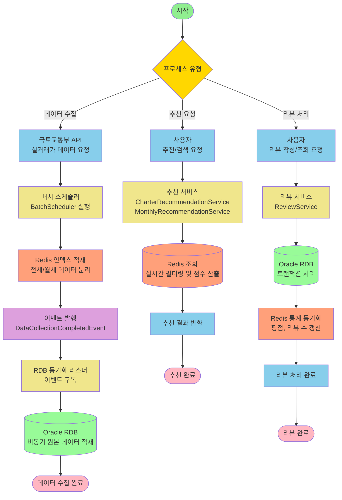

# 주거지 추천 서비스 고도화 요구사항 명세서

## 1. 서론 (Introduction)

### 1.1 목적 (Purpose)

본 문서는 '주거지 추천 서비스 고도화 (Phase 2: Review System Integration)' 프로젝트의 수행을 위한 소프트웨어 요구사항을 정의한다.

기존 주거지 추천 서비스는 국토교통부 실거래가 데이터와 같은 **정량적 공공데이터(CCTV, 범죄통계, 교통, 인구밀도)**에만 의존하여 지역구를 추천해 왔다. 이로 인해 소음, 채광, 이웃 분위기 등 실거주자만이 알 수 있는 정성적 거주 환경이 추천 결과에 반영되지 않아, 사용자가 체감하는 실제 환경과 추천 결과 간의 괴리가 발생하는 문제가 있었다.

이에 본 프로젝트는 다음과 같은 핵심 목적을 달성하기 위해 수행된다:

1. 실사용자 경험(UX) 데이터 통합: 매물별 리뷰 시스템을 구축하여 실거주자의 정성적 데이터를 수집하고, 이를 정량화하여 추천 알고리즘에 반영함으로써 추천의 신뢰도와 정확도를 높인다.
2. 데이터 신뢰성 및 무결성 확보: 기존 인메모리(Redis) 단일 저장 구조의 휘발성 위험을 제거하고, 관계형 데이터베이스(Oracle RDB)를 도입하여 리뷰 데이터와 매물 데이터 간의 **참조 무결성(Referential Integrity)**을 보장한다.
3. 고성능 아키텍처 구축: 100만 건 이상의 대규모 데이터 환경에서도 빠른 응답속도를 유지하기 위해, 조회 전용(Redis)과 쓰기 전용(RDB)을 분리하는 **하이브리드 데이터 저장소 전략(Hybrid Persistence Strategy)**을 수립하고 검증한다.

### 1.2 범위 (Scope)

본 시스템의 개발 범위는 기존 주거지 추천 서비스에 리뷰 기능을 통합하고, 백엔드 아키텍처를 고도화하는 것을 포함한다. 구체적인 범위는 다음과 같다.

1. 리뷰 관리 시스템 구축
* 리뷰 작성(Write): 지도 연동형 및 독립 탐색형의 이원화된 진입 경로를 제공하며, 별점(정량)과 텍스트(정성) 리뷰를 수집한다. 텍스트 리뷰 내 핵심 키워드(소음, 교통 등)를 자동 추출 및 점수화하는 로직을 포함한다.
* 리뷰 조회(Read): 지도 이탈 없이 정보를 확인하는 모달 오버레이(Modal Overlay) 방식과, 전체 리뷰를 관리하는 통합 페이지를 제공한다.

2. 추천 알고리즘 고도화
* 점수 통합 로직: 기존 공공데이터 기반 점수(70%)와 신규 리뷰 기반 점수(30%)를 가중 합산하는 하이브리드 추천 로직을 적용한다. 리뷰 데이터가 부족한(5개 미만) 경우 기존 로직으로 자동 전환(Fallback)되는 서비스 연속성 보장 메커니즘을 구현한다.

3. 시스템 아키텍처 및 데이터 파이프라인 개선
* 하이브리드 저장소(Hybrid Persistence): Redis는 실시간 조회 및 필터링을, Oracle RDB는 데이터 영구 저장 및 트랜잭션 관리를 전담하는 이원화 구조를 구축한다.
* 이벤트 기반 파이프라인(Event-Driven Pipeline): `BatchScheduler`의 데이터 수집 로직과 RDB 적재 로직을 이벤트(`DataCollectionCompletedEvent`)로 분리하여 결합도를 낮추고 확장성을 확보한다.
* 동시성 제어(Concurrency Control): 다수 사용자의 리뷰 작성 시 발생하는 통계 데이터(평점, 리뷰 수) 불일치를 방지하기 위해 DB 레벨의 잠금(Locking) 전략을 적용한다.

## 2. 시스템 개요 및 아키텍처 (System Overview & Architecture)

### 2.1 현행 시스템 분석 (AS-IS Analysis)

기존 주거지 추천 서비스는 국토교통부 실거래가 데이터와 서울시 공공데이터에 의존하여 서비스를 제공해 왔으며, 데이터 처리 및 저장 구조에서 다음과 같은 구조적 한계점을 가지고 있다.

#### 2.1.1 데이터 기반의 한계 (Data Limitation)

**정량적 지표 의존**: 추천 로직이 보증금, 월세, 평수, 범죄율 등 수치화된 공공데이터에만 전적으로 의존한다.

**정성적 경험 부재**: 층간소음, 채광, 이웃 분위기 등 실거주자만이 알 수 있는 거주 환경 데이터가 전무하여, 사용자가 체감하는 실제 환경과 추천 결과 간의 괴리가 발생한다.

#### 2.1.2 기술적 아키텍처의 한계 (Technical Limitations)

**데이터 휘발성 위험 (Volatility Risk)**: 매물 데이터를 수집하는 BatchScheduler가 데이터를 Redis(In-Memory)에만 적재하도록 설계되어 있다. 시스템 장애 발생 시 데이터 소실 위험이 존재하며, 리뷰 데이터와 같은 관계형 데이터의 영구 저장 및 참조 무결성(FK) 관리가 불가능하다.

**배치 프로세스의 강결합 (Tight Coupling)**: 데이터 수집(Collection), 가공(Processing), 적재(Loading) 로직이 BatchScheduler 내 단일 프로세스로 강하게 결합되어 있다. 새로운 저장소(RDB) 추가 시 기존 배치 로직의 안정성을 저해할 위험이 높으며, 확장성이 떨어진다.

**동시성 제어 부재 (Lack of Concurrency Control)**: 다수의 사용자가 동시에 리뷰를 작성하거나 평점을 수정할 때, 통계 데이터(평균 별점, 리뷰 수)의 정합성을 보장하는 메커니즘이 부재하여 데이터 오염(Lost Update) 가능성이 존재한다.

### 2.2 목표 시스템 구성 (TO-BE Architecture)

본 프로젝트는 대용량 리뷰 데이터 처리와 시스템 안정성을 동시에 확보하기 위해 하이브리드 데이터 저장소와 이벤트 기반 파이프라인을 핵심으로 하는 아키텍처로 전환한다.

#### 2.2.1 하이브리드 데이터 저장소 전략 (Hybrid Persistence Strategy)

조회 성능과 데이터 무결성이라는 상충되는 요구사항을 만족시키기 위해 저장소의 역할을 명확히 분리한다.

| 계층 (Layer) | 기술 스택 (Tech Stack) | 역할 및 책임 (Role & Responsibility) |
|------------|---------------------|-----------------------------------|
| Read Layer | Redis (In-Memory) | - 실시간 추천 알고리즘 연산 및 필터링 (전세/월세 인덱스 활용) - 빈번한 조회 트래픽(Hot Data) 처리로 Disk I/O 최소화 - 응답 속도 보장 (Millisecond 단위) |
| Write Layer | Oracle RDB (Disk) | - 리뷰 및 매물 원본 데이터의 영구 저장 (Source of Truth) - 매물-리뷰 간 참조 무결성(FK) 보장 - 트랜잭션(ACID) 관리 및 동시성 제어 (Locking) |

#### 2.2.2 이벤트 기반 데이터 파이프라인 (Event-Driven Data Pipeline)

배치 시스템의 유연성과 확장성을 확보하기 위해 관심사 분리(SoC) 원칙을 적용한다.

**Decoupling (결합도 감소)**: BatchScheduler는 국토부 API 데이터 수집 및 Redis 적재 완료 후, 후속 처리를 직접 수행하지 않고 DataCollectionCompletedEvent 이벤트를 발행한 뒤 즉시 종료한다.

**Async Processing (비동기 처리)**: 별도의 RdbSyncListener가 해당 이벤트를 구독(Subscribe)하여 RDB 적재(Upsert) 작업을 비동기적으로 수행한다. 이를 통해 RDB 적재 부하가 실시간 서비스나 기존 배치 프로세스에 영향을 주지 않도록 격리한다.

### 2.3 시스템 컨텍스트 다이어그램 (System Context Diagram)

목표 시스템의 데이터 흐름과 외부 인터페이스 관계는 다음과 같다.

#### 2.3.1 주요 데이터 흐름 설명

**데이터 수집 및 적재**: BatchScheduler는 매일 지정된 시각(04:00)에 국토교통부 API로부터 전월세 실거래가 데이터를 수집하여 Redis에 1차 적재하고, 이벤트를 통해 RDB에 비동기적으로 2차 적재한다.

**추천 서비스 제공**: CharterRecommendationService 및 MonthlyRecommendationService는 Redis에 구축된 전용 인덱스(idx:charterPrice, idx:monthlyRent 등)를 활용하여 사용자 조건에 맞는 매물을 실시간으로 검색하고 점수를 산출한다.

**리뷰 데이터 처리**: 사용자가 작성한 리뷰는 영속성 및 매물 데이터와의 정합성을 고려하여 Oracle RDB에 저장되며, 실시간 통계 정보는 Redis에 동기화되어 조회 성능을 보장한다.

## 3. 기능 요구사항 (Functional Requirements)

본 섹션에서는 시스템이 반드시 수행해야 할 구체적인 기능들을 정의한다. 각 요구사항은 'FR(Functional Requirement)-[모듈]-[번호]' 형식의 고유 ID를 부여하여 관리한다.

### 3.1 리뷰 관리 시스템 (Review Management System)

실거주자의 정성적 데이터를 수집, 저장, 조회하는 기능군이다.

**FR-RV-01: 리뷰 작성 (Write Review)**

사용자가 특정 매물에 대한 거주 경험을 정량적(별점) 및 정성적(텍스트)으로 입력하는 기능이다.

[ 기능 상세 ]

진입 경로 이원화:
지도 연동형 (Context-Aware): 지도 내 매물 상세 모달에서 [리뷰 작성] 버튼 클릭 시, 해당 매물 ID(propertyId)가 바인딩된 상태로 작성 화면에 진입한다.

독립 탐색형 (Search-Driven) : 리뷰 메인 페이지에서 작성 진입 시, 매물명 검색(자동완성) 모달을 통해 대상을 선택한 후 작성 화면에 진입한다.

입력 데이터:

별점 (Rating): 1~5점 척도 (필수).

상세 리뷰 (Text): 최소 20자 이상의 자유 서술형 텍스트.

키워드 자동 추출 (Auto-Extraction): 사용자가 입력한 텍스트를 서버에서 분석하여 '소음', '교통', '채광', '편의시설' 등 핵심 키워드를 자동으로 추출하고 각 항목별 긍정/부정 점수(+1/-1)를 산출하여 저장한다. (사용자 수동 태그 선택 없음)

제약 사항: 로그인한 사용자만 작성 가능하며, 매물당 1인 1회 작성을 원칙으로 한다.

**FR-RV-02: 리뷰 조회 (Read Review)**

축적된 리뷰 데이터를 사용자의 탐색 문맥에 맞춰 최적화된 형태로 제공하는 기능이다.

기능 상세:

모달 오버레이 조회 (Modal View): 지도 탐색 중 매물 카드의 `[리뷰 보기]` 버튼 클릭 시, 페이지 이동 없이 화면 위에 모달 레이어로 해당 매물의 리뷰 리스트를 최신순으로 출력한다. 이때 대용량 데이터 조회 성능 검증을 위해 무한 스크롤 방식이 아닌 **번호 기반 페이지네이션(1, 2, 3...)**을 적용하여 데이터를 제공한다.

통합 관리 페이지 조회 (Integrated View): 서비스 전체 리뷰를 최신순으로 조회하는 독립 페이지를 제공한다.

검색 기능: 통합 페이지 내에서 제목, 내용, 또는 '제목+내용' 조건으로 텍스트 검색을 수행한다.

**FR-RV-03: 리뷰 통계 동기화 (Statistics Synchronization)**

리뷰 데이터의 변동 사항을 통계 엔티티에 반영하고, 이를 캐시 저장소와 동기화하여 데이터 일관성을 유지하는 기능이다.

기능 상세:

1. 통계 엔티티 분리 및 갱신:
   * 리뷰(Review) 엔티티 생성 또는 삭제 시, 해당 매물과 연관된 리뷰 통계(Review Statistics) 엔티티를 갱신한다.
   * 갱신 대상 속성은 **평균 별점(Average Rating)**과 **총 리뷰 수(Review Count)**이며, 이를 통해 매물 엔티티의 빈번한 갱신을 방지한다.

2. 키워드 엔티티 매핑:
   * 리뷰 작성 시 추출된 키워드는 리뷰 키워드(Review Keyword) 엔티티에 별도로 저장하며, 리뷰(Review) 엔티티와 1:N 관계로 매핑하여 관리한다.

3. 캐시 데이터 동기화:
   * 리뷰 통계(Review Statistics) 엔티티의 갱신 트랜잭션이 완료(Commit)된 후, 변경된 통계 정보를 **캐시 저장소(Redis)**의 매물 정보에 비동기적으로 반영한다.

### 3.2 추천 알고리즘 고도화 (Recommendation Engine Enhancement)

기존 공공데이터 기반 추천 로직에 리뷰 점수를 통합하여 추천의 정확도를 높이는 기능군이다.

**FR-RC-01: 기존 추천 로직의 보존 및 확장성 확보 (Legacy Logic Preservation & Extensibility)**

리뷰 시스템 통합 시, 기존의 검증된 매물 추천 프로세스에 대한 코드 수정이나 로직 변경을 원천적으로 차단하고, 새로운 로직을 추가 레이어 형태로 확장하여 시스템 안정성을 확보한다.

기능 상세:

1. 기존 로직의 블랙박스화 (Legacy Logic Black-boxing):
   * 1차 검색(Strict Search) 및 2단계 폴백(Fallback Search)으로 이어지는 기존의 후보군 추출 프로세스는 내부 로직 변경 없이 입력값(조건)에 따른 출력값(매물 리스트)을 산출하는 독립된 모듈로 보존한다.

2. 비침해적 확장 설계 (Non-intrusive Extension Design):
   * 리뷰 점수 반영 로직은 기존 추천 프로세스가 완전히 종료된 후, 도출된 결과 데이터에 대해 후처리(Post-processing) 방식으로만 개입한다. 이를 통해 기존 로직의 실행 흐름에 어떠한 사이드 이펙트(Side Effect)도 발생시키지 않는다.

3. 점수 산출의 이원화 (Score Calculation Decoupling):
   * 기존의 정량적 점수(가격, 평수 등) 산출 로직과 새로운 정성적 점수(리뷰, 안전성) 산출 로직을 분리하여 실행하고, 최종 단계에서 단순 합산하는 구조를 채택하여 결합도를 낮춘다.

**FR-RC-02: 하이브리드 점수 산출 (Hybrid Score Calculation)**

최종 추천 매물 선정 시, 기존의 정량적 매물 점수와 사용자 리뷰 기반의 복합 점수를 가중 합산하여 최종 랭킹을 산출한다.

기능 상세:

1. 점수 산출 대상: 필터링 및 폴백 검색 프로세스를 통과하여 확정된 최종 후보 매물 엔티티군.

2. 리뷰 복합 점수(Composite Review Score) 산출: 리뷰 점수는 단일 별점이 아닌, 평점 점수와 키워드 분석 점수의 가중 합으로 구성된다.
   * 공식: `리뷰 점수 = (평점 점수 × 0.5) + (키워드 점수 × 0.5)`
   * 평점 점수(Rating Score): `(평균 별점 / 5.0) × 100`으로 정규화된 점수.
   * 키워드 점수(Keyword Score): 추출된 키워드의 긍정/부정 비율을 기반으로 산출된 점수.
      * 산출 로직: `(긍정 키워드 수 - 부정 키워드 수)`를 기반으로 0~100점 척도로 정규화(Normalization)하여 적용.

3. 최종 하이브리드 점수 통합:
   * 기본 공식: `최종 점수 = (기존 로직 점수 × 0.7) + (리뷰 복합 점수 × 0.3)`
   * 예외 처리 (Graceful Degradation): 통계적 유의성을 확보하기 위해, 해당 매물의 리뷰 개수가 임계값(5개) 미만인 경우 리뷰 가중치를 강제로 0으로 할당하고 기존 로직 점수만을 100% 반영한다.

### 3.3 배치 프로세스 아키텍처 개선 (Batch Process Architecture Improvement)

기존의 강결합된 배치 프로세스를 개선하여 확장성을 확보하고, 신규 저장소로의 데이터 흐름을 구축하는 기능군이다.

**FR-BA-01: 배치 완료 이벤트 발행 시스템 (Event Publishing Mechanism)**

기존 배치 프로세스의 로직 종료 시점을 트리거로 하여, 후속 작업을 위한 이벤트를 발행하도록 프로세스를 변경한다.

기능 상세:

1. 배치 로직 수정: 기존 데이터 수집 및 캐시 적재 로직이 성공적으로 완료된 직후, 프로세스를 종료하지 않고 시스템 내부 이벤트(`DataCollectionCompletedEvent`)를 발행한다.

2. 데이터 페이로드 전달: 이벤트 발행 시, 동기화에 필요한 최소한의 메타 데이터(수집된 매물 리스트의 참조 정보 등)를 이벤트 객체에 포함하여 전달한다.

3. 결합도 제거: 배치 스케줄러는 이벤트를 발행하는 즉시 트랜잭션을 종료하며, 이후 발생하는 영속성 저장소 동기화 로직의 성공/실패 여부에 관여하지 않는다.

**FR-BA-02: 영속성 저장소 비동기 동기화 (Asynchronous Persistence Synchronization)**

발행된 이벤트를 구독하여 인메모리 상의 휘발성 데이터를 영속성 저장소로 이관하여 영구 저장하는 동기화 리스너를 구현한다.

기능 상세:

1. 이벤트 구독 (Event Subscription): 동기화 리스너 모듈을 통해 수집 완료 이벤트를 비동기적으로 수신한다.

2. 엔티티 동기화 (Entity Synchronization):
   * 수신된 매물 데이터를 영속성 저장소 내 매물(Property) 엔티티에 반영한다.
   * 신규 매물: 새로운 매물 엔티티를 생성(Create)하여 저장한다.
   * 기존 매물: 이미 존재하는 매물 엔티티를 식별하여 변경된 속성 정보를 갱신(Update)한다.

3. 처리 성능 최적화: 대량의 엔티티를 처리할 때 발생할 수 있는 부하를 줄이기 위해, 개별 트랜잭션이 아닌 일괄 처리(Batch Processing) 방식을 적용하여 저장소와의 통신 비용을 최소화한다.

## 4. 비기능 요구사항 (Non-Functional Requirements)

시스템의 성능, 안정성, 유지보수성 등 품질 속성에 대한 요구사항을 정의한다.

### 4.1 성능 요구사항 (Performance)

**NFR-PF-01: 응답 속도 보장 (Response Time Guarantee)**

* 목표: 100만 건 이상의 매물 및 리뷰 데이터가 적재된 환경에서도, 리뷰 점수가 반영된 추천 API의 빠른 응답 속도를 보장해야 한다.
* 구현 전략:
   * Hot Data 캐싱: 빈번하게 조회되는 매물 엔티티와 리뷰 통계 엔티티 정보는 반드시 **캐시 저장소(In-Memory)**에서 조회되도록 설계하여 Disk I/O를 최소화한다.
   * 인덱스 최적화: 영속성 저장소 조회 시, 정렬(Sorting) 부하를 제거하기 위해 날짜 및 매물 ID 기반의 복합 인덱스 전략을 수립한다(설계 명세서에 구현 내용 작성).

**NFR-PF-02: 대용량 조회 최적화 (High-Volume Retrieval Optimization)**

* 목표: 리뷰 리스트 조회 시, 데이터 양이 증가하더라도 조회 성능이 저하되지 않아야 하며, UI의 번호 기반 페이지네이션을 효율적으로 지원해야 한다.
* 구현 전략:
   * 커버링 인덱스(Covering Index): 페이징 쿼리 수행 시, 실제 데이터 블록 접근을 최소화하기 위해 쿼리에 필요한 모든 컬럼을 포함하는 인덱스를 활용한다.
   * 카운트 쿼리 최적화: 전체 페이지 수 산출을 위한 카운트 쿼리(Count Query)를 별도로 최적화하거나, 리뷰 통계 엔티티에 저장된 '총 리뷰 수'를 활용하여 실시간 `COUNT(*)` 연산 부하를 제거한다.

### 4.2 데이터 무결성 및 동시성 (Data Integrity & Concurrency)

**NFR-DI-01: 통계 데이터 동시성 제어 (Statistics Concurrency Control)**

* 목표: 다수의 사용자가 동시에 리뷰를 작성하거나 삭제하는 상황에서도 **리뷰 통계 엔티티(평점, 개수)**의 값은 정확하게 유지되어야 한다.
* 구현 전략:
   * 비관적 잠금 (Pessimistic Locking): 영속성 저장소 레벨에서 리뷰 통계 엔티티 조회 및 갱신 시 `SELECT ... FOR UPDATE` 구문을 통한 배타적 잠금(Exclusive Lock)을 획득하여, 경쟁 조건(Race Condition)에 의한 데이터 오염(Lost Update)을 원천 차단한다.

**NFR-DI-02: 데이터 일관성 (Data Consistency)**

* 목표: 영속성 저장소(Source of Truth)와 캐시 저장소 간의 데이터 불일치가 발생하지 않아야 한다.
* 구현 전략:
   * 트랜잭션 보장: 리뷰 작성과 통계 갱신은 단일 트랜잭션 내에서 원자적(Atomic)으로 수행되어야 한다.
   * Write-Through 또는 Write-Behind: 영속성 저장소의 변경 사항이 확정(Commit)된 직후, 변경된 통계 데이터를 캐시 저장소에 동기화하여 데이터의 최신 상태를 유지한다.

### 4.3 확장성 및 유연성 (Scalability & Flexibility)

**NFR-SM-01: 관심사 분리 (Separation of Concerns)**

* 목표: 대용량 데이터 수집 프로세스와 적재 프로세스 간의 결합도를 낮춰 확장성을 확보한다.
* 구현 전략:
   * 이벤트 기반 아키텍처: 데이터 수집 모듈은 '수집 완료' 이벤트를 발행하는 책임만 가지며, 데이터 적재 모듈은 해당 이벤트를 구독하여 처리하는 책임만 가진다. 이를 통해 향후 적재 대상 저장소가 변경되거나 추가되더라도 수집 로직에는 영향이 없어야 한다.

## 5. 데이터 모델 및 인터페이스 (Data Model & Interfaces)

시스템의 데이터 구조를 물리적 스키마 종속성 없이 논리적 엔티티(Entity) 수준에서 정의하며, 시스템 간 통신을 위한 인터페이스 표준을 확립한다.

### 5.1 논리적 데이터 모델 (Logical Data Model)

시스템은 데이터의 영속성과 정합성을 보장하기 위해 다음 4가지 핵심 엔티티를 정의하고 관리한다.

#### 5.1.1 핵심 엔티티 정의 (Entity Definitions)

**매물 (Property) 엔티티**

정의: 주거지 추천 서비스의 근간이 되는 핵심 도메인 객체.

역할: 국토부 원천 데이터와 1:1로 매핑되며, 영속성 저장소(Persistence Store)와 인메모리 캐시(Cache) 양측에 존재하여 데이터의 기준점(Anchor) 역할을 수행한다.

주요 속성: 매물 고유 식별자, 위치 정보(주소, 법정동), 계약 정보(전세/월세 구분, 가격), 물리적 속성(평수, 층수), 안전성 점수.

**리뷰 (Review) 엔티티**

정의: 사용자의 개별 거주 경험을 기록하는 트랜잭션 데이터.

역할: 매물에 대한 정성적/정량적 평가를 저장하는 주체.

관계: 하나의 매물 엔티티는 다수의 리뷰 엔티티를 소유한다 (1:N).

주요 속성: 리뷰 식별자, 작성자 식별자, 참조 매물 식별자, 정량적 평점(Rating), 정성적 텍스트(Content), 작성 일시.

**리뷰 통계 (Review Statistics) 엔티티**

정의: 매물별 리뷰 데이터를 실시간으로 집계한 요약 정보.

역할: COUNT(*) 및 AVG()와 같은 고비용 집계 연산을 제거하기 위한 반정규화(Denormalization) 모델. 조회 성능 최적화를 위해 캐시 저장소에도 동기화된다.

관계: 매물 엔티티와 1:1 관계를 갖는다.

주요 속성: 참조 매물 식별자, 총 리뷰 수, 평균 평점.

**리뷰 키워드 (Review Keyword) 엔티티**

정의: 리뷰 텍스트 분석을 통해 추출된 의미론적 특징 데이터.

역할: 비정형 텍스트 데이터를 정형화된 점수 데이터로 변환하여 저장.

관계: 하나의 리뷰 엔티티에서 다수의 키워드가 파생된다 (1:N).

주요 속성: 참조 리뷰 식별자, 키워드 유형(소음, 교통 등), 긍정/부정 스코어.

### 5.2 인터페이스 명세 표준 (Interface Specification Standard)

#### 5.2.1 API 통신 아키텍처

통신 프로토콜: HTTP/1.1 기반의 RESTful API 아키텍처를 준수한다.

데이터 교환 포맷: 모든 요청(Request) 및 응답(Response)의 본문(Body)은 JSON(JavaScript Object Notation) 형식을 엄격히 따른다.

상태 코드 정책: 비즈니스 로직 성공 여부와 관계없이, HTTP 표준 상태 코드(2xx, 4xx, 5xx)를 사용하여 요청의 처리 결과를 명확히 식별한다.

#### 5.2.2 표준 에러 응답 규격

시스템 내 발생하는 모든 예외는 사전에 정의된 표준 에러 객체(ErrorResponseDto)로 캡슐화하여 반환한다.

errorCode: 시스템 내부에서 정의한 고유 식별 코드 (예: E4001).

message: 클라이언트 개발자 또는 사용자가 이해할 수 있는 명시적 에러 사유.

timestamp: 에러 발생 시점의 타임스탬프 (ISO 8601 형식).

## 6. 제약 사항 (Constraints)

시스템의 아키텍처 설계 및 구현 과정에서 반드시 준수해야 할 기술적 한계와 비즈니스적 통제 사항을 정의한다.

### 6.1 기술 스택 제약 (Technology Stack Constraints)

애플리케이션 프레임워크: Spring Boot 환경을 기반으로 하며, 비즈니스 로직의 모듈화를 준수한다.

영속성 계층 (Persistence Layer):

객체-관계 매핑(ORM)을 위해 JPA(Java Persistence API)를 사용한다.

동적 쿼리 및 복잡한 조인 처리를 위해 QueryDSL을 사용하여 타입 안정성(Type Safety)을 보장한다.

데이터의 물리적 저장은 Oracle RDB를 사용한다.

캐시 계층 (Cache Layer): 인메모리 데이터 처리를 위해 Redis를 사용하며, 실시간 조회 트래픽을 전담한다.

### 6.2 레거시 호환성 및 보존 제약 (Legacy Compatibility & Preservation)

기존 추천 로직의 불변성 (Immutability): CharterRecommendationService 및 MonthlyRecommendationService에 구현된 기존 매물 필터링 및 폴백(Fallback) 로직은 **블랙박스(Black-box)**로 취급하여 수정 없이 재사용해야 한다. 신규 로직은 오직 후처리(Post-processing) 단계에서만 개입한다.

배치 주기 유지: 기존 @Scheduled 기반의 데이터 수집 시점(04:00)과 주기는 변경하지 않으며, 신규 이벤트 발행 로직은 기존 배치의 종료 시점에 훅(Hook) 형태로 연결되어야 한다.