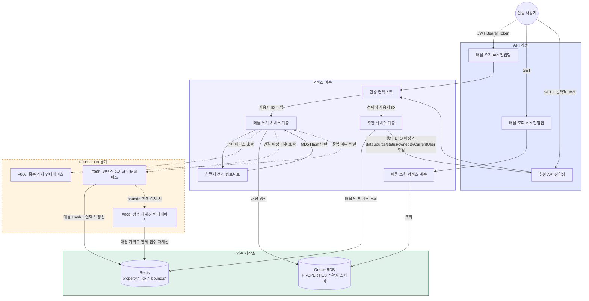
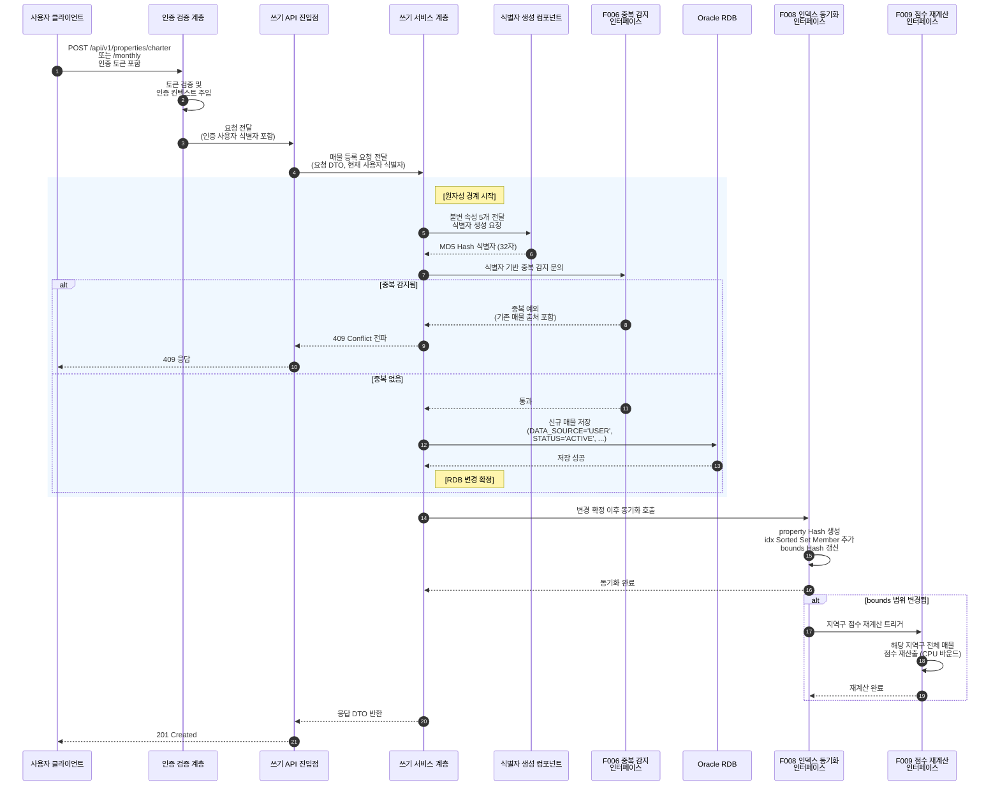
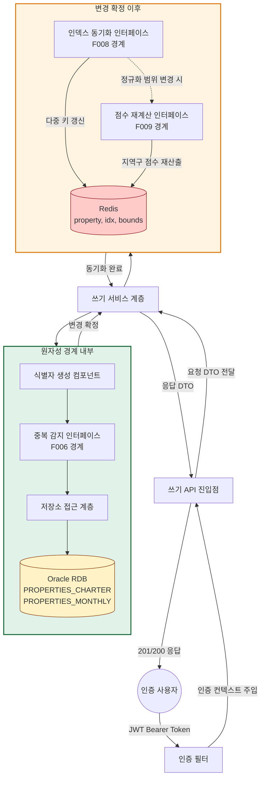
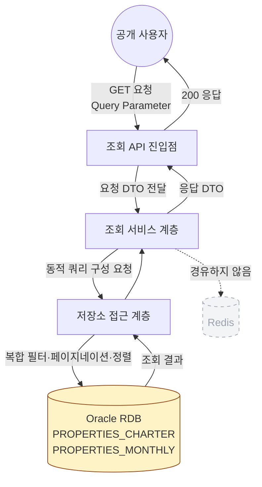
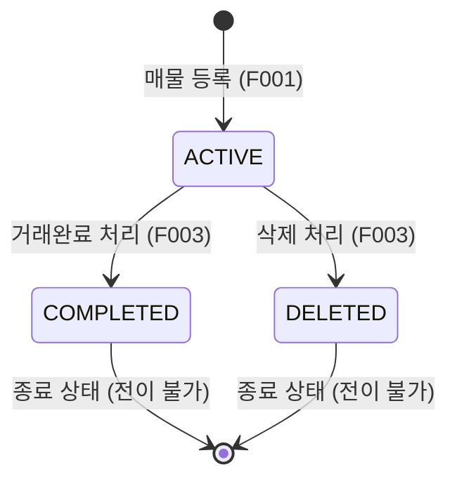
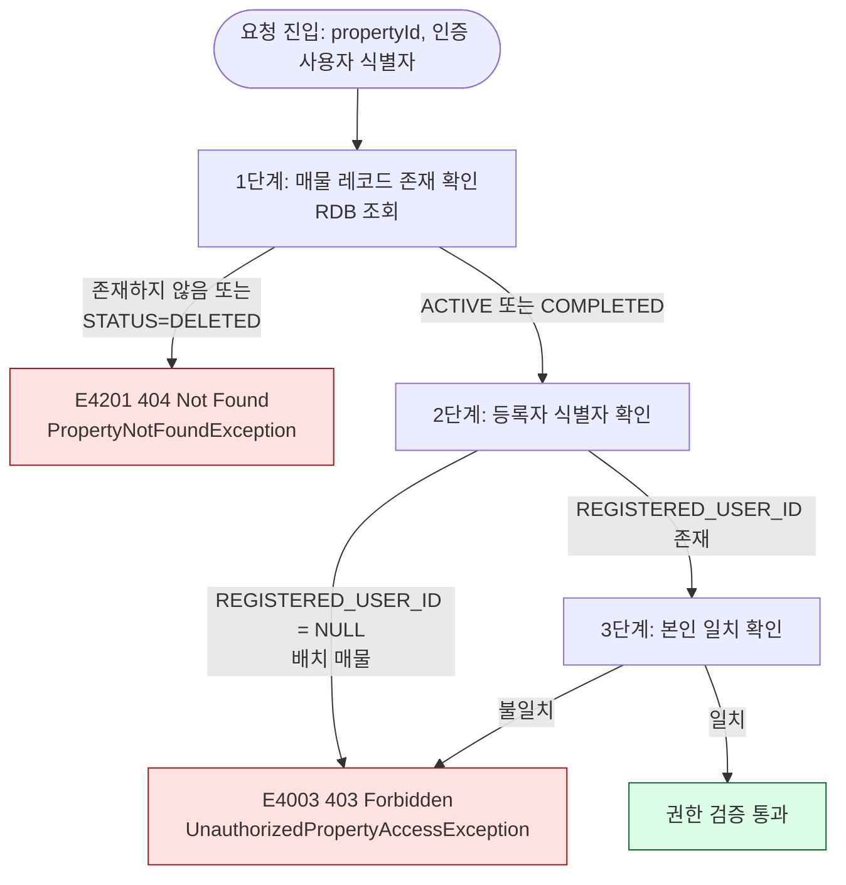

# Wherehouse 사용자 매물 등록 시스템 설계 명세서

프로젝트명: Wherehouse 서울 1인 가구 주거지 추천 서비스 — 사용자 매물 등록 시스템 (F001~F005)  
문서 버전: v3.0  
작성일: 2026년 4월 21일  
최종 수정일: 2026년 4월 27일  
작성자: 정범진 (Back-end Engineer)

---

## 개정 요지 (v2.1 → v3.0)

v2.1의 설계 문서를 실제 구현 결과에 맞추어 전면 갱신한다. 주요 변경: (1) 단일 엔드포인트를 전세/월세 물리 분리 엔드포인트로 전환, (2) F002 매물 수정의 등록자 본인 검증 제거 — 인증된 모든 사용자가 ACTIVE 매물 수정 가능, (3) 서비스 계층을 전세/월세 전용 WriteService로 분리, (4) Redis 동기화를 WriteService 내 인라인 처리로 확정, (5) PropertyDetailDto를 Composition 구조 + List 응답으로 변경, (6) 패키지명·컬럼 길이·DTO 구조 등 구현 확정 사항 반영.

**참조 문서**

- **기획서 v1.0** (2026-04-07): 프로젝트 배경·비즈니스 맥락·기존 시스템 한계·포트폴리오 구조 전환 목표
- **요구사항 명세서 v1.0** (2026-04-07): F001~F009 기능 요구사항·비기능 요구사항·CQRS 역할 분담
- **기존 v2 설계 명세서** (`4__주거지_추천_서비스_사용자_경험_반영_설계_명세서_v2.md`, 2025-11-27): AS-IS 컴포넌트·스키마·배치 파이프라인·추천 서비스 Phase 1·2 로직

---

## 목차

1. [개요](#1-개요)
2. [시스템 전체 개요](#2-시스템-전체-개요)
3. [일반 요구사항](#3-일반-요구사항)
4. [기존 시스템 분석](#4-기존-시스템-분석)
5. [시스템 아키텍처](#5-시스템-아키텍처)
6. [매물 상태 관리 체계](#6-매물-상태-관리-체계)
7. [API 명세](#7-api-명세)
8. [데이터 모델](#8-데이터-모델)
9. [기능별 처리 명세](#9-기능별-처리-명세)
10. [배치 처리 명세](#10-배치-처리-명세)
11. [기존 시스템 영향 및 변경 범위](#11-기존-시스템-영향-및-변경-범위)

---

## 1. 개요

### 1.1 목적

본 문서는 Wherehouse 사용자 매물 등록 시스템의 기본 기능군(F001~F005)에 대한 상세 설계를 정의한다. 프로젝트 배경·기존 시스템의 구조적 한계·포트폴리오 구조 전환 목표는 **기획서 "프로젝트 개요"·"현재 상태 분석"**에 상세 기술되어 있으며 본 문서는 이를 반복하지 않는다.

본 설계가 답하는 질문은 "F001~F005가 기존 CQRS 하이브리드 아키텍처(Oracle RDB Write Master + Redis Read Cache)의 쓰기 경로를 어떻게 확장하며, 기존 매물 테이블·Redis 키 구조·배치 프로세스·추천 API 계약에 어떤 수정이 수반되는가"이다.

### 1.2 범위

본 설계는 F001~F005 다섯 기능에 한정된다. 각 기능의 기능 개요·입출력·사용자 시나리오는 **요구사항 명세서 섹션 2 (F001~F005)**에 정의되어 있으며, 본 설계는 API 계약·데이터 모델·처리 단계·예외 매핑을 확정한다.

F006~F009는 본 문서의 범위에서 명시적으로 제외되며 후속 설계 명세서에서 별도로 다룬다. 본 설계는 F001~F005가 이들을 호출하는 인터페이스 경계만 섹션 5.2·9에서 정의한다.

| 제외 기능 | 후속 설계에서 확정할 주제 |
|-----------|--------------------------|
| F006 중복 감지 | MD5 해시 기반 동일 매물 판별과 동시 등록 Race Condition 처리의 락 전략 선택 |
| F007 배치-사용자 충돌 처리 | 임계값 기반 하이브리드 머지의 임계값 실측 및 배치 저장·갱신 통합 쿼리 수정 |
| F008 인덱스 동기화 | Redis 다중 키 갱신의 원자성 보장 및 부분 실패 보상 처리 전략 |
| F009 점수 재계산 | `bounds` 변경 감지 시 지역구 전체 매물 점수 재계산의 CPU 바운드 병렬 처리 전략 |

### 1.3 전제 조건

본 설계는 기존 v2 설계 명세서에 정의된 컴포넌트·스키마·인증 체계가 이미 구축되어 있음을 전제한다. 구체 AS-IS 구조는 섹션 4에서 참조 수준으로 집약하며, 본 고도화의 수정·확장 범위는 섹션 11에 집계된다.

---

## 2. 시스템 전체 개요

### 2.1 핵심 아키텍처 요약

본 고도화는 기존 CQRS 하이브리드 아키텍처(Oracle RDB Write Master + Redis Read Cache) 위에 **사용자 매물 쓰기 경로**(F001·F002·F003)와 **매물 조회 경로**(F004)를 신규로 추가하고, 기존 추천 API 응답 DTO를 확장(F005)한다. 기존 쓰기 경로는 배치 프로세스(월 1회)와 리뷰 CUD 두 가지였으며, 본 고도화가 세 번째 쓰기 경로인 매물 CUD를 도입한다.

매물 CUD는 기존 두 경로와 동일한 원칙(**RDB 변경 확정 우선, Redis 동기화는 변경 확정 이후**)을 따르되, 갱신 대상 Redis 키가 단일 Hash에서 **최대 5개 키**(매물 Hash + 인덱스 Sorted Set 2~3개 + 정규화 범위 Hash)로 확장되는 복잡도를 가진다. 이 복잡도에 대한 원자성·부분 실패 보상 처리 전략은 F008 후속 설계에서 확정된다.

본 설계의 핵심 아키텍처 결정은 다음 다섯 항목이며, 각 항목의 상세 근거·구현은 해당 섹션에서 기술된다.

| 결정 | 핵심 내용 | 상세 섹션 |
|------|----------|---------|
| 식별자 단일성 | 사용자 매물과 배치 매물이 동일한 MD5 해시 식별자 규칙을 공유 | 4.4, 9.1.1 |
| 스키마 공존 | `DATA_SOURCE`·`STATUS` 컬럼의 DDL DEFAULT 값으로 기존 배치 쿼리 무수정 공존 | 8.1.2 |
| 기존 조회 경로 불변 | 추천 서비스 Phase 1·Phase 2 내부 로직 한 줄도 변경되지 않음 | 9.5.5 |
| 선택적 인증 | F005를 위해 추천 API에 인증 헤더 부재 시 비인증 통과 동작 추가 | 3.2 |
| 경로 독립성 | 쓰기·조회·추천 확장 세 경로가 독립 호출 체인, 한 경로 장애가 타 경로에 전파되지 않음 | 5.4 |

### 2.2 전체 데이터 처리 흐름도

F001(매물 등록)을 대표 시나리오로 도식화한다. F002·F003은 본 흐름의 부분 경로를 따른다.



흐름의 각 구간(인증 컨텍스트 확보·식별자 생성·중복 감지·RDB 변경 확정·Redis 동기화·점수 재계산 연쇄·조회 경로)의 상세는 섹션 9의 기능별 처리 명세에서 확정된다.

### 2.3 주요 컴포넌트 간 상호작용

F001 매물 등록 프로세스의 시퀀스 다이어그램이다. F002·F003은 본 시퀀스의 부분 경로를 따른다.



원자성 경계의 범위·근거는 섹션 9.0 및 9.1.5, 권한 검증 위치·로직은 섹션 9.2.3, 후속 고도화 인터페이스의 블랙박스 취급 방식은 섹션 5.2에서 기술된다.

---

## 3. 일반 요구사항

### 3.1 기술 요구사항

**데이터 교환 형식**: 모든 API 요청·응답 본문은 `application/json; charset=UTF-8`, 날짜·시간은 ISO 8601(`YYYY-MM-DDThh:mm:ss`) 문자열로 직렬화. Oracle `TIMESTAMP` 타입은 애플리케이션 계층의 로컬 날짜·시간 표현으로 매핑.

**문자 인코딩**: UTF-8 표준. Oracle `NLS_CHARACTERSET`이 `AL32UTF8`임을 전제.

**API 주소 체계**: 기존 리뷰 API와 동일하게 `/api/v1` 기본 경로. 매물 도메인은 REST 원칙에 따라 매물 자원(`/properties`) 중심으로 계층화.

| 기능 | HTTP Method | Endpoint |
|------|-------------|----------|
| F001 전세 매물 등록 | POST | `/api/v1/properties/charter` |
| F001 월세 매물 등록 | POST | `/api/v1/properties/monthly` |
| F002 전세 매물 수정 | PATCH | `/api/v1/properties/charter/{propertyId}` |
| F002 월세 매물 수정 | PATCH | `/api/v1/properties/monthly/{propertyId}` |
| F003 전세 매물 상태 변경 | PATCH | `/api/v1/properties/charter/{propertyId}/status` |
| F003 월세 매물 상태 변경 | PATCH | `/api/v1/properties/monthly/{propertyId}/status` |
| F004 매물 목록 조회 | GET | `/api/v1/properties` |
| F004 매물 상세 조회 | GET | `/api/v1/properties/{propertyId}` |

F001~F003은 전세·월세 엔드포인트가 물리적으로 분리되어 있다. URL 경로가 임대 유형을 확정하므로 요청 본문에 `leaseType` 필드가 존재하지 않으며, 전세 DTO에는 `monthlyRent` 필드 자체가 없어 기존 단일 DTO에서 필요했던 조건부 필드 검증이 구조적으로 제거된다.

### 3.2 인증 및 인가

본 고도화는 기존 `com.wherehouse.JWT` 패키지의 JWT 기반 인증 체계를 재사용한다. 별도의 인증 로직은 신규 구현하지 않는다.

| API | 인증 요구 | 권한 검증 |
|-----|----------|----------|
| F001 POST /api/v1/properties/charter | 필수 (Protected) | 인증만 필요, 별도 권한 없음 |
| F001 POST /api/v1/properties/monthly | 필수 (Protected) | 동일 |
| F002 PATCH /api/v1/properties/charter/{id} | 필수 (Protected) | 인증만 필요. 등록자 본인 검증 없음 |
| F002 PATCH /api/v1/properties/monthly/{id} | 필수 (Protected) | 동일 |
| F003 PATCH /api/v1/properties/charter/{id}/status | 필수 (Protected) | 매물 등록자 본인 검증 (9.2.3) |
| F003 PATCH /api/v1/properties/monthly/{id}/status | 필수 (Protected) | 동일 |
| F004 GET /api/v1/properties | 불필요 (Public) | 없음 |
| F004 GET /api/v1/properties/{id} | 불필요 (Public) | 없음 |
| F005 GET /api/recommendations/* (기존 API) | 선택적 | 인증 시 본인 등록 매물 여부 판단 |

**선택적 인증 방식의 도입 근거**

F005 요구사항은 본인이 등록한 매물에 한해 수정·거래완료 버튼을 표시할 것을 요구한다. 이를 위해 추천 API가 요청자를 식별할 수 있어야 하나, 비로그인 사용자의 추천 조회를 제거하는 것은 기존 사용자 경험을 훼손한다. 두 요구(요청자 식별 가능성 + 기존 비로그인 접근 유지)는 단일 인증 정책으로 동시 만족이 불가능하므로, 인증 헤더 존재 여부에 따라 동작을 분기하는 **선택적 인증**을 채택한다.

구체 동작: 추천 API 경로는 기존 Public 접근 허용을 유지하되 인증 필터가 토큰이 존재하는 경우에만 검증하여 인증 컨텍스트를 세팅. 토큰 부재 또는 파싱 실패 시 예외를 던지지 않고 비인증 상태로 통과. 인증 컨텍스트가 익명 인증 상태로 표기된 경우 null로 통일 처리되어 본인 매물 판정에서 항상 `false` 반환.

### 3.3 데이터 정합성 요구사항

정합성 요구 사항은 **요구사항 명세서 섹션 4.3**을 따르며, 본 절은 구현 원칙만 확정한다.

- **RDB·Redis 일관성 원칙**: "RDB 변경 확정 우선, Redis 동기화는 변경 확정 이후" 단일 구현 원칙 적용(섹션 9.0). 활성 매물은 RDB·Redis 양쪽 반영, `COMPLETED`·`DELETED` 매물은 RDB 보존·Redis 인덱스 제거된 비대칭 상태가 정상(섹션 6.4).
- **동시 쓰기 정합성**: 동일 식별자에 대한 복수 동시 등록 시 정확히 하나만 통과시킨다는 요구를 중복 감지 인터페이스의 계약 수준에서 명시한다. 구체 락 전략은 F006 후속 설계에서 확정된다.
- **배치-사용자 충돌 해소**: 임계값 기반 하이브리드 머지 정책이 확정되어 있으며(요구사항 F007), 임계값 실측·구현은 F007 후속 설계 범위이다. 본 설계는 사용자 원본 가격 보존용 `USER_PROPOSED_*` 컬럼을 선제 반영한다(섹션 8.1·11.5).
- **리뷰 참조 무결성**: 섹션 6.3의 논리 삭제 정책과 `REVIEWS.PROPERTY_ID`의 외래 키 제약(`ON DELETE RESTRICT`)이 이 요구를 이중 방어로 충족한다.

### 3.4 보안 요구사항

보안 요구는 **요구사항 명세서 섹션 4.2**를 따른다. 본 절은 설계상의 구현 지점만 확정한다.

- **인증**: F001·F002·F003은 Protected(JWT 필수), F004는 Public, F005는 선택적 인증(섹션 3.2).
- **권한 관리**: F003의 등록자 본인 검증은 매물 쓰기 서비스 계층의 내부 헬퍼에서 3단계(매물 존재 → 등록자 존재 → 본인 일치)로 수행된다. F002는 등록자 본인 검증을 수행하지 않으며 인증된 모든 사용자가 ACTIVE 상태 매물을 수정할 수 있다. 단일 진원지는 섹션 9.2.3이다.
- **유효성 검증의 다계층 구조**: 1차 계층은 DTO 진입 시 선언적 검증(값 형식), 2차 계층은 서비스 계층의 비즈니스 규칙 검증(DB 조회 기반). 공통 구조는 섹션 9.0에서 선언되며 각 기능별 검증 항목은 9.1~9.3의 "유효성 검증" 소절에서 정의된다.

---

## 4. 기존 시스템 분석

### 4.1 기존 아키텍처 개요

본 고도화가 확장하는 기존 Wherehouse 시스템은 Oracle RDB(Write Master)와 Redis(Read Cache)를 분리 운영하는 CQRS 하이브리드 저장소 아키텍처이다. 두 저장소의 역할 분담은 **요구사항 명세서 섹션 1.2**에 정의되어 있다. 저장소 간 동기화는 배치 경로에서는 수집 완료 이벤트 기반으로, 리뷰 CUD 경로에서는 RDB 변경 확정 이후의 Write-Through 방식으로 수행된다.

### 4.2 기존 컴포넌트 구조

기존 시스템의 구성 요소를 계층별로 정리한다. 각 컴포넌트는 본 고도화의 전제 조건이며, 본 설계가 이들을 어떻게 확장·재사용하는지는 섹션 5와 11에 기술된다.

**API 계층**

| 컴포넌트 | 패키지 | 역할 |
|---------|--------|------|
| `RecommendationController` | `com.wherehouse.recommand.controller` | 전세·월세 추천 API 단일 진입점. 현재 Public |
| `ReviewQueryController` | `com.wherehouse.review.controller` | 리뷰 조회 API |
| `ReviewWriteController` | `com.wherehouse.review.controller` | 리뷰 CUD API |
| `ReviewBoardViewController` | `com.wherehouse.review.controller` | JSP 뷰 렌더링 |
| `PropertySearchController` | `com.wherehouse.review.controller` | 매물 검색 자동완성 (리뷰 작성 지원) |
| `GlobalExceptionHandlerReview` | `com.wherehouse.review.controller` | 리뷰 도메인 예외 처리 |

**서비스 계층**

| 컴포넌트 | 패키지 | 역할 |
|---------|--------|------|
| `CharterRecommendationService` | `com.wherehouse.recommand.service` | 전세 추천 파이프라인 (Phase 1·2) |
| `MonthlyRecommendationService` | `com.wherehouse.recommand.service` | 월세 추천 파이프라인 |
| `ReviewWriteService` | `com.wherehouse.review.service` | 리뷰 CUD의 원자성 관리, 통계 갱신, Redis 동기화 |
| `ReviewQueryService` | `com.wherehouse.review.service` | 리뷰 조회 로직 |

**배치 및 동기화 계층**

| 컴포넌트 | 패키지 | 역할 |
|---------|--------|------|
| `BatchScheduler` | `com.wherehouse.recommand.batch` | 월 1회 국토교통부 API 수집 총괄 |
| `IdGenerator` | `com.wherehouse.recommand.batch` | MD5 해시 기반 매물 식별자 생성 |
| `RdbSyncListener` | `com.wherehouse.recommand.batch` | 수집 완료 이벤트 수신 후 RDB·Redis 동기화 |

**보안 계층**

| 컴포넌트 | 패키지 | 역할 |
|---------|--------|------|
| JWT 인증 필터 체인 | `com.wherehouse.JWT` | Protected API 토큰 검증 및 인증 컨텍스트 주입 |

### 4.3 기존 데이터 저장소 구조

**Oracle RDB 테이블**

기존 매물 테이블은 전세·월세가 별도 테이블로 분리되어 있으며, 식별자는 불변 속성 5개의 MD5 해시 32자를 PK로 사용한다. 국토교통부 API가 고유 ID를 제공하지 않는 한계를 해소하기 위한 자체 Business Key 전략이다.

| 테이블 | 용도 | PK 생성 방식 | Redis 매핑 |
|--------|------|-------------|-----------|
| `PROPERTIES_CHARTER` | 전세 매물 마스터 | `MD5(SGG_CD \| JIBUN \| APT_NM \| FLOOR \| EXCLU_USE_AR)` | `property:charter:{id}` |
| `PROPERTIES_MONTHLY` | 월세 매물 마스터 | 동일 | `property:monthly:{id}` |
| `REVIEWS` | 사용자 리뷰 원본 | 시퀀스 기반 | 미적재 (CLOB 비용) |
| `REVIEW_STATISTICS` | 매물별 리뷰 집계 | `PROPERTY_ID` (1:1) | `stats:{type}:{id}` |
| `REVIEW_KEYWORDS` | 리뷰 키워드 태그 | 시퀀스 기반 | 미적재 |
| `ANALYSIS_*` | 지역구 분석 데이터 | 지역구명 | `safety:{district}`로 파생 |

**Redis 키 구조**

| 키 패턴 | 자료 구조 | 동기화 주체 | 갱신 시점 | 용도 |
|--------|----------|------------|----------|------|
| `property:charter:{id}` | Hash | 배치 적재 | 배치 완료 직후 | 전세 매물 상세 캐시 |
| `property:monthly:{id}` | Hash | 배치 적재 | 배치 완료 직후 | 월세 매물 상세 캐시 |
| `idx:charterPrice:{district}` | Sorted Set | 배치 적재 | 배치 완료 직후 | 전세금 범위 검색 인덱스 |
| `idx:deposit:{district}` | Sorted Set | 배치 적재 | 배치 완료 직후 | 보증금(월세) 범위 인덱스 |
| `idx:monthlyRent:{district}:월세` | Sorted Set | 배치 적재 | 배치 완료 직후 | 월세금 범위 인덱스 |
| `idx:area:{district}:{type}` | Sorted Set | 배치 적재 | 배치 완료 직후 | 평수 범위 인덱스 |
| `bounds:{district}:{type}` | Hash | 배치 적재 | 배치 완료 후 집계 | 정규화 기준값 (min·max) |
| `safety:{district}` | Hash | 배치 적재 | 배치 완료 후 분석 | 지역구 안전성 점수 |
| `stats:{type}:{id}` | Hash | 리뷰 쓰기 서비스 | 리뷰 CUD 변경 확정 직후 | 매물별 리뷰 통계 |

### 4.4 기존 핵심 비즈니스 로직 분석

**추천 검색 파이프라인 (Phase 1 + Phase 2)**

기존 추천 서비스는 두 단계 파이프라인으로 동작한다. Phase 1은 Redis Sorted Set 교집합으로 조건 만족 매물 식별자를 추출한 후 가격·평수·안전성을 0~100점으로 정규화하여 가중 합산한다(전세 가격·평수 2개 교집합, 월세 보증금·월세금·평수 3개 교집합). 결과가 임계치(3건) 미만인 지역구에는 폴백 검색이 적용된다. Phase 2는 Phase 1에서 확정된 매물 식별자에 대해 리뷰 통계 Hash를 일괄 조회하여 리뷰 점수를 가중 합산한다.

본 고도화의 F005는 Phase 1·2의 내부 로직을 변경하지 않으며 응답 DTO 매핑 단계에서만 3개 필드를 주입한다(상세는 섹션 9.5).

**배치 데이터 처리 파이프라인 및 리뷰 CUD Write-Through**

기존 배치 파이프라인(4단계 B-01~B-04)과 리뷰 CUD의 Write-Through 동기화 원리는 본 고도화의 매물 CUD가 동일 원칙을 따르는 기술적 토대이다. 본 설계에서의 재사용·확장 차이점은 다음과 같다.

- **배치 파이프라인**: F001~F005 범위에서 수정되지 않는다. F007 후속 설계에서 B-04 단계에 출처 기반 분기가 추가될 예정이다(섹션 10).
- **Write-Through 패턴**: 기존 리뷰 CUD는 통계 Hash 1개만 갱신하는 단순 구조였으나 본 고도화의 매물 CUD는 갱신 대상 Redis 키가 **최대 5개**로 확장된다. 이 확장이 F008 후속 설계의 부분 실패 보상 처리 전략이 필요한 근거이다.

**MD5 해시 식별자 생성 규칙**

기존 식별자 생성 컴포넌트는 불변 속성 5개(시군구코드·지번·아파트명·층·전용면적)를 정규화된 구분자로 연결한 문자열에 MD5 해시를 적용하여 32자 Hex String 식별자를 생성한다. 본 고도화의 F001은 동일 컴포넌트·규칙을 재사용하며, 이 단일성이 F006·F007과 기존 리뷰 데이터 참조 무결성의 토대이다. 구체 규칙은 섹션 9.1.1.

### 4.5 기존 시스템의 한계

기존 시스템의 세 구조적 한계(매물 갱신 빈도 제약·사용자 쓰기 상호작용 부재·데이터 출처 단일성)와 본 고도화가 이를 해소하는 범위는 **기획서 "현재 상태 분석"**에 정의되어 있다. 본 설계는 이를 전제하며 반복하지 않는다.

---

## 5. 시스템 아키텍처

### 5.1 아키텍처 개요

본 고도화는 기존 CQRS 하이브리드 아키텍처 위에 두 가지 신규 경로를 추가하고 한 가지 기존 경로를 확장한다.

| 경로 | 구성 | 기존 계층 관계 |
|------|------|--------------|
| 매물 쓰기 경로 (F001·F002·F003) | 매물 쓰기 API → 쓰기 서비스 → F006/F008/F009 인터페이스 → RDB·Redis | 기존 리뷰 CUD 경로와 유사 구조. Redis 갱신 대상이 단일 Hash → 최대 5개 키로 확장 |
| 매물 조회 경로 (F004) | 매물 조회 API → 조회 서비스 → RDB | 기존 추천 경로와 별개. Redis를 경유하지 않는 독립 경로 |
| 추천 확장 경로 (F005) | 기존 추천 API → 기존 추천 서비스 (Phase 1·2 불변) → 응답 DTO 매핑 확장 | 기존 컴포넌트의 확장. 선택적 인증 + 응답 DTO 3필드 추가 |

### 5.2 시스템 구성 요소

본 고도화에서 추가되는 신규 컴포넌트와 확장되는 기존 컴포넌트를 계약 수준에서 확정한다.

**API 계층 (신규)**

| 컴포넌트 | 패키지 | 역할 |
|---------|--------|------|
| `PropertyWriteController` | `com.wherehouse.PropertyManagement.controller` | F001·F002·F003 쓰기 API 단일 진입점. 전세/월세 분리 엔드포인트를 하나의 컨트롤러에서 처리 |
| `PropertyQueryController` | `com.wherehouse.PropertyManagement.controller` | F004 매물 목록·상세 조회 API 진입점 |
| `PropertyBoardViewController` | `com.wherehouse.PropertyManagement.controller` | 매물 등록·수정·목록 JSP 뷰 렌더링 |
| `GlobalExceptionHandlerProperty` | `com.wherehouse.PropertyManagement.execption` | 매물 도메인 예외의 HTTP 응답 매핑 |

**서비스 계층 (신규)**

| 컴포넌트 | 패키지 | 역할 |
|---------|--------|------|
| `CharterPropertyWriteService` | `com.wherehouse.PropertyManagement.service` | 전세 매물 F001~F003 CUD 처리, Redis 동기화 인라인 수행 |
| `MonthlyPropertyWriteService` | `com.wherehouse.PropertyManagement.service` | 월세 매물 F001~F003 CUD 처리, Redis 동기화 인라인 수행. 전세 서비스와 인덱스 제거 대상 차이(전세 2개 vs 월세 3개) |
| `PropertyQueryService` | `com.wherehouse.PropertyManagement.service` | F004 매물 전체 조회. RDB 직접 참조, 복합 필터·페이지네이션·정렬 |

**저장소 접근 계층 (신규)**

| 컴포넌트 | 패키지 | 역할 |
|---------|--------|------|
| `PropertyCharterRegistrationRepository` | `com.wherehouse.PropertyManagement.repository` | 전세 매물 테이블 접근, JPQL 기반 필터 쿼리 |
| `PropertyMonthlyRegistrationRepository` | `com.wherehouse.PropertyManagement.repository` | 월세 매물 테이블 접근, JPQL 기반 필터 쿼리 |

**도메인 모델 계층 (신규)**

| 컴포넌트 | 패키지 | 역할 |
|---------|--------|------|
| `PropertyCharterEntity` | `com.wherehouse.PropertyManagement.entity` | `PROPERTIES_CHARTER` 매핑. `@DynamicInsert`·`@DynamicUpdate` 적용 |
| `PropertyMonthlyEntity` | `com.wherehouse.PropertyManagement.entity` | `PROPERTIES_MONTHLY` 매핑. 월세 전용 컬럼 보유 |
| `PropertyStatus` | `com.wherehouse.PropertyManagement.entity` | 매물 상태 Enum (`ACTIVE`·`COMPLETED`·`DELETED`) |
| `DataSource` | `com.wherehouse.PropertyManagement.entity` | 데이터 출처 Enum (`BATCH`·`USER`·`MERGED`) |

**후속 고도화 컴포넌트의 성격 구분**

F006~F009 네 후속 기능은 본 설계와 연결되는 방식이 서로 다르다.

| 후속 기능 | 연결 방식 | 본 설계에서의 위치 |
|----------|----------|------------------|
| F006 중복 감지 | 매물 쓰기 서비스가 인터페이스로 호출 | `DuplicateChecker` 경계 정의 |
| F007 배치-사용자 충돌 처리 | **배치 경로 전용**. 매물 쓰기 경로가 호출하지 않음 | 인터페이스 추가 없음(섹션 10.2). 단 사용자 원본 가격 보존 컬럼은 선제 반영(섹션 8.1·11.5) |
| F008 인덱스 동기화 | 매물 쓰기 서비스가 변경 확정 이후 인터페이스로 호출 | `IndexSyncService` 경계 정의 |
| F009 점수 재계산 | F008 인터페이스가 정규화 범위 변경 시 연쇄 호출 | `ScoreRecalcService` 경계 정의 |

F006·F008·F009의 계약 시그니처는 아래 인터페이스 표에서 패키지 수준으로 선언되며, 구체 시그니처는 섹션 9의 해당 호출 지점에서 확정된다. 의존성 방향은 상위(F001~F005) → 하위(F006·F008·F009)로 고정된다.

**통합 헬퍼 컴포넌트 (신규)**

| 컴포넌트 | 패키지 | 역할 |
|---------|--------|------|
| `BoundsUpdater` | `com.wherehouse.PropertyManagement.integration` | bounds Hash의 min/max 경계 확장 로직 공통 헬퍼. 최초 생성 시 제로 분산 방지 보정(max = min + delta) 적용 |
| `PropertyHashBuilder` | `com.wherehouse.PropertyManagement.integration` | Entity → Redis Hash Map 변환 공통 헬퍼. Charter/Monthly 양쪽의 필드 매핑 규약을 단일 진원지로 보유 |

Redis 동기화(매물 Hash·인덱스 Sorted Set·bounds Hash 갱신)는 각 WriteService 내부에서 인라인으로 수행된다. 별도의 `IndexSyncService` 인터페이스를 경유하지 않으며, `BoundsUpdater`와 `PropertyHashBuilder`를 공통 헬퍼로 호출한다. 점수 재계산(F009)은 본 구현 범위에서 bounds 확장만 처리하며, bounds 축소에 의한 전체 재산출은 F009 후속 설계에서 확정된다.

**예외 계층 (신규)**

| 컴포넌트 | 패키지 | 매핑 HTTP 상태 |
|---------|--------|---------------|
| `PropertyNotFoundException` | `com.wherehouse.PropertyManagement.execption.customExceptions` | 404 |
| `UnauthorizedPropertyAccessException` | `com.wherehouse.PropertyManagement.execption.customExceptions` | 403 |
| `InvalidStateForUpdateException` | `com.wherehouse.PropertyManagement.execption.customExceptions` | 409 (종료 상태 수정) |
| `InvalidStatusTransitionException` | `com.wherehouse.PropertyManagement.execption.customExceptions` | 400 (상태 전이 위반) |
| `DuplicatePropertyException` | `com.wherehouse.PropertyManagement.execption.customExceptions` | 409 (중복 등록) |
| `PropertyValidationException` | `com.wherehouse.PropertyManagement.execption.customExceptions` | 400 (서비스 계층 2차 검증 실패, E4001) |

**DTO 계층 (신규)**

전세/월세 DTO 분리로 총 12개: F001 전세/월세 요청 각 1 + F001 응답 1 + F002 전세/월세 요청 각 1 + F002 응답 1 + F003 요청·응답 각 1 + F004 목록 요청·응답·Summary·Detail 4개. 전체 목록은 섹션 11.4 참조.

**확장 대상 기존 컴포넌트**

| 컴포넌트 | 패키지 | 확장 내용 |
|---------|--------|----------|
| `RecommendationController` | `com.wherehouse.recommand.controller` | 선택적 인증 지원 추가 |
| `CharterRecommendationService` | `com.wherehouse.recommand.service` | 응답 DTO 매핑에 `dataSource`·`status`·`ownedByCurrentUser` 주입 |
| `MonthlyRecommendationService` | `com.wherehouse.recommand.service` | 동일 확장 |
| `TopCharterPropertyDto` | `com.wherehouse.recommand.dto` | 3개 필드 추가 |
| `TopMonthlyPropertyDto` | `com.wherehouse.recommand.dto` | 동일 확장 |
| JWT 인증 필터 체인 | `com.wherehouse.JWT` | 추천 API 경로에 대해 토큰 부재 시 비인증 통과 분기 |

수정되지 않는 기존 컴포넌트의 전수는 섹션 11.6에 집계된다.

### 5.3 계층 간 데이터 흐름

세 경로(매물 쓰기·매물 조회·추천 확장)의 계층 구조를 경로 단위로 제시한다. 섹션 2.2가 F001 대표 시나리오의 조감도를, 섹션 2.3이 시간 순서를 제시한 반면, 본 절은 경로별 계층 구조와 구간 구분을 기술한다.

#### 매물 쓰기 경로 (F001·F002·F003)

매물 쓰기 경로는 **원자성 경계 내부**와 **변경 확정 이후**의 두 구간으로 나뉘며, 마지막 점수 재계산은 정규화 범위 변경이 감지된 경우에만 연쇄 호출된다. 구간 경계의 근거와 RDB·Redis 순서 원칙은 섹션 9.0.



| 계층 | 책임 요약 | 관련 컴포넌트 |
|------|----------|------------|
| 인증 필터 | JWT 토큰 검증 및 인증 컨텍스트에 사용자 식별자 주입 | 기존 JWT 인증 필터 체인 |
| 쓰기 API 진입점 | HTTP 요청 수신, DTO 바인딩, 사용자 식별자 추출, 서비스 계층 호출 | `PropertyWriteController` |
| 쓰기 서비스 계층 | 원자성 경계 진입·종료 관리, 변경 확정 이후 인덱스 동기화 호출 | `PropertyWriteService` |
| 식별자 생성 컴포넌트 | 불변 속성 5개 기반 MD5 해시 식별자 반환 | `IdGenerator` (기존 재사용) |
| 중복 감지 인터페이스 | 동일 식별자 매물 존재 여부 판별, 동시 등록 Race Condition 차단 | `DuplicateChecker` (F006 경계) |
| 저장소 접근 계층 | 매물 레코드 영속 저장 | `PropertyCharterRepository`·`PropertyMonthlyRepository` |
| 영속 저장소 | 매물 레코드 원본 보관, ACID 무결성 | Oracle RDB |
| 인덱스 동기화 인터페이스 | 매물 Hash·검색 인덱스·정규화 범위 Hash 다중 키 갱신 | `IndexSyncService` (F008 경계) |
| 점수 재계산 인터페이스 | 정규화 범위 변경 시 지역구 전체 점수 재산출 | `ScoreRecalcService` (F009 경계) |

#### 매물 조회 경로 (F004)

매물 조회 경로는 Redis를 경유하지 않고 Oracle RDB를 직접 참조하는 단일 선형 흐름이다. 복합 필터·페이지네이션·정렬이 관계형 DB의 강점 영역이라는 점, Source of Truth에서 직접 조회하여 Redis 동기화 지연에 의한 데이터 불일치를 원천 차단한다는 점, 본 기능이 대량 트래픽이 예상되지 않는 보조 탐색 기능이라는 점이 이 결정의 근거이다.



| 계층 | 책임 요약 | 관련 컴포넌트 |
|------|----------|------------|
| 조회 API 진입점 | HTTP 요청 수신, Query Parameter 바인딩 | `PropertyQueryController` |
| 조회 서비스 계층 | 복합 필터 구성, 페이지네이션·정렬 처리 | `PropertyQueryService` |
| 저장소 접근 계층 | 동적 쿼리 기반 매물 조회 | `PropertyCharterRepository`·`PropertyMonthlyRepository` |
| 영속 저장소 | 임대 유형 미지정 시 두 테이블 각각 조회 후 병합 | Oracle RDB |

#### 추천 확장 경로 (F005)

추천 확장 경로는 기존 추천 서비스의 Phase 1·2 내부 로직을 변경하지 않고 응답 DTO 매핑 단계에만 확장이 적용된다. 선택적 인증은 JWT 토큰 존재 시에만 검증하는 분기 방식으로, 비인증 요청도 기존 동작이 유지된다.

```mermaid
flowchart TD
    User((사용자<br/>선택적 JWT))
    Filter[인증 필터<br/>선택적 검증]
    Ctrl[추천 API 진입점]
    Svc[추천 서비스 계층]

    subgraph Existing [기존 Phase 1·2 로직 — 불변]
        direction TB
        Phase1[Phase 1<br/>검색 필터링 + 정량 점수]
        Phase2[Phase 2<br/>리뷰 통합]
        Redis[(Redis<br/>property, idx, bounds, stats)]

        Phase1 -->|매물 식별자 목록| Phase2
        Phase1 <-->|Sorted Set 교집합| Redis
        Phase2 <-->|stats Hash 조회| Redis
    end

    subgraph Extension [응답 DTO 매핑 — 확장]
        direction TB
        DtoMap[DTO 구성]
        FieldInject[확장 필드 주입<br/>dataSource, status,<br/>ownedByCurrentUser]

        DtoMap --> FieldInject
    end

    User -->|토큰 있으면 검증<br/>없으면 비인증 통과| Filter
    Filter -->|인증 컨텍스트<br/>(사용자 식별자 또는 null)| Ctrl
    Ctrl --> Svc
    Svc --> Existing
    Existing -->|추천 매물 목록| Extension
    Extension -->|응답 DTO| Svc
    Svc --> Ctrl
    Ctrl -->|200 응답| User

    style Existing fill:#f3f4f6,stroke:#9ca3af,stroke-dasharray: 5 5,color:#4b5563
    style Extension fill:#e0e7ff,stroke:#3730a3,stroke-width:2px
    style Redis fill:#fecaca,stroke:#991b1b
```

| 계층 | 책임 요약 | 관련 컴포넌트 |
|------|----------|------------|
| 인증 필터 (선택적) | 토큰 존재 시에만 검증, 부재 시 비인증 통과 | 기존 JWT 인증 필터 체인 (확장) |
| 추천 API 진입점 | HTTP 요청 수신, DTO 바인딩 | `RecommendationController` (확장) |
| 추천 서비스 계층 (Phase 1·2) | 기존 검색·리뷰 통합 로직 불변 | `CharterRecommendationService`·`MonthlyRecommendationService` |
| 추천 서비스 계층 (응답 매핑) | `dataSource`·`status`·`ownedByCurrentUser` 조건부 주입 | 동일 (매핑 단계 확장) |
| 영속 저장소 (읽기 전용) | 매물·인덱스·정규화 범위·리뷰 통계 조회 | Redis (기존) |

### 5.4 경로 간 독립성

세 경로는 서로 독립된 호출 체인을 가지며 한 경로의 장애가 다른 경로에 전파되지 않는다.

- 매물 쓰기 경로의 Redis 동기화 실패는 RDB Source of Truth를 훼손하지 않으므로 조회 경로의 데이터 일관성에 영향을 주지 않는다.
- 매물 조회 경로는 Redis를 경유하지 않으므로 Redis 장애 시에도 정상 동작한다(섹션 9.4.3).
- 추천 확장 경로는 기존 Phase 1·2 로직 불변이므로 본 고도화 컴포넌트 장애 시에도 기존 추천 동작을 유지한다.

---

## 6. 매물 상태 관리 체계

### 6.1 매물 상태 값 정의

| 상태 값 | 의미 | 검색 인덱스 노출 | 수정 가능성 |
|---------|------|---------------|-----------|
| `ACTIVE` | 거래 진행 중 매물. 등록 직후의 기본 상태 | 포함 | 인증된 모든 사용자가 수정 가능, 등록자 본인만 상태 전이 가능 |
| `COMPLETED` | 거래 체결 매물. 데이터 보존, 리뷰 열람용 개별 조회 허용 | 제외 | 수정·전이 불가 |
| `DELETED` | 등록자가 삭제 처리한 매물. 개별 조회도 미존재 응답 | 제외 | 수정·전이 불가 |

**세 값을 선정한 근거**: 거래 진행과 거래 체결은 사용자 의도상 명확히 구분되는 행위이다. 거래 체결되었으나 리뷰를 통해 사후 참조되는 매물을 "없어진 상태"로 취급하면 리뷰가 고아 레코드를 참조하게 되므로 `COMPLETED`를 별도 값으로 분리. `DELETED`는 등록자의 노출 제거 의도이며 리뷰 보존 요구로 물리 삭제가 불가하므로 별도 값. 두 종료 상태를 단일 값으로 묶으면 "거래 체결로 인한 제외"와 "등록자 의사에 의한 제거"의 UI 구분이 불가능해진다.

### 6.2 상태 전이 규칙

매물 상태의 허용 전이는 `ACTIVE` 상태에서만 출발하는 단방향 전이로 한정된다.



**허용 전이**

| 출발 상태 | 목표 상태 | 발생 경로 |
|----------|----------|----------|
| 초기 | `ACTIVE` | F001 매물 등록 |
| `ACTIVE` | `COMPLETED` | F003 거래완료 |
| `ACTIVE` | `DELETED` | F003 삭제 |

**금지 전이**

| 출발 상태 | 목표 상태 | 금지 사유 |
|----------|----------|---------|
| `COMPLETED` | `ACTIVE` | 거래 체결 취소 개념은 본 설계 범위 외. 동일 불변 속성 신규 등록 경로 사용 |
| `DELETED` | `ACTIVE` | 동일 근거 |
| `COMPLETED` | `DELETED` | 두 종료 상태 간 전환은 의미 중복, 이미 인덱스 제외 상태 |
| `DELETED` | `COMPLETED` | 동일 근거 |
| `ACTIVE` | `ACTIVE` | 상태 전이가 아닌 가변 속성 수정은 F002 |

금지 전이 시도 시 상태 전이 위반 예외(`InvalidStatusTransitionException`) 발생, API 계층이 400 Bad Request · E4002로 응답한다(섹션 7.8).

### 6.3 논리 삭제 정책

매물 상태가 `COMPLETED`·`DELETED`로 전이되어도 Oracle RDB의 매물 레코드는 삭제되지 않는다. `STATUS` 컬럼 값만 변경되며 불변 속성·가변 속성·등록자 식별자는 원본 상태로 보존된다.

**물리 삭제를 배제한 근거 — 등록자 복구 요청 대응 가능성**

논리 삭제 채택의 유일한 비즈니스 근거는 등록자의 복구 요청 대응 가능성이다. 등록자가 실수로 삭제 처리한 매물의 복구 시나리오는 운영 단계에서 충분히 예상되며, 물리 삭제는 이 경로를 원천 차단한다. 본 설계 범위에서 자동 복구 API는 정의되지 않으나, 영속 저장소에 원본 레코드가 보존되어 있으면 운영자 수준의 수동 복구가 가능하다. 동일한 기능적 결과(검색 인덱스 제외·상세 조회 미존재 응답)를 달성할 수 있는 논리 삭제를 우선한다.

**병행 개선 사항 — 매물·리뷰 참조 관계의 외래 키 제약 설정**

기존 시스템에서 `REVIEWS.PROPERTY_ID`는 매물 레코드를 참조하는 논리적 관계만 있고 DB 수준의 외래 키 제약(`FOREIGN KEY ... REFERENCES`)이 설정되어 있지 않다. 참조 무결성이 애플리케이션 계층의 호출 순서에만 의존하므로 매물 레코드가 의도치 않게 물리 삭제되는 경로(운영 실수·수동 쿼리·데이터 이관)를 DB 수준에서 차단할 수단이 부재하다.

본 고도화는 이 결함을 논리 삭제 정책의 부속 개선으로 함께 처리한다.

| 항목 | 내용 |
|------|------|
| 대상 제약 | `REVIEWS.PROPERTY_ID` → 매물 테이블 `PROPERTY_ID` 외래 키 제약 |
| 참조 동작 | `ON DELETE RESTRICT`. 매물 레코드 물리 삭제 시도 자체를 DB 수준에서 차단 |
| 방어 계층 | 애플리케이션 계층(`STATUS=DELETED`) + DB 계층(외래 키) 이중 방어 |
| 선행 작업 | 기존 `REVIEWS`의 고아 레코드(존재하지 않는 매물 식별자 참조) 존재 여부 점검·정리. 제약 추가 시점에 위반 레코드가 있으면 DDL이 실패하므로 필수 |
| 전세·월세 이중 참조 | 리뷰 레코드가 두 매물 테이블 중 어느 쪽을 참조하는지 DB 제약만으로 일의적 표현이 어려움. 구체 해결 방식(리뷰 테이블에 임대 유형 구분 컬럼 추가 후 조건부 참조·트리거·매물 통합 뷰 등)은 구현 단계에서 확정 |

**개선 사항이 본 설계 범위에 포함되는 근거**: 매물 논리 삭제 정책과 리뷰 참조 무결성은 분리해서 완결될 수 없는 주제이다. 본 설계가 `DELETED` 매물 개별 조회를 미존재로 응답하는 이상(섹션 6.4), 리뷰가 해당 매물을 참조하는 경우의 DB 수준 보증이 필요하며 이는 외래 키 제약 외의 수단으로 제공되기 어렵다.

**논리 삭제의 구체 구현**: F003 상태 변경 요청이 처리되면 매물 쓰기 서비스 계층이 매물 테이블의 `STATUS` 컬럼 값을 `COMPLETED`·`DELETED`로 갱신한다. 변경 확정 이후 인덱스 동기화 인터페이스가 호출되어 해당 매물의 Sorted Set Member를 제거한다(섹션 9.3). RDB 상에서 매물 레코드 자체는 유지되므로 `ON DELETE RESTRICT` 제약과 충돌하지 않는다.

### 6.4 상태별 동작 규칙

각 상태가 RDB·Redis·조회 응답·수정 가능성의 네 관점에서 어떤 동작을 보이는지를 단일 표로 정리한다.

| 관점 | `ACTIVE` | `COMPLETED` | `DELETED` |
|------|---------|------------|----------|
| Oracle RDB 레코드 존재 | 존재 | 존재 (보존) | 존재 (보존) |
| Redis 매물 Hash (`property:*`) | 존재 | 존재하되 `status` 필드만 `COMPLETED`로 갱신 | 제거 |
| Redis 검색 인덱스 (`idx:*`) Member | 등록 | 제거 | 제거 |
| Redis 정규화 범위 (`bounds:*`) 기여 | 기여 | 기여하지 않음 (재계산 시 제외) | 동일 |
| F004 매물 목록 조회 (기본 필터) | 포함 | 기본 제외, `status` Query Parameter 명시 시 포함 | 기본 제외, 명시 시에도 미반환 |
| F004 매물 상세 조회 | 200 OK | 200 OK (리뷰 참조용 허용) | 404 Not Found (E4201) |
| F002 가변 속성 수정 | 인증 사용자 전체 가능 | 불가 (E4106) | 불가 (404 또는 E4106) |
| F003 상태 전이 | 가능 | 불가 (E4002) | 불가 (E4002) |
| 추천 검색 결과 포함 | 포함 | 제외 (인덱스 Member 부재) | 제외 |
| 리뷰 참조 무결성 | 유지 | 유지 | 유지 (레코드 보존) |

**`COMPLETED`의 Redis Hash 필드 부분 갱신 근거**: `COMPLETED` 상태에서는 검색 인덱스에서 제외되므로 Sorted Set Member는 제거하지만 매물 상세 Hash(`property:*`)는 제거하지 않고 `status` 필드만 `COMPLETED`로 갱신한다. 리뷰 게시판이 매물 식별자로부터 매물 정보를 역조회하는 시나리오가 존재하기 때문이다. 이 조회는 추천 검색 경로가 아닌 리뷰 경로이므로 검색 인덱스 제거와는 별개로 매물 상세 정보는 참조 가능해야 한다.

**`DELETED`의 매물 Hash 전면 제거 근거**: `DELETED` 상태에서는 매물 상세 Hash 자체를 제거한다. `DELETED`가 등록자 의사에 의한 제거이므로 사용자 경험상 매물이 조회되지 않아야 한다는 점, Redis 메모리 자원 회수라는 부수 효과 때문이다. 리뷰 참조 무결성은 Oracle RDB 레코드 보존으로 유지되며, 리뷰 게시판이 `DELETED` 매물의 리뷰를 조회하는 경우에는 "매물 정보 조회 실패"로 처리되어 리뷰만 표시되거나 에러 상태로 처리된다. 이 세부 동작은 리뷰 게시판 측의 처리 로직이며 본 설계 범위 외이다.

**F004 매물 상세 조회의 `COMPLETED` 허용 근거**: 추천 결과에서 사용자가 이미 확인한 매물을 클릭했을 때 "거래완료된 매물입니다" 안내를 표시하려면 매물 정보를 응답해야 하며(요구사항 명세서 F003-요구사항 5), 이 안내는 매물 상세 정보 표시를 전제로 한다. `DELETED`의 경우 등록자 의사에 의한 제거이므로 동일 시나리오에서 404로 응답한다.

---

## 7. API 명세

### 7.1 공통 사항

| 항목 | 내용 |
|------|------|
| 프로토콜 | HTTP/1.1 |
| 요청·응답 포맷 | `application/json; charset=UTF-8` |
| 날짜·시간 직렬화 | ISO 8601 (`YYYY-MM-DDThh:mm:ss`) |
| 문자 인코딩 | UTF-8 |

**에러 응답 공통 포맷**

```json
{
  "errorCode": "E4003",
  "message": "해당 매물에 대한 수정 권한이 없습니다",
  "timestamp": "2026-04-21T14:30:00"
}
```

에러 코드의 단일 진원지는 섹션 7.8이다. 각 API 명세는 발생 가능한 코드 목록만 제시한다.

### 7.2 F001 매물 등록 API

| 항목 | 내용 |
|------|------|
| HTTP Method | POST |
| Endpoint URL (전세) | `/api/v1/properties/charter` |
| Endpoint URL (월세) | `/api/v1/properties/monthly` |
| 인증 여부 | 필수 (섹션 3.2) |

#### 7.2.1 요청 (Request)

**Request Headers**

| 헤더명 | 필수 | 설명 |
|--------|-----|------|
| `Authorization` | Y | `Bearer {Access_Token}` 형식의 JWT |
| `Content-Type` | Y | `application/json; charset=UTF-8` |

URL 경로가 임대 유형을 확정하므로 요청 본문에 `leaseType` 필드가 존재하지 않는다.

**Request Body — 전세 (`CharterCreateRequestDto`)**

| 필드 | 타입 | 필수 | 검증 규칙 |
|------|------|------|---------|
| `aptNm` | String | Y | 1~100자 |
| `sggCd` | String | Y | 서울시 25개 자치구 코드 중 하나 (5자리 숫자) |
| `umdNm` | String | Y | 1~100자 |
| `jibun` | String | Y | 1~50자 |
| `floor` | Integer | Y | -10 이상 100 이하 (음수는 지하층) |
| `excluUseAr` | BigDecimal | Y | 양수, 소수점 4자리까지 |
| `deposit` | Integer | Y | 양수. 전세금(만원) |
| `buildYear` | Integer | N | 1900~현재 연도 |
| `dealDate` | String | N | ISO 8601 날짜 (`YYYY-MM-DD`) |

**Request Body — 월세 (`MonthlyCreateRequestDto`)**

전세 DTO와 동일 필드에 다음 필드 추가:

| 필드 | 타입 | 필수 | 검증 규칙 |
|------|------|------|---------|
| `monthlyRent` | Integer | Y | 양수. 월세금(만원) |

전세 DTO에는 `monthlyRent` 필드 자체가 존재하지 않으므로, 기존 단일 DTO에서 필요했던 "전세 요청에 monthlyRent 포함 시 E4001" 검증이 DTO 구조상 원천 불필요하다.

**Request 예시 (전세)**

```json
{
  "aptNm": "래미안그레이튼",
  "sggCd": "11680",
  "umdNm": "역삼동",
  "jibun": "123-45",
  "floor": 12,
  "excluUseAr": 59.8400,
  "buildYear": 2015,
  "dealDate": "2026-04-20",
  "deposit": 45000
}
```

**Request 예시 (월세)**

```json
{
  "aptNm": "그린아파트",
  "sggCd": "11440",
  "umdNm": "연남동",
  "jibun": "567-89",
  "floor": 3,
  "excluUseAr": 32.5000,
  "buildYear": 2010,
  "dealDate": "2026-04-19",
  "deposit": 5000,
  "monthlyRent": 75
}
```

#### 7.2.2 응답 (Response)

**성공 응답: 201 Created**

| 필드 | 타입 | 설명 |
|------|------|------|
| `propertyId` | String | MD5 해시 32자 Hex String |
| `leaseType` | String | 등록된 임대 유형 |
| `dataSource` | String | `USER` 고정 |
| `status` | String | `ACTIVE` 고정 |
| `registeredUserId` | String | 인증 컨텍스트에서 추출된 값 |
| `registeredAt` | String | 등록 시각 (ISO 8601) |

**Response 예시**

```json
{
  "propertyId": "5d41402abc4b2a76b9719d911017c592",
  "leaseType": "CHARTER",
  "dataSource": "USER",
  "status": "ACTIVE",
  "registeredUserId": "user_1234",
  "registeredAt": "2026-04-21T14:30:00"
}
```

#### 7.2.3 에러 응답

발생 가능 코드: **E4001, E4101, E4105**. 상세는 섹션 7.8.

### 7.3 F002 매물 수정 API

| 항목 | 내용 |
|------|------|
| HTTP Method | PATCH |
| Endpoint URL (전세) | `/api/v1/properties/charter/{propertyId}` |
| Endpoint URL (월세) | `/api/v1/properties/monthly/{propertyId}` |
| 인증 여부 | 필수 |
| 권한 검증 | 없음. 인증된 모든 사용자가 ACTIVE 매물 수정 가능 |

#### 7.3.1 요청 (Request)

**Path Parameters**

| 파라미터 | 타입 | 설명 |
|---------|------|------|
| `propertyId` | String | 수정 대상 매물 식별자 (MD5 32자) |

**Request Body — 전세 (`CharterUpdateRequestDto`)** — PATCH 시맨틱, 변경 필드만 포함

| 필드 | 타입 | 선택성 | 제약 |
|------|------|------|------|
| `deposit` | Integer | 선택 | 양수 |
| `buildYear` | Integer | 선택 | 1900 이상 |
| `dealDate` | String | 선택 | ISO 8601 날짜 |

**Request Body — 월세 (`MonthlyUpdateRequestDto`)**

전세 DTO와 동일 필드에 다음 필드 추가:

| 필드 | 타입 | 선택성 | 제약 |
|------|------|------|------|
| `monthlyRent` | Integer | 선택 | 양수 |

불변 속성·시스템 관리 필드가 요청 본문에 포함되더라도 Jackson 기본 동작이 알 수 없는 필드를 무시하므로 바인딩 단계에서 에러가 발생하지 않는다.

**Request 예시 (전세금만 수정)**

```json
{
  "deposit": 47000
}
```

**Request 예시 (월세금·계약일자 동시 수정)**

```json
{
  "monthlyRent": 80,
  "dealDate": "2026-04-25"
}
```

#### 7.3.2 응답 (Response)

**성공 응답: 200 OK**

| 필드 | 타입 | 설명 |
|------|------|------|
| `propertyId` | String | 수정된 매물 식별자 |
| `modifiedAt` | String | 수정 시각 |
| `changedFields` | Array of String | 실제로 변경된 필드명 목록 |

**Response 예시**

```json
{
  "propertyId": "5d41402abc4b2a76b9719d911017c592",
  "modifiedAt": "2026-04-21T15:10:00",
  "changedFields": ["deposit"]
}
```

#### 7.3.3 에러 응답

발생 가능 코드: **E4001, E4101, E4201, E4106**. 상세는 섹션 7.8. E4106은 종료 상태(COMPLETED/DELETED) 매물 수정 시도.

### 7.4 F003 매물 상태 변경 API

| 항목 | 내용 |
|------|------|
| HTTP Method | PATCH |
| Endpoint URL (전세) | `/api/v1/properties/charter/{propertyId}/status` |
| Endpoint URL (월세) | `/api/v1/properties/monthly/{propertyId}/status` |
| 인증 여부 | 필수 |
| 권한 검증 | 등록자 본인 (섹션 9.2.3) |
| 상태 전이 규칙 | 섹션 6.2 |

#### 7.4.1 요청 (Request)

**Path Parameters**

| 파라미터 | 타입 | 설명 |
|---------|------|------|
| `propertyId` | String | 대상 매물 식별자 |

**Request Body**

| 필드 | 타입 | 필수 | 허용 값 |
|------|------|------|--------|
| `targetStatus` | String | Y | `COMPLETED` 또는 `DELETED` (`ACTIVE` 불허) |

**Request 예시**

```json
{
  "targetStatus": "COMPLETED"
}
```

#### 7.4.2 응답 (Response)

**성공 응답: 200 OK**

| 필드 | 타입 | 설명 |
|------|------|------|
| `propertyId` | String | 대상 매물 식별자 |
| `previousStatus` | String | 전이 이전 (`ACTIVE`) |
| `currentStatus` | String | 전이 이후 |
| `modifiedAt` | String | 상태 변경 시각 |

**Response 예시**

```json
{
  "propertyId": "5d41402abc4b2a76b9719d911017c592",
  "previousStatus": "ACTIVE",
  "currentStatus": "COMPLETED",
  "modifiedAt": "2026-04-21T15:30:00"
}
```

#### 7.4.3 에러 응답

발생 가능 코드: **E4001, E4002, E4101, E4003, E4201**. 상세는 섹션 7.8. E4002는 허용되지 않는 상태 전이(섹션 6.2 금지 전이).

### 7.5 F004 매물 목록 조회 API

| 항목 | 내용 |
|------|------|
| HTTP Method | GET |
| Endpoint URL | `/api/v1/properties` |
| 인증 여부 | 불필요 (Public) |

#### 7.5.1 요청 (Request)

**Query Parameters**

| 파라미터 | 타입 | 필수 | 기본값 | 설명 |
|---------|------|------|-------|------|
| `leaseType` | String | N | 미지정 시 두 유형 통합 | `CHARTER`·`MONTHLY` |
| `district` | String | N | 미지정 시 25개 통합 | 지역구명 (예: `강남구`) |
| `status` | String | N | `ACTIVE` | `ACTIVE`·`COMPLETED` |
| `dataSource` | String | N | 미지정 시 전체 | `BATCH`·`USER`·`MERGED` |
| `keyword` | String | N | — | 아파트명 또는 지역구명 부분 일치 |
| `page` | Integer | N | 0 | 0-indexed |
| `size` | Integer | N | 20 | 페이지 크기 |
| `sort` | String | N | `latest` | 정렬 기준 |

**정렬 기준 허용 값**

| 값 | 의미 |
|----|------|
| `latest` | 최신 갱신 내림차순. 배치는 `LAST_UPDATED`, 사용자는 `COALESCE(MODIFIED_AT, REGISTERED_AT)` |
| `priceDesc`·`priceAsc` | 가격 내림·오름차순 (전세: 전세금, 월세: 보증금) |
| `areaDesc`·`areaAsc` | 전용면적 내림·오름차순 |

**DELETED 상태 매물의 응답 제외**: `status` Query Parameter가 `DELETED`로 지정되더라도 응답에 포함되지 않는다(섹션 6.4).

**Request 예시**

```
GET /api/v1/properties?leaseType=CHARTER&district=강남구&keyword=래미안&page=0&size=20&sort=priceAsc
```

#### 7.5.2 응답 (Response)

**성공 응답: 200 OK**

| 필드 | 타입 | 설명 |
|------|------|------|
| `properties` | Array of `PropertySummaryDto` | 현재 페이지의 매물 요약 |
| `totalElements` | Long | 총 매물 수 |
| `totalPages` | Integer | 총 페이지 수 |
| `currentPage` | Integer | 현재 페이지 (0-indexed) |
| `size` | Integer | 페이지 크기 |

**`PropertySummaryDto` 필드**

| 필드 | 타입 | 설명 |
|------|------|------|
| `propertyId` | String | MD5 32자 |
| `leaseType` | String | `CHARTER`·`MONTHLY` |
| `aptNm` | String | 아파트·건물명 |
| `districtName` | String | 지역구명 |
| `address` | String | 전체 주소 (파생값) |
| `floor` | Integer | 층수 |
| `excluUseAr` | Number | 전용면적 (㎡) |
| `areaInPyeong` | Number | 전용면적 (평, 파생값) |
| `deposit` | Integer | 전세금 또는 보증금 |
| `monthlyRent` | Integer | 월세금 (전세는 null) |
| `buildYear` | Integer | 건축연도 |
| `dataSource` | String | `BATCH`·`USER`·`MERGED` |
| `status` | String | `ACTIVE`·`COMPLETED` |
| `registeredUserId` | String | 등록자 식별자 (배치는 null). 버튼 노출 제어에 필요 |
| `registeredAt` | String | 사용자 매물만 (배치는 null) |
| `lastUpdated` | String | 최종 갱신 시각 |

**Response 예시**

```json
{
  "properties": [
    {
      "propertyId": "5d41402abc4b2a76b9719d911017c592",
      "leaseType": "CHARTER",
      "aptNm": "래미안그레이튼",
      "districtName": "강남구",
      "address": "서울특별시 강남구 역삼동 123-45",
      "floor": 12,
      "excluUseAr": 59.84,
      "areaInPyeong": 18.10,
      "deposit": 45000,
      "monthlyRent": null,
      "buildYear": 2015,
      "dataSource": "USER",
      "status": "ACTIVE",
      "registeredAt": "2026-04-21T14:30:00",
      "lastUpdated": "2026-04-21T14:30:00"
    }
  ],
  "totalElements": 1247,
  "totalPages": 63,
  "currentPage": 0,
  "size": 20
}
```

#### 7.5.3 에러 응답

발생 가능 코드: **E4001** (Query Parameter 형식 오류). 상세는 섹션 7.8.

### 7.6 F004 매물 상세 조회 API

| 항목 | 내용 |
|------|------|
| HTTP Method | GET |
| Endpoint URL | `/api/v1/properties/{propertyId}` |
| 인증 여부 | 불필요 |

#### 7.6.1 요청 (Request)

**Path Parameters**

| 파라미터 | 타입 | 설명 |
|---------|------|------|
| `propertyId` | String | 매물 식별자 (MD5 32자) |

#### 7.6.2 응답 (Response)

**성공 응답: 200 OK**

응답은 `List<PropertyDetailDto>` 배열이다. MD5 해시 식별자 생성 입력에 `leaseType`이 포함되지 않으므로 동일 `propertyId`가 `PROPERTIES_CHARTER`와 `PROPERTIES_MONTHLY` 양쪽에 각각 존재할 수 있다. 양쪽을 모두 조회하여 `DELETED`가 아닌 유효 레코드를 전부 반환한다(최소 1건, 최대 2건).

`PropertyDetailDto`는 `PropertySummaryDto`를 Composition(has-a)으로 포함한다. 상속(is-a) 대신 합성을 선택한 근거: Summary 매핑 로직 재사용, Summary 필드 변경 시 Detail 자동 반영, Lombok `@Builder` 기본 동작과의 호환(`@SuperBuilder` 전환 불필요).

| 필드 | 타입 | 설명 |
|------|------|------|
| `summary` | `PropertySummaryDto` | 매물 요약 정보 (7.5.2의 모든 필드 포함) |
| `umdNm` | String | 법정동명 |
| `jibun` | String | 지번 |
| `sggCd` | String | 시군구 코드 |
| `dealDate` | String | 계약일자 |
| `registeredUserId` | String | 등록자 식별자 (배치는 null) |
| `modifiedAt` | String | 수정 시각 (미수정 시 null) |
| `reviewCount` | Integer | `REVIEW_STATISTICS`에서 참조 |
| `avgRating` | Number | 평균 별점 (리뷰 미존재 시 0) |

#### 7.6.3 에러 응답

발생 가능 코드: **E4201** (매물 미존재 또는 `DELETED` 상태, 섹션 6.4). 상세는 섹션 7.8.

### 7.7 F005 추천 결과 화면 매물 정보 확장

F005는 기존 추천 API(`/api/recommendations/*`)의 응답 DTO 확장이며 신규 엔드포인트를 도입하지 않는다. 기존 HTTP Method·URL·요청 구조는 불변이며 인증 정책만 선택적 인증으로 변경(섹션 3.2), 응답 DTO에 필드 3개 추가.

**응답 DTO 확장 — `TopCharterPropertyDto`·`TopMonthlyPropertyDto`**

기존 필드는 전부 유지(기존 v2 설계 명세서 7.3.2)되며 다음 3개 필드가 신규 추가된다.

| 필드 | 타입 | 값 결정 |
|------|------|-------|
| `dataSource` | String | Redis 매물 Hash의 `dataSource` 필드에서 복사 |
| `status` | String | 추천 결과는 기본 `ACTIVE`만 포함하나, 조회 후 상태 변경되는 경합 윈도우 UI 대응을 위해 필드 노출 |
| `ownedByCurrentUser` | Boolean | 인증 컨텍스트의 사용자 식별자와 매물 `registeredUserId` 비교. 비인증·배치 매물은 `false` |

**Response 예시 (전세 추천 개별 매물)**

```json
{
  "propertyId": "5d41402abc4b2a76b9719d911017c592",
  "propertyName": "래미안그레이튼",
  "address": "서울특별시 강남구 역삼동 123-45",
  "price": 45000,
  "leaseType": "전세",
  "area": 18.10,
  "floor": 12,
  "buildYear": 2015,
  "finalScore": 82.4,
  "reviewCount": 12,
  "avgRating": 4.3,
  "dataSource": "USER",
  "status": "ACTIVE",
  "ownedByCurrentUser": true
}
```

기존 응답 DTO에 필드가 추가되는 확장이며 기존 필드는 제거·변경되지 않으므로 알 수 없는 필드를 무시하는 통상적 JSON 파서는 영향받지 않는다. `ownedByCurrentUser` 값 결정 로직은 섹션 9.5.2.

### 7.8 공통 에러 코드 체계 (단일 진원지)

본 고도화의 모든 API가 반환하는 에러 코드 체계를 본 표에서 확정한다. 다른 섹션의 에러 응답은 이 체계의 코드만 참조하며 의미를 재정의하지 않는다.

| HTTP 상태 | 에러 코드 | 발생 상황 | 매핑 예외 클래스 | 기존 코드 재사용 여부 |
|----------|----------|---------|------------|------------------|
| 400 | E4001 | 요청 파라미터 유효성 검증 실패 (필수 누락·값 범위 초과·타입 오류·불변 속성 수정 시도) | (DTO 진입 시 검증 실패) | 기존 리뷰 도메인 재사용 |
| 400 | E4002 | 허용되지 않는 상태 전이 요청 (섹션 6.2) | `InvalidStatusTransitionException` | 신규 |
| 401 | E4101 | JWT 토큰 부재 또는 만료 (Protected API) | (인증 필터 계층) | 기존 재사용 |
| 403 | E4003 | 등록자 본인 아님, 배치 매물 수정·상태 변경 시도 (섹션 9.2.3 3단계) | `UnauthorizedPropertyAccessException` | 기존 재사용, 의미 확장 |
| 404 | E4201 | 매물 미존재 또는 `DELETED` 상태 접근 (섹션 6.4) | `PropertyNotFoundException` | 기존 재사용 |
| 409 | E4104 | 동일 사용자 동일 매물 중복 리뷰 작성 (기존 리뷰 도메인 고유) | (기존 리뷰 도메인) | 기존 유지, 본 고도화와 무관 |
| 409 | E4105 | 동일 MD5 해시 매물 이미 존재 (F006 중복 감지) | `DuplicatePropertyException` | 신규 |
| 409 | E4106 | `COMPLETED`·`DELETED` 종료 상태 매물 수정 시도 (섹션 6.4) | `InvalidStateForUpdateException` | 신규 |

**코드 번호 할당 규칙**: 기존 리뷰 도메인이 사용하는 E4001·E4101·E4003·E4201·E4104는 의미가 본 고도화와 호환되거나 확장 가능하므로 재사용한다. 409 Conflict에서 E4104는 리뷰 고유이므로 본 고도화의 매물 관련 409는 E4105·E4106 신규 번호를 할당. E4002는 기존 미사용이며 상태 전이 위반이 유효성 E4001과 의미상 구분(유효성은 요청 값 자체, 상태 전이는 요청 값과 현재 상태 조합)되어야 하므로 별도 코드로 분리.

---

## 8. 데이터 모델

### 8.1 Oracle RDB 스키마 확장

기존 매물 테이블(`PROPERTIES_CHARTER`·`PROPERTIES_MONTHLY`)의 구조는 기존 v2 설계 명세서 섹션 7.1.1에 정의되어 있다. 본 고도화는 두 테이블 모두에 6개 공통 컬럼을 신규 추가하며(월세 테이블은 1개 추가로 7개), 기존 컬럼은 한 개도 변경·삭제되지 않는다.

#### 8.1.1 신규 추가 컬럼

**공통 추가 컬럼 (전세·월세 공통, 6개)**

| 컬럼명 | 데이터 타입 | DEFAULT | NULL 허용 | 설명 |
|--------|------------|---------|----------|------|
| `DATA_SOURCE` | `VARCHAR2(10)` | `'BATCH'` | NOT NULL | `BATCH`·`USER`·`MERGED` |
| `STATUS` | `VARCHAR2(10)` | `'ACTIVE'` | NOT NULL | `ACTIVE`·`COMPLETED`·`DELETED` (섹션 6.1) |
| `REGISTERED_USER_ID` | `VARCHAR2(100)` | — | YES | 사용자 매물의 등록자 식별자. 배치는 NULL |
| `REGISTERED_AT` | `TIMESTAMP` | — | YES | 사용자 등록 시각. 배치는 NULL |
| `MODIFIED_AT` | `TIMESTAMP` | — | YES | 사용자 매물의 최종 수정 시각 |
| `USER_PROPOSED_DEPOSIT` | `NUMBER(15)` | — | YES | 사용자 원본 보증금. F007 선제 반영. 배치·머지 전은 NULL |

**월세 테이블 (`PROPERTIES_MONTHLY`) 전용 추가 컬럼 (1개)**

| 컬럼명 | 데이터 타입 | DEFAULT | NULL 허용 | 설명 |
|--------|------------|---------|----------|------|
| `USER_PROPOSED_MONTHLY_RENT` | `NUMBER(10)` | — | YES | 사용자 원본 월세금. F007 선제 반영 |

#### 8.1.2 기존 배치 적재 로직과의 공존 메커니즘

`DATA_SOURCE`·`STATUS`의 두 컬럼은 DDL에서 DEFAULT 값이 지정되어 있다. 기존 배치 적재 컴포넌트의 저장·갱신 통합 쿼리는 이 두 신규 컬럼을 명시하지 않으며, Oracle이 컬럼 목록에 부재한 컬럼에 대해 DDL의 DEFAULT 값을 자동 주입하므로 **배치 매물은 자연스럽게 `DATA_SOURCE='BATCH'`·`STATUS='ACTIVE'`로 적재되고, 기존 배치 적재 쿼리는 한 줄도 수정되지 않는다**.

`REGISTERED_USER_ID`·`REGISTERED_AT`·`MODIFIED_AT`·`USER_PROPOSED_DEPOSIT`·`USER_PROPOSED_MONTHLY_RENT`의 다섯 컬럼은 NULL 허용·DEFAULT 미지정이며 배치 쿼리가 이들을 언급하지 않으면 NULL로 저장되어 배치 매물에 해당 정보가 의미를 가지지 않음이 자연스럽게 표현된다.

#### 8.1.3 배치 매물과 사용자 매물의 컬럼 값 조합 매트릭스

| 컬럼 | 배치 매물 (`DATA_SOURCE='BATCH'`) | 사용자 매물 (`DATA_SOURCE='USER'`) | 병합 매물 (`DATA_SOURCE='MERGED'`) |
|------|------------------------------|-------------------------------|------------------------------|
| `STATUS` | `ACTIVE` | `ACTIVE`·`COMPLETED`·`DELETED` 중 하나 | 병합 전 상태 계승 |
| `REGISTERED_USER_ID` | NULL | 등록자 식별자 (NOT NULL) | 원 사용자의 식별자 유지 |
| `REGISTERED_AT` | NULL | 등록 시각 (NOT NULL) | 원 등록 시각 유지 |
| `MODIFIED_AT` | NULL | 최종 수정 시각 또는 NULL | 병합 시각 |
| `USER_PROPOSED_DEPOSIT` | NULL | NULL (머지 발생 시 값 주입) | 사용자 원본 값 (F007 머지 시점에 채워짐) |
| `USER_PROPOSED_MONTHLY_RENT` | NULL | NULL | 동일 |
| `DEPOSIT`·`MONTHLY_RENT` | 국토부 값 | 사용자 값 | 머지 정책에 따라 채택된 값 (F007 정책 참조) |

> **참고 — 배치 매물의 상태 전이 주체 부재 (본 설계의 한계)**
>
> 배치 매물은 `REGISTERED_USER_ID`가 NULL이므로 권한 검증 3단계 로직(섹션 9.2.3)의 2단계에서 모든 사용자의 상태 변경 요청이 차단되며, 국토교통부 실거래가 데이터만으로는 사후 거래 종료 여부를 판별할 수단도 없다. 따라서 표에서 배치 매물의 `STATUS`가 `ACTIVE`로 표기된 것은 설계 의지가 아니라 **상태 전이 주체의 부재에서 기인한 결과**이며, 배치 매물의 `COMPLETED`·`DELETED` 전이 경로는 F007 후속 이관 범위가 아닌 본 설계 범위 내에서 해법이 정의되지 않은 한계로 남는다.

#### 8.1.4 신규 인덱스

| 인덱스명 | 대상 테이블·컬럼 | 타입 | 용도 |
|---------|--------------|------|------|
| `IDX_PROP_CHARTER_USER` | `PROPERTIES_CHARTER (REGISTERED_USER_ID)` | B-Tree | 특정 사용자의 등록 매물 조회 |
| `IDX_PROP_MONTHLY_USER` | `PROPERTIES_MONTHLY (REGISTERED_USER_ID)` | B-Tree | 동일 |
| `IDX_PROP_CHARTER_STATUS` | `PROPERTIES_CHARTER (STATUS, DATA_SOURCE)` | B-Tree 복합 | F004 상태·출처 필터 |
| `IDX_PROP_MONTHLY_STATUS` | `PROPERTIES_MONTHLY (STATUS, DATA_SOURCE)` | B-Tree 복합 | 동일 |

기존 PK 유니크 제약(`PROPERTY_ID`)은 유지되며 F006 중복 감지 인터페이스의 동시 등록 경합 대응에 활용될 수 있다(F006 후속 설계에서 확정).

#### 8.1.5 기존 컬럼의 변경 없음 확인

기존 v2 설계 명세서 섹션 7.1.1에 정의된 양 테이블의 기존 컬럼은 이름·타입·제약이 한 개도 변경되지 않는다.

### 8.2 Redis 데이터 구조 확장

#### 8.2.1 매물 상세 Hash 필드 확장

`property:charter:{id}`·`property:monthly:{id}` Hash의 기존 필드는 전부 유지되며 다음 5개 필드가 신규 추가된다.

| 신규 필드명 | 대응 RDB 컬럼 | 저장 값 예시 | 용도 |
|-----------|-------------|-----------|------|
| `dataSource` | `DATA_SOURCE` | `"USER"` | F005 출처 뱃지, F004 필터 |
| `status` | `STATUS` | `"ACTIVE"` | F005 상태 표시, 조회 경합 윈도우 대응 |
| `registeredUserId` | `REGISTERED_USER_ID` | `"user_1234"` 또는 `""` | F005 `ownedByCurrentUser` 판정 |
| `registeredAt` | `REGISTERED_AT` | `"2026-04-21T14:30:00"` 또는 `""` | 표시용 (배치는 빈 문자열) |
| `modifiedAt` | `MODIFIED_AT` | `"2026-04-21T15:10:00"` 또는 `""` | 표시용 |

**NULL 값의 Redis 표현**: Redis Hash는 NULL을 직접 지원하지 않으며 기존 시스템의 공통 규칙은 "모든 필드는 String 타입". 본 고도화는 RDB 컬럼이 NULL인 경우 Hash 필드에 빈 문자열(`""`)을 저장하여 "값 없음"을 표현. 추천 서비스 계층이 `registeredUserId`를 읽을 때 빈 문자열은 "배치 매물이므로 등록자 없음"을 의미하며 본인 매물 판정에서 항상 `false`를 반환한다.

**저장 구조 시각화**

```
Key = property:charter:5d41402abc4b2a76b9719d911017c592
Hash fields:
  propertyId       = "5d41402abc4b2a76b9719d911017c592"
  aptNm            = "래미안그레이튼"
  excluUseAr       = "59.84"
  floor            = "12"
  buildYear        = "2015"
  dealDate         = "2026-04-20"
  deposit          = "45000"
  leaseType        = "전세"
  umdNm            = "역삼동"
  jibun            = "123-45"
  sggCd            = "11680"
  address          = "서울특별시 강남구 역삼동 123-45"
  areaInPyeong     = "18.10"
  rgstDate         = "20260421"
  districtName     = "강남구"
  dataSource       = "USER"             [신규]
  status           = "ACTIVE"           [신규]
  registeredUserId = "user_1234"        [신규]
  registeredAt     = "2026-04-21T14:30:00"  [신규]
  modifiedAt       = ""                 [신규, 미수정 시]
```

#### 8.2.2 사용자 제시 가격 필드의 Redis 미적재

`USER_PROPOSED_DEPOSIT`·`USER_PROPOSED_MONTHLY_RENT` 두 컬럼은 Redis Hash에 미적재한다. 추천 검색·F004 매물 조회·F005 응답 DTO의 어느 경로에서도 사용자 제시 원본 가격이 요구되지 않으며, F007 후속 설계의 머지 정책 처리 시점에만 RDB에서 직접 참조되는 감사용·보존용 필드이기 때문이다. Redis 적재 시 메모리 비용이 증가하면서도 참조 이익이 없다.

#### 8.2.3 그 외 Redis 키의 스키마 불변

`idx:charterPrice:{district}`·`idx:deposit:{district}`·`idx:monthlyRent:{district}:월세`·`idx:area:{district}:{type}`·`bounds:{district}:{type}`·`safety:{district}`·`stats:{type}:{id}`의 일곱 키 범주는 Key Pattern·자료 구조·필드 구조가 일체 변경되지 않는다. 사용자 매물은 기존 배치 매물과 동일한 Sorted Set 인덱스 구조로 `idx:*`에 Member로 추가되며, `bounds:*` Hash의 min·max 값 역시 사용자 매물의 가격·면적이 합쳐진 결과로 재계산되지만 필드명과 값 타입은 기존 그대로이다.

### 8.3 Enum 매핑

`DataSource`·`PropertyStatus` 두 Enum은 본 고도화의 도메인 모델 계층에 신규 정의되며 RDB 컬럼 값 및 Redis Hash 필드 값과 1:1 대응한다.

**`DataSource` Enum**

| Enum 값 | RDB 값 | Redis 값 | 의미 |
|---------|--------|----------|------|
| `BATCH` | `BATCH` | `"BATCH"` | 기존 배치 적재 매물 |
| `USER` | `USER` | `"USER"` | 사용자 등록 매물, F007 머지 전 |
| `MERGED` | `MERGED` | `"MERGED"` | F007 후속 설계의 머지 완료 매물 |

**`PropertyStatus` Enum**

| Enum 값 | RDB 값 | Redis 값 | 의미·동작 |
|---------|--------|----------|---------|
| `ACTIVE` | `ACTIVE` | `"ACTIVE"` | 섹션 6.1 |
| `COMPLETED` | `COMPLETED` | `"COMPLETED"` | 섹션 6.1 |
| `DELETED` | `DELETED` | (Hash 자체 제거) | 섹션 6.4. Redis에서 `status` 필드 값으로 `"DELETED"`가 관찰되지 않음 |

**Enum 값 저장 표기의 일관성**: RDB·Redis·API 응답·내부 Enum의 네 표현 계층 모두에서 대문자 영문 문자열 사용. 한글 표기(`"전세"`·`"월세"`)는 기존 `LEASE_TYPE` 컬럼에 한정되며 본 고도화 신규 Enum에는 적용되지 않는다. Enum 값이 UI 표시용이 아니라 시스템 내부 분기 키이며 한글 표기는 다국어 대응·입력 오류·정렬 일관성에서 약점이 있기 때문이다.

---

## 9. 기능별 처리 명세

### 9.0 쓰기 경로 공통 원칙 (F001·F002·F003)

쓰기 기능 세 가지는 다음 공통 원칙을 따르며, 각 기능 소절(9.1~9.3)은 이 원칙 위에서의 **차이점만** 기술한다.

**원자성 경계 및 Redis 동기화 순서**

- **원자성 경계 내부**: RDB 작업(조회·저장·갱신)으로 한정. 경계 내부 어느 하나라도 실패하면 전체 되돌림으로 RDB 상태가 요청 진입 이전으로 복원된다.
- **Redis 동기화는 원자성 경계 외부, RDB 변경 확정 이후에만 수행**. 이 순서의 근거는 두 가지다. 경계 내부에서 Redis 동기화를 수행하면 RDB 전체 되돌림 시 Redis 변경이 이미 가해진 상태가 되어 불일치가 발생한다. 역으로 RDB 확정 이전의 데이터가 Redis에 노출되면 추천 서비스가 존재하지 않을 데이터를 조회하게 된다.
- **Redis 동기화 실패 시의 사후 일관성**: RDB Source of Truth는 확정 상태로 유지되며 Redis 재동기화로 복구 가능하다. 장기 불일치 해소 메커니즘(누락 매물 재동기화)은 F008 후속 설계에서 정의된다. RDB 강 일관성 + Redis 최종 일관성 모델은 기존 리뷰 CUD에서 채택된 일관성 모델의 계승이다.

**유효성 검증의 2계층 구조**

- **1차 계층 (DTO 진입 시 선언적 검증)**: 값 자체의 형식 적합성(필수·값 범위·패턴·Enum). DB I/O 없이 판단. 실패 시 **E4001**.
- **2차 계층 (서비스 계층 비즈니스 규칙 검증)**: DB 조회가 필요한 판단(중복·매물 존재 여부·권한·상태 전이 허용성).

"빠른 실패 우선, 완전한 검증까지" 원칙이며 비용이 높은 DB I/O를 1차 검증 통과 요청에만 적용한다.

**예외 응답 매핑**

각 기능의 발생 가능 에러 코드 목록은 섹션 7의 해당 API 명세(7.2.3·7.3.3·7.4.3)에 열거되며 코드 상세(발생 상황·매핑 예외 클래스)는 섹션 7.8 단일 진원지를 참조한다. 본 9장의 각 기능 소절은 예외 응답 매핑 표를 반복하지 않는다.

### 9.1 F001 매물 등록

F001은 인증된 사용자가 매물 정보를 입력하여 신규 매물을 등록하는 기능이다. API 엔드포인트는 전세 `POST /api/v1/properties/charter`, 월세 `POST /api/v1/properties/monthly`(섹션 7.2).

#### 9.1.1 식별자 생성 규칙

본 고도화는 매물 식별자(`PROPERTY_ID`) 생성을 위해 기존 식별자 생성 컴포넌트를 신규 구현 없이 재사용한다. 배치 매물과 사용자 매물이 동일한 해시 체계를 공유하므로 같은 물리적 매물에 대해 양쪽 경로에서 동일한 `PROPERTY_ID`가 산출되어 섹션 8.1.3의 컬럼 값 조합이 동일 레코드에서 정합적으로 표현된다.

MD5 해시의 입력 문자열은 다음 다섯 불변 속성을 정의된 구분자로 연결하여 구성된다. 연결 순서는 기존 배치 적재 로직과 동일해야 하며 어떤 속성 하나라도 순서·구분자·정규화 방식이 달라지면 같은 물리적 매물에 대해 다른 해시가 산출되어 식별자 단일성이 깨진다.

| 순서 | 속성 | 정규화 방식 |
|------|------|----------|
| 1 | 시군구 코드 (`SGG_CD`) | 5자리 숫자 문자열 |
| 2 | 지번 (`JIBUN`) | 공백 제거, 원본 문자열 그대로 |
| 3 | 아파트·건물명 (`APT_NM`) | 원본 문자열 (공백 포함) |
| 4 | 층수 (`FLOOR`) | 정수의 문자열 표현 |
| 5 | 전용면적 (`EXCLU_USE_AR`) | 소수점 4자리까지의 문자열 표현 |

출력은 32자 Hex String이며 대소문자는 기존 배치 로직이 사용하는 표기와 일치시킨다.

#### 9.1.2 처리 단계

| 단계 ID | 단계명 | 실행 주체 | 상세 |
|---------|-------|---------|------|
| R-F001-01 | 인증 컨텍스트 확인 | 인증 필터 계층 | JWT 토큰 검증, 인증 컨텍스트에 사용자 식별자 주입. 토큰 부재 시 E4101 |
| R-F001-02 | 요청 DTO 바인딩 및 1차 유효성 검증 | 쓰기 API 진입점 | 9.1.3의 1차 계층. 실패 시 E4001 |
| R-F001-03 | 식별자 생성 | 쓰기 서비스 계층 → 식별자 생성 컴포넌트 | 9.1.1의 규칙으로 MD5 해시 32자 확보. 순수 해시 계산, 네트워크·DB I/O 없음 |
| R-F001-04 | 중복 감지 | 쓰기 서비스 계층 → `DuplicateChecker` (F006 경계) | 계약 세부는 F006 후속 설계. 중복 존재 시 E4105 |
| R-F001-05 | 매물 레코드 저장 | 쓰기 서비스 계층 → 저장소 접근 계층 | `DATA_SOURCE='USER'`·`STATUS='ACTIVE'`·`REGISTERED_USER_ID`·`REGISTERED_AT` 포함 |
| R-F001-06 | RDB 변경 확정 | 쓰기 서비스 계층 | 원자성 경계 종료 |
| R-F001-07 | 인덱스 동기화 호출 | 쓰기 서비스 계층 → `IndexSyncService` (F008 경계) | 변경 확정 이후 수행 |
| R-F001-08 | 점수 재계산 연쇄 호출 | `IndexSyncService` → `ScoreRecalcService` (F009 경계) | `bounds` 변경 감지 시에만 |
| R-F001-09 | 응답 DTO 반환 | 쓰기 서비스 계층 → API 진입점 → 클라이언트 | 201 Created (섹션 7.2.2) |

식별자 생성(R-F001-03)은 순수 해시 계산이며 비용이 극히 낮다. 중복 감지(R-F001-04)는 DB·Redis 조회를 수반하므로 비용이 상대적으로 높다. 식별자를 먼저 확보한 후 중복 감지에 이 값을 입력으로 전달하는 순서는 중복 감지 인터페이스의 계약 시그니처와도 부합한다.

#### 9.1.3 유효성 검증

2계층 구조는 섹션 9.0 공통 원칙을 따른다. F001 고유의 검증 항목은 다음과 같다.

**1차 계층: DTO 진입 시 선언적 검증** (R-F001-02)

| 검증 항목 | 대상 필드 | 검증 규칙 |
|---------|---------|---------|
| 필수 필드 존재 | 섹션 7.2.1 필수 필드 전체 | 누락 시 E4001 |
| 값 범위 | `floor`·`excluUseAr`·`buildYear`·`deposit`·`monthlyRent`(월세만) | 섹션 7.2.1 |
| 패턴 일치 | `sggCd`(5자리 숫자)·`dealDate` | ISO 8601 날짜 형식 |
| 지역 코드 허용 값 | `sggCd` | 서울시 25개 자치구 코드. 서비스 계층 2차 검증에서 화이트리스트 대조 |

1차 검증은 식별자 생성 컴포넌트에 도달하는 입력이 항상 정규화 가능한 값임을 계약상 보장한다.

**2차 계층: 중복 감지** (R-F001-04)

F001의 2차 계층은 식별자 중복 감지이다. 동일 물리 매물의 기존 등록 여부는 DB 조회 없이는 판단 불가하며, 중복 감지 인터페이스가 중복 확정 시 E4105로 응답한다.

#### 9.1.4 권한 검증의 부재 근거

F001은 신규 매물 등록이며 기존 레코드가 없으므로 3단계 권한 검증(9.2.3·9.3.3)이 적용되지 않는다. 인증 사용자가 자신을 등록자로 주장하는 것은 항상 허용된다.

#### 9.1.5 원자성 경계와 Redis 동기화 (F001 고유 사항)

공통 원칙(섹션 9.0)을 기반으로 F001의 **경계 범위와 동기화 대상의 차이점**만 기술한다.

- **원자성 경계 범위**: 식별자 생성(R-F001-03) + 중복 감지(R-F001-04) + 신규 매물 저장(R-F001-05). 중복 감지 통과와 저장 사이의 시간 창에서 Race Condition이 발생하지 않도록 세 작업을 단일 원자 단위로 묶는다.
- **Redis 동기화 작업 목록**: 매물 상세 Hash 생성 + 가격 Sorted Set Member 추가 + 평수 Sorted Set Member 추가 + `bounds` Hash 재계산의 네 작업. 구체 원자성·부분 실패 보상 처리 전략은 F008 후속 설계에서 확정된다.

#### 9.1.6 발생 가능 에러

섹션 7.2.3 참조.

---

### 9.2 F002 매물 수정

F002는 인증된 사용자가 ACTIVE 상태 매물의 가변 속성을 수정하는 기능이다. API 엔드포인트는 전세 `PATCH /api/v1/properties/charter/{propertyId}`, 월세 `PATCH /api/v1/properties/monthly/{propertyId}`(섹션 7.3). 등록자 본인 검증은 수행하지 않으며, 인증된 모든 사용자가 수정 가능하다.

#### 9.2.1 처리 단계

| 단계 ID | 단계명 | 실행 주체 | 상세 |
|---------|-------|---------|------|
| R-F002-01 | 인증 컨텍스트 확인 | 인증 필터 | JWT 검증. 부재 시 E4101 |
| R-F002-02 | 요청 DTO 바인딩 및 1차 유효성 검증 | 쓰기 API 진입점 | 9.2.2의 1차 계층 |
| R-F002-03 | 매물 조회 | 쓰기 서비스 계층 | DELETED 필터링. 미존재 또는 DELETED 시 E4201 |
| R-F002-04 | 종료 상태 수정 차단 | 쓰기 서비스 계층 | 현재 상태가 `ACTIVE`가 아니면 E4106. `ACTIVE`만 수정 허용 |
| R-F002-05 | 매물 레코드 갱신 | 쓰기 서비스 계층 → 저장소 접근 계층 | 요청 본문의 가변 속성 중 실제 변경된 필드만 갱신. `MODIFIED_AT=현재 시각` 동시 갱신 |
| R-F002-06 | RDB 변경 확정 | 쓰기 서비스 계층 | 원자성 경계 종료 |
| R-F002-07 | Redis 동기화 | 쓰기 서비스 계층 (인라인) | Hash 덮어쓰기 + 변경된 속성에 해당하는 인덱스만 선택적 갱신 + bounds 확장 검토 |
| R-F002-08 | 응답 DTO 반환 | → 클라이언트 | 200 OK (섹션 7.3.2) |

#### 9.2.2 유효성 검증

2계층 구조는 섹션 9.0을 따른다. F002 고유 검증 항목:

**1차 계층: DTO 진입 시 선언적 검증** (R-F002-02)

| 검증 항목 | 대상 필드 | 검증 규칙 |
|---------|---------|---------|
| 가변 속성 값 범위 | `deposit`·`monthlyRent`·`buildYear` | 양수, 섹션 7.3.1 |
| 패턴 일치 | `dealDate` | ISO 8601 날짜 형식 |

DTO가 전세/월세로 분리되어 있으므로 불변 속성·시스템 관리 필드가 요청 본문에 포함되더라도 Jackson이 무시한다. 전세 DTO에 `monthlyRent` 필드가 없으므로 임대 유형별 필드 정합성 검증도 구조적으로 불필요하다.

**2차 계층: 비즈니스 규칙 검증** (R-F002-03·R-F002-04)

| 검증 항목 | 검증 규칙 | 실패 응답 |
|---------|---------|---------|
| 매물 존재 및 DELETED 필터링 | `DELETED` 또는 미존재 시 | E4201 |
| 종료 상태 수정 차단 (R-F002-04) | `ACTIVE`만 수정 허용 | E4106 |

#### 9.2.3 권한 검증 3단계 로직 (F003 전용 단일 진원지)

F003는 매물 등록자 본인만 상태 변경할 수 있어야 한다. 매물 쓰기 서비스 계층의 내부 헬퍼가 다음 3단계를 순차 수행한다. **F002는 이 로직을 사용하지 않는다**(인증된 모든 사용자가 수정 가능).



| 단계 | 판단 | 성공 조건 | 실패 응답 |
|------|------|---------|---------|
| 1단계 | 매물 레코드 존재 확인 | `propertyId` 레코드가 RDB 존재, `STATUS`가 `ACTIVE` 또는 `COMPLETED` | E4201. `DELETED`는 존재하지 않음과 동일 취급 (섹션 6.4) |
| 2단계 | 등록자 존재 확인 | `REGISTERED_USER_ID` 컬럼 값이 NULL 아님 | E4003. NULL은 배치 매물이며 등록자 없음이므로 본인 주장 불가 |
| 3단계 | 본인 일치 확인 | `REGISTERED_USER_ID` 값이 인증 컨텍스트의 현재 사용자 식별자와 일치 | E4003 |

**2단계·3단계의 동일 에러 코드 통일 근거**: 두 실패가 사용자 관점에서 동일 의미(권한 없음)를 가지며 배치 매물 여부를 에러 응답에 노출하면 내부 데이터 출처 정보가 유출되는 부작용이 있기 때문이다. 예외 클래스 내부에서는 실패 원인을 구분 기록하여 로그 분석을 지원하되 외부 응답은 단일 코드로 단순화한다.

**종료 상태 수정 검증이 3단계 이후에 수행되는 근거**: `COMPLETED` 상태라 수정 불가는 권한 검증이 아닌 상태 조건 검증이다(R-F002-04). 권한 없는 사용자에게 종료 상태 정보가 노출되면 안 되므로 권한 검증이 선행된다.

#### 9.2.4 조회와 권한 검증의 통합 실행

권한 3단계의 1단계 RDB 조회 결과 레코드는 이어지는 2·3단계, R-F002-04 종료 상태 차단, R-F002-05 갱신에서 재사용된다. 단일 조회를 경계 내부에서 일관되게 참조하여 동일 매물에 대한 여러 조회 간 경합 윈도우를 축소한다.

#### 9.2.5 원자성 경계와 Redis 동기화 (F002 고유 사항)

공통 원칙(섹션 9.0)을 기반으로 F002의 **차이점**만 기술한다.

- **원자성 경계 범위**: 기존 매물 조회(권한 검증용) + 매물 레코드 갱신.
- **Redis 동기화의 선택적 갱신**: `changedFields`에 포함된 속성에 대응하는 인덱스만 갱신. 가격 변경 시 가격 인덱스의 Score 값만 갱신하고 Member는 유지. 인덱스와 무관한 값(`buildYear`·`dealDate`) 변경 시 매물 상세 Hash 필드만 갱신. `bounds`는 가격 변경 시에만 재계산 검토.

#### 9.2.6 발생 가능 에러

섹션 7.3.3 참조.

---

### 9.3 F003 매물 상태 변경

F003은 매물 등록자가 본인 매물의 상태를 `ACTIVE`에서 `COMPLETED` 또는 `DELETED`로 전이시키는 기능이다. API 엔드포인트는 전세 `PATCH /api/v1/properties/charter/{propertyId}/status`, 월세 `PATCH /api/v1/properties/monthly/{propertyId}/status`(섹션 7.4). 등록자 본인 권한 검증과 상태 전이 허용성 검증이 모두 필수다. 상태 전이 규칙 자체의 정의는 섹션 6.2.

#### 9.3.1 처리 단계

| 단계 ID | 단계명 | 실행 주체 | 상세 |
|---------|-------|---------|------|
| R-F003-01 | 인증 컨텍스트 확인 | 인증 필터 | JWT 검증. 부재 시 E4101 |
| R-F003-02 | 요청 DTO 바인딩 및 1차 유효성 검증 | 쓰기 API 진입점 | `targetStatus` 값이 `COMPLETED` 또는 `DELETED`인지 확인 |
| R-F003-03 | 매물 조회 및 권한 검증 3단계 | 쓰기 서비스 계층 | **9.2.3 로직을 그대로 공유**. 단계별 실패 시 E4201 또는 E4003 |
| R-F003-04 | 상태 전이 허용성 검증 | 쓰기 서비스 계층 | 9.3.4 로직. 허용되지 않는 전이면 E4002 |
| R-F003-05 | `STATUS` 컬럼 갱신 | 쓰기 서비스 계층 → 저장소 접근 계층 | `STATUS`를 `targetStatus`로 갱신, `MODIFIED_AT=현재 시각` 동시 갱신. 불변·가변 속성은 건드리지 않음 |
| R-F003-06 | RDB 변경 확정 | 쓰기 서비스 계층 | 원자성 경계 종료 |
| R-F003-07 | 인덱스 동기화 호출 | 쓰기 서비스 계층 → `IndexSyncService` | 전이 결과에 따라 분기: `COMPLETED`는 Sorted Set Member 제거 + `status` 필드만 갱신, `DELETED`는 Sorted Set Member 제거 + 매물 Hash 전면 제거 (섹션 6.4) |
| R-F003-08 | 점수 재계산 연쇄 호출 | `IndexSyncService` → `ScoreRecalcService` | 제거된 매물이 `bounds`의 min·max 제공 주체였던 경우에만 |
| R-F003-09 | 응답 DTO 반환 | → 클라이언트 | 200 OK (섹션 7.4.2) |

#### 9.3.2 유효성 검증

2계층 구조는 섹션 9.0을 따른다. F003 고유 검증 항목:

**1차 계층: DTO 진입 시 선언적 검증** (R-F003-02)

| 검증 항목 | 대상 | 검증 규칙 |
|---------|------|---------|
| 필수 필드 존재 | `targetStatus` | 누락 시 E4001 |
| Enum 값 범위 | `targetStatus` | `COMPLETED` 또는 `DELETED`만 허용 (`ACTIVE` 불허), 섹션 8.3 |

**2차 계층: 비즈니스 규칙 검증** (R-F003-03·R-F003-04)

2차 계층은 권한 검증(9.3.3)과 상태 전이 허용성 검증(9.3.4)의 두 단계로 구성된다.

#### 9.3.3 권한 검증 3단계 로직

F003의 권한 검증은 **F002와 동일한 3단계 로직을 공유한다**(섹션 9.2.3). 매물 쓰기 서비스 계층의 내부 헬퍼가 두 기능에서 재사용되며 흐름도·표·근거 서술은 9.2.3 단일 진원지를 참조한다.

#### 9.3.4 상태 전이 허용성 검증

전이 규칙(어떤 전이가 허용·금지되는지)의 정의는 섹션 6.2에 있다. 본 절은 검증의 실행 주체·시점 및 응답 매핑을 기술한다.

실행 주체는 매물 쓰기 서비스 계층의 내부 헬퍼이다. 수행 시점은 **권한 검증 통과 직후, 매물 상태 갱신 쿼리 발행 직전**(R-F003-04). 이 위치는 다음 두 원칙을 동시에 만족시킨다.

- **권한 검증 먼저, 상태 전이 검증 나중**: 권한 없는 사용자에게 상태 전이 실패 사유가 노출되면 내부 상태 정보가 유출된다. 권한 검증이 선행되어야 무관한 사용자는 E4003에서 종료되고 상태 전이 실패 메시지는 본인 매물의 정당한 요청자에게만 반환된다.
- **상태 전이 검증 먼저, RDB 쓰기 나중**: 허용되지 않는 전이는 RDB 쓰기 시도 자체가 차단되어야 한다. 검증을 쓰기 이후로 미루면 잘못된 갱신이 일시적으로라도 반영된 뒤 복구하는 구조가 되어 원자성 경계가 훼손된다.

검증 실패 시 `InvalidStatusTransitionException` 발생, API 계층이 E4002 400으로 매핑.

#### 9.3.5 원자성 경계와 Redis 동기화 (F003 고유 사항)

공통 원칙(섹션 9.0)을 기반으로 F003의 **차이점**만 기술한다.

- **원자성 경계 범위**: 기존 매물 조회(권한·상태 검증용) + `STATUS` 컬럼 갱신. 불변 속성·가변 속성은 건드리지 않는다.
- **Redis 동기화의 상태별 분기**: `targetStatus`에 따라 동작이 나뉘며, 분기 자체는 `IndexSyncService` 내부에 있다(매물 쓰기 서비스 계층은 상태 전이가 일어났다는 정보만 전달).
  - `COMPLETED`: 가격·평수 인덱스 Member 제거, 매물 상세 Hash 유지하되 `status`만 `"COMPLETED"`로 갱신, `bounds` 재계산 검토.
  - `DELETED`: 가격·평수 인덱스 Member 제거, 매물 상세 Hash 전면 제거, `bounds` 재계산 검토.

**`DELETED` 전이 시의 매물 Hash 제거와 리뷰 경로의 영향**: 섹션 6.4에서 명시한 대로 `DELETED`는 Redis 매물 Hash를 전면 제거한다. 이로 인해 리뷰 게시판이 매물 식별자로 매물 상세를 역조회할 때 Hash 부재를 관찰하게 되며, 이 시나리오의 UI 처리는 기존 리뷰 도메인의 책임이다(본 설계 범위 외).

#### 9.3.6 발생 가능 에러

섹션 7.4.3 참조.

---

### 9.4 F004 매물 조회

F004는 배치 매물과 사용자 등록 매물을 통합하여 목록 및 상세 조회를 제공한다. 쓰기 경로와 완전히 분리된 조회 경로로 처리되며 Redis를 경유하지 않고 Oracle RDB를 직접 참조한다(섹션 5.3). 인증 불필요(Public) API이며 두 엔드포인트(목록·상세)가 존재한다.

#### 9.4.1 매물 목록 조회 (`GET /api/v1/properties`)

**처리 단계**

| 단계 ID | 단계명 | 실행 주체 | 상세 |
|---------|-------|---------|------|
| R-F004L-01 | Query Parameter 바인딩 | 매물 조회 API 진입점 | 섹션 7.5.1 파라미터를 DTO로 변환 |
| R-F004L-02 | Query Parameter 유효성 검증 | 매물 조회 API 진입점 | `sort`·`page`·`size` 값 검증, 실패 시 E4001 |
| R-F004L-03 | 임대 유형별 동적 쿼리 구성 | 매물 조회 서비스 계층 | `leaseType` 지정 시 단일 테이블, 미지정 시 두 테이블 각각 |
| R-F004L-04 | 복합 필터 조건 적용 | 매물 조회 서비스 계층 → 저장소 접근 계층 | `status`·`dataSource`·`district`·`keyword`·`leaseType` 조건. 기본 필터: `STATUS IN ('ACTIVE')` 또는 지정 상태. `DELETED` 제외 규칙(섹션 6.4) 강제 |
| R-F004L-05 | 정렬 적용 | 저장소 접근 계층 | `sort`에 따라 컬럼 선택. `latest`의 배치·사용자 통합 기준은 `COALESCE(MODIFIED_AT, REGISTERED_AT, LAST_UPDATED)` (섹션 7.5.1) |
| R-F004L-06 | 페이지네이션 | 저장소 접근 계층 | 조건 만족 총 건수와 현재 페이지의 `size`건 추출 |
| R-F004L-07 | 응답 DTO 매핑 | 매물 조회 서비스 계층 | 각 레코드를 요약 DTO로 변환 |
| R-F004L-08 | 응답 반환 | → 클라이언트 | 200 OK (섹션 7.5.2) |

**임대 유형 미지정 시의 두 테이블 조회**: `leaseType`이 미지정이면 `PROPERTIES_CHARTER`·`PROPERTIES_MONTHLY` 두 테이블 각각에 동일 필터를 적용한 결과 집합을 합쳐 페이지네이션. 정렬·페이지네이션은 합침 결과 전체에 대해 수행. 구체 쿼리 방식은 구현 단계에서 확정.

**`DELETED` 제외의 강제성**: 사용자가 `status`로 `DELETED`를 지정하더라도 `DELETED` 매물은 응답에 포함되지 않는다(섹션 6.4). 저장소 접근 계층의 쿼리 조건에 `STATUS != 'DELETED'` 강제 삽입 또는 서비스 계층이 빈 결과로 즉시 반환하는 방식 중 구현 단계에서 선택.

#### 9.4.2 매물 상세 조회 (`GET /api/v1/properties/{propertyId}`)

| 단계 ID | 단계명 | 실행 주체 | 상세 |
|---------|-------|---------|------|
| R-F004D-01 | Path Parameter 바인딩 | 조회 API 진입점 | `propertyId` 추출 |
| R-F004D-02 | 임대 유형 탐색 | 매물 조회 서비스 계층 | 두 테이블 각각 조회하여 존재 테이블 식별 |
| R-F004D-03 | 상태 확인 | 매물 조회 서비스 계층 | `DELETED` 또는 미존재 시 E4201 (섹션 6.4) |
| R-F004D-04 | 리뷰 통계 병합 | 매물 조회 서비스 계층 | `REVIEW_STATISTICS` 조회로 `reviewCount`·`avgRating` 주입 |
| R-F004D-05 | 응답 DTO 매핑 | 매물 조회 서비스 계층 | 상세 DTO로 변환 |
| R-F004D-06 | 응답 반환 | → 클라이언트 | 200 OK (섹션 7.6.2) |

#### 9.4.3 쓰기 경로와의 독립성

F004는 쓰기 경로의 Redis 동기화 결과에 의존하지 않는다. Oracle RDB 직접 조회이므로 Redis 동기화가 실패·지연되어도 F004 응답 정확성은 영향받지 않는다. 이 독립성은 섹션 5.4 "경로 간 독립성"의 구체적 발현이며 F004가 쓰기 경로의 재동기화 복구 상태와 무관하게 일관된 응답을 제공하는 근거이다.

#### 9.4.4 발생 가능 에러

목록 조회: **E4001** (Query Parameter 형식 오류, 섹션 7.5.3). 상세 조회: **E4201** (미존재 또는 `DELETED`, 섹션 7.6.3).

---

### 9.5 F005 추천 결과 매물 정보 확장

F005는 기존 추천 API의 응답 DTO 확장이며 신규 엔드포인트를 도입하지 않는다. 기존 추천 API의 HTTP Method·URL·요청 구조는 불변이고 인증 정책만 선택적 인증으로 변경(섹션 3.2), 응답 DTO에 필드 3개(`dataSource`·`status`·`ownedByCurrentUser`) 추가. API 계약은 섹션 7.7.

#### 9.5.1 처리 단계

| 단계 ID | 단계명 | 실행 주체 | 상세 |
|---------|-------|---------|------|
| R-F005-01 | 선택적 인증 확인 | 인증 필터 계층 (확장) | JWT 토큰 존재 시 검증·인증 컨텍스트 주입, 부재 시 비인증 통과 (섹션 3.2) |
| R-F005-02 | 추천 요청 DTO 바인딩 | 추천 API 진입점 | 기존 요청 구조 그대로 |
| R-F005-03 | Phase 1 검색 필터링 + 정량 점수 | 추천 서비스 계층 | 기존 로직 불변 |
| R-F005-04 | Phase 2 리뷰 통합 | 추천 서비스 계층 | 기존 로직 불변 |
| R-F005-05 | 응답 DTO 매핑 (확장) | 추천 서비스 계층 (매핑 단계 확장) | Redis 매물 Hash의 `dataSource`·`status` 필드 복사, `ownedByCurrentUser`는 9.5.2 로직으로 산출 주입 |
| R-F005-06 | 응답 반환 | → 클라이언트 | 200 OK, 확장된 응답 DTO (섹션 7.7) |

#### 9.5.2 `ownedByCurrentUser` 값 결정 규칙

| 인증 상태 | 매물 유형 (`REGISTERED_USER_ID`) | 반환 값 | 근거 |
|----------|-----------------------------|-------|------|
| 인증 사용자 + 식별자 추출 성공 | NULL (배치 매물) | `false` | 배치 매물은 등록자 없음 |
| 인증 사용자 + 식별자 추출 성공 | 현재 사용자 식별자와 일치 | `true` | 본인 등록 매물 |
| 인증 사용자 + 식별자 추출 성공 | 현재 사용자 식별자와 불일치 | `false` | 타인 등록 매물 |
| 비인증 (JWT 없음) 또는 익명 인증 | 어떤 값이든 | `false` | 선택적 인증에서 인증 컨텍스트가 null이면 비교 대상 없음 |

#### 9.5.3 비교 연산의 구현 위치

- **실행 주체**: 추천 서비스 계층 (기존 컴포넌트의 확장)
- **조회 대상**: Redis 매물 Hash의 `registeredUserId` 필드
- **수행 시점**: Phase 2 리뷰 통합 완료 후 응답 DTO 매핑 단계 (R-F005-05)
- **기존 로직 영향**: Phase 1·Phase 2 내부 로직에 개입하지 않음

본 지점에서 수행하는 근거는 본인 여부 판정이 점수 계산의 입력이 아닌 응답 표현 단계의 파생 필드이기 때문이다. 점수 산출이 끝난 매물 목록 위에서 DTO 필드만 주입하면 충분하므로 기존 검색·정렬 로직을 건드리지 않고 확장 가능하다.

#### 9.5.4 익명 인증 상태의 처리

JWT 인증 필터는 비인증 요청에 대해 익명 인증 주체를 자동 주입하는 경우가 있다. 추천 서비스 계층은 이 익명 주체의 사용자 식별자를 null로 정규화하여 9.5.2 표의 네 번째 행(비인증/익명 인증)과 동일하게 처리하며, 정규화된 null 입력은 항상 `false`를 반환한다. 정규화 근거는 선택적 인증(섹션 3.2)이 비인증과 익명 인증을 동일하게 취급해야 본인 소유 판정의 일관성이 유지되기 때문이다.

#### 9.5.5 Phase 1·2 로직의 불변성

Phase 1 검색 필터링·점수 계산·정렬 메서드와 Phase 2 리뷰 통합의 내부 로직(Sorted Set 교집합, 가격·평수·안전성 정규화, 폴백 검색, 리뷰 통계 가중 합산, Cold Start 대응)은 한 줄도 변경되지 않는다. F005가 기존 로직을 건드리지 않고도 요구 필드를 주입할 수 있는 근거는 주입 대상 3필드가 Phase 1·2의 점수 계산에 관여하지 않으며 Phase 2 완료 시점에 확정된 매물 식별자 목록에서 추가 조회만 하면 도출 가능한 값들이기 때문이다.

매물 Hash는 Phase 1·2에서 이미 조회된 상태이므로 `dataSource`·`status` 필드 복사에는 추가 I/O가 없다. `ownedByCurrentUser`는 인증 컨텍스트의 사용자 식별자와 매물의 `registeredUserId` 필드를 비교하는 순수 메모리 연산이며 비용이 무시 가능하다. 따라서 F005 확장은 응답 시간에 의미 있는 영향을 주지 않는다.

---

## 10. 배치 처리 명세

### 10.1 기존 배치 파이프라인의 유지 원칙

본 고도화의 F001~F005 범위에서 기존 배치 파이프라인(월 1회 국토교통부 API 수집)은 수정되지 않는다. 기존 v2 설계 명세서 섹션 9에 정의된 배치 4단계(B-01 수집 → B-02 데이터 정제 → B-03 수집 완료 이벤트 발행 → B-04 저장·갱신 통합 쿼리 실행 및 Redis 동기화)의 각 단계 구현 코드는 한 줄도 변경되지 않으며, 기존 `BatchScheduler`·`IdGenerator`·`RdbSyncListener`의 인터페이스와 내부 구현이 그대로 유지된다.

**스키마 공존의 계약**은 섹션 8.1.2에 정의되어 있다. DDL DEFAULT 값에 의해 기존 배치 적재 쿼리 수정 없이 `DATA_SOURCE='BATCH'`·`STATUS='ACTIVE'`가 자동 주입되며, 나머지 NULL 허용 컬럼은 NULL로 저장된다. 이 계약이 유지되는 한 배치 파이프라인은 본 고도화 도입 전과 기능적으로 동일하게 동작한다.

### 10.2 F007 후속 설계로 이관되는 변경 범위

배치 처리에 대한 실질적 변경은 F007(배치-사용자 데이터 충돌 처리) 후속 설계에서 수행된다. 본 설계는 F007이 건드릴 지점과 접근 방향만 선언하며, 구체 분기 로직·임계값 수치·머지 처리 구현은 F007 후속 설계로 이관된다.

**B-04 단계의 분기 확장**

F007 후속 설계에서 기존 배치 적재 컴포넌트의 저장·갱신 통합 쿼리 단계(B-04)에 출처 기반 분기가 추가된다. 분기의 입력은 "수집된 배치 매물의 MD5 해시가 기존 사용자 매물(`DATA_SOURCE='USER'`)과 일치하는가"이며, 분기 결과는 다음과 같이 처리된다.

- 일치하지 않음: 기존 저장·갱신 통합 쿼리로 정상 UPSERT (기존 동작 동일)
- 일치함: 가격 차이율 산출 → 임계값 기반 하이브리드 머지 → `DATA_SOURCE`를 `'MERGED'`로 전환 → `USER_PROPOSED_DEPOSIT`·`USER_PROPOSED_MONTHLY_RENT`에 사용자 원본 가격 영구 보존

**본 설계가 F007을 위해 선제 반영한 사항**

F007 구현 전에도 본 설계 범위에서 `USER_PROPOSED_*` 컬럼 및 `DataSource` Enum의 `MERGED` 값이 선제 반영된다. 상세는 섹션 11.5 단일 진원지 참조.

**F007이 본 설계의 인터페이스 목록에 포함되지 않는 근거**: 섹션 5.2에서 정의된 바와 같이 F007은 매물 쓰기 경로에서 호출되는 인터페이스가 아닌 배치 적재 컴포넌트의 내부 분기 확장이다. 매물 쓰기 서비스 계층은 F007을 호출하지 않으며, 따라서 본 설계에서 선언하는 후속 고도화 인터페이스(F006·F008·F009)에도 F007이 등장하지 않는다.

### 10.3 배치 파이프라인과 사용자 쓰기 경로의 동시 수행 시나리오

배치 실행 시각(기존 새벽 4시 월 1회)과 사용자 쓰기 요청은 이론상 동시에 발생할 수 있다. 본 설계는 다음 세 시나리오를 식별한다.

| 시나리오 | 동시 수행 주체 | 본 설계에서의 처리 | 후속 설계 이관 |
|---------|-------------|-----------------|-------------|
| A | 배치 B-04 적재 + 사용자 F001 등록이 동일 MD5 해시에 대해 동시 발생 | 본 설계에서 직접 해소 불가. 중복 감지 인터페이스의 계약에 "동시 시도 시 정확히 하나만 통과"가 명시됨 (섹션 3.3) | F006 후속 설계에서 동시성 전략 확정 |
| B | 배치 B-04 적재와 사용자 F002 수정이 동일 매물에 대해 동시 발생 | 본 설계에서 직접 해소 불가. 수정 대상이 배치 매물이면 권한 검증 2단계에서 E4003으로 거부되므로 충돌 불가능 | 해당 없음 (권한 검증으로 차단) |
| C | 배치 B-04 적재와 사용자 F001 등록이 서로 다른 매물에 대해 동시 발생 | 독립적으로 진행. Redis 동기화 경로가 중첩되나 키 공간이 다른 매물 식별자로 분리되어 경합 없음 | 해당 없음 |

**시나리오 A의 현실적 발생 빈도**: 배치가 월 1회 새벽에 실행되고 사용자 쓰기는 수시 발생하므로 동일 매물 동시 발생은 극히 낮은 빈도의 엣지 케이스이다. 그럼에도 본 설계가 이 시나리오를 후속 설계 이관 명시 대상으로 삼는 근거는 "발생 시 데이터 정합성이 훼손되면 안 된다"는 요구(요구사항 F006-요구사항 3·F007-요구사항 6)가 존재하며 발생 가능성이 낮다고 해서 설계가 이를 배제하면 우연한 발생 시 무방어 상태가 되기 때문이다.

---

## 11. 기존 시스템 영향 및 변경 범위

### 11.1 Oracle RDB 스키마 변경 집계

섹션 8.1의 상세 정의를 집계한 형태이다.

**신규 컬럼 추가**

| 테이블 | 컬럼명 | 타입 | DEFAULT | NULL | 추가 사유 |
|--------|--------|------|---------|------|---------|
| `PROPERTIES_CHARTER` | `DATA_SOURCE` | `VARCHAR2(10)` | `'BATCH'` | NOT NULL | F001~F005 출처 구분 |
| `PROPERTIES_CHARTER` | `STATUS` | `VARCHAR2(10)` | `'ACTIVE'` | NOT NULL | F003 상태 관리 |
| `PROPERTIES_CHARTER` | `REGISTERED_USER_ID` | `VARCHAR2(100)` | — | YES | 등록자 식별 |
| `PROPERTIES_CHARTER` | `REGISTERED_AT` | `TIMESTAMP` | — | YES | 등록 시각 |
| `PROPERTIES_CHARTER` | `MODIFIED_AT` | `TIMESTAMP` | — | YES | 수정 시각 |
| `PROPERTIES_CHARTER` | `USER_PROPOSED_DEPOSIT` | `NUMBER(15)` | — | YES | F007 선제 반영 |
| `PROPERTIES_MONTHLY` | `DATA_SOURCE` | `VARCHAR2(10)` | `'BATCH'` | NOT NULL | 동일 |
| `PROPERTIES_MONTHLY` | `STATUS` | `VARCHAR2(10)` | `'ACTIVE'` | NOT NULL | 동일 |
| `PROPERTIES_MONTHLY` | `REGISTERED_USER_ID` | `VARCHAR2(100)` | — | YES | 동일 |
| `PROPERTIES_MONTHLY` | `REGISTERED_AT` | `TIMESTAMP` | — | YES | 동일 |
| `PROPERTIES_MONTHLY` | `MODIFIED_AT` | `TIMESTAMP` | — | YES | 동일 |
| `PROPERTIES_MONTHLY` | `USER_PROPOSED_DEPOSIT` | `NUMBER(15)` | — | YES | 동일 |
| `PROPERTIES_MONTHLY` | `USER_PROPOSED_MONTHLY_RENT` | `NUMBER(10)` | — | YES | F007 선제 반영, 월세 전용 |

**총 추가 컬럼 수**: `PROPERTIES_CHARTER` 6개, `PROPERTIES_MONTHLY` 7개, 합계 13개.

**신규 인덱스 추가**

| 인덱스명 | 대상 | 타입 | 용도 |
|---------|------|------|------|
| `IDX_PROP_CHARTER_USER` | `PROPERTIES_CHARTER (REGISTERED_USER_ID)` | B-Tree | 사용자별 등록 매물 조회 |
| `IDX_PROP_MONTHLY_USER` | `PROPERTIES_MONTHLY (REGISTERED_USER_ID)` | B-Tree | 동일 |
| `IDX_PROP_CHARTER_STATUS` | `PROPERTIES_CHARTER (STATUS, DATA_SOURCE)` | B-Tree 복합 | F004 필터 |
| `IDX_PROP_MONTHLY_STATUS` | `PROPERTIES_MONTHLY (STATUS, DATA_SOURCE)` | B-Tree 복합 | 동일 |

**신규 외래 키 제약 추가**

섹션 6.3에서 선언된 논리 삭제 정책의 부속 개선으로, 기존에 설정되어 있지 않던 매물·리뷰 참조 관계에 외래 키 제약이 소급 추가된다.

| 제약 대상 | 참조 관계 | 참조 동작 | 선행 작업 |
|---------|---------|---------|---------|
| `REVIEWS.PROPERTY_ID` | 매물 테이블 `PROPERTY_ID` | `ON DELETE RESTRICT` | 기존 `REVIEWS`의 고아 레코드 점검 및 정리 |

전세·월세 이중 참조 구조의 구체 해결 방식은 구현 단계에서 확정. 도입 배경·방어 계층 구조 상세는 섹션 6.3.

**부분적으로 변경되는 기존 테이블**

`REVIEWS`는 컬럼 구성은 변경되지 않으나 `PROPERTY_ID` 컬럼에 외래 키 제약이 추가된다. `REVIEW_STATISTICS`·`REVIEW_KEYWORDS`·`ANALYSIS_*`는 컬럼·제약·인덱스 모두 불변. 본 고도화의 기존 테이블 영향은 매물 두 테이블의 컬럼·인덱스 확장과 `REVIEWS`의 외래 키 제약 추가로 한정된다.

### 11.2 Redis 키 변경 집계

섹션 8.2의 상세 정의를 집계한 형태이다.

**매물 상세 Hash 필드 추가**

| Redis 키 패턴 | 추가 필드 수 | 추가 필드 목록 |
|-----------|----------|-----------|
| `property:charter:{id}` | 5개 | `dataSource`·`status`·`registeredUserId`·`registeredAt`·`modifiedAt` |
| `property:monthly:{id}` | 5개 | 동일 |

**스키마 불변 키**

| 키 범주 | 키 패턴 | 불변 사유 |
|--------|-------|---------|
| 검색 인덱스 | `idx:charterPrice:{district}`·`idx:deposit:{district}`·`idx:monthlyRent:{district}:월세`·`idx:area:{district}:{type}` | 사용자 매물도 동일 구조로 Member 추가되므로 키 패턴 확장 불필요 |
| 정규화 범위 | `bounds:{district}:{type}` | 사용자 매물의 min·max 기여로 값은 변경되나 필드 구조는 그대로 |
| 안전성 점수 | `safety:{district}` | 본 고도화와 무관 |
| 리뷰 통계 | `stats:{type}:{id}` | 본 고도화와 무관 |

신규 Redis 키 패턴은 도입되지 않으며 기존 키 제거도 없다. 변경은 오직 `property:*` Hash의 필드 확장에 한정된다.

### 11.3 기존 파일 수정 목록

섹션 5.2의 "확장 대상 기존 컴포넌트"를 파일 단위로 집계한 형태이다.

| 파일 경로 | 수정 내용 | 수정 규모 |
|----------|---------|---------|
| `com/wherehouse/recommand/controller/RecommendationController.java` | 선택적 인증 지원 | 메서드 파라미터 또는 내부 로직 소규모 변경 |
| `com/wherehouse/recommand/service/CharterRecommendationService.java` | 응답 DTO 매핑에 3필드 주입 | 매핑 로직 확장 |
| `com/wherehouse/recommand/service/MonthlyRecommendationService.java` | 동일 확장 | 동일 |
| `com/wherehouse/recommand/dto/TopCharterPropertyDto.java` | 필드 3개 추가 | 필드 선언만 |
| `com/wherehouse/recommand/dto/TopMonthlyPropertyDto.java` | 동일 | 동일 |
| JWT 인증 필터 체인 (`com/wherehouse/JWT/*`) | 추천 API 경로에 대해 토큰 부재 시 비인증 통과 분기 | 필터 체인 설정 및 분기 |

수정되지 않는 기존 파일의 전수는 섹션 11.6 단일 진원지 참조.

### 11.4 신규 추가 파일 목록

섹션 5.2의 신규 컴포넌트 목록을 파일 단위로 집계한 형태이다. 모든 신규 파일은 `com.wherehouse.PropertyManagement` 패키지 하위에 배치된다.

**API 계층 (4개)**

| 파일 경로 | 역할 |
|----------|------|
| `com/wherehouse/PropertyManagement/controller/PropertyWriteController.java` | F001·F002·F003 쓰기 API 진입점. 전세/월세 분리 엔드포인트 |
| `com/wherehouse/PropertyManagement/controller/PropertyQueryController.java` | F004 조회 API 진입점 |
| `com/wherehouse/PropertyManagement/controller/PropertyBoardViewController.java` | 매물 등록·수정·목록 JSP 뷰 렌더링 |
| `com/wherehouse/PropertyManagement/execption/GlobalExceptionHandlerProperty.java` | 매물 도메인 예외 HTTP 응답 매핑 |

**서비스 계층 (3개)**

| 파일 경로 | 역할 |
|----------|------|
| `com/wherehouse/PropertyManagement/service/CharterPropertyWriteService.java` | 전세 매물 F001~F003 CUD + Redis 동기화 인라인 처리 |
| `com/wherehouse/PropertyManagement/service/MonthlyPropertyWriteService.java` | 월세 매물 F001~F003 CUD + Redis 동기화 인라인 처리 |
| `com/wherehouse/PropertyManagement/service/PropertyQueryService.java` | F004 매물 전체 조회, RDB 직접 참조 |

**저장소 접근 계층 (2개)**

| 파일 경로 | 역할 |
|----------|------|
| `com/wherehouse/PropertyManagement/repository/PropertyCharterRegistrationRepository.java` | 전세 매물 테이블 접근 |
| `com/wherehouse/PropertyManagement/repository/PropertyMonthlyRegistrationRepository.java` | 월세 매물 테이블 접근 |

**도메인 모델 계층 (4개)**

| 파일 경로 | 역할 |
|----------|------|
| `com/wherehouse/PropertyManagement/entity/PropertyCharterEntity.java` | `PROPERTIES_CHARTER` 매핑 |
| `com/wherehouse/PropertyManagement/entity/PropertyMonthlyEntity.java` | `PROPERTIES_MONTHLY` 매핑 |
| `com/wherehouse/PropertyManagement/entity/PropertyStatus.java` | 매물 상태 Enum |
| `com/wherehouse/PropertyManagement/entity/DataSource.java` | 데이터 출처 Enum |

**통합 헬퍼 계층 (2개)**

| 파일 경로 | 역할 |
|----------|------|
| `com/wherehouse/PropertyManagement/integration/BoundsUpdater.java` | bounds Hash min/max 경계 확장 공통 헬퍼 |
| `com/wherehouse/PropertyManagement/integration/PropertyHashBuilder.java` | Entity → Redis Hash Map 변환 공통 헬퍼 |

**예외 계층 (7개 — 핸들러 1 + 커스텀 예외 6)**

| 파일 경로 | 매핑 HTTP 상태 |
|----------|---------------|
| `com/wherehouse/PropertyManagement/execption/GlobalExceptionHandlerProperty.java` | 통합 예외 핸들러 |
| `com/wherehouse/PropertyManagement/execption/customExceptions/PropertyNotFoundException.java` | 404 |
| `com/wherehouse/PropertyManagement/execption/customExceptions/UnauthorizedPropertyAccessException.java` | 403 |
| `com/wherehouse/PropertyManagement/execption/customExceptions/InvalidStateForUpdateException.java` | 409 (종료 상태 수정) |
| `com/wherehouse/PropertyManagement/execption/customExceptions/InvalidStatusTransitionException.java` | 400 (상태 전이 위반) |
| `com/wherehouse/PropertyManagement/execption/customExceptions/DuplicatePropertyException.java` | 409 (중복 등록) |
| `com/wherehouse/PropertyManagement/execption/customExceptions/PropertyValidationException.java` | 400 (서비스 계층 2차 검증) |

**DTO 계층 (12개)**

| 파일 경로 | 역할 |
|----------|------|
| `com/wherehouse/PropertyManagement/dto/CharterCreateRequestDto.java` | F001 전세 등록 요청 |
| `com/wherehouse/PropertyManagement/dto/MonthlyCreateRequestDto.java` | F001 월세 등록 요청 |
| `com/wherehouse/PropertyManagement/dto/PropertyCreateResponseDto.java` | F001 응답 |
| `com/wherehouse/PropertyManagement/dto/CharterUpdateRequestDto.java` | F002 전세 수정 요청 |
| `com/wherehouse/PropertyManagement/dto/MonthlyUpdateRequestDto.java` | F002 월세 수정 요청 |
| `com/wherehouse/PropertyManagement/dto/PropertyUpdateResponseDto.java` | F002 응답 |
| `com/wherehouse/PropertyManagement/dto/PropertyStatusUpdateRequestDto.java` | F003 요청 |
| `com/wherehouse/PropertyManagement/dto/PropertyStatusUpdateResponseDto.java` | F003 응답 |
| `com/wherehouse/PropertyManagement/dto/PropertyListRequestDto.java` | F004 목록 Query Parameter 바인딩 |
| `com/wherehouse/PropertyManagement/dto/PropertyListResponseDto.java` | F004 목록 응답 (페이지네이션) |
| `com/wherehouse/PropertyManagement/dto/PropertySummaryDto.java` | F004 목록의 개별 매물 요약 |
| `com/wherehouse/PropertyManagement/dto/PropertyDetailDto.java` | F004 상세 응답 (Composition 구조) |

**JSP 뷰 파일**

기존 리뷰 게시판과 동일 구조로 매물 등록·수정·목록 뷰를 신규 추가한다. 구체 파일명은 구현 단계에서 확정.

**총 신규 파일 수**: 자바 33개(API 4 + 서비스 3 + 저장소 2 + 도메인 4 + 통합 헬퍼 2 + 예외 7 + DTO 12) + JSP 뷰 수 개 + 리소스 파일.

### 11.5 F007 선제 반영 범위의 명시 (단일 진원지)

섹션 5.2·8.1·10.2에서 반복 언급된 F007 선제 반영 사항을 본 절에서 집계 선언한다.

| 선제 반영 항목 | 본 설계 범위 내 상태 | F007 후속 설계에서의 활용 |
|-------------|-----------------|-----------------------|
| `USER_PROPOSED_DEPOSIT` 컬럼 | `PROPERTIES_CHARTER`·`PROPERTIES_MONTHLY`에 NULL 허용 상태로 존재. 본 설계 범위에서 값이 주입되지 않음 | 머지 발생 시 사용자 원본 보증금·전세금이 주입되어 영구 보존 |
| `USER_PROPOSED_MONTHLY_RENT` 컬럼 | `PROPERTIES_MONTHLY`에만 존재. 동일 조건 | 머지 발생 시 사용자 원본 월세금 주입 |
| `DataSource` Enum의 `MERGED` 값 | Enum 정의에 포함. 본 설계 범위에서 어떤 매물도 `MERGED` 상태가 되지 않음 | 배치 머지 완료 시 매물의 `DATA_SOURCE`가 `MERGED`로 전환 |

**선제 반영의 근거**: F007 구현 시점에 DDL 변경을 추가로 수행하면 기존 데이터 마이그레이션이 필요하다. 본 설계에서 DDL 확장 시 선제적으로 포함하면 마이그레이션 부담이 사라진다. `DataSource` Enum에 `MERGED` 값을 미리 포함시켜 두면 F007 구현 시 Enum 변경이 불필요하며 기존에 생성된 직렬화 데이터(Enum 이름 기반)의 호환성도 유지된다.

### 11.6 수정되지 않는 컴포넌트 (단일 진원지)

본 고도화가 불변임을 선언하는 기존 컴포넌트를 본 절 단일 진원지로 확정한다.

| 영역 | 불변 확인 대상 | 불변 이유 |
|------|------------|---------|
| 배치 파이프라인 | `BatchScheduler`·`IdGenerator`·`RdbSyncListener` | DDL DEFAULT 값 주입과 NULL 허용 컬럼으로 기존 쿼리 수정 없이 공존 가능 (섹션 10.1). F007 후속 설계에서 `RdbSyncListener`의 B-04 단계가 수정될 예정이나 본 설계 범위 외 |
| 추천 서비스 핵심 로직 | Phase 1 검색 필터링 + 정량 점수, Phase 2 리뷰 통합 | 사용자 매물이 기존 Sorted Set에 동일 구조로 Member 추가되므로 검색·점수 로직 변경 불필요 (섹션 5.4 경로 간 독립성) |
| 리뷰 도메인 전체 (파일 코드 기준) | `ReviewQueryController`·`ReviewWriteController`·`ReviewBoardViewController`·`ReviewQueryService`·`ReviewWriteService`·`KeywordExtractor`·`GlobalExceptionHandlerReview` | 본 고도화는 매물 CUD만 도입하며 리뷰 도메인 파일 코드는 변경되지 않음. 단, `REVIEWS` 테이블에 외래 키 제약이 부속 개선으로 추가됨(섹션 6.3·11.1). DDL 변경이며 리뷰 도메인 파일 코드에는 영향 없음 |
| 리뷰 통계 테이블 | `REVIEW_STATISTICS` | 매물 식별자가 MD5 기반으로 기존 체계와 동일, 통계 집계 로직 불변 |
| 매물 검색 자동완성 API | `PropertySearchController` | 리뷰 작성 시 매물 선택용 자동완성, 본 고도화와 독립 |
| 보안 방어 계층 | 기존 Rate Limiting·XSS 방어·OWASP HTML Sanitizer | 매물 도메인에도 기존 방어가 그대로 적용됨 (섹션 3.4) |
| Redis 검색 인덱스 구조 | `idx:*`·`bounds:*`·`safety:*`·`stats:*` | 키 패턴·자료 구조·필드 구조 불변 (섹션 8.2.3) |

---

## 문서 종료

**본 설계의 변경 영향 요약**

| 영역 | 변경 규모 |
|------|---------|
| 신규 자바 파일 | 33개 (섹션 11.4) |
| 기존 파일 수정 | 6개 (섹션 11.3) |
| Oracle RDB 컬럼 추가 | 13개 (섹션 11.1) |
| Oracle RDB 인덱스 추가 | 4개 |
| Oracle RDB 외래 키 제약 추가 | 1개 (`REVIEWS.PROPERTY_ID`) |
| Redis Hash 필드 추가 | `property:*` 5필드 (섹션 11.2) |
| 신규 Redis 키 패턴 | 없음 |

**문서 개정 이력**

| 버전 | 일자 | 개정 내용 |
|------|------|---------|
| v2.0 | 2026-04-21 | 초안 |
| v2.1 | 2026-04-21 | 외부·내부 중복 제거, 단일 진원지 원칙 적용 |
| v3.0 | 2026-04-27 | 구현 확정 사항 전면 반영: 전세/월세 엔드포인트 물리 분리, F002 권한 검증 제거, 서비스 계층 분리, Redis 동기화 인라인 처리, DTO 분리, Composition 구조, 패키지명·컬럼 길이·파일 구조 확정 |

---

**문서 작성 완료일**: 2026-04-21  
**최종 수정일**: 2026-04-27  
**문서 상태**: 확정 (v3.0)