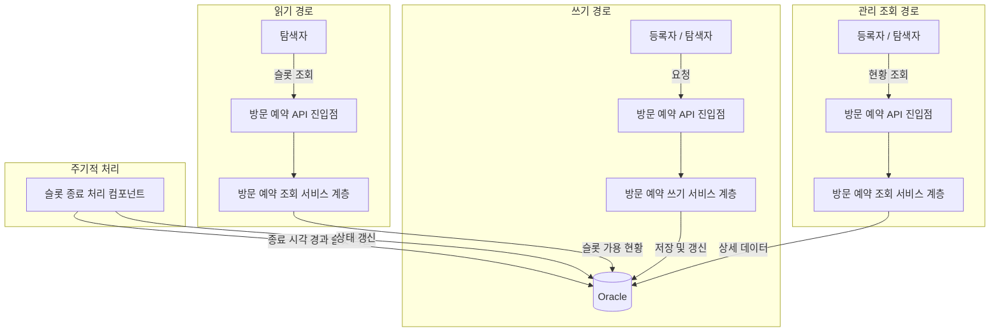
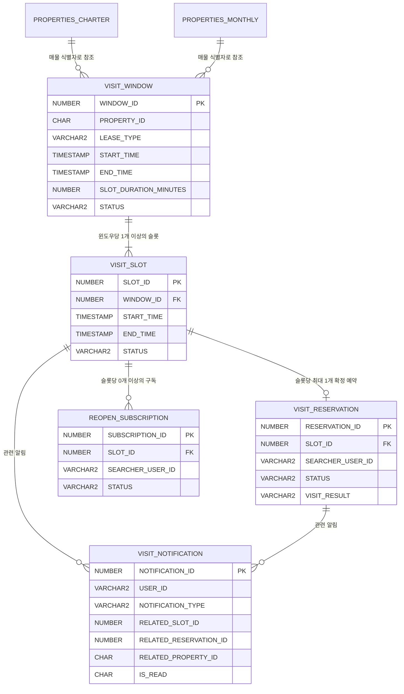
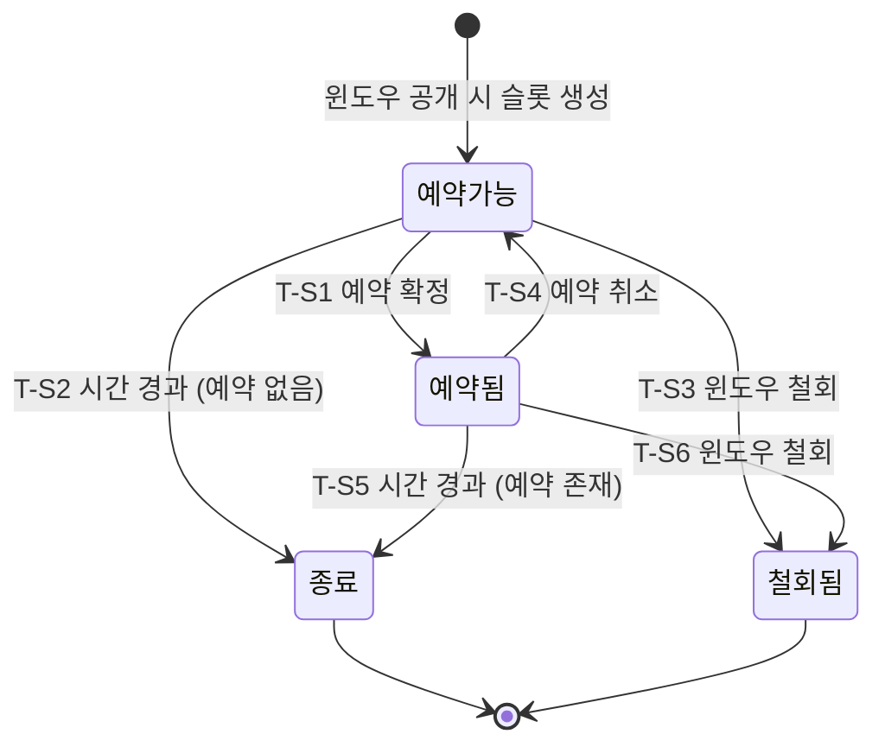
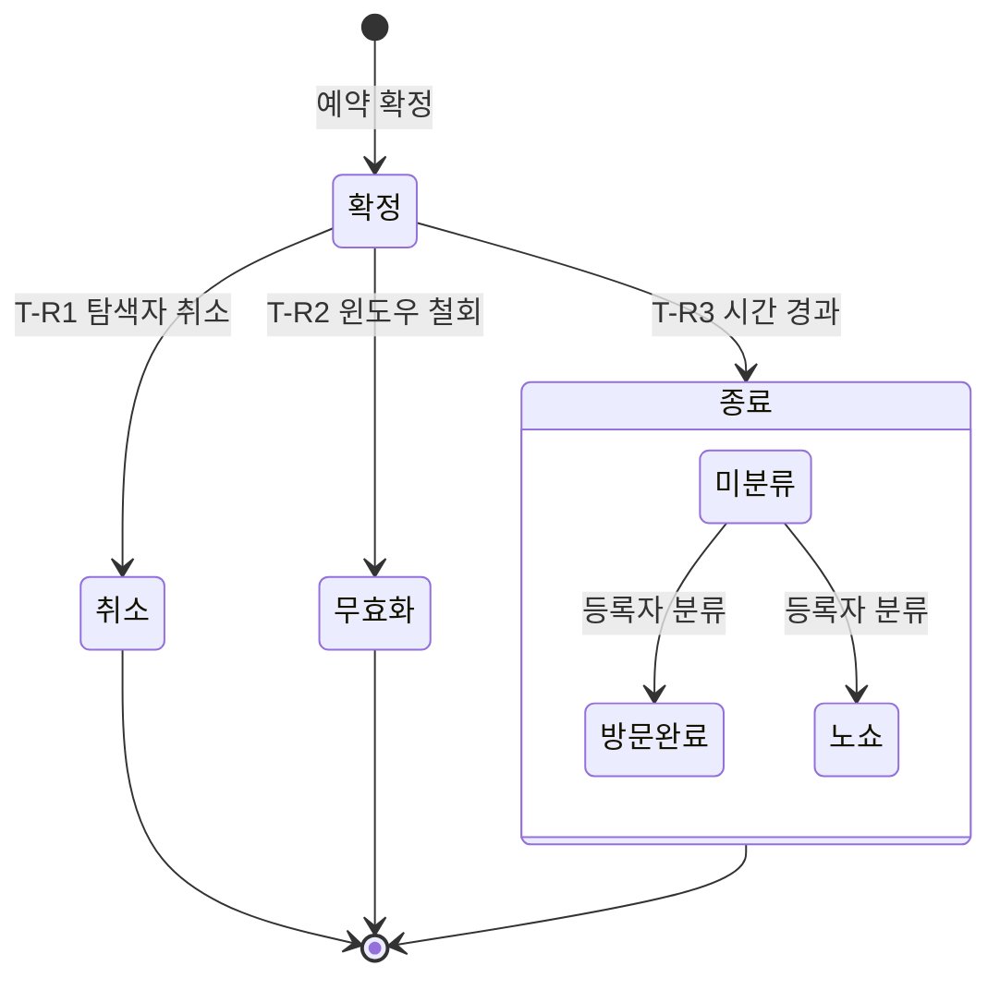

# Wherehouse 매물 방문 예약 기능 설계 명세서

프로젝트명: Wherehouse 매물 방문 예약 기능  
문서 버전: 1.2  
작성일: 2026년 5월 21일  
작성자: 정범진

---

## 목차

1. [개요](#1-개요)
2. [시스템 아키텍처](#2-시스템-아키텍처)
3. [일반 요구사항](#3-일반-요구사항)
4. [데이터 모델](#4-데이터-모델)
5. [슬롯 상태 머신](#5-슬롯-상태-머신)
6. [기능별 설계](#6-기능별-설계)
7. [API 명세](#7-api-명세)
8. [경합 구간 식별](#8-경합-구간-식별)
9. [에러 처리](#9-에러-처리)
10. [부록](#10-부록)

---

## 1. 개요

### 1.1 문서 목적

Wherehouse 매물 방문 예약 기능의 설계 명세서다. 기획서가 확정한 비즈니스 맥락과 요구사항 명세서의 8개 기능(F001–F008)을 받아, 다음 다섯 가지를 설계 수준에서 정의한다.

- 기존 아키텍처 편입 방식
- 영속 데이터 모델
- 슬롯 상태 머신
- 각 기능의 처리 흐름
- 에러 처리 체계

본 문서는 "무엇을, 왜"를 다룬다. "어떻게 구현하는가"는 구현 단계에서 결정한다. 특히 동시 예약 경합의 해결 기법은 본 문서의 범위 밖이며, 섹션 8에서 경합 구간의 위치와 요구조건만 식별한다.

### 1.2 범위

요구사항 명세서의 8개 기능 전체를 다룬다. 데이터 모델, 상태 머신, 처리 흐름, API 계약, 에러 코드를 정의한다. 다음은 범위에 포함하지 않는다.

- 동시 예약 경합의 해결 기법
- 화면 설계와 프론트엔드 구현
- 임대차 계약, 금전 결제, 실시간 메시징, 외부 캘린더 동기화

### 1.3 참조 문서

- 매물 방문 예약 기능 기획서
- 매물 방문 예약 기능 요구사항 명세서

---

## 2. 시스템 아키텍처

### 2.1 기존 시스템 편입 방식

**저장소 구조**

Wherehouse의 매물 추천 기능은 Oracle을 원본 저장소로, Redis를 읽기 저장소로 두는 쓰기-읽기 분리 구조를 쓴다. 방문 예약은 이 구조를 따르지 않는다. 윈도우·슬롯·예약·구독은 모두 Oracle에 저장하고, Oracle에서 직접 조회한다. 별도의 캐시 저장소를 두지 않는다.

이유는 두 기능의 읽기 특성이 다르기 때문이다. 매물 추천은 전체 매물 풀에서 다차원 조건(가격, 면적, 안전 점수)으로 필터링·정렬하는 읽기 집약적 기능이고, 배치 파이프라인으로 적재된 대량 데이터를 대상으로 한다. 캐시 저장소가 효과적인 환경이다. 반면 방문 슬롯 조회는 한 매물에 속한 소수의 슬롯을 조회하는 작업이고 결과 집합이 작다. Oracle 직접 조회만으로 응답 시간 목표가 달성되며, 캐시 저장소의 복잡성을 도입할 이유가 없다.

**기존 매물 관리와의 관계**

방문 예약은 기존 매물 관리 기능에 얹힌다. 윈도우와 슬롯은 매물 테이블(PROPERTIES_CHARTER, PROPERTIES_MONTHLY)의 매물 식별자를 참조하고, 등록자는 매물 레코드의 `REGISTERED_USER_ID`로 식별한다. 따라서 방문 예약의 대상이 될 수 있는 매물은 다음 조건을 모두 만족해야 한다.

- `DATA_SOURCE`가 `USER` 또는 `MERGED`
- `REGISTERED_USER_ID`가 존재
- `STATUS`가 `ACTIVE`

배치로만 적재된 매물(`DATA_SOURCE = BATCH`)은 인간 등록자가 없으므로 윈도우를 공개할 수 없다.

**인증 체계의 재사용**

방문 예약의 모든 쓰기 동작은 인증된 이용자만 수행할 수 있다. 기존 JWT 인증 체계를 재사용하며, 쿠키에서 추출한 JWT의 `userId` 클레임을 요청자 식별자로 사용한다. 방문 예약 경로에 신규 필터 체인을 추가한다.

**매물 상태 변경 연동**

매물의 상태가 `ACTIVE`에서 `COMPLETED` 또는 `DELETED`로 전이될 때, 그 매물에 활성 윈도우와 확정 예약이 남아 있을 수 있다. 매물이 유효하지 않은 상태에서 그 위의 예약이 살아 있는 것은 의미상 모순이다. 매물 상태가 비활성으로 전이되면 방문 예약 서비스 계층에 활성 윈도우 일괄 철회를 요청한다. 호출 방식은 구현 단계에서 확정한다.

### 2.2 전제 조건

다음 기존 시스템 구성 요소의 존재와 동작을 전제한다.

| 전제 | 기존 구성 요소 | 역할 |
|------|-------------|------|
| 매물 원본 저장소 | PROPERTIES_CHARTER, PROPERTIES_MONTHLY 테이블 | 매물 식별자, 등록자, 상태, 임대 유형의 원본 |
| 사용자 인증 | JWT 인증 필터, `userentity` 테이블 | 요청자 식별, 인증 상태 판별 |
| 사용자 프로필 | 회원 관리 시스템 | 예약 확정 시 공개되는 연락 경로의 원천 |
| 매물 식별자 생성 | `IdGenerator` | 매물의 MD5 해시 기반 식별자 생성 |

### 2.3 시스템 구성 요소

신규 추가·기존 수정 구성 요소의 상세 목록은 부록 10.2에 둔다. 본문에서는 다음 역할 명칭으로 지칭한다.

| 역할 지칭 | 설명 |
|-----------|------|
| 방문 예약 API 진입점 | 방문 예약 관련 HTTP 요청을 받아 서비스 계층에 위임한다 |
| 방문 예약 쓰기 서비스 계층 | 윈도우 공개, 슬롯 예약, 예약 취소 등 상태 변경 로직을 처리한다 |
| 방문 예약 조회 서비스 계층 | 슬롯 조회, 현황 조회 등 읽기 로직을 처리한다 |
| 슬롯 종료 처리 컴포넌트 | 종료 시각이 지난 슬롯을 주기적으로 종료 상태로 전환한다 |
| 알림 서비스 계층 | 예약 확정, 윈도우 철회, 슬롯 재개방 등의 사건을 당사자에게 통지한다 |

### 2.4 데이터 처리 흐름



**쓰기 경로.** 윈도우 공개, 슬롯 예약, 예약 취소 등 상태 변경 요청은 모두 Oracle에 저장된다. Oracle이 유일한 저장소이자 정합성 기준점이다.

**읽기 경로.** 매물 상세 화면에서 슬롯의 예약 가능 여부를 묻는 슬롯 조회 요청은 Oracle에서 직접 응답한다. 슬롯 조회와 예약 시도 사이에 다른 탐색자의 예약이 확정될 수 있고, 그 경우는 예약 시도 처리에서 거부 응답으로 반환한다.

**관리 조회 경로.** 등록자의 슬롯 관리 현황, 탐색자의 예약 현황 같은 당사자별 상세 조회(현황 조회)는 Oracle에서 직접 응답한다.

**주기적 처리.** 슬롯 종료 처리 컴포넌트가 1분 주기로 종료 시각이 지난 슬롯을 식별해 종료 상태로 전환한다.

### 2.5 통지 체계

방문 예약 과정에서 발생하는 비동기 통지는 다음 네 가지다.

| 사건 | 수신자 | 발생 시점 |
|------|--------|----------|
| 슬롯 예약 확정 | 등록자 | 슬롯 예약 처리에서 탐색자의 예약이 확정될 때 |
| 확정 예약 무효화 | 탐색자 | 윈도우 철회로 확정 예약이 무효화될 때 |
| 슬롯 재개방 | 구독 중인 탐색자 | 예약 취소로 슬롯이 다시 열릴 때 |
| 매물 상태 연동 철회 | 탐색자 | 매물 상태가 비활성으로 전이되어 윈도우가 일괄 철회될 때 |

통지는 Oracle의 `VISIT_NOTIFICATION` 테이블에 저장한다. 이용자는 알림 조회 경로로 미읽은 알림을 확인한다. 실시간 전달 방식(폴링, 서버 전송 이벤트 등)은 구현 단계에서 확정한다.

---

## 3. 일반 요구사항

### 3.1 인증 및 인가

방문 예약 경로는 기존 JWT 인증 필터를 재사용하며, 신규 필터 체인을 추가한다.

| 경로 | 역할 | 인증 | 비고 |
|------|------|------|------|
| GET /api/v1/visit/properties/{propertyId}/slots | 탐색자 (모든 이용자) | 불필요 (공개) | 슬롯 조회. 인증 정보가 있으면 추출하되, 없어도 접근을 허용한다 |
| POST /api/v1/visit/windows | 등록자 | 필수 | 윈도우 공개 |
| DELETE /api/v1/visit/windows/{windowId} | 등록자 | 필수 | 윈도우 철회 |
| POST /api/v1/visit/reservations | 탐색자 | 필수 | 슬롯 예약 |
| DELETE /api/v1/visit/reservations/{reservationId} | 탐색자 | 필수 | 예약 취소 |
| POST /api/v1/visit/slots/{slotId}/subscriptions | 탐색자 | 필수 | 재개방 알림 구독 신청 |
| DELETE /api/v1/visit/slots/{slotId}/subscriptions | 탐색자 | 필수 | 재개방 알림 구독 해제 |
| PATCH /api/v1/visit/reservations/{reservationId}/result | 등록자 | 필수 | 방문 결과 분류 |
| GET /api/v1/visit/searcher/reservations | 탐색자 | 필수 | 탐색자 예약 현황 조회 |
| GET /api/v1/visit/searcher/subscriptions | 탐색자 | 필수 | 탐색자 구독 현황 조회 |
| GET /api/v1/visit/registrant/properties/{propertyId}/slots | 등록자 | 필수 | 등록자 슬롯 현황 조회 |
| GET /api/v1/visit/notifications | 이용자 | 필수 | 알림 조회 |

인증 필수 경로에서 인증 정보가 없거나 유효하지 않으면, 기존 처리 방식과 동일하게 HTTP 401을 반환한다.

**인가 규칙.** 인증된 이용자도 자신의 자원에 대해서만 동작할 수 있다. 등록자는 자신이 등록한 매물의 윈도우와 슬롯만 관리할 수 있고, 탐색자는 자신의 예약과 구독만 취소·조회할 수 있다. 권한 위반은 HTTP 403으로 응답한다. 세부 규칙은 각 기능의 처리 흐름(섹션 6)에서 정의한다.

### 3.2 데이터 정합성

핵심 정합성 요구사항은 두 가지다.

**슬롯 배타적 점유.** 한 슬롯에 둘 이상의 확정 예약이 동시에 존재하는 사건은 0건이어야 한다. 이 불변식은 여러 탐색자의 동시 예약 요청 하에서도 유지되어야 한다. 이를 보장하는 동시성 제어 방식은 본 설계에서 결정하지 않으며, 섹션 8에서 경합 구간의 위치와 요구조건만 식별한다.

**결과 정합성.** 각 당사자에게 반환되는 결과(확정 또는 거부)는 Oracle에 확정된 실제 상태와 일치해야 한다. 확정되지 못한 탐색자가 확정 통지를 받는 일은 없어야 하며, 등록자의 관리 화면이 한 슬롯을 예약 가능과 예약됨으로 동시에 표시하는 일은 없어야 한다.

### 3.3 성능

예약 요청은 탐색자가 결과를 즉시 인지할 수 있는 시간 안에 확정 또는 거부 결과를 반환해야 한다. 슬롯 조회는 매물 상세 화면의 응답 시간에 포함되므로 기존 매물 상세 조회와 동등한 응답 시간을 유지한다. 슬롯 조회는 한 매물에 속한 소수의 슬롯을 대상으로 하며, Oracle 직접 조회로 목표를 달성한다. 구체적 목표 응답 시간과 동시 처리량 목표는 구현 단계의 측정 계획에서 확정한다.

### 3.4 시간대 정책

모든 시각은 KST(Asia/Seoul, UTC+09:00) 단일 시간대를 가정한다. Oracle `TIMESTAMP` 타입은 시간대 정보를 갖지 않으며, 모든 시각 컬럼에 KST 로컬 시각을 저장한다.

**API 입출력.** ISO 8601 시각 문자열은 시간대 표시가 없는 로컬 시각(KST)으로 해석한다. 예: `2026-06-15T10:00:00`은 KST 2026년 6월 15일 10시다. 시간대 표시를 포함한 입력(예: `2026-06-15T10:00:00+09:00`, `2026-06-15T10:00:00Z`)은 KST로 변환해 저장하고, 변환 결과가 의미 검증(예: 시작 시각이 현재 시각 이후)을 통과해야 한다.

**시간 비교의 기준 시각.** 유효성 검증, 슬롯 시작 시각 경과 판단, 종료 컴포넌트의 종료 대상 식별에 쓰는 "현재 시각"은 모두 데이터베이스의 `SYSTIMESTAMP`를 기준으로 한다. 애플리케이션 서버와 데이터베이스 서버가 동일 시간대에서 동기화된 상태로 운영됨을 전제한다.

---

## 4. 데이터 모델

### 4.1 Oracle 스키마

5개의 신규 테이블을 추가한다. 모든 테이블의 기본 키는 Oracle 시퀀스로 생성한다. `VISIT_SLOT`을 중심으로 공급 측(`VISIT_WINDOW`, `VISIT_SLOT`)과 수요 측(`VISIT_RESERVATION`, `REOPEN_SUBSCRIPTION`)이 연결되며, `VISIT_NOTIFICATION`은 그 과정에서 발생하는 비동기 통지를 저장한다.

#### 4.1.1 VISIT_WINDOW

방문 예약의 공급 측을 형성한다. 등록자가 "이 시간대에 방문을 받겠다"고 공개하는 행위를 저장한다. 한 매물에 여러 윈도우가 존재할 수 있다. 윈도우 자체는 예약 대상이 아니다. 공개된 윈도우는 고정 길이 슬롯으로 분할되고, 예약 대상이 되는 것은 그 슬롯이다.

| 컬럼명 | 데이터 타입 | 제약조건 | 설명 |
|--------|------------|---------|------|
| WINDOW_ID | NUMBER(19) | PK, SEQ_VISIT_WINDOW | 윈도우 식별자 |
| PROPERTY_ID | CHAR(32) | NOT NULL | 대상 매물 식별자 (`PROPERTIES_CHARTER` 또는 `PROPERTIES_MONTHLY`의 `PROPERTY_ID` 참조) |
| LEASE_TYPE | VARCHAR2(10) | NOT NULL, CHECK IN ('CHARTER','MONTHLY') | 임대 유형. 대상 매물이 속한 테이블을 식별한다 |
| START_TIME | TIMESTAMP | NOT NULL | 윈도우 시작 시각 |
| END_TIME | TIMESTAMP | NOT NULL, CHECK (END_TIME > START_TIME) | 윈도우 종료 시각 |
| SLOT_DURATION_MINUTES | NUMBER(3) | NOT NULL, DEFAULT 30 | 슬롯 분할 단위 (분) |
| STATUS | VARCHAR2(10) | NOT NULL, DEFAULT 'ACTIVE', CHECK IN ('ACTIVE','WITHDRAWN') | 윈도우 상태 |
| CREATED_AT | TIMESTAMP | NOT NULL | 생성 시각 |
| WITHDRAWN_AT | TIMESTAMP | | 철회 시각. 상태가 `WITHDRAWN`일 때만 값이 존재한다 |

**매물 식별 방식.** `PROPERTY_ID`와 `LEASE_TYPE`을 함께 저장하는 이유는, 같은 MD5 해시 식별자가 전세 테이블과 월세 테이블에 각각 존재할 수 있기 때문이다. `(PROPERTY_ID, LEASE_TYPE)` 쌍이 매물을 유일하게 식별한다. 등록자 식별자는 매물 테이블의 `REGISTERED_USER_ID`를 조인으로 획득한다.

#### 4.1.2 VISIT_SLOT

윈도우를 분할한 고정 길이 슬롯을 저장한다. 예약의 대상이 되는 단위 자원이자 본 데이터 모델의 중심이다. 예약·구독·통지가 모두 슬롯을 기준으로 연결되며, 슬롯의 상태(섹션 5)가 예약 가능 여부의 판정 기준이 된다. 슬롯은 윈도우 공개(섹션 6.1) 시점에 일괄 생성된다.

| 컬럼명 | 데이터 타입 | 제약조건 | 설명 |
|--------|------------|---------|------|
| SLOT_ID | NUMBER(19) | PK, SEQ_VISIT_SLOT | 슬롯 식별자 |
| WINDOW_ID | NUMBER(19) | NOT NULL, FK → VISIT_WINDOW(WINDOW_ID) | 소속 윈도우 식별자. 매물·임대 유형·등록자 정보는 윈도우 테이블에서 조인으로 얻는다 |
| START_TIME | TIMESTAMP | NOT NULL | 슬롯 시작 시각 |
| END_TIME | TIMESTAMP | NOT NULL, CHECK (END_TIME > START_TIME) | 슬롯 종료 시각 |
| STATUS | VARCHAR2(15) | NOT NULL, DEFAULT 'AVAILABLE', CHECK IN ('AVAILABLE','RESERVED','CLOSED','WITHDRAWN') | 슬롯 상태. 섹션 5에서 정의한다 |
| CREATED_AT | TIMESTAMP | NOT NULL | 생성 시각 |

**윈도우 내 시작 시각 유일 제약.** 컬럼 표의 단일 컬럼 제약 외에, `(WINDOW_ID, START_TIME)` 조합에 데이터베이스 차원의 유일 제약을 건다.

```sql
ALTER TABLE VISIT_SLOT
    ADD CONSTRAINT UQ_VISIT_SLOT_WINDOW_START UNIQUE (WINDOW_ID, START_TIME);
```

윈도우 공개 시 시스템이 윈도우를 분할해 슬롯을 자동 생성한다. 코드 버그나 동시 호출로 같은 윈도우에 같은 시작 시각의 슬롯이 두 번 INSERT 되면, 한 시간대에 두 슬롯이 존재해 예약이 한쪽에만 몰리는 식의 데이터 일관성 붕괴가 발생할 수 있다. 본 제약은 그 INSERT를 데이터베이스에서 거부한다. 4.1.3의 부분 유일 제약(슬롯당 확정 예약 1건)과 같은 부류로, 애플리케이션 로직 외에 데이터베이스가 한 번 더 막는 무결성 백스톱이다.

#### 4.1.3 VISIT_RESERVATION

탐색자가 슬롯을 예약한 결과를 저장한다. 한 행은 한 탐색자가 한 슬롯에 대해 가진 한 예약이며, 예약은 확정·취소·무효화·종료 중 한 상태를 가진다. 한 슬롯은 예약 한 건보다 오래 존속한다. 예약이 취소되면 슬롯은 다시 예약 가능 상태가 되어 새 예약을 받을 수 있으므로, 한 슬롯에는 시간에 걸쳐 여러 예약 행이 누적될 수 있다. 그중 확정(`CONFIRMED`) 상태의 예약은 어느 시점에나 최대 한 건이다.

| 컬럼명 | 데이터 타입 | 제약조건 | 설명 |
|--------|------------|---------|------|
| RESERVATION_ID | NUMBER(19) | PK, SEQ_VISIT_RESERVATION | 예약 식별자 |
| SLOT_ID | NUMBER(19) | NOT NULL, FK → VISIT_SLOT(SLOT_ID) | 대상 슬롯 식별자. 매물·임대 유형 정보는 슬롯의 윈도우를 조인해 얻는다 |
| SEARCHER_USER_ID | VARCHAR2(100) | NOT NULL | 예약한 탐색자의 식별자 |
| STATUS | VARCHAR2(15) | NOT NULL, DEFAULT 'CONFIRMED', CHECK IN ('CONFIRMED','CANCELLED','INVALIDATED','COMPLETED') | 예약 상태. 섹션 5.3에서 정의한다 |
| CONFIRMED_AT | TIMESTAMP | NOT NULL | 확정 시각 |
| CANCELLED_AT | TIMESTAMP | | 취소 시각 |
| INVALIDATED_AT | TIMESTAMP | | 무효화 시각 |
| VISIT_RESULT | VARCHAR2(10) | CHECK IN ('VISITED','NO_SHOW') 또는 NULL | 방문 결과. `STATUS`가 `COMPLETED`일 때만 의미를 가진다 |
| RESULT_CLASSIFIED_AT | TIMESTAMP | | 결과 분류 시각 |

**STATUS와 VISIT_RESULT 분리.** 예약의 생명주기 상태(`STATUS`)와 방문 결과(`VISIT_RESULT`)는 차원이 다르다. `STATUS`는 예약의 현재 단계, `VISIT_RESULT`는 종료된 예약에 대한 사후 분류다. 둘을 하나의 컬럼에 합치면 상태 전이 규칙이 복잡해진다.

**부분 유일 제약 — 핵심 무결성 백스톱.** `SLOT_ID` 컬럼에 대해 `STATUS='CONFIRMED'`인 행에 한해 조건부 유일 제약을 설정한다. Oracle에서는 Function-Based Unique Index로 구현한다.

```sql
CREATE UNIQUE INDEX UQ_VISIT_RESERVATION_CONFIRMED_SLOT
    ON VISIT_RESERVATION (CASE WHEN STATUS = 'CONFIRMED' THEN SLOT_ID END);
```

`STATUS`가 `CONFIRMED`인 행만 인덱스 키를 갖고, `CANCELLED`·`INVALIDATED`·`COMPLETED` 행은 키가 `NULL`이 되어 제약에서 빠진다. 따라서 한 슬롯에 여러 예약 행이 누적되어도, 어느 시점에나 `CONFIRMED` 행은 슬롯당 최대 1건임이 데이터베이스 차원에서 보장된다.

이 제약은 동시성 제어 기법과 직교한다. 섹션 8.4는 동시성 제어의 선택을 구현 단계로 위임하지만, 어떤 제어 기법을 선택해도 그것이 통과시킨 INSERT는 데이터베이스까지 도달한다. 본 제약은 제어 기법과 독립적으로 작동하는 마지막 무결성 방어선이며, 섹션 3.2와 섹션 8.2의 불변식을 데이터베이스 차원에서 강제한다. 기존 매물 등록(섹션 8.3 비교 표 참조)이 PK 유일 제약을 방어선으로 가졌듯이, 슬롯 예약도 본 제약을 데이터 모델의 일부로 확보한다.

#### 4.1.4 REOPEN_SUBSCRIPTION

이미 다른 탐색자에게 예약된 슬롯이 취소로 다시 열릴 때 통지를 받기 위한 신청을 저장한다. 구독은 예약이 아니다. 어떤 슬롯도 보장하지 않고, 우선권을 부여하는 대기열도 아니다. 슬롯이 다시 열리면 모든 구독자가 통지를 받고 슬롯 예약에서 동등하게 경쟁한다. 슬롯을 놓친 탐색자가 재개방 여부를 반복 조회하지 않도록 수동 확인을 통지로 대체하는 것이 본 테이블의 목적이다.

| 컬럼명 | 데이터 타입 | 제약조건 | 설명 |
|--------|------------|---------|------|
| SUBSCRIPTION_ID | NUMBER(19) | PK, SEQ_REOPEN_SUBSCRIPTION | 구독 식별자 |
| SLOT_ID | NUMBER(19) | NOT NULL, FK → VISIT_SLOT(SLOT_ID) | 대상 슬롯 식별자 |
| SEARCHER_USER_ID | VARCHAR2(100) | NOT NULL | 구독자 식별자 |
| STATUS | VARCHAR2(15) | NOT NULL, DEFAULT 'ACTIVE', CHECK IN ('ACTIVE','FULFILLED','CANCELLED','EXPIRED') | 구독 상태 |
| SUBSCRIBED_AT | TIMESTAMP | NOT NULL | 구독 시각 |
| TERMINATED_AT | TIMESTAMP | | 종료 시각 |
| TERMINATION_REASON | VARCHAR2(20) | | 종료 사유 (`SLOT_CLOSED`, `RESERVED`, `USER_CANCELLED`) |

**구독 상태**

- `ACTIVE`: 구독 중. 슬롯 재개방 시 알림을 수신한다.
- `FULFILLED`: 구독자가 해당 슬롯을 다시 예약하는 데 성공해 구독이 종료되었다.
- `CANCELLED`: 구독자가 직접 구독을 해제했다.
- `EXPIRED`: 슬롯이 재개방 없이 종료 상태에 도달해 구독이 폐기되었다.

**유일 제약.** `(SLOT_ID, SEARCHER_USER_ID)` 조합에 조건부 유일 제약을 설정한다. 한 탐색자가 같은 슬롯에 활성 구독을 중복으로 가지는 것을 막는다. 종료된 구독(`STATUS`가 `ACTIVE`가 아닌 행)은 이 제약에서 빠진다.

#### 4.1.5 VISIT_NOTIFICATION

방문 예약 과정에서 발생하는 비동기 통지를 저장한다. 한 당사자의 행위가 다른 당사자에게 영향을 줄 때(예약 확정, 윈도우 철회에 의한 무효화, 슬롯 재개방 등) 영향을 받는 당사자에게 전달할 통지가 이 테이블에 기록된다. 하나의 사건이 여러 수신자에게 영향을 주면 수신자마다 한 행이 생성된다. 어떤 상태 전이의 판정에도 사용되지 않는 단방향 출력 기록이며, 실시간 전달 방식은 설계 범위 밖이다(섹션 2.5).

| 컬럼명 | 데이터 타입 | 제약조건 | 설명 |
|--------|------------|---------|------|
| NOTIFICATION_ID | NUMBER(19) | PK, SEQ_VISIT_NOTIFICATION | 알림 식별자 |
| USER_ID | VARCHAR2(100) | NOT NULL | 수신자 식별자 |
| NOTIFICATION_TYPE | VARCHAR2(30) | NOT NULL | 알림 유형 |
| RELATED_SLOT_ID | NUMBER(19) | | 관련 슬롯 식별자 |
| RELATED_RESERVATION_ID | NUMBER(19) | | 관련 예약 식별자 |
| RELATED_PROPERTY_ID | CHAR(32) | | 관련 매물 식별자 |
| MESSAGE | VARCHAR2(500) | NOT NULL | 알림 메시지 |
| IS_READ | CHAR(1) | NOT NULL, DEFAULT 'N', CHECK IN ('Y','N') | 읽음 여부 |
| CREATED_AT | TIMESTAMP | NOT NULL | 생성 시각 |

**알림 유형**

| NOTIFICATION_TYPE | 의미 | 발생 맥락 |
|-------------------|------|----------|
| SLOT_RESERVED | 등록자의 슬롯이 예약됨 | 슬롯 예약 확정 |
| RESERVATION_INVALIDATED | 탐색자의 예약이 윈도우 철회로 무효화됨 | 윈도우 철회 |
| SLOT_REOPENED | 구독 중인 슬롯이 예약 취소로 다시 열림 | 예약 취소, 재개방 알림 구독 |
| PROPERTY_DEACTIVATED | 매물 비활성화로 예약이 무효화됨 | 매물 상태 연동 |

**행 생성 규칙.** 일반 원칙은 "한 사건이 여러 수신자에게 영향을 주면 수신자마다 한 행이 생성된다"이다.

`PROPERTY_DEACTIVATED`는 부연 설명이 필요하다. 한 매물이 비활성화되면 그 매물의 여러 슬롯과 그 슬롯에 묶인 여러 확정 예약이 한꺼번에 무효화될 수 있기 때문이다. 다만 한 탐색자는 같은 매물에 활성 예약을 1건만 가질 수 있다(슬롯 예약 처리 흐름의 동일 매물 중복 예약 검증). 따라서 한 매물 비활성화 사건이 한 탐색자에게 발생시키는 무효화 알림은 정확히 1건이다.

이 사건은 무효화된 확정 예약의 수만큼 행으로 분할되어 생성된다. 각 행에서 RELATED 컬럼은 다음과 같이 채워진다.

- `RELATED_RESERVATION_ID` = 그 탐색자의 무효화된 예약 한 건
- `RELATED_SLOT_ID` = 그 예약이 점유하던 슬롯
- `RELATED_PROPERTY_ID` = 비활성화된 매물

### 4.1.6 인덱스 명세

동시성 제어 기법과 별개로, 핵심 처리 경로의 조회 성능을 보장하기 위해 다음 인덱스를 데이터 모델의 일부로 정의한다. 동시성 제어가 락 보유 시간을 짧게 유지하려면 그 안에서 수행되는 조회가 인덱스 기반이어야 한다.

#### VISIT_WINDOW

| 인덱스명 | 컬럼 | 용도 |
|---------|------|------|
| PK_VISIT_WINDOW | WINDOW_ID | 기본 키 |
| IX_VISIT_WINDOW_PROPERTY | (PROPERTY_ID, LEASE_TYPE, STATUS) | 한 매물의 활성 윈도우 조회 |

**IX_VISIT_WINDOW_PROPERTY.**

매물 한 건의 활성 윈도우 목록은 두 방향에서 모두 필요하다. 등록자는 새 윈도우를 공개할 때 기존 활성 윈도우와의 시간 겹침을 검증해야 하고, 탐색자는 슬롯을 조회할 때 그 매물의 활성 윈도우를 먼저 찾아 거기 속한 슬롯을 가져와야 한다. 본 인덱스는 두 방향 모두에서 "한 매물의 활성 윈도우"를 빠르게 식별한다.

- 윈도우 공개(섹션 6.1) 시 같은 매물의 기존 활성 윈도우와 시간 겹침 검증
- 슬롯 조회(섹션 6.3) 시 매물의 활성 윈도우를 먼저 찾고 그 윈도우의 슬롯을 가져오는 첫 단계

#### VISIT_SLOT

| 인덱스명 | 컬럼 | 용도 |
|---------|------|------|
| PK_VISIT_SLOT | SLOT_ID | 기본 키 |
| UQ_VISIT_SLOT_WINDOW_START | (WINDOW_ID, START_TIME) | 윈도우 내 슬롯 중복 방지 + 윈도우에 속한 슬롯 조회 |
| IX_VISIT_SLOT_STATUS_END | (STATUS, END_TIME) | 종료 시각이 지난 슬롯 식별 |

**UQ_VISIT_SLOT_WINDOW_START.**

등록자가 윈도우를 공개하면 시스템이 그 윈도우를 슬롯 단위로 자동 분할해 생성한다(섹션 6.1). 본 인덱스는 이 흐름에서 두 역할을 동시에 한다.

- 무결성: 같은 윈도우 안에서 같은 시작 시각의 슬롯이 두 번 INSERT 되는 것을 차단(섹션 4.1.2)
- 조회: 윈도우 식별자로 그 윈도우의 슬롯 목록을 시작 시각 순으로 조회. 윈도우 철회(섹션 6.2) 시 소속 슬롯 일괄 식별, 슬롯 조회에서 윈도우별 목록 표시에 사용

**IX_VISIT_SLOT_STATUS_END.**

슬롯은 종료 시각이 지나면 자동으로 종료 상태로 전환되어야 한다. 슬롯 종료 처리 컴포넌트(섹션 6.7)가 1분 주기로 종료 대상 슬롯을 찾는다. 본 인덱스는 그 식별 쿼리를 받친다.

- 조회 조건: 상태가 AVAILABLE 또는 RESERVED이면서 종료 시각이 현재 시각 이전인 슬롯

#### VISIT_RESERVATION

| 인덱스명 | 컬럼 | 용도 |
|---------|------|------|
| PK_VISIT_RESERVATION | RESERVATION_ID | 기본 키 |
| UQ_VISIT_RESERVATION_CONFIRMED_SLOT | CASE WHEN STATUS='CONFIRMED' THEN SLOT_ID END | 슬롯당 확정 예약 1건 강제 |
| IX_VISIT_RESERVATION_SEARCHER | (SEARCHER_USER_ID, STATUS) | 한 탐색자의 예약 조회 |
| IX_VISIT_RESERVATION_SLOT | (SLOT_ID, STATUS) | 한 슬롯의 예약 조회 |

**UQ_VISIT_RESERVATION_CONFIRMED_SLOT.**

한 슬롯은 한 시간대를 점유하므로 확정 예약은 최대 1건이어야 한다(섹션 3.2). 그러나 여러 탐색자가 같은 슬롯에 동시에 예약을 시도하는 상황이 발생할 수 있다. 본 제약은 이 정합성을 데이터베이스 차원에서 강제한다.

- 무엇을 강제하나: 한 슬롯에 확정 예약을 두 건 이상 만드는 시도를 데이터베이스가 차단한다.
- 어떻게: 상태가 `CONFIRMED`인 행에 한해 `SLOT_ID` 유일성을 강제하는 부분 유일 제약(섹션 4.1.3).
- 위계: 동시성 제어 기법과 별개로 작동한다. 어떤 동시성 제어를 통과한 INSERT도 본 제약이 마지막에 한 번 더 검증한다.

**IX_VISIT_RESERVATION_SEARCHER.**

탐색자가 슬롯을 예약하려 할 때 시스템은 그 탐색자의 기존 활성 예약을 검사한다(동일 매물 중복 예약, 시간 겹침 차단). 탐색자는 자신의 예약 현황도 화면에서 확인한다. 본 인덱스는 "한 탐색자의 예약 행"을 빠르게 좁히는 진입점이다.

- 슬롯 예약(섹션 6.4) 시 동일 매물 중복 예약 검증 — 한 탐색자가 같은 매물에 활성 예약을 1건만 가질 수 있다는 규칙(같은 매물의 다른 시간대 슬롯도 차단). 요청자의 활성 예약 후보를 인덱스로 좁힌 뒤 매물 식별자 비교
- 슬롯 예약 시 시간 겹침 검증 — 매물에 무관하게 요청자의 활성 예약 중 요청 슬롯과 시간이 겹치는 것이 있는지 비교
- 탐색자 예약 현황 조회(섹션 6.8) — 그 탐색자의 모든 예약을 상태별로 분류해 반환

**IX_VISIT_RESERVATION_SLOT.**

한 슬롯에 묶인 예약을 시스템이 한꺼번에 처리해야 하는 경로가 있다. 윈도우 철회 시 슬롯들의 확정 예약 무효화, 슬롯 종료 시 연결 예약의 상태 전이 등이 그것이다. 본 인덱스는 "슬롯 → 예약" 방향 조회를 빠르게 한다.

- 핵심 용도: 윈도우 철회(섹션 6.2)에서 윈도우 소속 슬롯들의 확정 예약을 일괄 식별해 무효화하는 처리
- 다른 활용처: 슬롯 종료 시 연결 예약 전이, 등록자 슬롯 현황 조회

#### REOPEN_SUBSCRIPTION

| 인덱스명 | 컬럼 | 용도 |
|---------|------|------|
| PK_REOPEN_SUBSCRIPTION | SUBSCRIPTION_ID | 기본 키 |
| UQ_REOPEN_SUBSCRIPTION_ACTIVE | CASE WHEN STATUS='ACTIVE' THEN (SLOT_ID, SEARCHER_USER_ID) END | 한 탐색자의 슬롯당 활성 구독 중복 방지 |
| IX_REOPEN_SUBSCRIPTION_SLOT | (SLOT_ID, STATUS) | 슬롯의 활성 구독자 조회 |
| IX_REOPEN_SUBSCRIPTION_SEARCHER | (SEARCHER_USER_ID, STATUS) | 탐색자의 구독 현황 조회 |

**UQ_REOPEN_SUBSCRIPTION_ACTIVE.**

한 탐색자가 같은 슬롯에 구독을 등록하고 해제하기를 반복할 수 있다. 시간에 걸쳐 종료 구독 행이 누적되지만, 동시에 활성인 구독은 슬롯당 1건이어야 한다. 본 제약은 이 비대칭 규칙을 데이터베이스 차원에서 강제한다.

- 무엇을 강제하나: 한 탐색자가 같은 슬롯에 활성 구독을 동시에 1건만 가질 수 있다.
- 어떻게: 상태가 `ACTIVE`인 행에만 `(SLOT_ID, SEARCHER_USER_ID)` 유일성을 적용하는 부분 유일 제약(섹션 4.1.4).
- 종료 행 처리: `CANCELLED`·`FULFILLED`·`EXPIRED` 상태의 행은 제약 대상이 아니다. 같은 탐색자-슬롯 쌍에 시간에 걸쳐 종료 행이 누적될 수 있다(구독 → 해제 → 재구독 → 해제를 반복하는 흐름).

**IX_REOPEN_SUBSCRIPTION_SLOT.**

이미 예약된 슬롯에 대해 다른 탐색자들이 재개방 알림을 받기 위해 구독을 등록한다. 예약이 취소되어 그 슬롯이 다시 열리면, 그 슬롯에 활성 구독을 가진 모든 탐색자에게 재개방 알림을 보내야 한다(섹션 6.5). 본 인덱스는 "한 슬롯의 활성 구독자"를 빠르게 식별한다.

- `STATUS`가 두 번째 컬럼이라 인덱스 단계에서 활성 구독만 추려져 종료 구독은 알림 대상에서 자연스럽게 제외된다.

**IX_REOPEN_SUBSCRIPTION_SEARCHER.**

탐색자는 자신이 등록한 구독 현황을 화면에서 확인한다(섹션 6.8). 본 인덱스는 "한 탐색자의 구독 행"을 상태별로 빠르게 좁힌다.

#### VISIT_NOTIFICATION

| 인덱스명 | 컬럼 | 용도 |
|---------|------|------|
| PK_VISIT_NOTIFICATION | NOTIFICATION_ID | 기본 키 |
| IX_VISIT_NOTIFICATION_USER | (USER_ID, IS_READ, CREATED_AT DESC) | 이용자의 미읽음 알림을 최신순으로 조회 |

**IX_VISIT_NOTIFICATION_USER.**

이용자는 자신에게 전달된 알림을 미읽음부터 최신순으로 확인한다(섹션 7.12). 본 인덱스는 알림 조회 API의 정렬과 필터링을 한 단계에서 받친다.

- `USER_ID`로 본인 알림을 좁힘
- `IS_READ`로 미읽음을 우선 정렬
- `CREATED_AT DESC`로 최신순 정렬

#### 슬롯 예약 핵심 경로와 인덱스의 대응

슬롯 예약 처리 흐름은 다음 순서로 진행된다. 슬롯의 매물·등록자 정보가 정상 정규화로 매물 테이블에 있으므로 슬롯 → 윈도우 → 매물 3단 조회가 필요하다. 모든 조회가 PK 기반이므로, 어떤 동시성 제어 기법을 선택해도 임계 구간이 짧게 유지된다.

1. 슬롯 단건 조회 → `PK_VISIT_SLOT`
2. 슬롯의 `WINDOW_ID`로 윈도우 단건 조회 → `PK_VISIT_WINDOW` (매물 식별자·임대 유형 획득)
3. 윈도우의 `PROPERTY_ID`·`LEASE_TYPE`으로 매물 단건 조회 → 매물 테이블의 PK (등록자 식별자 획득)
4. 자기 매물 검증 → 매물의 `REGISTERED_USER_ID`와 요청자 비교
5. 동일 매물 중복 예약 검증 → `IX_VISIT_RESERVATION_SEARCHER`로 요청자의 활성 예약 후보 좁히고, 각 예약의 슬롯 → 윈도우 조인으로 매물 식별자 비교
6. 시간 겹침 검증 → 5단계와 같은 인덱스의 범위에서 슬롯 시간 비교
7. 상태 전이와 예약 INSERT → PK 기반 갱신과 `UQ_VISIT_RESERVATION_CONFIRMED_SLOT` 무결성 검증

### 4.2 엔티티 관계



---

## 5. 슬롯 상태 머신

### 5.1 슬롯 상태 정의

| 상태 | 값 | 의미 |
|------|------|------|
| 예약 가능 | AVAILABLE | 슬롯이 생성되어 탐색자의 예약을 받을 수 있는 상태. 윈도우 공개 시 초기 상태 |
| 예약됨 | RESERVED | 한 탐색자에게 확정되어 다른 탐색자가 예약할 수 없는 상태 |
| 종료 | CLOSED | 슬롯의 예정 시간이 지나 더 이상 예약·변경 대상이 아닌 상태. 구체적 결과는 연결된 예약의 `VISIT_RESULT`로 구분된다 |
| 철회됨 | WITHDRAWN | 등록자의 윈도우 철회로 슬롯이 비활성화된 상태 |

**종료 상태의 세부 구분.** 슬롯의 `STATUS`가 `CLOSED`일 때, 연결된 예약의 유무와 `VISIT_RESULT` 값에 따라 다음과 같이 해석한다.

| 조건 | 해석 |
|------|------|
| 확정 예약 존재, VISIT_RESULT = VISITED | 방문 완료 |
| 확정 예약 존재, VISIT_RESULT = NO_SHOW | 노쇼 |
| 확정 예약 존재, VISIT_RESULT = NULL | 종료 (미분류) |
| 확정 예약이 존재하지 않음 | 예약 없는 종료 |

이 세부 구분은 슬롯 `STATUS`에 추가 값을 두지 않고, `VISIT_RESERVATION`의 존재 여부와 `VISIT_RESULT` 값에서 파생된다. 슬롯의 생명주기와 방문 결과를 별도 차원으로 분리해 상태 전이 규칙을 단순하게 유지한다.

### 5.2 슬롯 상태 전이 규칙

| 전이 | 출발 상태 | 도착 상태 | 촉발 기능 | 조건 |
|------|----------|----------|----------|------|
| T-S1 | 예약 가능 | 예약됨 | 슬롯 예약 | 탐색자의 예약 요청이 확정될 때 |
| T-S2 | 예약 가능 | 종료 | 슬롯 종료 | 슬롯 종료 시각이 경과했을 때 (예약 없이) |
| T-S3 | 예약 가능 | 철회됨 | 윈도우 철회 | 등록자가 소속 윈도우를 철회할 때 |
| T-S4 | 예약됨 | 예약 가능 | 예약 취소 | 탐색자가 확정 예약을 취소할 때 |
| T-S5 | 예약됨 | 종료 | 슬롯 종료 | 슬롯 종료 시각이 경과했을 때 (확정 예약 존재) |
| T-S6 | 예약됨 | 철회됨 | 윈도우 철회 | 등록자가 소속 윈도우를 철회할 때 (확정 예약 무효화 동반) |

위 표에 없는 전이는 모두 금지된다. 종료와 철회는 최종 상태이며, 다른 상태로의 전이는 불가능하다.

### 5.3 예약 상태 정의

| 상태 | 값 | 의미 |
|------|------|------|
| 확정 | CONFIRMED | 예약이 확정되어 활성 상태. 슬롯 방문 시간에 탐색자가 방문할 것으로 기대된다 |
| 취소 | CANCELLED | 탐색자가 직접 예약을 취소한 상태 |
| 무효화 | INVALIDATED | 등록자의 윈도우 철회로 강제 무효화된 상태 |
| 종료 | COMPLETED | 슬롯의 예정 시간이 지나 예약이 종료된 상태. 방문 결과는 `VISIT_RESULT`로 구분된다 |

### 5.4 예약 상태 전이 규칙

| 전이 | 출발 상태 | 도착 상태 | 촉발 기능 | 조건 |
|------|----------|----------|----------|------|
| T-R1 | 확정 | 취소 | 예약 취소 | 탐색자가 슬롯 시작 시간 이전에 취소할 때 |
| T-R2 | 확정 | 무효화 | 윈도우 철회 | 등록자의 윈도우 철회로 무효화될 때 |
| T-R3 | 확정 | 종료 | 슬롯 종료 | 슬롯 종료 시각이 경과했을 때 |

취소·무효화·종료는 모두 최종 상태다. 종료 상태의 예약에 한해 등록자가 `VISIT_RESULT`를 `NULL`에서 `VISITED` 또는 `NO_SHOW`로 분류할 수 있지만, 이는 상태 전이가 아니라 방문 결과 속성의 갱신이다.

### 5.5 슬롯-예약 공동 불변식

슬롯 상태(섹션 5.1)와 예약 상태(섹션 5.3)는 차원이 다른 상태 머신이며 각각 독립적으로 전이된다. 그러나 둘 사이에는 임의 조합이 허용되지 않는 의존 관계가 있다. 다음 공동 불변식이 어느 시점에나 유지되어야 한다. 이 표는 섹션 6의 처리 흐름에서 "원자적 실행 단위"가 무엇을 보장해야 하는지를 구체적으로 규정한다.

| 불변식 | 슬롯 상태 | 그 슬롯에 연결된 예약 상태의 허용 분포 |
|--------|----------|----------------------------------|
| I-1 | AVAILABLE | `CONFIRMED` 예약 0건. `CANCELLED`/`INVALIDATED`/`COMPLETED`는 0건 이상(이전 생명주기 누적) |
| I-2 | RESERVED | `CONFIRMED` 예약 정확히 1건. 그 외 상태는 0건 이상 |
| I-3 | CLOSED | `CONFIRMED` 예약 0건. 한때 확정 예약이 있었다면 그 행은 `COMPLETED` |
| I-4 | WITHDRAWN | `CONFIRMED` 예약 0건. 한때 확정 예약이 있었다면 그 행은 `INVALIDATED` |

**강제 메커니즘.** I-2의 "정확히 1건"은 데이터베이스 차원에서 강제된다. 섹션 4.1.3의 부분 유일 제약(`UQ_VISIT_RESERVATION_CONFIRMED_SLOT`)이 한 슬롯에 `CONFIRMED` 행을 2건 이상 만들려는 시도를 거부한다. I-1·I-3·I-4의 "0건"은 처리 흐름의 원자적 실행 단위가 강제한다. 예약 취소(T-S4와 T-R1 묶음), 슬롯 종료(T-S5와 T-R3 묶음), 윈도우 철회(T-S6와 T-R2 묶음)는 슬롯 전이와 예약 전이를 한 트랜잭션 안에서 함께 수행하므로, 슬롯이 AVAILABLE/CLOSED/WITHDRAWN으로 전이된 시점에 예약은 이미 적절한 최종 상태로 전이되어 있다.

**중간 상태의 가시성.** 위 트랜잭션이 커밋되기 전에 다른 트랜잭션이 슬롯과 예약을 따로 조회하면, 두 행이 불변식을 위반하는 조합으로 보일 수 있다. 이 가시성 문제는 데이터베이스의 READ COMMITTED 격리 수준에 위임한다. 한 트랜잭션이 커밋된 직후의 다른 트랜잭션은 위 표의 어느 한 행에 해당하는 일관된 조합만 본다.

### 5.6 상태 다이어그램

**슬롯 상태 다이어그램**



**예약 상태 다이어그램**



---

## 6. 기능별 설계

각 기능의 처리 흐름을 단계별로 정의한다. 상태 명칭(예약 가능·예약됨·종료·철회됨, 확정·취소·무효화·종료)은 섹션 5의 정의를 따르며, 데이터베이스 컬럼명과 전이 식별자는 섹션 4와 섹션 5를 참조한다.

### 6.1 F001 — 방문 윈도우 공개

#### 개요

등록자가 자신이 등록한 매물에 방문 가능 시간 윈도우를 공개한다. 공개된 윈도우는 고정 길이 슬롯으로 분할되어 각 슬롯이 예약 가능 상태로 생성된다. 방문 예약의 공급 측을 형성하는 기능이며, 이후 모든 기능의 대상이 되는 슬롯을 만든다.

#### 처리 흐름

**1단계: 요청 검증.** API 진입점이 요청을 받아 다음을 검증한다.

- 필수 입력값(대상 매물, 임대 유형, 윈도우 시작·종료 시각)의 형식과 존재 여부
- 슬롯 분할 단위가 없으면 기본값 30분 적용
- 윈도우 종료 시각이 시작 시각보다 늦어야 함
- 윈도우 시작 시각이 현재 시각 이후여야 함
- 윈도우 길이가 슬롯 분할 단위의 정수배여야 함 — 정수배가 아니면 마지막 부분이 불완전 슬롯으로 남으므로 입력 단계에서 거부한다

**2단계: 매물 유효성 확인.** 쓰기 서비스 계층이 대상 매물을 조회한다. 매물이 존재하고 활성 상태이며 등록자가 지정되어 있어야 한다. 셋 중 하나라도 충족되지 않으면 거부한다.

**3단계: 등록자 권한 확인.** 요청자가 그 매물의 등록자인지 확인한다. 아니면 권한 없음으로 거부한다.

**4단계: 윈도우 시간 겹침 검증.** 같은 매물의 다른 활성 윈도우 중 요청된 시간 범위와 겹치는 것이 있는지 확인한다. 겹치면 거부한다. 같은 시간대에 슬롯이 중복으로 생성되는 것을 막는다.

**5단계: 윈도우 저장 및 슬롯 생성.** 윈도우를 저장한 뒤, 윈도우 시간 범위를 분할 단위에 따라 고정 길이 슬롯으로 나누고 각 슬롯을 예약 가능 상태로 생성한다. 윈도우 저장과 슬롯 일괄 생성을 하나의 원자적 실행 단위로 수행해, 윈도우만 저장되고 슬롯이 생성되지 않는 부분 실패를 막는다.

**6단계: 응답 반환.** 생성된 윈도우 정보와 슬롯 목록을 반환한다.

### 6.2 F002 — 방문 윈도우 철회

#### 개요

등록자가 이미 공개한 방문 윈도우를 철회한다. 철회된 윈도우의 슬롯은 더 이상 예약 대상이 아니다. 확정된 예약이 있으면 무효화되고 해당 탐색자에게 통지된다. 윈도우 철회는 되돌릴 수 없다.

#### 처리 흐름

**1단계: 요청 검증 및 권한 확인.** API 진입점이 윈도우 식별자와 요청자 식별자를 받는다. 쓰기 서비스 계층이 다음을 확인한다.

- 윈도우가 존재하고 활성 상태인가
- 윈도우의 `PROPERTY_ID`·`LEASE_TYPE`으로 매물 테이블(`PROPERTIES_CHARTER` 또는 `PROPERTIES_MONTHLY`)을 조회해, 매물의 `REGISTERED_USER_ID`가 요청자 식별자와 일치하는가

하나라도 충족되지 않으면 거부한다.

**2단계: 확정 예약 식별.** 윈도우에 속한 예약됨 상태의 슬롯과, 그 슬롯에 연결된 확정 예약을 식별한다.

**3단계: 원자적 상태 전이.** 다음을 하나의 트랜잭션에서 수행한다.

- 윈도우를 철회 상태로 전이하고 철회 시각 기록
- 윈도우에 속한 모든 활성 슬롯(예약 가능·예약됨)을 철회됨으로 전이
- 식별된 확정 예약을 무효화 상태로 전이하고 무효화 시각 기록
- 해당 슬롯에 연결된 활성 구독 폐기

**경합 구간.** 윈도우 철회와 동시에 같은 윈도우의 슬롯에 대한 예약 요청이 도착할 수 있다. 요구조건은 섹션 8에서 정의하며, 해결 방식은 본 설계에서 결정하지 않는다.

**4단계: 알림 생성.** 무효화된 각 예약의 탐색자에게 무효화 통지를 생성한다.

**5단계: 응답 반환.** 철회 처리 결과와 무효화된 예약 목록을 반환한다.

### 6.3 F003 — 방문 슬롯 조회

#### 개요

탐색자가 특정 매물에 공개된 방문 슬롯과 예약 가능 여부를 조회한다. 매물 상세 화면에서 예약할 슬롯을 고르는 진입점이다.

#### 처리 흐름

**1단계: 요청 수신.** API 진입점이 매물 식별자를 받는다. 임대 유형은 선택적 매개변수다. 인증이 필수가 아니므로 모든 이용자가 접근할 수 있다. 인증 정보가 있으면 추출하되, 없어도 접근을 허용한다(섹션 3.1 참조).

**2단계: 슬롯 목록 조회.** 조회 서비스 계층이 Oracle에서 해당 매물의 슬롯 중 예약 가능 상태와 예약됨 상태인 슬롯을 조회한다. 임대 유형이 지정되면 그 유형의 슬롯만, 지정되지 않으면 같은 매물 식별자의 전세·월세 두 유형 슬롯을 모두 조회한다.

**3단계: 응답 구성.** 조회된 슬롯을 임대 유형별로 분리해 전세 묶음과 월세 묶음으로 응답한다. 각 묶음에는 그 유형의 슬롯 목록을 시작 시각 순으로 담는다. 임대 유형이 지정된 경우 해당 유형의 묶음만 포함한다. 각 슬롯은 시작 시각·종료 시각·현재 상태(예약 가능 또는 예약됨)를 포함한다. 슬롯을 예약한 탐색자의 신원은 포함하지 않는다. 종료되거나 철회된 슬롯은 조회 대상에서 빠진다.

**조회와 예약 사이의 상태 변경.** 이 조회와 예약 시도 사이에 다른 탐색자의 예약이 확정되어 슬롯 상태가 바뀔 수 있다. 조회 시점에 예약 가능으로 보였던 슬롯이 예약 시도 시점에 이미 확정된 경우, 슬롯 예약 처리에서 거부 응답으로 반환한다.

### 6.4 F004 — 방문 슬롯 예약

#### 개요

탐색자가 예약 가능한 방문 슬롯 하나를 예약한다. 매물 방문 예약의 핵심이다. 여러 탐색자가 같은 슬롯을 동시에 예약하려 할 수 있으며, 동시 요청 하에서도 한 슬롯에 정확히 한 명만 확정된다.

#### 처리 흐름

**1단계: 요청 검증.** API 진입점이 슬롯 식별자와 요청자 식별자를 받는다. 인증이 필수이며, 인증되지 않은 요청은 거부한다.

**2단계: 슬롯 유효성 및 시점 확인.** 쓰기 서비스 계층이 슬롯을 단건 조회하여 다음을 검증한다.

- 슬롯이 존재해야 함
- 슬롯 상태가 `AVAILABLE`이어야 함
- 슬롯의 시작 시각이 현재 시각 이후여야 함

세 번째 검증은 슬롯 종료 처리 컴포넌트가 1분 주기로 동작하므로, 시작 시각이 이미 지났지만 `STATUS`가 아직 `AVAILABLE`인 슬롯이 일시적으로 존재할 수 있는 점을 고려한 것이다. 이 슬롯에 새 예약을 허용하면 "지나간 시간에 대한 예약"이 시스템 안에 발생한다.

실패한 검증에 따라 거부 응답이 다르다. `STATUS`가 `AVAILABLE`이 아니면 슬롯이 이미 확정되었다는 사유와 함께 같은 매물의 현재 예약 가능한 슬롯 목록을 반환한다. 시작 시각이 이미 지났으면 별도 사유로 거부한다.

**3단계: 자기 매물 예약 제한.** 슬롯의 `WINDOW_ID`로 윈도우를 조회하고, 윈도우의 `PROPERTY_ID`·`LEASE_TYPE`으로 매물 테이블을 조회한다. 매물의 `REGISTERED_USER_ID`가 요청자 식별자와 일치하는지 확인한다. 일치하면 자기 매물 예약 불가 사유로 거부한다. 이 조회로 매물 식별자와 등록자 식별자를 함께 얻어 이후 단계에서 재사용한다.

**4단계: 동일 매물 중복 예약 검증.** 요청자의 활성 예약(`SEARCHER_USER_ID` = 요청자, `STATUS` = `CONFIRMED`)을 조회한 뒤, 각 예약의 `SLOT_ID`로 슬롯과 윈도우를 조인해 매물 식별자를 비교한다. 같은 매물(`PROPERTY_ID`, `LEASE_TYPE` 일치)에 활성 예약이 있으면 동일 매물 중복 예약 사유로 거부한다.

**5단계: 시간 겹침 검증.** 요청자의 기존 확정 예약 중 요청 슬롯의 방문 시간과 겹치는 것이 있는지 확인한다. 두 시간 구간은 다음 조건일 때 겹친다.

```
기존 예약의 시작 시각 < 요청 슬롯의 종료 시각
AND
기존 예약의 종료 시각 > 요청 슬롯의 시작 시각
```

겹치는 예약이 있으면 시간 겹침 사유로 거부한다.

**6단계: 슬롯 상태 전이 및 예약 생성.** 슬롯을 예약 가능에서 예약됨으로 전이하고, 확정 상태의 예약을 생성한다. 둘을 하나의 트랜잭션에서 수행한다. 섹션 4.1.3의 부분 유일 제약(`UQ_VISIT_RESERVATION_CONFIRMED_SLOT`)이 이 단계의 INSERT 시점에 데이터베이스 차원의 무결성 백스톱으로 작동한다.

**핵심 경합 구간.** 여러 탐색자의 동시 예약 요청이 같은 슬롯에 도달할 때, 2단계의 예약 가능 확인과 6단계의 예약됨 전이 사이에 경합이 발생한다. 경합 구간의 위치·요구조건·기존 매물 등록과의 차이는 섹션 8에서 식별하며, 해결 방식은 본 설계에서 결정하지 않는다.

**7단계: 알림 생성.** 확정에 성공하면, 3단계에서 획득한 매물의 `REGISTERED_USER_ID`를 수신자로 하여 `SLOT_RESERVED` 통지를 생성한다.

**8단계: 응답 반환.**

- 확정한 탐색자에게: 예약 식별자, 슬롯의 방문 시각, 매물 정보, 확정 시점에 공개되는 등록자 연락 정보를 반환한다. 연락 정보는 등록자의 닉네임과 회원 프로필의 연락 경로를 포함한다. 이 연락 정보는 예약이 확정된 한 쌍의 당사자에게만 그 시점에 공개되고 예약 이전에는 노출되지 않는다.
- 확정되지 못한 탐색자에게: 거부 사유와 함께 같은 매물의 현재 예약 가능한 슬롯 목록을 반환한다.

### 6.5 F005 — 방문 예약 취소

#### 개요

탐색자가 자신의 확정 예약을 취소한다. 취소된 예약의 슬롯은 다시 예약 가능 상태가 되어 다른 탐색자가 예약할 수 있다.

#### 처리 흐름

**1단계: 요청 검증 및 권한 확인.** API 진입점이 예약 식별자와 요청자 식별자를 받는다. 쓰기 서비스 계층이 다음을 확인한다.

- 예약이 존재하고 확정 상태인가
- 요청자가 그 예약을 한 탐색자 본인인가

하나라도 충족되지 않으면 거부한다.

**2단계: 취소 가능 시점 검증.** 예약에 연결된 슬롯의 시작 시각이 아직 지나지 않았는지 확인한다. 시작 시각이 이미 지났으면 취소 불가로 거부한다. 기획서에 따라 시작 시각 이전까지는 별도의 취소 마감 없이 허용한다.

**3단계: 원자적 상태 전이.** 다음을 하나의 트랜잭션에서 수행한다.

- 예약을 취소 상태로 전이하고 취소 시각 기록
- 슬롯을 예약됨에서 예약 가능 상태로 되돌림

**경합 구간.** 슬롯이 예약 가능 상태로 돌아가는 시점에 다른 탐색자의 예약 요청이 동시에 도착할 수 있다. 요구조건은 섹션 8에서 정의한다.

**4단계: 재개방 알림 발송.** 그 슬롯에 연결된 활성 구독의 구독자에게 재개방 통지를 생성한다. 구독 자체는 종료하지 않는다. 기획서에 따라 슬롯이 다시 열릴 때마다 알림이 발송되며, 종료 조건에 도달하기 전까지 구독은 유지된다.

**5단계: 응답 반환.** 취소 처리 결과와 다시 열린 슬롯의 상태를 반환한다.

### 6.6 F006 — 재개방 알림 구독

#### 개요

이미 예약된 슬롯이 취소로 다시 열릴 때 알림을 받기 위해, 탐색자가 구독을 신청하거나 해제한다. 구독은 어떤 예약도 보장하지 않으며, 슬롯이 다시 열릴 때 알림을 전달할 뿐이다. 시스템은 슬롯을 자동 배정하지 않는다.

#### 처리 흐름 — 구독 신청

**1단계: 요청 검증.** API 진입점이 슬롯 식별자와 요청자 식별자를 받는다. 슬롯이 존재하고 예약됨 상태인지 확인한다. 예약 가능 상태의 슬롯은 바로 예약하면 되므로 구독이 무의미하고, 종료·철회된 슬롯은 다시 열릴 수 없으므로, 두 경우 모두 거부한다.

**2단계: 자기 매물 구독 제한.** 슬롯의 `WINDOW_ID`로 윈도우를 조회하고, 윈도우의 `PROPERTY_ID`·`LEASE_TYPE`으로 매물 테이블을 조회한다. 매물의 `REGISTERED_USER_ID`가 요청자 식별자와 일치하는지 확인한다. 일치하면 자기 매물 슬롯에 대한 구독으로, 자기가 윈도우를 철회·재공개할 수 있으므로 알림 대상이 아니다. 거부한다.

**3단계: 자기 확정 예약 슬롯 구독 제한.** 슬롯에 현재 연결된 확정 예약의 `SEARCHER_USER_ID`가 요청자 식별자와 일치하는지 확인한다. 일치하면 자기가 예약한 슬롯에 대한 구독이며, 자기가 취소하면 자기가 알림을 받는 자기언급 루프가 된다. 거부한다.

**4단계: 중복 구독 검증.** 요청자가 그 슬롯에 이미 활성 구독을 가지고 있는지 확인한다. 있으면 중복 구독 사유로 거부한다.

**5단계: 구독 생성.** 활성 상태의 구독을 생성해 저장한다.

**6단계: 응답 반환.** 구독 신청 결과를 반환한다.

#### 처리 흐름 — 구독 해제

**1단계: 요청 검증 및 권한 확인.** 요청자가 그 슬롯에 활성 구독을 가지고 있는지 확인한다. 없으면 거부한다.

**2단계: 구독 종료.** 해당 구독을 종료 상태로 전이하고 종료 시각을 기록한다.

**3단계: 응답 반환.** 구독 해제 결과를 반환한다.

#### 구독 종료 조건

기획서에 따라 구독은 다음 세 경우에 종료된다. 종료 처리는 재개방 알림 구독 자체가 아니라 각각을 촉발하는 처리에서 수행된다.

| 종료 조건 | 종료를 처리하는 곳 |
|-----------|----------------------|
| 슬롯이 다시 열리지 않고 종료 상태에 도달 (구독 폐기) | 슬롯 종료 처리 |
| 구독자가 그 슬롯을 다시 예약하는 데 성공 | 슬롯 예약 처리 |
| 구독자가 직접 구독을 해제 | 재개방 알림 구독 해제 |

### 6.7 F007 — 슬롯 종료 및 방문 결과 분류

#### 개요

두 부분으로 구성된다. 슬롯의 예정 시간이 지나면 시스템이 그 슬롯을 종료 상태로 전환한다. 그리고 등록자가 종료된 예약의 방문 결과를 분류한다.

#### 처리 흐름 — 슬롯 종료 (시스템 주도)

슬롯 종료 처리 컴포넌트가 1분 주기로 다음을 수행한다.

**1단계: 종료 대상 식별.** 예약 가능 또는 예약됨 상태이면서 종료 시각이 이미 지난 슬롯을 조회한다.

**2단계: 상태 전이.** 식별된 슬롯을 종료 상태로 전이한다. 슬롯에 연결된 확정 예약이 있으면 그 예약도 종료 상태로 전이한다. 방문 결과는 분류되지 않은 상태로 두어 등록자의 분류를 기다린다.

**3단계: 구독 폐기.** 종료된 슬롯에 연결된 활성 구독을 폐기한다.

#### 처리 흐름 — 방문 결과 분류 (등록자 주도)

**1단계: 요청 검증 및 권한 확인.** API 진입점이 예약 식별자·분류 값(방문 완료 또는 노쇼)·요청자 식별자를 받는다. 쓰기 서비스 계층이 다음을 확인한다.

- 예약이 존재하고 종료 상태인가
- 방문 결과가 아직 분류되지 않았는가
- 요청자가 그 예약이 속한 매물의 등록자인가

**2단계: 결과 분류.** 예약의 방문 결과를 요청된 값으로 기록하고 분류 시각을 기록한다.

**3단계: 응답 반환.** 분류 결과를 반환한다.

**분류 마감.** 기획서에 따라 방문 결과 분류에는 별도의 마감 시점이 없다. 등록자가 분류하지 않은 예약은 미분류 종료 상태로 유지된다.

### 6.8 F008 — 예약 및 슬롯 현황 조회

#### 개요

탐색자가 자신의 예약·구독 현황을, 등록자가 자기 매물의 슬롯·예약 현황을 조회한다. 예약 이후 시간에 걸친 상태 가시성을 제공하며, 관리 화면의 정확성을 위해 Oracle에서 직접 조회한다.

#### 처리 흐름 — 탐색자 예약 현황 조회

**1단계: 요청 수신.** 인증된 탐색자의 식별자를 기준으로 조회한다.

**2단계: 예약 목록 조회.** 조회 서비스 계층이 그 탐색자의 예약을 조회한다. 확정·취소·무효화·종료된 예약을 모두 포함하며 최신순으로 정렬한다. 각 예약에 연결된 슬롯의 시간 정보와 매물 정보를 함께 반환한다.

**3단계: 응답 구성.** 다른 탐색자의 예약은 포함하지 않는다. 등록자의 연락 정보는 예약이 확정 또는 종료 상태일 때만 포함한다.

#### 처리 흐름 — 탐색자 구독 현황 조회

조회 서비스 계층이 그 탐색자의 구독을 조회한다. 활성 구독과 종료된 구독을 모두 포함하며, 각 구독에 연결된 슬롯의 시간 정보와 현재 상태를 함께 반환한다.

#### 처리 흐름 — 등록자 슬롯 현황 조회

**1단계: 요청 수신.** 인증된 등록자의 식별자와 대상 매물 식별자를 받는다.

**2단계: 권한 확인.** 요청자가 그 매물의 등록자인지 확인한다.

**3단계: 슬롯 목록 조회.** 조회 서비스 계층이 그 매물의 모든 슬롯을 조회한다. 각 슬롯의 시작·종료 시각과 상태, 슬롯에 연결된 예약 정보(예약자 닉네임·예약 상태·방문 결과)를 함께 반환한다.

**4단계: 응답 구성.** 다른 등록자의 매물 슬롯은 포함하지 않는다. 탐색자의 연락 정보는 예약이 확정 또는 종료 상태일 때만 포함한다.

---

## 7. API 명세

각 API의 계약(경로, 요청, 응답, 에러)을 정의한다. 처리 흐름의 상세는 섹션 6을 참조한다. JSON 필드명은 기존 시스템의 명명 전략을 따라 snake_case로 표기한다.

### 7.1 방문 윈도우 공개

| 항목 | 내용 |
|------|------|
| 기능 | F001 — 등록자가 매물에 방문 가능 시간 윈도우를 공개한다 |
| HTTP | POST |
| 경로 | /api/v1/visit/windows |
| 인증 | 필수 |

**요청 본문**

| 필드 | 타입 | 필수 | 설명 |
|------|------|------|------|
| property_id | String | O | 대상 매물 식별자 (32자) |
| lease_type | String | O | 임대 유형. CHARTER 또는 MONTHLY |
| start_time | String | O | 윈도우 시작 시각 (ISO 8601, 예: 2026-06-01T10:00:00) |
| end_time | String | O | 윈도우 종료 시각 |
| slot_duration_minutes | Integer | X | 슬롯 분할 단위 (분). 기본값 30 |

```json
{
  "property_id": "a1b2c3d4e5f6a1b2c3d4e5f6a1b2c3d4",
  "lease_type": "CHARTER",
  "start_time": "2026-06-15T10:00:00",
  "end_time": "2026-06-15T13:00:00",
  "slot_duration_minutes": 30
}
```

**성공 응답: 201**

| 필드 | 타입 | 설명 |
|------|------|------|
| window_id | Long | 생성된 윈도우 식별자 |
| property_id | String | 대상 매물 식별자 |
| lease_type | String | 임대 유형 |
| start_time | String | 윈도우 시작 시각 |
| end_time | String | 윈도우 종료 시각 |
| slot_duration_minutes | Integer | 슬롯 분할 단위 |
| slots | Array | 생성된 슬롯 목록 |
| slots[].slot_id | Long | 슬롯 식별자 |
| slots[].start_time | String | 슬롯 시작 시각 |
| slots[].end_time | String | 슬롯 종료 시각 |
| slots[].status | String | 슬롯 상태 (AVAILABLE) |
| created_at | String | 생성 시각 |

```json
{
  "window_id": 1,
  "property_id": "a1b2c3d4e5f6a1b2c3d4e5f6a1b2c3d4",
  "lease_type": "CHARTER",
  "start_time": "2026-06-15T10:00:00",
  "end_time": "2026-06-15T13:00:00",
  "slot_duration_minutes": 30,
  "slots": [
    {"slot_id": 1, "start_time": "2026-06-15T10:00:00", "end_time": "2026-06-15T10:30:00", "status": "AVAILABLE"},
    {"slot_id": 2, "start_time": "2026-06-15T10:30:00", "end_time": "2026-06-15T11:00:00", "status": "AVAILABLE"},
    {"slot_id": 3, "start_time": "2026-06-15T11:00:00", "end_time": "2026-06-15T11:30:00", "status": "AVAILABLE"},
    {"slot_id": 4, "start_time": "2026-06-15T11:30:00", "end_time": "2026-06-15T12:00:00", "status": "AVAILABLE"},
    {"slot_id": 5, "start_time": "2026-06-15T12:00:00", "end_time": "2026-06-15T12:30:00", "status": "AVAILABLE"},
    {"slot_id": 6, "start_time": "2026-06-15T12:30:00", "end_time": "2026-06-15T13:00:00", "status": "AVAILABLE"}
  ],
  "created_at": "2026-06-10T14:30:00"
}
```

**에러 응답** — 섹션 9.1의 에러 코드 참조

| HTTP 코드 | 에러 코드 | 상황 |
|-----------|----------|------|
| 400 | E7001 | 입력값 유효성 검증 실패 (윈도우 길이가 슬롯 분할 단위의 정수배가 아닌 경우 포함) |
| 403 | E7003 | 등록자 권한 없음 |
| 404 | E7204 | 매물 없음 또는 비활성 |
| 409 | E7011 | 윈도우 시간 겹침 |

### 7.2 방문 윈도우 철회

| 항목 | 내용 |
|------|------|
| 기능 | F002 — 등록자가 공개한 윈도우를 철회한다 |
| HTTP | DELETE |
| 경로 | /api/v1/visit/windows/{windowId} |
| 인증 | 필수 |

**경로 매개변수**

| 매개변수 | 타입 | 설명 |
|---------|------|------|
| windowId | Long | 철회 대상 윈도우 식별자 |

**성공 응답: 200**

| 필드 | 타입 | 설명 |
|------|------|------|
| window_id | Long | 철회된 윈도우 식별자 |
| status | String | 윈도우 상태 (WITHDRAWN) |
| withdrawn_at | String | 철회 시각 |
| invalidated_reservations | Array | 무효화된 예약 목록 |
| invalidated_reservations[].reservation_id | Long | 예약 식별자 |
| invalidated_reservations[].slot_id | Long | 슬롯 식별자 |
| invalidated_reservations[].searcher_user_id | String | 영향받은 탐색자 식별자 |

**에러 응답**

| HTTP 코드 | 에러 코드 | 상황 |
|-----------|----------|------|
| 403 | E7003 | 등록자 권한 없음 |
| 404 | E7201 | 윈도우 없음 |
| 409 | E7002 | 이미 철회된 윈도우 |

### 7.3 방문 슬롯 조회

| 항목 | 내용 |
|------|------|
| 기능 | F003 — 탐색자가 매물의 방문 슬롯을 조회한다 |
| HTTP | GET |
| 경로 | /api/v1/visit/properties/{propertyId}/slots |
| 인증 | 불필요 (선택적 인증) |

**경로 매개변수**

| 매개변수 | 타입 | 설명 |
|---------|------|------|
| propertyId | String | 대상 매물 식별자 (32자) |

**요청 매개변수 (쿼리)**

| 매개변수 | 타입 | 필수 | 설명 |
|---------|------|------|------|
| lease_type | String | X | 임대 유형(CHARTER 또는 MONTHLY). 지정하면 해당 유형의 슬롯만, 생략하면 전세와 월세 두 유형의 슬롯을 모두 조회한다 |

**호출 예**

```
GET /api/v1/visit/properties/a1b2c3d4e5f6a1b2c3d4e5f6a1b2c3d4/slots
GET /api/v1/visit/properties/a1b2c3d4e5f6a1b2c3d4e5f6a1b2c3d4/slots?lease_type=CHARTER
```

동일한 매물 식별자가 전세 테이블과 월세 테이블에 각각 존재할 수 있으므로(섹션 4.1.1 참조), 임대 유형은 선택적 매개변수다. 응답은 슬롯을 단일 목록으로 나열하지 않고 임대 유형별로 분리하여 charter 필드와 monthly 필드로 구성한다. 임대 유형을 지정하면 해당 유형의 필드만 포함하고, 생략하면 해당 매물에 존재하는 두 유형의 필드를 모두 포함한다.

**성공 응답: 200**

| 필드 | 타입 | 설명 |
|------|------|------|
| property_id | String | 매물 식별자 |
| charter | Array | 전세 임대 유형의 활성 슬롯 목록 (시작 시각 순). 요청에서 전세를 선택했거나 임대 유형을 생략한 경우, 해당 매물에 전세 슬롯이 존재할 때 포함된다 |
| monthly | Array | 월세 임대 유형의 활성 슬롯 목록 (시작 시각 순). 요청에서 월세를 선택했거나 임대 유형을 생략한 경우, 해당 매물에 월세 슬롯이 존재할 때 포함된다 |
| charter[]·monthly[].slot_id | Long | 슬롯 식별자 |
| charter[]·monthly[].start_time | String | 슬롯 시작 시각 |
| charter[]·monthly[].end_time | String | 슬롯 종료 시각 |
| charter[]·monthly[].status | String | 슬롯 상태 (AVAILABLE 또는 RESERVED) |

다음은 임대 유형을 생략하여 전세와 월세를 모두 조회한 응답 예시다. 임대 유형을 CHARTER로 지정한 요청에서는 charter 필드만, MONTHLY로 지정한 요청에서는 monthly 필드만 포함된다.

```json
{
  "property_id": "a1b2c3d4e5f6a1b2c3d4e5f6a1b2c3d4",
  "charter": [
    {"slot_id": 1, "start_time": "2026-06-15T10:00:00", "end_time": "2026-06-15T10:30:00", "status": "AVAILABLE"},
    {"slot_id": 2, "start_time": "2026-06-15T10:30:00", "end_time": "2026-06-15T11:00:00", "status": "RESERVED"}
  ],
  "monthly": [
    {"slot_id": 7, "start_time": "2026-06-16T14:00:00", "end_time": "2026-06-16T14:30:00", "status": "AVAILABLE"}
  ]
}
```

**에러 응답**

| HTTP 코드 | 에러 코드 | 상황 |
|-----------|----------|------|
| 400 | E7001 | lease_type이 CHARTER/MONTHLY 외의 값 |
| 404 | E7204 | 매물 없음 또는 비활성 |

### 7.4 방문 슬롯 예약

| 항목 | 내용 |
|------|------|
| 기능 | F004 — 탐색자가 슬롯을 예약한다 |
| HTTP | POST |
| 경로 | /api/v1/visit/reservations |
| 인증 | 필수 |

**요청 본문**

| 필드 | 타입 | 필수 | 설명 |
|------|------|------|------|
| slot_id | Long | O | 예약 대상 슬롯 식별자 |

```json
{
  "slot_id": 1
}
```

**성공 응답 (확정): 201**

| 필드 | 타입 | 설명 |
|------|------|------|
| reservation_id | Long | 예약 식별자 |
| slot_id | Long | 슬롯 식별자 |
| property_id | String | 매물 식별자 |
| lease_type | String | 임대 유형 |
| start_time | String | 방문 시작 시각 |
| end_time | String | 방문 종료 시각 |
| status | String | 예약 상태 (CONFIRMED) |
| confirmed_at | String | 확정 시각 |
| registrant | Object | 등록자 연락 정보 (확정 시점에 공개) |
| registrant.user_id | String | 등록자 식별자 |
| registrant.username | String | 등록자 닉네임 |
| registrant.contact | String | 회원 프로필에 등록된 연락 경로(예: 전화번호 또는 메신저 ID 등 단일 채널). 실제 필드 형식은 회원 프로필 시스템의 스키마를 따른다 |

```json
{
  "reservation_id": 1,
  "slot_id": 1,
  "property_id": "a1b2c3d4e5f6a1b2c3d4e5f6a1b2c3d4",
  "lease_type": "CHARTER",
  "start_time": "2026-06-15T10:00:00",
  "end_time": "2026-06-15T10:30:00",
  "status": "CONFIRMED",
  "confirmed_at": "2026-06-10T15:30:00",
  "registrant": {
    "user_id": "owner123",
    "username": "김등록",
    "contact": "010-1234-5678"
  }
}
```

**실패 응답 (거부): 409**

`available_slots`는 E7007·E7008·E7013에 한해 포함된다(섹션 9.2 참조). 다른 거부 코드(E7004·E7005·E7006)에서는 슬롯 목록 제시가 의미상 무관하므로 본문에 포함되지 않는다. `lease_type`은 `available_slots`가 포함될 때 함께 표기되며, 슬롯 목록은 거부된 슬롯과 같은 임대 유형의 슬롯만 포함한다.

| 필드 | 타입 | 설명 |
|------|------|------|
| error_code | String | 에러 코드 |
| message | String | 거부 사유 |
| timestamp | String | 시각 |
| lease_type | String | available_slots에 포함된 슬롯의 임대 유형(CHARTER 또는 MONTHLY). available_slots 포함 시에만 표기 |
| available_slots | Array | 같은 매물·같은 임대 유형의 현재 예약 가능한 슬롯 목록 |
| available_slots[].slot_id | Long | 슬롯 식별자 |
| available_slots[].start_time | String | 슬롯 시작 시각 |
| available_slots[].end_time | String | 슬롯 종료 시각 |
| available_slots[].status | String | 슬롯 상태 (AVAILABLE) |

```json
{
  "error_code": "E7007",
  "message": "해당 슬롯은 이미 예약되었습니다.",
  "timestamp": "2026-06-10T15:30:01",
  "lease_type": "CHARTER",
  "available_slots": [
    {"slot_id": 3, "start_time": "2026-06-15T11:00:00", "end_time": "2026-06-15T11:30:00", "status": "AVAILABLE"}
  ]
}
```

**에러 응답**

| HTTP 코드 | 에러 코드 | 상황 |
|-----------|----------|------|
| 403 | E7004 | 자기 매물 예약 불가 |
| 404 | E7202 | 슬롯 없음 |
| 409 | E7005 | 동일 매물 중복 예약 |
| 409 | E7006 | 시간 겹침 |
| 409 | E7007 | 슬롯 이미 예약됨 |
| 409 | E7008 | 예약 가능 상태가 아닌 슬롯 |
| 409 | E7013 | 슬롯 시작 시각 경과 (스케줄러 미반영 상태에서 시간이 지난 슬롯) |

### 7.5 방문 예약 취소

| 항목 | 내용 |
|------|------|
| 기능 | F005 — 탐색자가 자신의 예약을 취소한다 |
| HTTP | DELETE |
| 경로 | /api/v1/visit/reservations/{reservationId} |
| 인증 | 필수 |

**경로 매개변수**

| 매개변수 | 타입 | 설명 |
|---------|------|------|
| reservationId | Long | 취소 대상 예약 식별자 |

**성공 응답: 200**

| 필드 | 타입 | 설명 |
|------|------|------|
| reservation_id | Long | 취소된 예약 식별자 |
| status | String | 예약 상태 (CANCELLED) |
| cancelled_at | String | 취소 시각 |
| reopened_slot | Object | 다시 열린 슬롯 정보 |
| reopened_slot.slot_id | Long | 슬롯 식별자 |
| reopened_slot.status | String | 슬롯 상태 (AVAILABLE) |

```json
{
  "reservation_id": 1,
  "status": "CANCELLED",
  "cancelled_at": "2026-06-12T09:15:00",
  "reopened_slot": {
    "slot_id": 1,
    "status": "AVAILABLE"
  }
}
```

**에러 응답**

| HTTP 코드 | 에러 코드 | 상황 |
|-----------|----------|------|
| 403 | E7003 | 본인 예약이 아님 |
| 404 | E7203 | 예약 없음 |
| 409 | E7009 | 취소 불가 (슬롯 시간 경과) |
| 409 | E7002 | 이미 취소/무효화/종료된 예약 |

### 7.6 재개방 알림 구독

| 항목 | 내용 |
|------|------|
| 기능 | F006 — 탐색자가 슬롯의 재개방 알림을 구독한다 |
| HTTP | POST |
| 경로 | /api/v1/visit/slots/{slotId}/subscriptions |
| 인증 | 필수 |

**경로 매개변수**

| 매개변수 | 타입 | 설명 |
|---------|------|------|
| slotId | Long | 구독 대상 슬롯 식별자 |

**성공 응답: 201**

| 필드 | 타입 | 설명 |
|------|------|------|
| subscription_id | Long | 구독 식별자 |
| slot_id | Long | 대상 슬롯 식별자 |
| status | String | 구독 상태 (ACTIVE) |
| subscribed_at | String | 구독 시각 |

```json
{
  "subscription_id": 1,
  "slot_id": 5,
  "status": "ACTIVE",
  "subscribed_at": "2026-06-12T10:20:00"
}
```

**에러 응답**

| HTTP 코드 | 에러 코드 | 상황 |
|-----------|----------|------|
| 403 | E7014 | 자기 매물 슬롯에 대한 구독 불가 |
| 404 | E7202 | 슬롯 없음 |
| 409 | E7008 | 예약 가능 상태가 아닌 슬롯 (RESERVED가 아님) |
| 409 | E7012 | 이미 구독 중 |
| 409 | E7015 | 자기 확정 예약 슬롯에 대한 구독 불가 |

### 7.7 재개방 알림 구독 해제

| 항목 | 내용 |
|------|------|
| 기능 | F006 — 탐색자가 슬롯의 재개방 알림 구독을 해제한다 |
| HTTP | DELETE |
| 경로 | /api/v1/visit/slots/{slotId}/subscriptions |
| 인증 | 필수 |

**경로 매개변수**

| 매개변수 | 타입 | 설명 |
|---------|------|------|
| slotId | Long | 구독 해제 대상 슬롯 식별자 |

**성공 응답: 200**

| 필드 | 타입 | 설명 |
|------|------|------|
| slot_id | Long | 대상 슬롯 식별자 |
| status | String | 구독 상태 (CANCELLED) |
| terminated_at | String | 종료 시각 |

```json
{
  "slot_id": 5,
  "status": "CANCELLED",
  "terminated_at": "2026-06-12T11:05:00"
}
```

**에러 응답**

| HTTP 코드 | 에러 코드 | 상황 |
|-----------|----------|------|
| 404 | E7202 | 슬롯 없음 |
| 404 | E7205 | 활성 구독 없음 |

### 7.8 방문 결과 분류

| 항목 | 내용 |
|------|------|
| 기능 | F007 — 등록자가 종료된 예약의 방문 결과를 분류한다 |
| HTTP | PATCH |
| 경로 | /api/v1/visit/reservations/{reservationId}/result |
| 인증 | 필수 |

**경로 매개변수**

| 매개변수 | 타입 | 설명 |
|---------|------|------|
| reservationId | Long | 분류 대상 예약 식별자 |

**요청 본문**

| 필드 | 타입 | 필수 | 설명 |
|------|------|------|------|
| visit_result | String | O | 방문 결과. VISITED 또는 NO_SHOW |

```json
{
  "visit_result": "VISITED"
}
```

**성공 응답: 200**

| 필드 | 타입 | 설명 |
|------|------|------|
| reservation_id | Long | 예약 식별자 |
| visit_result | String | 분류된 방문 결과 |
| result_classified_at | String | 분류 시각 |

```json
{
  "reservation_id": 1,
  "visit_result": "VISITED",
  "result_classified_at": "2026-06-15T11:30:00"
}
```

**에러 응답**

| HTTP 코드 | 에러 코드 | 상황 |
|-----------|----------|------|
| 400 | E7001 | 유효하지 않은 분류 값 |
| 403 | E7003 | 등록자 권한 없음 |
| 404 | E7203 | 예약 없음 |
| 409 | E7010 | 분류 불가 (종료 상태 아님 또는 이미 분류됨) |

### 7.9 탐색자 예약 현황 조회

| 항목 | 내용 |
|------|------|
| 기능 | F008 — 탐색자가 자신의 예약 현황을 조회한다 |
| HTTP | GET |
| 경로 | /api/v1/visit/searcher/reservations |
| 인증 | 필수 |

**성공 응답: 200**

| 필드 | 타입 | 설명 |
|------|------|------|
| reservations | Array | 예약 목록 (최신순) |
| reservations[].reservation_id | Long | 예약 식별자 |
| reservations[].slot_id | Long | 슬롯 식별자 |
| reservations[].property_id | String | 매물 식별자 |
| reservations[].lease_type | String | 임대 유형 |
| reservations[].start_time | String | 방문 시작 시각 |
| reservations[].end_time | String | 방문 종료 시각 |
| reservations[].status | String | 예약 상태 |
| reservations[].visit_result | String | 방문 결과 (종료 시에만) |
| reservations[].confirmed_at | String | 확정 시각 |
| reservations[].registrant | Object | 등록자 연락 정보 (CONFIRMED/COMPLETED 시에만 포함). 내부 필드는 7.4 성공 응답의 registrant와 동일하다 |
| reservations[].registrant.user_id | String | 등록자 식별자 |
| reservations[].registrant.username | String | 등록자 닉네임 |
| reservations[].registrant.contact | String | 회원 프로필에 등록된 연락 경로 |

```json
{
  "reservations": [
    {
      "reservation_id": 1,
      "slot_id": 1,
      "property_id": "a1b2c3d4e5f6a1b2c3d4e5f6a1b2c3d4",
      "lease_type": "CHARTER",
      "start_time": "2026-06-15T10:00:00",
      "end_time": "2026-06-15T10:30:00",
      "status": "CONFIRMED",
      "visit_result": null,
      "confirmed_at": "2026-06-10T15:30:00",
      "registrant": {
        "user_id": "owner123",
        "username": "김등록",
        "contact": "010-1234-5678"
      }
    }
  ]
}
```

**에러 응답**

본인 자원 조회 API이므로 비즈니스 에러는 없다. 인증 실패 시 401(섹션 3.1).

### 7.10 탐색자 구독 현황 조회

| 항목 | 내용 |
|------|------|
| 기능 | F008 — 탐색자가 자신의 재개방 알림 구독 현황을 조회한다 |
| HTTP | GET |
| 경로 | /api/v1/visit/searcher/subscriptions |
| 인증 | 필수 |

**성공 응답: 200**

| 필드 | 타입 | 설명 |
|------|------|------|
| subscriptions | Array | 구독 목록 |
| subscriptions[].subscription_id | Long | 구독 식별자 |
| subscriptions[].slot_id | Long | 슬롯 식별자 |
| subscriptions[].property_id | String | 매물 식별자 |
| subscriptions[].lease_type | String | 임대 유형 |
| subscriptions[].start_time | String | 슬롯 시작 시각 |
| subscriptions[].end_time | String | 슬롯 종료 시각 |
| subscriptions[].slot_status | String | 현재 슬롯 상태 |
| subscriptions[].status | String | 구독 상태 |
| subscriptions[].subscribed_at | String | 구독 시각 |

```json
{
  "subscriptions": [
    {
      "subscription_id": 1,
      "slot_id": 5,
      "property_id": "a1b2c3d4e5f6a1b2c3d4e5f6a1b2c3d4",
      "lease_type": "CHARTER",
      "start_time": "2026-06-15T12:00:00",
      "end_time": "2026-06-15T12:30:00",
      "slot_status": "RESERVED",
      "status": "ACTIVE",
      "subscribed_at": "2026-06-12T10:20:00"
    }
  ]
}
```

**에러 응답**

본인 자원 조회 API이므로 비즈니스 에러는 없다. 인증 실패 시 401(섹션 3.1).

### 7.11 등록자 슬롯 현황 조회

| 항목 | 내용 |
|------|------|
| 기능 | F008 — 등록자가 자기 매물의 슬롯과 예약 현황을 조회한다 |
| HTTP | GET |
| 경로 | /api/v1/visit/registrant/properties/{propertyId}/slots |
| 인증 | 필수 |

**경로 매개변수**

| 매개변수 | 타입 | 설명 |
|---------|------|------|
| propertyId | String | 대상 매물 식별자 (32자) |

**요청 매개변수 (쿼리)**

| 매개변수 | 타입 | 필수 | 설명 |
|---------|------|------|------|
| lease_type | String | X | 임대 유형(CHARTER 또는 MONTHLY). 지정하면 해당 유형의 슬롯만, 생략하면 동일 매물 식별자에 해당하는 전세와 월세 두 유형의 슬롯을 모두 조회한다. 한 등록자가 같은 매물 식별자로 전세와 월세를 모두 등록한 경우 단일 조회로 두 유형을 함께 확인할 수 있다(섹션 7.3 슬롯 조회와 일관성 유지). |

**호출 예**

```
GET /api/v1/visit/registrant/properties/a1b2c3d4e5f6a1b2c3d4e5f6a1b2c3d4/slots
GET /api/v1/visit/registrant/properties/a1b2c3d4e5f6a1b2c3d4e5f6a1b2c3d4/slots?lease_type=CHARTER
```

**성공 응답: 200**

응답 구조는 슬롯 조회(섹션 7.3)와 일관되게 임대 유형별로 분리된 형태를 따른다. 임대 유형을 지정하면 해당 유형의 필드만 포함하고, 생략하면 해당 매물에 등록자가 보유한 두 유형의 필드를 모두 포함한다.

| 필드 | 타입 | 설명 |
|------|------|------|
| property_id | String | 매물 식별자 |
| charter | Array | 전세 임대 유형의 슬롯 목록 (시간순). 요청에서 전세를 선택했거나 임대 유형을 생략한 경우, 등록자가 해당 매물 식별자로 전세 슬롯을 보유할 때 포함된다 |
| monthly | Array | 월세 임대 유형의 슬롯 목록 (시간순). 요청에서 월세를 선택했거나 임대 유형을 생략한 경우, 등록자가 해당 매물 식별자로 월세 슬롯을 보유할 때 포함된다 |
| charter[]·monthly[].slot_id | Long | 슬롯 식별자 |
| charter[]·monthly[].window_id | Long | 소속 윈도우 식별자 |
| charter[]·monthly[].start_time | String | 슬롯 시작 시각 |
| charter[]·monthly[].end_time | String | 슬롯 종료 시각 |
| charter[]·monthly[].status | String | 슬롯 상태 (AVAILABLE/RESERVED/CLOSED/WITHDRAWN) |
| charter[]·monthly[].reservation | Object | 연결된 예약 (존재 시) |
| charter[]·monthly[].reservation.reservation_id | Long | 예약 식별자 |
| charter[]·monthly[].reservation.status | String | 예약 상태 |
| charter[]·monthly[].reservation.visit_result | String | 방문 결과 (예약 상태가 COMPLETED이고 분류된 경우만) |
| charter[]·monthly[].reservation.searcher | Object | 탐색자 연락 정보 (예약 상태가 CONFIRMED 또는 COMPLETED일 때만 포함). 7.4 성공 응답의 registrant 객체와 동일한 구조의 대응 객체이며, 등록자가 받는 탐색자 측 연락 정보다 |
| charter[]·monthly[].reservation.searcher.user_id | String | 탐색자 식별자 |
| charter[]·monthly[].reservation.searcher.username | String | 탐색자 닉네임 |
| charter[]·monthly[].reservation.searcher.contact | String | 회원 프로필에 등록된 연락 경로. 형식은 회원 프로필 시스템의 스키마를 따른다 |

```json
{
  "property_id": "a1b2c3d4e5f6a1b2c3d4e5f6a1b2c3d4",
  "charter": [
    {
      "slot_id": 1,
      "window_id": 1,
      "start_time": "2026-06-15T10:00:00",
      "end_time": "2026-06-15T10:30:00",
      "status": "RESERVED",
      "reservation": {
        "reservation_id": 1,
        "status": "CONFIRMED",
        "visit_result": null,
        "searcher": {
          "user_id": "searcher789",
          "username": "이탐색",
          "contact": "010-9876-5432"
        }
      }
    },
    {
      "slot_id": 2,
      "window_id": 1,
      "start_time": "2026-06-15T10:30:00",
      "end_time": "2026-06-15T11:00:00",
      "status": "AVAILABLE",
      "reservation": null
    }
  ]
}
```

**에러 응답**

| HTTP 코드 | 에러 코드 | 상황 |
|-----------|----------|------|
| 403 | E7003 | 등록자 권한 없음 |
| 404 | E7204 | 매물 없음 |

### 7.12 알림 조회

| 항목 | 내용 |
|------|------|
| 기능 | 이용자가 자신의 방문 예약 관련 알림을 조회한다 |
| HTTP | GET |
| 경로 | /api/v1/visit/notifications |
| 인증 | 필수 |

**요청 매개변수 (쿼리)**

| 매개변수 | 타입 | 필수 | 설명 |
|---------|------|------|------|
| unread_only | Boolean | X | 미읽은 알림만 조회. 기본값 false |
| limit | Integer | X | 한 번에 반환할 알림 수. 기본값 20, 최대 100 |
| before | Long | X | 페이징 커서. 지정된 notification_id보다 작은 식별자를 가진 알림만 반환한다. 첫 페이지 요청에서는 생략하고, 다음 페이지는 직전 응답의 마지막 알림의 notification_id를 이 값으로 전달한다 |

알림은 한 이용자에게 시간이 지나며 누적되는 자원이므로, 응답 크기를 제한하기 위해 페이징을 지원한다. `notification_id`는 시퀀스 기반 단조 증가 식별자이므로 커서로 사용 가능하다. 4.1.6의 `IX_VISIT_NOTIFICATION_USER` 인덱스가 `(USER_ID, IS_READ, CREATED_AT DESC)` 순으로 정의되어 있어 페이징 조회를 받친다.

**호출 예**

```
GET /api/v1/visit/notifications
GET /api/v1/visit/notifications?unread_only=true
GET /api/v1/visit/notifications?limit=20&before=150
```

**성공 응답: 200**

| 필드 | 타입 | 설명 |
|------|------|------|
| notifications | Array | 알림 목록 (최신순) |
| notifications[].notification_id | Long | 알림 식별자 |
| notifications[].notification_type | String | 알림 유형 |
| notifications[].message | String | 알림 메시지 |
| notifications[].is_read | Boolean | 읽음 여부 |
| notifications[].created_at | String | 생성 시각 |
| notifications[].related_property_id | String | 관련 매물 식별자 (알림 유형에 따라 null일 수 있음) |
| notifications[].related_slot_id | Long | 관련 슬롯 식별자 (알림 유형에 따라 null일 수 있음) |
| notifications[].related_reservation_id | Long | 관련 예약 식별자 (SLOT_RESERVED, RESERVATION_INVALIDATED, PROPERTY_DEACTIVATED 유형에서 채워진다. 알림 유형별 RELATED 컬럼 채움 규칙은 섹션 4.1.5 참조) |
| next_before | Long | 다음 페이지 조회용 커서. null이면 더 이상 알림이 없음을 의미한다 |

```json
{
  "notifications": [
    {
      "notification_id": 150,
      "notification_type": "SLOT_RESERVED",
      "message": "회원님의 슬롯이 예약되었습니다.",
      "is_read": false,
      "created_at": "2026-06-10T15:30:00",
      "related_property_id": "a1b2c3d4e5f6a1b2c3d4e5f6a1b2c3d4",
      "related_slot_id": 1,
      "related_reservation_id": 1
    },
    {
      "notification_id": 149,
      "notification_type": "SLOT_REOPENED",
      "message": "구독 중인 슬롯이 다시 열렸습니다.",
      "is_read": true,
      "created_at": "2026-06-09T18:00:00",
      "related_property_id": "a1b2c3d4e5f6a1b2c3d4e5f6a1b2c3d4",
      "related_slot_id": 5,
      "related_reservation_id": null
    }
  ],
  "next_before": 149
}
```

**에러 응답**

본인 자원 조회 API이므로 비즈니스 에러는 없다. 인증 실패 시 401(섹션 3.1).

### 7.13 알림 읽음 처리

| 항목 | 내용 |
|------|------|
| 기능 | 이용자가 자신의 알림을 읽음으로 표시한다 |
| HTTP | PATCH |
| 경로 | /api/v1/visit/notifications/{notificationId}/read |
| 인증 | 필수 |

VISIT_NOTIFICATION 테이블의 `IS_READ` 컬럼을 'Y'로 갱신한다. 호출은 멱등이며, 이미 읽음 상태인 알림에 다시 호출해도 200을 반환한다.

**경로 매개변수**

| 매개변수 | 타입 | 설명 |
|---------|------|------|
| notificationId | Long | 읽음으로 표시할 알림 식별자 |

**성공 응답: 200**

| 필드 | 타입 | 설명 |
|------|------|------|
| notification_id | Long | 알림 식별자 |
| is_read | Boolean | 읽음 여부 (true) |

```json
{
  "notification_id": 150,
  "is_read": true
}
```

**에러 응답**

| HTTP 코드 | 에러 코드 | 상황 |
|-----------|----------|------|
| 403 | E7003 | 본인 알림이 아님 |
| 404 | E7206 | 알림 없음 |

---

## 8. 경합 구간 식별

방문 예약 기능에서 동시 변경이 발생할 수 있는 경합 구간을 식별하고, 각 구간이 만족해야 할 요구조건을 기술한다. **각 경합 구간의 동시성 제어 방식은 본 설계 명세서에서 결정하지 않으며, 구현 단계에서 설계한다.**

### 8.1 경합 구간의 위치와 성격

#### 경합 구간 1: 슬롯 예약 확정 (핵심)

**위치.** 슬롯 예약 처리 흐름(섹션 6.4)에서 2단계(슬롯 `STATUS`가 `AVAILABLE`인지 확인)와 6단계(`STATUS`를 `RESERVED`로 전이하고 예약 생성) 사이.

**성격.** 여러 탐색자의 동시 예약 요청이 같은 슬롯에 도달할 때, 각 요청은 슬롯 현재 상태 읽기(`AVAILABLE` 확인) → 비즈니스 규칙 검증(3~5단계) → 상태 전이(`RESERVED` 갱신)의 복합 연산을 수행한다. 이 읽기-판단-쓰기 복합 연산이 원자적으로 보장되지 않으면, 두 요청이 모두 `AVAILABLE`을 읽고 두 건의 확정 예약이 생성되는 이중 예약이 발생한다.

**발생 빈도.** 인기 매물의 희소 슬롯에 여러 탐색자가 동시에 접근하는 시나리오에서 높은 빈도로 발생한다. 시스템이 제공하는 가치(한정된 슬롯의 공정한 분배)의 핵심에 놓인 경합이며, 운영 중 반복적으로 발생하는 정상 시나리오다.

#### 경합 구간 2: 예약 취소와 슬롯 재개방

**위치.** 예약 취소 처리 흐름(섹션 6.5)에서 슬롯 `STATUS`가 `RESERVED`에서 `AVAILABLE`로 전이(T-S4)되는 시점과, 새 예약 요청이 같은 슬롯에 도달하는 시점 사이. 추가로, 예약 취소가 슬롯을 `AVAILABLE`로 되돌리는 시점에 슬롯 종료 처리 컴포넌트의 1분 주기 작업이 같은 슬롯을 `CLOSED` 후보로 인식할 수도 있다.

**성격.** 예약 취소로 슬롯이 `AVAILABLE`로 돌아가는 전이와 다른 탐색자의 새 예약 요청이 동시에 발생할 수 있다. 가용성을 회복하는 방향이므로 경합 구간 1보다 위험은 낮지만, 상태 전이의 원자성은 보장되어야 한다. 슬롯 시작 시각이 임박한 시점에서의 취소는 종료 컴포넌트의 다음 사이클과 시간 경계가 겹칠 수 있다. 이 경계 구간에서 슬롯 예약의 시점 검증(슬롯 시작 시각 > 현재 시각)과 슬롯 종료의 종료 대상 식별(슬롯 종료 시각 ≤ 현재 시각)이 함께 작동해 의미적 정합성을 유지한다. 시작 시각이 이미 지난 슬롯은 슬롯 예약에서 거부되고 슬롯 종료에서 곧 `CLOSED`로 전이된다.

#### 경합 구간 3: 윈도우 철회와 예약/조회

**위치.** 윈도우 철회 처리 흐름(섹션 6.2)에서 윈도우 소속 슬롯을 일괄 `WITHDRAWN`으로 전이하고 확정 예약을 무효화하는 구간과, 같은 윈도우의 슬롯에 대한 예약 요청 또는 조회가 동시에 도달하는 구간.

**성격.** 윈도우 철회는 여러 슬롯·예약에 걸친 일괄 상태 전이다. 철회가 진행되는 동안 소속 슬롯에 새 예약이 성공하면, 직후에 그 예약이 무효화되거나 처음부터 예약이 거부되어야 한다. 어느 쪽이든 이중 상태가 발생하지 않아야 한다.

### 8.2 요구조건

모든 경합 구간에 적용되는 불변식은 다음 넷이다.

1. **슬롯 배타적 점유.** 한 슬롯에 동시에 존재하는 확정 예약(`STATUS = CONFIRMED`)은 최대 1건. 어떤 동시 요청 조합에서도 위반될 수 없다.
2. **이중 예약 0건.** 같은 슬롯에 대한 여러 동시 예약 요청에 대해 정확히 1건의 확정과 나머지 전부의 거부가 발생.
3. **결과 일관성.** 확정 통지를 받은 탐색자가 실제로는 확정되지 않은 경우, 거부 통지를 받은 탐색자가 실제로는 확정된 경우는 없어야 한다.
4. **상태 전이의 원자성.** 슬롯 상태 전이와 예약 생성(또는 삭제)은 하나의 원자적 단위로 수행. 슬롯은 `RESERVED`로 전이되었으나 예약 레코드는 생성되지 않은 부분 실패, 또는 그 반대의 부분 실패는 존재해서는 안 된다.

### 8.3 기존 매물 등록 기능과의 문제 구분

기존 매물 등록 기능(기존 포트폴리오 p4)이 다루는 동시성 문제와 슬롯 예약이 다루는 문제는 성격이 다르다. 각 문제에 적합한 해결 기법이 다를 수 있다.

**기존 매물 등록(p4): 삽입 시점의 유일성 보장.** 여러 요청이 같은 MD5 해시 식별자의 매물을 동시에 등록하려 할 때, 같은 기본 키의 행이 중복 저장되는 것을 막는 문제다. 대상 행은 아직 존재하지 않으며, 본질은 "이 식별자의 행이 존재하지 않아야 저장할 수 있다"는 부재 확인과 저장의 원자성이다. 저장소의 PK 유일 제약이 자연스러운 방어선이며, 충돌 빈도는 낮다(같은 5개 속성 조합의 매물을 동시에 등록할 가능성은 적다).

**방문 슬롯 예약: 상태 전이 하의 배타적 점유.** 여러 탐색자가 이미 존재하는 슬롯의 상태를 동시에 `AVAILABLE`에서 `RESERVED`로 전이하려 할 때, 정확히 한 명만 전이에 성공하도록 보장하는 문제다. 대상 행은 이미 존재하며, 본질은 "이 행의 현재 상태가 `AVAILABLE`이어야 `RESERVED`로 바꿀 수 있다"는 상태 확인과 상태 전이의 원자성이다. 이 읽기-판단-쓰기 복합 연산은 PK 유일 제약만으로 해결되지 않으며, 충돌 빈도가 높다(인기 매물의 희소 슬롯에 여러 탐색자가 동시 접근).

| 구분 | 기존 매물 등록 (p4) | 방문 슬롯 예약 |
|------|--------------------|--------------------|
| 문제 성격 | 삽입 시점의 유일성 보장 | 상태 전이 하의 배타적 점유 |
| 대상 행 | 아직 존재하지 않음 | 이미 존재함 |
| 핵심 연산 | 부재 확인 + 저장 | 상태 읽기 + 판단 + 상태 쓰기 |
| 충돌 빈도 | 낮음 | 높음 (정상 시나리오) |
| PK 유일 제약의 적용 | 자연스러운 방어선 | 그 자체로는 불충분 |

### 8.4 설계 명세서의 경계

본 설계 명세서는 섹션 8.1의 경합 구간 위치와 섹션 8.2의 요구조건을 정의하는 데서 멈춘다. 다음은 본 문서의 범위 밖이며 구현 단계에서 작성자가 직접 설계·구현·측정한다.

- 경합 구간을 해결하는 구체적 동시성 제어 기법의 선택
- 경합을 인메모리에서 중재할지 데이터베이스에서 중재할지의 결정
- 후보 기법의 도출, 비교, 측정
- 선택한 기법의 구현과 동시 부하 시험

---

## 9. 에러 처리

### 9.1 에러 코드 체계

방문 예약 기능의 에러 코드는 E7xxx 범위를 사용한다. 기존 매물 관리·추천 기능의 에러 코드 범위(E4xxx, E5xxx)와 분리되어 충돌하지 않는다.

| 에러 코드 | 의미 | HTTP 코드 |
|----------|------|-----------|
| E7001 | 입력값 유효성 검증 실패 (윈도우 길이가 슬롯 분할 단위의 정수배가 아닌 경우 포함) | 400 |
| E7002 | 유효하지 않은 상태 전이 (이미 철회/취소/종료된 자원에 대한 동작) | 409 |
| E7003 | 권한 없음 (본인의 매물/예약/구독이 아님) | 403 |
| E7004 | 자기 매물 예약 불가 | 403 |
| E7005 | 동일 매물 중복 예약 (같은 매물에 이미 활성 예약 존재) | 409 |
| E7006 | 시간 겹침 (기존 활성 예약의 방문 시간과 겹침) | 409 |
| E7007 | 슬롯 이미 예약됨 (다른 탐색자에게 확정됨) | 409 |
| E7008 | 예약 가능 상태가 아닌 슬롯 (종료, 철회 등) | 409 |
| E7009 | 취소 불가 (슬롯 시작 시간 경과) | 409 |
| E7010 | 분류 불가 (종료 상태 아님 또는 이미 분류됨) | 409 |
| E7011 | 윈도우 시간 겹침 (동일 매물의 활성 윈도우와 겹침) | 409 |
| E7012 | 이미 구독 중 (같은 슬롯에 활성 구독 존재) | 409 |
| E7013 | 슬롯 시작 시각 경과 (예약 시도 시점에 슬롯 시작 시각이 이미 지남. 슬롯 종료 처리 컴포넌트의 사이클 사이에 발생 가능) | 409 |
| E7014 | 자기 매물 슬롯 구독 불가 (자기가 등록한 매물의 슬롯에 대한 구독 시도) | 403 |
| E7015 | 자기 확정 예약 슬롯 구독 불가 (자기가 예약한 슬롯에 대한 구독 시도) | 409 |
| E7201 | 윈도우 없음 | 404 |
| E7202 | 슬롯 없음 | 404 |
| E7203 | 예약 없음 | 404 |
| E7204 | 매물 없음 또는 비활성 (존재하지 않거나 STATUS가 ACTIVE가 아님) | 404 |
| E7205 | 활성 구독 없음 | 404 |
| E7206 | 알림 없음 | 404 |

### 9.2 에러 응답 형식

기존 시스템의 에러 응답 형식을 따른다. 모든 에러 응답은 다음 구조를 가진다.

```json
{
  "error_code": "E7007",
  "message": "해당 슬롯은 이미 예약되었습니다.",
  "timestamp": "2026-06-10T15:30:01"
}
```

슬롯 예약(섹션 7.4)의 다음 거부 코드에 한해, 같은 매물·같은 임대 유형의 현재 예약 가능한 슬롯 목록을 `available_slots`로, 그 임대 유형 식별자를 `lease_type`으로 추가 포함한다.

| 거부 코드 | available_slots 포함 여부 | 근거 |
|----------|--------------------------|------|
| E7007 (슬롯 이미 예약됨) | 포함 | 슬롯 단위 경쟁에서 진 거부. 기획서가 본래 의도한 대체 슬롯 제시 시나리오 |
| E7008 (예약 가능 상태 아님) | 포함 | 종료·철회된 슬롯이므로 같은 매물의 다른 슬롯 제시가 의미 있음 |
| E7013 (슬롯 시작 시각 경과) | 포함 | 스케줄러 사이클 사이에 시간 지난 슬롯이므로 같은 매물의 다른 슬롯 제시가 의미 있음 |
| E7004 (자기 매물 예약 불가) | 미포함 | 요청자가 등록자이므로 다른 슬롯도 자기 매물. 제시 무의미 |
| E7005 (동일 매물 중복 예약) | 미포함 | 같은 매물의 어느 슬롯이든 또 거부됨. 제시 무의미 |
| E7006 (시간 겹침) | 미포함 | 시간 비교를 시스템이 매번 수행해 제시할 책임 범위 밖 |

---

## 10. 부록

### 10.1 용어 정의

| 용어 | 정의 |
|------|------|
| 등록자 | Wherehouse에 매물을 등록한 이용자. 방문 예약 맥락에서 자신의 매물에 대한 방문 가능 시간을 공개하는 주체 |
| 탐색자 | 매물을 찾는 이용자. 방문 예약 맥락에서 방문 슬롯을 예약하는 주체 |
| 윈도우 | 등록자가 공개하는 방문 가능 시간 구간 |
| 방문 슬롯 (슬롯) | 윈도우가 분할된 고정 길이의 단위 시간으로, 예약의 대상이 되는 단위 자원 |
| 활성 예약 | 확정되어 아직 종료되거나 취소되지 않은 예약 (STATUS = CONFIRMED) |
| 종료 | 슬롯의 시간이 경과하여 더 이상 예약이나 변경의 대상이 되지 않는 상태 |
| 재개방 알림 구독 | 예약된 슬롯이 취소로 다시 열릴 경우 알림을 받기 위한 신청. 예약을 보장하지 않는다 |
| 경합 구간 | 여러 요청이 동시에 같은 자원의 상태를 변경하려 할 때 정합성이 위협받는 구간 |
| 정합성 기준점 | 데이터의 정합성을 최종적으로 보장하는 유일한 저장소. 방문 예약 기능에서는 Oracle |

### 10.2 시스템 구성 요소 상세

**신규 추가 구성 요소**

| 구성 요소 | 패키지 | 역할 | 구분 |
|----------|--------|------|------|
| `VisitReservationController` | com.wherehouse.VisitReservation.controller | 방문 예약 관련 HTTP 요청 수신 및 응답 반환 | 신규 |
| `VisitReservationWriteService` | com.wherehouse.VisitReservation.service | 윈도우 공개, 슬롯 예약, 예약 취소, 결과 분류 등 쓰기 로직 | 신규 |
| `VisitReservationQueryService` | com.wherehouse.VisitReservation.service | 슬롯 조회, 예약 현황 조회 등 읽기 로직 | 신규 |
| `SlotExpirationScheduler` | com.wherehouse.VisitReservation.scheduler | 종료 시각 경과 슬롯의 주기적 상태 전환 | 신규 |
| `VisitNotificationService` | com.wherehouse.VisitReservation.service | 알림 생성 및 조회 | 신규 |
| `VisitWindowEntity` | com.wherehouse.VisitReservation.entity | VISIT_WINDOW 테이블 매핑 | 신규 |
| `VisitSlotEntity` | com.wherehouse.VisitReservation.entity | VISIT_SLOT 테이블 매핑 | 신규 |
| `VisitReservationEntity` | com.wherehouse.VisitReservation.entity | VISIT_RESERVATION 테이블 매핑 | 신규 |
| `ReopenSubscriptionEntity` | com.wherehouse.VisitReservation.entity | REOPEN_SUBSCRIPTION 테이블 매핑 | 신규 |
| `VisitNotificationEntity` | com.wherehouse.VisitReservation.entity | VISIT_NOTIFICATION 테이블 매핑 | 신규 |
| `VisitSlotStatus` | com.wherehouse.VisitReservation.entity | 슬롯 상태 열거형 (AVAILABLE, RESERVED, CLOSED, WITHDRAWN) | 신규 |
| `VisitReservationStatus` | com.wherehouse.VisitReservation.entity | 예약 상태 열거형 (CONFIRMED, CANCELLED, INVALIDATED, COMPLETED) | 신규 |
| `VisitResult` | com.wherehouse.VisitReservation.entity | 방문 결과 열거형 (VISITED, NO_SHOW) | 신규 |
| `VisitWindowRepository` | com.wherehouse.VisitReservation.repository | VISIT_WINDOW 저장소 인터페이스 | 신규 |
| `VisitSlotRepository` | com.wherehouse.VisitReservation.repository | VISIT_SLOT 저장소 인터페이스 | 신규 |
| `VisitReservationRepository` | com.wherehouse.VisitReservation.repository | VISIT_RESERVATION 저장소 인터페이스 | 신규 |
| `ReopenSubscriptionRepository` | com.wherehouse.VisitReservation.repository | REOPEN_SUBSCRIPTION 저장소 인터페이스 | 신규 |
| `VisitNotificationRepository` | com.wherehouse.VisitReservation.repository | VISIT_NOTIFICATION 저장소 인터페이스 | 신규 |
| `GlobalExceptionHandlerVisit` | com.wherehouse.VisitReservation.exception | 방문 예약 에러 응답 처리 | 신규 |

**DTO 목록**

| DTO | 용도 |
|-----|------|
| `WindowCreateRequestDto` | 윈도우 공개 요청 |
| `WindowCreateResponseDto` | 윈도우 공개 응답 |
| `WindowWithdrawResponseDto` | 윈도우 철회 응답 |
| `SlotQueryResponseDto` | 슬롯 조회 응답 |
| `ReservationCreateRequestDto` | 슬롯 예약 요청 |
| `ReservationCreateResponseDto` | 슬롯 예약 확정 응답 |
| `ReservationCancelResponseDto` | 예약 취소 응답 |
| `SubscriptionResponseDto` | 재개방 알림 구독 신청/해제 응답 |
| `ResultClassifyRequestDto` | 방문 결과 분류 요청 |
| `ResultClassifyResponseDto` | 방문 결과 분류 응답 |
| `SearcherReservationListDto` | 탐색자 예약 현황 응답 |
| `SearcherSubscriptionListDto` | 탐색자 구독 현황 응답 |
| `RegistrantSlotListDto` | 등록자 슬롯 현황 응답 |
| `NotificationListDto` | 알림 조회 응답 |

### 10.3 기존 파일 수정 목록

| 기존 파일 | 수정 내용 |
|----------|----------|
| SecurityConfig | 방문 예약 경로(/api/v1/visit/**)에 대한 신규 필터 체인 추가 |
| CharterPropertyWriteService | 매물 상태 변경(COMPLETED/DELETED) 시 방문 예약 서비스 계층에 활성 윈도우 일괄 철회 연동 |
| MonthlyPropertyWriteService | 동일 연동 |

### 10.4 참조 문서

- 매물 방문 예약 기능 기획서
- 매물 방문 예약 기능 요구사항 명세서

### 10.5 문서 변경 이력

| 버전 | 작성일 | 작성자 | 변경 내용 |
|------|--------|--------|----------|
| 1.0 | 2026-05-19 | 정범진 | 초안 작성 |
| 1.1 | 2026-05-21 | 정범진 | 자체 검수 결과 반영. 부분 유일 제약·시점 검증·시간대 정책·인덱스 명세·슬롯-예약 공동 불변식 등 데이터 모델과 무결성 백스톱 강화. 신규 에러 코드 E7013·E7014·E7015 추가. |
| 1.2 | 2026-05-21 | 정범진 | 가독성 전면 개선 및 요구사항 명세서 종속성 제거. 비정규화 결정 전면 철회하여 완전 정상 정규화로 복귀. |
| 1.3 | 2026-05-21 | 정범진 | GET 엔드포인트(7.3·7.11·7.12) "요청 매개변수 (쿼리)" 표 아래에 호출 URL 예시 추가. |
| 1.4 | 2026-05-21 | 정범진 | API 명세 7.3~7.13 정밀 검수 반영. 등록자/탐색자 연락 경로 필드 추가(7.4·7.9·7.11), 거부 응답의 lease_type·status·적용 범위 명시(7.4·9.2), 알림의 related_reservation_id·페이징·읽음 처리 API 신설(7.12·7.13). 신규 에러 코드 E7206 추가. |

---

## 문서 종료

**문서 작성 완료일**: 2026년 5월 21일  
**문서 상태**: 1차 자체 검수 및 가독성 개선본

**© 2026 정범진. All rights reserved.**