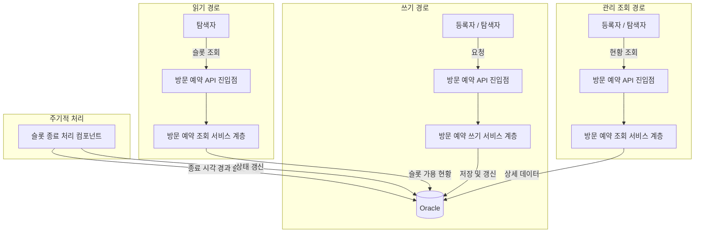
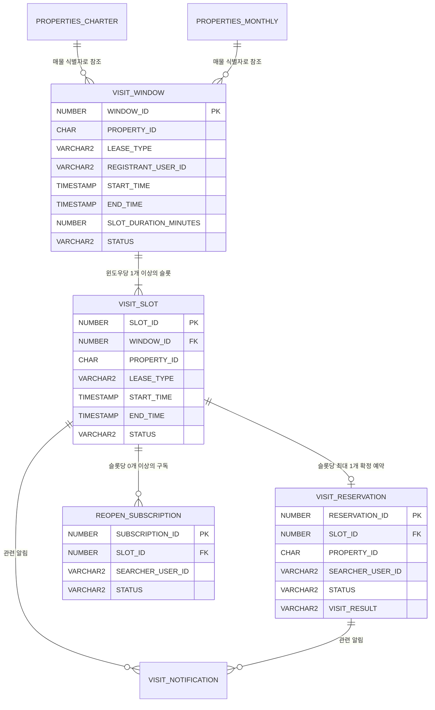
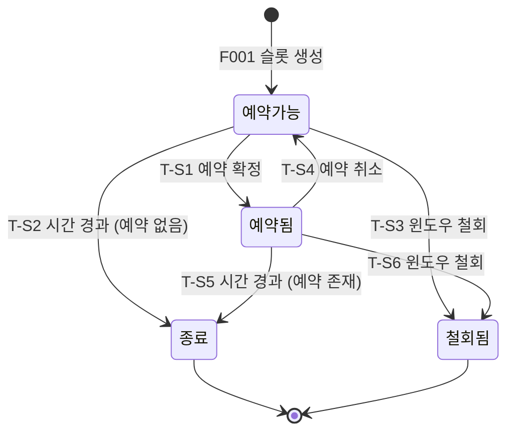
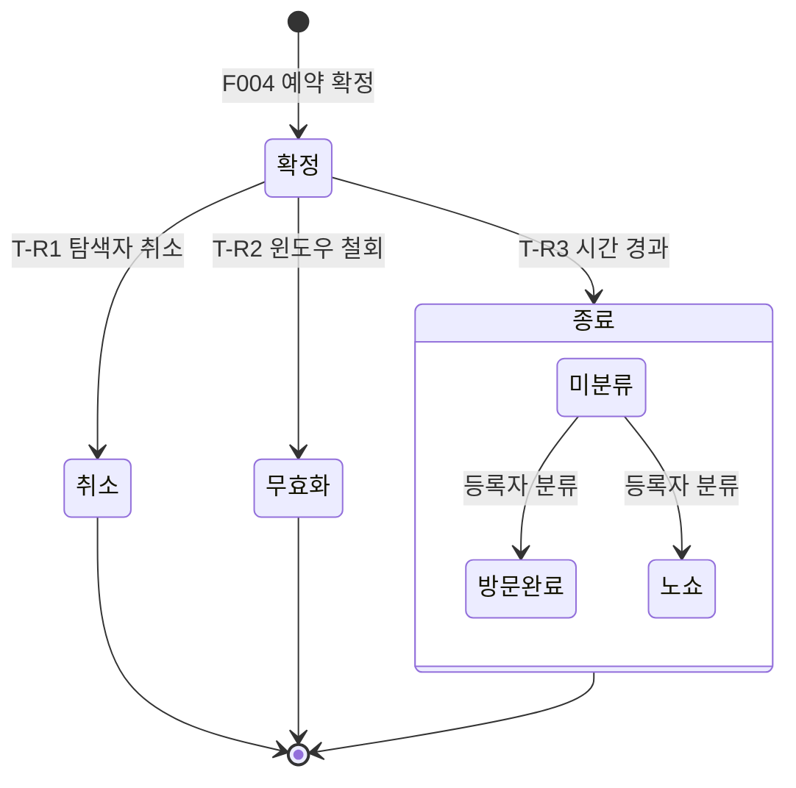

# Wherehouse 매물 방문 예약 기능 설계 명세서

프로젝트명: Wherehouse 매물 방문 예약 기능  
문서 버전: 1.0  
작성일: 2026년 5월 19일  
작성자: 정범진

---

## 목차

1. [개요](#1-개요)
2. [시스템 아키텍처](#2-시스템-아키텍처)
3. [일반 요구사항](#3-일반-요구사항)
4. [데이터 모델](#4-데이터-모델)
5. [슬롯 상태 머신](#5-슬롯-상태-머신)
6. [기능별 설계](#6-기능별-설계)
7. [API 명세](#7-api-명세)
8. [경합 구간 식별](#8-경합-구간-식별)
9. [에러 처리](#9-에러-처리)
10. [부록](#10-부록)

---

## 1. 개요

### 1.1 문서 목적

본 문서는 Wherehouse 서비스의 신규 기능 "매물 방문 예약"의 설계 명세서다. 「매물 방문 예약 기능 기획서」에서 확정된 비즈니스 맥락과 「매물 방문 예약 기능 요구사항 명세서」에서 정의된 8개 기능(F001~F008)을 대상으로, 기능이 Wherehouse 기존 아키텍처에 편입되는 방식, 영속 데이터 모델, 슬롯 상태 머신, 각 기능의 처리 흐름, 에러 처리 체계를 설계 수준에서 정의한다.

본 문서는 "무엇을, 왜"를 정의한다. "어떻게 구현할 것인가"는 구현 단계의 기술 의사결정 영역이며, 포트폴리오의 핵심 자산이다. 특히 동시 예약 요청 하에서의 경합 해결 방식은 본 문서의 범위 밖이며, 섹션 8에서 경합 구간의 위치와 요구조건만을 식별한다.

### 1.2 범위

본 문서의 범위는 요구사항 명세서의 8개 기능(F001~F008) 전체를 설계 수준에서 다루는 것이다. 데이터 모델, 상태 머신, 처리 흐름, API 계약, 에러 코드를 정의하되, 동시성 제어 기법의 선택은 포함하지 않는다.

본 문서의 범위에 포함되지 않는 것은 다음과 같다. 동시 예약 경합의 구체적 해결 기법. 화면 설계와 프론트엔드 구현. 임대차 계약, 금전 결제, 실시간 메시징, 외부 캘린더 동기화.

### 1.3 참조 문서

- 매물 방문 예약 기능 기획서
- 매물 방문 예약 기능 요구사항 명세서

---

## 2. 시스템 아키텍처

### 2.1 기존 시스템 편입 방식

**저장소 구조**

Wherehouse의 기존 매물 추천 기능은 Oracle을 원본 저장소로, Redis를 읽기 저장소로 사용하는 쓰기-읽기 저장소 분리 구조를 채택하고 있다. 방문 예약 기능은 이 구조를 따르지 않는다. 윈도우, 슬롯, 예약, 구독의 모든 데이터는 Oracle에 저장되고, Oracle에서 직접 조회된다. 읽기 경로에서 별도의 캐시 저장소를 두지 않는다.

**기존 매물 추천 기능과 저장소 구조가 다른 이유.** 매물 추천은 전체 매물 풀에서 다차원 조건(가격, 면적, 안전 점수)으로 필터링과 정렬을 수행하는 읽기 집약적 기능이며, 배치 파이프라인으로 적재된 대량 데이터를 대상으로 한다. 이 특성상 읽기 저장소를 통한 최적화가 효과적이다. 반면 방문 예약의 슬롯 조회(F003)는 특정 매물 한 건에 속한 소수의 슬롯을 조회하는 것이며, 결과 집합의 크기가 작다. Oracle 직접 조회로 충분한 응답 시간을 달성할 수 있으므로, 별도의 읽기 저장소를 두는 복잡성을 도입하지 않는다.

**기존 매물 관리와의 관계**

방문 예약 기능은 기존 매물 관리 기능을 기반으로 한다. 윈도우와 슬롯은 기존 매물 테이블(PROPERTIES_CHARTER, PROPERTIES_MONTHLY)의 매물 식별자를 참조하며, 등록자 식별은 매물 레코드의 REGISTERED_USER_ID 컬럼을 통해 이루어진다. 따라서 방문 예약의 대상이 될 수 있는 매물은 등록자가 존재하는 매물, 즉 DATA_SOURCE가 USER 또는 MERGED이고 REGISTERED_USER_ID가 존재하며 STATUS가 ACTIVE인 매물로 한정된다. 배치 파이프라인으로만 적재된 매물(DATA_SOURCE = BATCH)은 인간 등록자가 없으므로 방문 윈도우를 공개할 수 없다.

**인증 체계의 재사용**

방문 예약의 모든 쓰기 동작은 인증된 이용자만 수행할 수 있다. 기존 JWT 기반 인증 체계를 재사용하며, 쿠키에서 추출된 JWT의 userId 클레임이 요청자의 식별자로 사용된다. 신규 필터 체인을 추가하여 방문 예약 경로의 인증 정책을 적용한다.

**매물 상태 변경과의 연동**

기존 매물 관리에서 매물의 상태가 ACTIVE에서 COMPLETED 또는 DELETED로 전이되면, 해당 매물의 활성 윈도우가 존재할 수 있다. 매물이 더 이상 유효하지 않은 상태에서 방문 윈도우와 예약이 유지되는 것은 모순이다. 따라서 매물 상태가 비활성으로 전이될 때, 방문 예약 서비스 계층에 해당 매물의 활성 윈도우 일괄 철회를 요청하는 연동이 필요하다. 이 연동의 구체적 호출 방식은 구현 단계에서 확정한다.

### 2.2 전제 조건

본 설계는 다음 기존 시스템 구성 요소의 존재와 동작을 전제로 한다.

| 전제 | 기존 구성 요소 | 역할 |
|------|-------------|------|
| 매물 원본 저장소 | PROPERTIES_CHARTER, PROPERTIES_MONTHLY 테이블 | 매물 식별자, 등록자, 상태, 임대 유형의 원본 |
| 사용자 인증 | JWT 기반 인증 필터, `userentity` 테이블 | 요청자 식별(userId), 인증 상태 판별 |
| 사용자 프로필 | 회원 관리 시스템 | 예약 확정 시 공개되는 연락 경로의 원천 |
| 매물 식별자 생성 | `IdGenerator` | 매물의 MD5 해시 기반 식별자 생성 (기존 매물에 이미 적용) |

### 2.3 시스템 구성 요소

본 기능을 위해 신규로 추가되는 구성 요소와 기존 구성 요소의 수정 사항은 부록 10.2에서 정의한다. 이하 본문의 비즈니스 흐름 서술에서는 역할 기반 지칭을 사용한다.

| 역할 지칭 | 설명 |
|-----------|------|
| 방문 예약 API 진입점 | 방문 예약 관련 HTTP 요청을 수신하고 서비스 계층에 위임하는 진입점 |
| 방문 예약 쓰기 서비스 계층 | 윈도우 공개, 슬롯 예약, 예약 취소 등 상태 변경 로직을 수행하는 계층 |
| 방문 예약 조회 서비스 계층 | 슬롯 조회, 현황 조회 등 읽기 로직을 수행하는 계층 |
| 슬롯 종료 처리 컴포넌트 | 종료 시각이 경과한 슬롯을 주기적으로 식별하여 종료 상태로 전환하는 컴포넌트 |
| 알림 서비스 계층 | 예약 확정, 윈도우 철회, 슬롯 재개방 등의 사건을 당사자에게 통지하는 계층 |

### 2.4 데이터 처리 흐름

방문 예약 기능의 데이터 처리 흐름은 다음과 같다.



**쓰기 경로.** 등록자의 윈도우 공개, 탐색자의 슬롯 예약, 예약 취소 등 상태를 변경하는 모든 요청은 Oracle에 저장된다. Oracle이 유일한 저장소이자 정합성 기준점이다.

**읽기 경로.** 탐색자가 매물 상세 화면에서 슬롯의 예약 가능 여부를 조회하는 요청(F003)은 Oracle에서 직접 응답한다. 슬롯 조회와 예약 시도(F004) 사이에 다른 탐색자의 예약이 확정될 수 있으며, 이 경우 F004의 거부 응답으로 처리된다.

**관리 조회 경로.** 등록자의 슬롯 관리 현황, 탐색자의 예약 현황 등 당사자별 상세 조회(F008)는 Oracle에서 직접 응답한다.

**주기적 처리.** 슬롯 종료 처리 컴포넌트가 1분 주기로 종료 시각이 경과한 슬롯을 식별하여 종료 상태로 전환한다.

### 2.5 통지 체계

본 기능에서 발생하는 비동기 통지는 다음 네 가지다.

| 사건 | 수신자 | 발생 시점 |
|------|--------|----------|
| 슬롯 예약 확정 | 등록자 | F004에서 탐색자의 예약이 확정될 때 |
| 확정 예약 무효화 | 탐색자 | F002에서 등록자의 윈도우 철회로 확정 예약이 무효화될 때 |
| 슬롯 재개방 | 구독 중인 탐색자 | F005에서 예약 취소로 슬롯이 다시 열릴 때 |
| 매물 상태 연동 철회 | 탐색자 | 매물 상태가 비활성으로 전이되어 윈도우가 일괄 철회될 때 |

통지는 Oracle의 알림 테이블(VISIT_NOTIFICATION)에 저장되며, 이용자는 알림 조회 경로를 통해 자신의 미읽은 알림을 확인한다. 통지의 실시간 전달 방식(폴링, 서버 전송 이벤트 등)은 본 설계의 범위 밖이며 구현 단계에서 확정한다.

---

## 3. 일반 요구사항

### 3.1 인증 및 인가

방문 예약 경로의 인증 정책은 다음과 같다. 기존 JWT 인증 필터를 재사용하며, 신규 필터 체인을 추가한다.

| 경로 | 역할 | 인증 | 비고 |
|------|------|------|------|
| GET /api/v1/visit/properties/{propertyId}/slots | 탐색자 (모든 이용자) | 불필요 (공개) | F003. 선택적 인증: 인증 정보 존재 시 추출하되 미존재 시에도 접근 허용 |
| POST /api/v1/visit/windows | 등록자 | 필수 | F001 |
| DELETE /api/v1/visit/windows/{windowId} | 등록자 | 필수 | F002 |
| POST /api/v1/visit/reservations | 탐색자 | 필수 | F004 |
| DELETE /api/v1/visit/reservations/{reservationId} | 탐색자 | 필수 | F005 |
| POST /api/v1/visit/slots/{slotId}/subscriptions | 탐색자 | 필수 | F006 |
| DELETE /api/v1/visit/slots/{slotId}/subscriptions | 탐색자 | 필수 | F006 |
| PATCH /api/v1/visit/reservations/{reservationId}/result | 등록자 | 필수 | F007 |
| GET /api/v1/visit/searcher/reservations | 탐색자 | 필수 | F008 |
| GET /api/v1/visit/searcher/subscriptions | 탐색자 | 필수 | F008 |
| GET /api/v1/visit/registrant/properties/{propertyId}/slots | 등록자 | 필수 | F008 |
| GET /api/v1/visit/notifications | 이용자 | 필수 | 알림 조회 |

인증 필수 경로에서 인증 정보가 없거나 유효하지 않으면, 기존 API 인증 실패 처리 방식과 동일하게 HTTP 401 응답을 반환한다.

**인가 규칙.** 인증된 이용자라 하더라도, 각 기능의 권한 규칙에 따라 자신의 자원에 대해서만 동작할 수 있다. 등록자는 자신이 등록한 매물의 윈도우와 슬롯만 관리할 수 있고, 탐색자는 자신의 예약과 구독만 취소하거나 조회할 수 있다. 권한 위반 시 HTTP 403 응답을 반환한다. 권한 검증의 세부 규칙은 각 기능의 처리 흐름(섹션 6)에서 정의한다.

### 3.2 데이터 정합성

방문 예약 기능의 핵심 정합성 요구사항은 다음과 같다.

**슬롯 배타적 점유.** 한 슬롯에 둘 이상의 확정 예약이 동시에 존재하는 사건은 0건이어야 한다. 이 불변식은 여러 탐색자의 동시 예약 요청 하에서도 유지되어야 한다. 이 요구사항을 보장하는 동시성 제어 방식은 본 설계에서 결정하지 않으며, 섹션 8에서 경합 구간의 위치와 요구조건을 식별한다.

**결과 정합성.** 각 당사자에게 반환되는 결과(확정 또는 거부)는 Oracle에 확정된 실제 상태와 일치해야 한다. 확정되지 못한 탐색자가 확정 통지를 받는 일은 없어야 하며, 등록자의 관리 화면이 한 슬롯을 예약 가능과 예약됨으로 동시에 표시하는 일은 없어야 한다.

### 3.3 성능

예약 요청(F004)은 탐색자가 결과를 즉시 인지할 수 있는 시간 내에 확정 또는 거부 결과를 반환해야 한다. 슬롯 조회(F003)는 매물 상세 화면의 응답 시간에 포함되므로, 기존 매물 상세 조회와 동등한 수준의 응답 시간을 유지해야 한다. F003은 특정 매물 한 건에 속한 소수의 슬롯을 조회하며, Oracle 직접 조회로 이 목표를 달성한다. 구체적 목표 응답 시간과 동시 처리량 목표는 구현 단계의 측정 계획에서 확정한다.

---

## 4. 데이터 모델

### 4.1 Oracle 스키마

본 기능은 5개의 신규 테이블을 추가하며, 모든 테이블의 기본 키는 Oracle 시퀀스로 생성되는 순번이다. 다섯 테이블은 VISIT_SLOT을 중심으로 방문 예약의 공급 측(VISIT_WINDOW, VISIT_SLOT)과 수요 측(VISIT_RESERVATION, REOPEN_SUBSCRIPTION)을 연결하며, VISIT_NOTIFICATION은 그 과정에서 발생하는 비동기 통지를 저장한다.

#### 4.1.1 VISIT_WINDOW

방문 예약의 공급 측을 형성하는 테이블이다. 등록자가 자신의 매물에 대해 "이 시간대에 방문을 받겠다"고 공개하는 행위를 저장하며, 하나의 매물에 여러 윈도우가 존재할 수 있다. 윈도우 자체는 예약 대상이 아니다. 공개된 윈도우는 고정 길이 슬롯으로 분할되고, 예약 대상이 되는 것은 그 슬롯이다.

| 컬럼명 | 데이터 타입 | 제약조건 | 설명 |
|--------|------------|---------|------|
| WINDOW_ID | NUMBER(19) | PK, SEQ_VISIT_WINDOW | 윈도우 식별자 |
| PROPERTY_ID | CHAR(32) | NOT NULL | 대상 매물 식별자 (PROPERTIES_CHARTER 또는 PROPERTIES_MONTHLY의 PROPERTY_ID 참조) |
| LEASE_TYPE | VARCHAR2(10) | NOT NULL, CHECK IN ('CHARTER','MONTHLY') | 임대 유형. 대상 매물이 속한 테이블을 식별한다 |
| REGISTRANT_USER_ID | VARCHAR2(100) | NOT NULL | 윈도우를 공개한 등록자의 식별자 |
| START_TIME | TIMESTAMP | NOT NULL | 윈도우 시작 시각 |
| END_TIME | TIMESTAMP | NOT NULL, CHECK (END_TIME > START_TIME) | 윈도우 종료 시각 |
| SLOT_DURATION_MINUTES | NUMBER(3) | NOT NULL, DEFAULT 30 | 슬롯 분할 단위 (분) |
| STATUS | VARCHAR2(10) | NOT NULL, DEFAULT 'ACTIVE', CHECK IN ('ACTIVE','WITHDRAWN') | 윈도우 상태 |
| CREATED_AT | TIMESTAMP | NOT NULL | 생성 시각 |
| WITHDRAWN_AT | TIMESTAMP | | 철회 시각. 상태가 WITHDRAWN일 때만 값이 존재한다 |

**설계 근거.** PROPERTY_ID와 LEASE_TYPE을 함께 저장하는 이유는, 기존 시스템에서 동일한 MD5 해시 식별자가 전세 테이블과 월세 테이블에 각각 존재할 수 있기 때문이다. (PROPERTY_ID, LEASE_TYPE) 쌍이 매물을 유일하게 식별한다. REGISTRANT_USER_ID를 윈도우에 비정규화하여 저장하는 이유는, 윈도우 철회 시 매물 테이블을 조인하지 않고도 등록자 권한을 검증하기 위함이다.

#### 4.1.2 VISIT_SLOT

윈도우를 분할하여 생성된 고정 길이 슬롯을 저장한다. 슬롯은 예약의 대상이 되는 단위 자원이자 본 데이터 모델의 중심이다. 예약, 구독, 통지가 모두 슬롯을 기준으로 연결되며, 슬롯의 상태(섹션 5에서 정의)가 예약 가능 여부를 판정하는 기준이 된다. 슬롯은 윈도우 공개(F001) 시점에 일괄 생성된다.

| 컬럼명 | 데이터 타입 | 제약조건 | 설명 |
|--------|------------|---------|------|
| SLOT_ID | NUMBER(19) | PK, SEQ_VISIT_SLOT | 슬롯 식별자 |
| WINDOW_ID | NUMBER(19) | NOT NULL, FK → VISIT_WINDOW(WINDOW_ID) | 소속 윈도우 식별자 |
| PROPERTY_ID | CHAR(32) | NOT NULL | 대상 매물 식별자 (비정규화) |
| LEASE_TYPE | VARCHAR2(10) | NOT NULL | 임대 유형 (비정규화) |
| START_TIME | TIMESTAMP | NOT NULL | 슬롯 시작 시각 |
| END_TIME | TIMESTAMP | NOT NULL, CHECK (END_TIME > START_TIME) | 슬롯 종료 시각 |
| STATUS | VARCHAR2(15) | NOT NULL, DEFAULT 'AVAILABLE', CHECK IN ('AVAILABLE','RESERVED','CLOSED','WITHDRAWN') | 슬롯 상태. 섹션 5에서 정의한다 |
| CREATED_AT | TIMESTAMP | NOT NULL | 생성 시각 |

**설계 근거.** PROPERTY_ID와 LEASE_TYPE을 슬롯에 비정규화하는 이유는, F003(슬롯 조회)과 F004(슬롯 예약)에서 윈도우 테이블을 조인하지 않고 매물 기준으로 슬롯을 직접 조회하기 위함이다. 슬롯은 윈도우 공개 시점에 일괄 생성되며 이후 개별 슬롯의 PROPERTY_ID가 변경되는 경우는 없으므로, 비정규화에 의한 불일치 위험은 없다.

**유일 제약.** (WINDOW_ID, START_TIME) 조합에 유일 제약을 설정한다. 하나의 윈도우 안에서 같은 시작 시각의 슬롯이 중복 생성되는 것을 방지한다.

#### 4.1.3 VISIT_RESERVATION

방문 예약의 수요 측 기록으로, 탐색자가 슬롯 하나를 확정 점유한 결과를 저장한다. 하나의 슬롯은 예약 한 건보다 오래 존속한다. 예약이 취소되면 슬롯은 다시 예약 가능 상태가 되어 새 예약을 받을 수 있으므로, 한 슬롯에는 시간에 걸쳐 여러 예약 행이 누적될 수 있다. 그중 확정(CONFIRMED) 상태의 예약은 어느 시점에나 최대 한 건이다.

| 컬럼명 | 데이터 타입 | 제약조건 | 설명 |
|--------|------------|---------|------|
| RESERVATION_ID | NUMBER(19) | PK, SEQ_VISIT_RESERVATION | 예약 식별자 |
| SLOT_ID | NUMBER(19) | NOT NULL, FK → VISIT_SLOT(SLOT_ID) | 대상 슬롯 식별자 |
| PROPERTY_ID | CHAR(32) | NOT NULL | 대상 매물 식별자 (비정규화) |
| LEASE_TYPE | VARCHAR2(10) | NOT NULL | 임대 유형 (비정규화) |
| SEARCHER_USER_ID | VARCHAR2(100) | NOT NULL | 예약한 탐색자의 식별자 |
| STATUS | VARCHAR2(15) | NOT NULL, DEFAULT 'CONFIRMED', CHECK IN ('CONFIRMED','CANCELLED','INVALIDATED','COMPLETED') | 예약 상태. 섹션 5.3에서 정의한다 |
| CONFIRMED_AT | TIMESTAMP | NOT NULL | 확정 시각 |
| CANCELLED_AT | TIMESTAMP | | 취소 시각 |
| INVALIDATED_AT | TIMESTAMP | | 무효화 시각 |
| VISIT_RESULT | VARCHAR2(10) | CHECK IN ('VISITED','NO_SHOW') 또는 NULL | 방문 결과. STATUS가 COMPLETED일 때만 의미를 가진다 |
| RESULT_CLASSIFIED_AT | TIMESTAMP | | 결과 분류 시각 |

**설계 근거.** VISIT_RESULT를 별도 컬럼으로 분리한 이유는, 예약의 생명주기 상태(STATUS)와 방문 결과(VISIT_RESULT)가 서로 다른 차원의 정보이기 때문이다. STATUS는 예약의 현재 단계를 나타내고, VISIT_RESULT는 종료된 예약에 대한 사후 분류다. 이 둘을 하나의 컬럼에 혼합하면 상태 전이 규칙이 복잡해진다.

#### 4.1.4 REOPEN_SUBSCRIPTION

이미 다른 탐색자에게 예약된(RESERVED) 슬롯이 취소로 다시 열릴 때 통지를 받기 위한 신청을 저장한다. 구독은 예약이 아니며 어떤 슬롯도 보장하지 않고, 우선권을 부여하는 대기열도 아니다. 슬롯이 다시 열리면 모든 구독자가 통지를 받고 예약(F004)에서 동등하게 경쟁한다. 슬롯을 놓친 탐색자가 재개방 여부를 반복 조회하지 않도록, 수동 확인을 통지로 대체하는 것이 이 테이블의 목적이다.

| 컬럼명 | 데이터 타입 | 제약조건 | 설명 |
|--------|------------|---------|------|
| SUBSCRIPTION_ID | NUMBER(19) | PK, SEQ_REOPEN_SUBSCRIPTION | 구독 식별자 |
| SLOT_ID | NUMBER(19) | NOT NULL, FK → VISIT_SLOT(SLOT_ID) | 대상 슬롯 식별자 |
| SEARCHER_USER_ID | VARCHAR2(100) | NOT NULL | 구독자 식별자 |
| STATUS | VARCHAR2(15) | NOT NULL, DEFAULT 'ACTIVE', CHECK IN ('ACTIVE','FULFILLED','CANCELLED','EXPIRED') | 구독 상태 |
| SUBSCRIBED_AT | TIMESTAMP | NOT NULL | 구독 시각 |
| TERMINATED_AT | TIMESTAMP | | 종료 시각 |
| TERMINATION_REASON | VARCHAR2(20) | | 종료 사유 (SLOT_CLOSED, RESERVED, USER_CANCELLED) |

**구독 상태 정의.**
- ACTIVE: 구독 중. 슬롯 재개방 시 알림을 수신한다.
- FULFILLED: 구독자가 해당 슬롯을 다시 예약하는 데 성공하여 구독이 종료되었다.
- CANCELLED: 구독자가 직접 구독을 해제하였다.
- EXPIRED: 슬롯이 재개방 없이 종료 상태에 도달하여 구독이 폐기되었다.

**유일 제약.** (SLOT_ID, SEARCHER_USER_ID) 조합에 조건부 유일 제약을 설정한다. 한 탐색자가 같은 슬롯에 대해 활성 구독을 중복으로 가지는 것을 방지한다. 종료된 구독(STATUS가 ACTIVE가 아닌 것)은 이 제약에서 제외된다.

#### 4.1.5 VISIT_NOTIFICATION

방문 예약 과정에서 발생하는 비동기 통지를 저장한다. 한 당사자의 행위가 다른 당사자에게 영향을 줄 때 — 예약 확정, 윈도우 철회에 의한 무효화, 슬롯 재개방 등 — 영향을 받는 당사자에게 전달할 통지가 이 테이블에 기록되며, 하나의 사건이 여러 수신자에게 영향을 주면 수신자마다 한 행이 생성된다. 이 테이블은 어떤 상태 전이의 판정에도 사용되지 않는 단방향 출력 기록이며, 통지의 실시간 전달 방식은 섹션 2.5에 따라 본 설계의 범위 밖이다.

| 컬럼명 | 데이터 타입 | 제약조건 | 설명 |
|--------|------------|---------|------|
| NOTIFICATION_ID | NUMBER(19) | PK, SEQ_VISIT_NOTIFICATION | 알림 식별자 |
| USER_ID | VARCHAR2(100) | NOT NULL | 수신자 식별자 |
| NOTIFICATION_TYPE | VARCHAR2(30) | NOT NULL | 알림 유형 |
| RELATED_SLOT_ID | NUMBER(19) | | 관련 슬롯 식별자 |
| RELATED_RESERVATION_ID | NUMBER(19) | | 관련 예약 식별자 |
| RELATED_PROPERTY_ID | CHAR(32) | | 관련 매물 식별자 |
| MESSAGE | VARCHAR2(500) | NOT NULL | 알림 메시지 |
| IS_READ | CHAR(1) | NOT NULL, DEFAULT 'N', CHECK IN ('Y','N') | 읽음 여부 |
| CREATED_AT | TIMESTAMP | NOT NULL | 생성 시각 |

**알림 유형.**

| NOTIFICATION_TYPE 값 | 의미 | 발생 기능 |
|---------------------|------|----------|
| SLOT_RESERVED | 등록자의 슬롯이 예약됨 | F004 |
| RESERVATION_INVALIDATED | 탐색자의 예약이 윈도우 철회로 무효화됨 | F002 |
| SLOT_REOPENED | 구독 중인 슬롯이 예약 취소로 다시 열림 | F005, F006 |
| PROPERTY_DEACTIVATED | 매물 비활성화로 예약이 무효화됨 | 매물 상태 연동 |

### 4.2 엔티티 관계



---

## 5. 슬롯 상태 머신

### 5.1 슬롯 상태 정의

| 상태 | 값 | 의미 |
|------|------|------|
| 예약 가능 | AVAILABLE | 슬롯이 생성되어 탐색자의 예약을 받을 수 있는 상태. 윈도우 공개(F001) 시 초기 상태로 설정된다 |
| 예약됨 | RESERVED | 한 명의 탐색자에게 확정되어 다른 탐색자가 예약할 수 없는 상태 |
| 종료 | CLOSED | 슬롯의 예정 시간이 경과하여 더 이상 예약이나 변경의 대상이 아닌 상태. 종료된 슬롯의 구체적 결과는 연결된 예약의 VISIT_RESULT로 구분된다 |
| 철회됨 | WITHDRAWN | 등록자의 윈도우 철회(F002)로 슬롯이 비활성화된 상태 |

**종료 상태의 세부 구분.** 슬롯의 STATUS가 CLOSED일 때, 연결된 예약의 유무와 그 VISIT_RESULT에 따라 다음과 같이 해석된다.

| 조건 | 해석 |
|------|------|
| 확정 예약이 존재하고 VISIT_RESULT = VISITED | 방문 완료 |
| 확정 예약이 존재하고 VISIT_RESULT = NO_SHOW | 노쇼 |
| 확정 예약이 존재하고 VISIT_RESULT = NULL | 종료(미분류) |
| 확정 예약이 존재하지 않음 | 예약 없는 종료 |

이 세부 구분은 슬롯의 STATUS 컬럼에 추가 값을 두지 않고, VISIT_RESERVATION의 존재 여부와 VISIT_RESULT 값에서 파생된다. 하나의 상태 차원(슬롯의 생명주기)과 다른 차원(방문 결과)을 분리함으로써 상태 전이 규칙을 단순하게 유지한다.

### 5.2 슬롯 상태 전이 규칙

| 전이 | 출발 상태 | 도착 상태 | 촉발 기능 | 조건 |
|------|----------|----------|----------|------|
| T-S1 | 예약 가능 | 예약됨 | F004 | 탐색자의 예약 요청이 확정될 때 |
| T-S2 | 예약 가능 | 종료 | F007 | 슬롯 종료 시각이 경과했을 때 (예약 없이) |
| T-S3 | 예약 가능 | 철회됨 | F002 | 등록자가 소속 윈도우를 철회할 때 |
| T-S4 | 예약됨 | 예약 가능 | F005 | 탐색자가 확정 예약을 취소할 때 |
| T-S5 | 예약됨 | 종료 | F007 | 슬롯 종료 시각이 경과했을 때 (확정 예약 존재) |
| T-S6 | 예약됨 | 철회됨 | F002 | 등록자가 소속 윈도우를 철회할 때 (확정 예약 무효화 동반) |

위 표에 정의되지 않은 전이는 모두 금지된다. 종료 상태와 철회 상태는 최종 상태이며, 이 상태에서 다른 상태로의 전이는 불가능하다.

### 5.3 예약 상태 정의

| 상태 | 값 | 의미 |
|------|------|------|
| 확정 | CONFIRMED | 예약이 확정되어 활성 상태. 슬롯의 방문 시간에 탐색자가 방문할 것으로 기대된다 |
| 취소 | CANCELLED | 탐색자가 직접 예약을 취소한 상태 |
| 무효화 | INVALIDATED | 등록자의 윈도우 철회로 예약이 강제 무효화된 상태 |
| 종료 | COMPLETED | 슬롯의 예정 시간이 경과하여 예약이 종료된 상태. VISIT_RESULT로 방문 결과가 구분된다 |

### 5.4 예약 상태 전이 규칙

| 전이 | 출발 상태 | 도착 상태 | 촉발 기능 | 조건 |
|------|----------|----------|----------|------|
| T-R1 | 확정 | 취소 | F005 | 탐색자가 슬롯 시작 시간 이전에 취소할 때 |
| T-R2 | 확정 | 무효화 | F002 | 등록자의 윈도우 철회로 무효화될 때 |
| T-R3 | 확정 | 종료 | F007 | 슬롯 종료 시각이 경과했을 때 |

취소, 무효화, 종료 상태는 모두 최종 상태다. 종료 상태의 예약에 한해 등록자가 VISIT_RESULT를 NULL에서 VISITED 또는 NO_SHOW로 분류할 수 있으나, 이는 예약 상태의 전이가 아닌 방문 결과 속성의 갱신이다.

### 5.5 상태 다이어그램

**슬롯 상태 다이어그램**



**예약 상태 다이어그램**



---

## 6. 기능별 설계

본 섹션은 각 기능의 처리 흐름을 단계 단위로 정의한다. 슬롯과 예약의 상태는 섹션 5에서 정의한 명칭(예약 가능·예약됨·종료·철회됨, 확정·취소·무효화·종료)으로 서술하며, 데이터베이스 컬럼명과 상태 전이 식별자는 데이터 모델(섹션 4)과 상태 머신(섹션 5)을 참조한다.

### 6.1 F001 — 방문 윈도우 공개

#### 개요

등록자가 자신이 등록한 매물에 방문 가능 시간 윈도우를 공개한다. 공개된 윈도우는 고정 길이 슬롯으로 분할되어, 각 슬롯이 예약 가능 상태로 생성된다. 이 기능은 방문 예약의 공급 측을 형성하며, 이후 모든 기능의 대상이 되는 슬롯을 만들어 낸다.

#### 처리 흐름

**1단계: 요청 검증.** 방문 예약 API 진입점이 요청을 수신하고, 필수 입력값(대상 매물, 임대 유형, 윈도우 시작 시각과 종료 시각)의 형식과 존재 여부를 검증한다. 슬롯 분할 단위가 지정되지 않으면 기본값 30분을 적용한다. 윈도우 종료 시각이 시작 시각보다 이르거나, 시작 시각이 현재 시각보다 이르면 거부한다.

**2단계: 매물 유효성 확인.** 방문 예약 쓰기 서비스 계층이 대상 매물을 조회하여, 매물이 존재하고 활성 상태이며 등록자가 지정되어 있는지 확인한다. 셋 중 하나라도 충족되지 않으면 거부한다.

**3단계: 등록자 권한 확인.** 요청자가 그 매물의 등록자인지 확인한다. 등록자가 아니면 권한 없음으로 거부한다.

**4단계: 윈도우 시간 겹침 검증.** 같은 매물의 다른 활성 윈도우 중 요청된 시간 범위와 겹치는 것이 있는지 확인하고, 겹치는 윈도우가 있으면 거부한다. 이 검증은 같은 시간대에 슬롯이 중복으로 생성되는 것을 막는다.

**5단계: 윈도우 저장 및 슬롯 생성.** 윈도우를 저장한 뒤, 윈도우의 시간 범위를 분할 단위에 따라 고정 길이 슬롯으로 나누어 각 슬롯을 예약 가능 상태로 생성한다. 윈도우 저장과 슬롯 일괄 생성은 하나의 원자적 실행 단위로 수행하여, 윈도우만 저장되고 슬롯이 생성되지 않는 부분 실패가 발생하지 않도록 한다.

**6단계: 응답 반환.** 생성된 윈도우 정보와 슬롯 목록을 반환한다.

### 6.2 F002 — 방문 윈도우 철회

#### 개요

등록자가 이미 공개한 방문 윈도우를 철회한다. 철회된 윈도우의 슬롯은 더 이상 예약 대상이 아니며, 확정된 예약이 있으면 무효화되고 해당 탐색자에게 통지된다. 윈도우 철회는 되돌릴 수 없다.

#### 처리 흐름

**1단계: 요청 검증 및 권한 확인.** 방문 예약 API 진입점이 윈도우 식별자와 요청자 식별자를 수신한다. 방문 예약 쓰기 서비스 계층이 해당 윈도우가 존재하고 활성 상태인지, 요청자가 그 윈도우를 공개한 등록자인지 확인하며, 하나라도 충족되지 않으면 거부한다.

**2단계: 확정 예약 식별.** 해당 윈도우에 속한 슬롯 중 예약됨 상태인 슬롯과, 그 슬롯에 연결된 확정 예약을 식별한다.

**3단계: 원자적 상태 전이.** 다음을 하나의 원자적 실행 단위로 수행한다. 윈도우를 철회하고 철회 시각을 기록한다. 해당 윈도우의 모든 활성 슬롯(예약 가능 상태와 예약됨 상태)을 철회됨 상태로 전이한다. 식별된 확정 예약을 무효화 상태로 전이하고 무효화 시각을 기록한다. 그 슬롯에 연결된 활성 구독을 폐기한다.

**경합 구간.** 윈도우 철회와 동시에 같은 윈도우의 슬롯에 대한 예약 요청(F004)이 도착할 수 있다. 이 경합의 요구조건은 섹션 8에서 정의하며, 해결 방식은 본 설계에서 결정하지 않는다.

**4단계: 알림 생성.** 무효화된 각 예약의 탐색자에게 예약이 무효화되었음을 알리는 통지를 생성한다.

**5단계: 응답 반환.** 철회 처리 결과와 무효화된 예약 목록을 반환한다.

### 6.3 F003 — 방문 슬롯 조회

#### 개요

탐색자가 특정 매물에 공개된 방문 슬롯과 그 예약 가능 여부를 조회한다. 이 기능은 매물 상세 화면에서 탐색자가 예약할 슬롯을 고르는 진입점이다.

#### 처리 흐름

**1단계: 요청 수신.** 방문 예약 API 진입점이 매물 식별자를 수신한다. 임대 유형은 선택적 매개변수로 받는다. 이 경로는 인증이 필요하지 않으며 모든 이용자가 접근할 수 있다. 인증 정보가 있으면 추출하되, 없어도 접근을 허용한다(섹션 3.1 참조).

**2단계: 슬롯 목록 조회.** 방문 예약 조회 서비스 계층이 Oracle에서 해당 매물의 슬롯 중 예약 가능 상태와 예약됨 상태인 슬롯을 조회한다. 임대 유형이 지정되면 그 유형의 슬롯만 조회하고, 지정되지 않으면 동일 매물 식별자에 해당하는 전세와 월세 두 유형의 슬롯을 모두 조회한다.

**3단계: 응답 구성.** 조회된 슬롯을 임대 유형별로 분리하여 전세 묶음과 월세 묶음으로 응답을 구성한다. 각 묶음은 그 유형의 슬롯 목록을 시작 시각 순으로 담으며, 임대 유형이 지정된 경우 해당 유형의 묶음만 포함한다. 각 슬롯은 시작 시각, 종료 시각, 현재 상태(예약 가능 또는 예약됨)를 포함한다. 슬롯을 예약한 탐색자의 신원은 응답에 포함하지 않으며, 종료되거나 철회된 슬롯은 조회 대상에서 제외되므로 응답에 나타나지 않는다.

**조회와 예약 사이의 상태 변경.** 이 조회와 실제 예약 시도(F004) 사이에 다른 탐색자의 예약이 확정되어 슬롯 상태가 바뀔 수 있다. 조회 시점에 예약 가능으로 확인된 슬롯이 예약 시도 시점에 이미 확정되어 있으면, F004의 거부 응답으로 처리된다.

### 6.4 F004 — 방문 슬롯 예약

#### 개요

탐색자가 예약 가능한 방문 슬롯 하나를 예약한다. 이 기능은 매물 방문 예약의 핵심이다. 여러 탐색자가 같은 슬롯을 동시에 예약하려 할 수 있으며, 시스템은 동시 요청 하에서도 한 슬롯에 정확히 한 명만 확정한다.

#### 처리 흐름

**1단계: 요청 검증.** 방문 예약 API 진입점이 슬롯 식별자와 요청자 식별자를 수신한다. 인증이 필수이며, 인증되지 않은 요청은 거부한다.

**2단계: 슬롯 유효성 확인.** 방문 예약 쓰기 서비스 계층이 해당 슬롯이 존재하고 예약 가능 상태인지 확인한다. 예약 가능 상태가 아니면, 슬롯이 이미 확정되었다는 사유와 함께 같은 매물의 현재 예약 가능한 슬롯 목록을 반환하며 거부한다.

**3단계: 자기 매물 예약 제한.** 슬롯이 속한 매물의 등록자가 요청자 본인인지 확인한다. 본인이면 자기 매물 예약 불가 사유로 거부한다.

**4단계: 동일 매물 중복 예약 검증.** 요청자가 같은 매물에 이미 확정된 예약을 가지고 있는지 확인한다. 있으면 동일 매물 중복 예약 사유로 거부한다.

**5단계: 시간 겹침 검증.** 요청자의 기존 확정 예약 중 요청한 슬롯의 방문 시간과 겹치는 것이 있는지 확인한다. 두 시간 구간은 기존 예약의 시작 시각이 요청 슬롯의 종료 시각보다 이르고, 동시에 기존 예약의 종료 시각이 요청 슬롯의 시작 시각보다 늦을 때 겹친다. 겹치는 예약이 있으면 시간 겹침 사유로 거부한다.

**6단계: 슬롯 상태 전이 및 예약 생성.** 슬롯을 예약 가능 상태에서 예약됨 상태로 전이하고, 확정 상태의 예약을 생성한다. 슬롯 상태 전이와 예약 생성은 하나의 원자적 실행 단위로 수행한다.

**핵심 경합 구간.** 여러 탐색자의 동시 예약 요청이 같은 슬롯에 도달할 때, 2단계의 예약 가능 확인과 6단계의 예약됨 전이 사이에 경합이 발생한다. 이 경합 구간의 위치, 요구조건, 기존 매물 등록과의 차이는 섹션 8에서 상세히 식별하며, 해결 방식은 본 설계에서 결정하지 않는다.

**7단계: 알림 생성.** 확정에 성공하면, 슬롯이 속한 매물의 등록자에게 슬롯이 예약되었음을 알리는 통지를 생성한다.

**8단계: 응답 반환.** 확정에 성공한 탐색자에게는 예약 식별자, 슬롯의 방문 시각, 매물 정보, 그리고 확정 시점에 공개되는 등록자의 연락 정보를 반환한다. 연락 정보는 등록자의 닉네임과 회원 프로필의 연락 경로를 포함하며, 예약이 확정된 한 쌍의 당사자에게만 그 시점에 공개되고 예약 이전에는 노출되지 않는다. 확정되지 못한 탐색자에게는 거부 사유와 함께 같은 매물의 현재 예약 가능한 슬롯 목록을 반환한다.

### 6.5 F005 — 방문 예약 취소

#### 개요

탐색자가 자신의 확정 예약을 취소한다. 취소된 예약의 슬롯은 다시 예약 가능 상태가 되어 다른 탐색자가 예약할 수 있다.

#### 처리 흐름

**1단계: 요청 검증 및 권한 확인.** 방문 예약 API 진입점이 예약 식별자와 요청자 식별자를 수신한다. 방문 예약 쓰기 서비스 계층이 해당 예약이 존재하고 확정 상태인지, 요청자가 그 예약을 한 탐색자 본인인지 확인하며, 하나라도 충족되지 않으면 거부한다.

**2단계: 취소 가능 시점 검증.** 예약에 연결된 슬롯의 시작 시각이 아직 지나지 않았는지 확인한다. 슬롯 시작 시각이 이미 지났으면 취소 불가로 거부한다. 기획서에 따라 시작 시각 이전까지는 별도의 취소 마감 없이 취소를 허용한다.

**3단계: 원자적 상태 전이.** 다음을 하나의 원자적 실행 단위로 수행한다. 예약을 취소 상태로 전이하고 취소 시각을 기록한다. 그 슬롯을 예약됨 상태에서 예약 가능 상태로 되돌린다.

**경합 구간.** 슬롯이 예약 가능 상태로 돌아가는 시점에 다른 탐색자의 예약 요청(F004)이 동시에 도착할 수 있다. 이 경합의 요구조건은 섹션 8에서 정의한다.

**4단계: 재개방 알림 발송.** 그 슬롯에 연결된 활성 구독의 구독자에게 슬롯이 다시 열렸음을 알리는 통지를 생성한다. 구독 자체는 종료하지 않는다. 기획서에 따라 슬롯이 다시 열릴 때마다 알림이 발송되며, 종료 조건에 도달하기 전까지 구독은 유지된다.

**5단계: 응답 반환.** 취소 처리 결과와 다시 열린 슬롯의 상태를 반환한다.

### 6.6 F006 — 재개방 알림 구독

#### 개요

이미 예약된 슬롯이 취소로 다시 열릴 때 알림을 받기 위해, 탐색자가 구독을 신청하거나 해제한다. 구독은 어떤 예약도 보장하지 않으며, 슬롯이 다시 열릴 때 구독자에게 알림을 전달하는 신청일 뿐이다. 시스템은 슬롯을 자동으로 배정하지 않는다.

#### 처리 흐름 — 구독 신청

**1단계: 요청 검증.** 방문 예약 API 진입점이 슬롯 식별자와 요청자 식별자를 수신한다. 해당 슬롯이 존재하고 예약됨 상태인지 확인한다. 예약 가능 상태의 슬롯은 바로 예약하면 되므로 구독이 무의미하고, 종료되거나 철회된 슬롯은 다시 열릴 수 없으므로, 두 경우 모두 거부한다.

**2단계: 중복 구독 검증.** 요청자가 그 슬롯에 이미 활성 구독을 가지고 있는지 확인한다. 이미 구독 중이면 중복 구독 사유로 거부한다.

**3단계: 구독 생성.** 활성 상태의 구독을 생성하여 저장한다.

**4단계: 응답 반환.** 구독 신청 결과를 반환한다.

#### 처리 흐름 — 구독 해제

**1단계: 요청 검증 및 권한 확인.** 요청자가 그 슬롯에 활성 구독을 가지고 있는지 확인한다. 활성 구독이 없으면 거부한다.

**2단계: 구독 종료.** 해당 구독을 종료 상태로 전이하고 종료 시각을 기록한다.

**3단계: 응답 반환.** 구독 해제 결과를 반환한다.

#### 구독 종료 조건

기획서에 따라 구독은 다음 세 경우에 종료된다. 이 종료 처리는 F006 자체가 아니라 각각을 촉발하는 기능에서 수행된다.

| 종료 조건 | 종료를 처리하는 기능 |
|-----------|----------------------|
| 슬롯이 다시 열리지 않고 종료 상태에 도달하여 구독이 폐기됨 | F007 — 슬롯 종료 |
| 구독자가 그 슬롯을 다시 예약하는 데 성공함 | F004 — 슬롯 예약 |
| 구독자가 직접 구독을 해제함 | F006 — 구독 해제 |

### 6.7 F007 — 슬롯 종료 및 방문 결과 분류

#### 개요

이 기능은 두 부분으로 구성된다. 첫째, 슬롯의 예정 시간이 지나면 시스템이 그 슬롯을 종료 상태로 전환한다. 둘째, 등록자가 종료된 예약의 방문 결과를 분류한다.

#### 처리 흐름 — 슬롯 종료 (시스템 주도)

슬롯 종료 처리 컴포넌트가 1분 주기로 다음을 수행한다.

**1단계: 종료 대상 식별.** 예약 가능 상태나 예약됨 상태이면서 종료 시각이 이미 지난 슬롯을 Oracle에서 조회한다.

**2단계: 상태 전이.** 식별된 각 슬롯을 종료 상태로 전이한다. 슬롯에 연결된 확정 예약이 있으면 그 예약도 종료 상태로 전이하되, 방문 결과는 분류되지 않은 상태로 두어 등록자의 분류를 기다린다.

**3단계: 구독 폐기.** 종료된 슬롯에 연결된 활성 구독을 폐기한다.

#### 처리 흐름 — 방문 결과 분류 (등록자 주도)

**1단계: 요청 검증 및 권한 확인.** 방문 예약 API 진입점이 예약 식별자, 분류 값(방문 완료 또는 노쇼), 요청자 식별자를 수신한다. 방문 예약 쓰기 서비스 계층이 해당 예약이 존재하고 종료 상태인지, 방문 결과가 아직 분류되지 않았는지, 요청자가 그 예약이 속한 매물의 등록자인지 확인한다.

**2단계: 결과 분류.** 예약의 방문 결과를 요청된 값으로 기록하고 분류 시각을 기록한다.

**3단계: 응답 반환.** 분류 결과를 반환한다.

**분류 마감.** 기획서에 따라 방문 결과 분류에는 별도의 마감 시점이 없다. 등록자가 분류하지 않은 예약은 미분류 종료 상태로 유지된다.

### 6.8 F008 — 예약 및 슬롯 현황 조회

#### 개요

탐색자가 자신의 예약과 구독 현황을 조회하고, 등록자가 자기 매물의 슬롯과 예약 현황을 조회한다. 이 기능은 예약 이후 시간에 걸친 상태 가시성을 제공하며, 관리 화면의 정확성을 위해 Oracle에서 직접 조회한다.

#### 처리 흐름 — 탐색자 예약 현황 조회

**1단계: 요청 수신.** 인증된 탐색자의 식별자를 기준으로 조회한다.

**2단계: 예약 목록 조회.** 방문 예약 조회 서비스 계층이 Oracle에서 그 탐색자의 예약을 조회한다. 확정 예약뿐 아니라 취소·무효화·종료된 예약까지 모두 포함하며 최신순으로 정렬하고, 각 예약에 연결된 슬롯의 시간 정보와 매물 정보를 함께 반환한다.

**3단계: 응답 구성.** 다른 탐색자의 예약은 포함하지 않는다. 등록자의 연락 정보는 해당 예약이 확정 상태이거나 종료 상태일 때만 포함한다.

#### 처리 흐름 — 탐색자 구독 현황 조회

방문 예약 조회 서비스 계층이 Oracle에서 그 탐색자의 구독을 조회한다. 활성 구독과 종료된 구독을 모두 포함하며, 각 구독에 연결된 슬롯의 시간 정보와 현재 상태를 함께 반환한다.

#### 처리 흐름 — 등록자 슬롯 현황 조회

**1단계: 요청 수신.** 인증된 등록자의 식별자와 대상 매물 식별자를 수신한다.

**2단계: 권한 확인.** 요청자가 그 매물의 등록자인지 확인한다.

**3단계: 슬롯 목록 조회.** 방문 예약 조회 서비스 계층이 Oracle에서 그 매물의 모든 슬롯을 조회하고, 각 슬롯의 시작 시각·종료 시각·상태와 슬롯에 연결된 예약 정보(예약자 닉네임, 예약 상태, 방문 결과)를 함께 반환한다.

**4단계: 응답 구성.** 다른 등록자의 매물 슬롯은 포함하지 않는다. 탐색자의 연락 정보는 해당 예약이 확정 상태이거나 종료 상태일 때만 포함한다.

---

## 7. API 명세

본 섹션은 각 API의 계약(경로, 요청, 응답, 에러)을 정의한다. 처리 흐름의 상세는 섹션 6을 참조한다. JSON 필드명은 기존 시스템의 명명 전략(snake_case)을 따른다.

### 7.1 방문 윈도우 공개

| 항목 | 내용 |
|------|------|
| 기능 | F001 — 등록자가 매물에 방문 가능 시간 윈도우를 공개한다 |
| HTTP | POST |
| 경로 | /api/v1/visit/windows |
| 인증 | 필수 |

**요청 본문**

| 필드 | 타입 | 필수 | 설명 |
|------|------|------|------|
| property_id | String | O | 대상 매물 식별자 (32자) |
| lease_type | String | O | 임대 유형. CHARTER 또는 MONTHLY |
| start_time | String | O | 윈도우 시작 시각 (ISO 8601, 예: 2026-06-01T10:00:00) |
| end_time | String | O | 윈도우 종료 시각 |
| slot_duration_minutes | Integer | X | 슬롯 분할 단위 (분). 기본값 30 |

```json
{
  "property_id": "a1b2c3d4e5f6a1b2c3d4e5f6a1b2c3d4",
  "lease_type": "CHARTER",
  "start_time": "2026-06-15T10:00:00",
  "end_time": "2026-06-15T13:00:00",
  "slot_duration_minutes": 30
}
```

**성공 응답: 201**

| 필드 | 타입 | 설명 |
|------|------|------|
| window_id | Long | 생성된 윈도우 식별자 |
| property_id | String | 대상 매물 식별자 |
| lease_type | String | 임대 유형 |
| start_time | String | 윈도우 시작 시각 |
| end_time | String | 윈도우 종료 시각 |
| slot_duration_minutes | Integer | 슬롯 분할 단위 |
| slots | Array | 생성된 슬롯 목록 |
| slots[].slot_id | Long | 슬롯 식별자 |
| slots[].start_time | String | 슬롯 시작 시각 |
| slots[].end_time | String | 슬롯 종료 시각 |
| slots[].status | String | 슬롯 상태 (AVAILABLE) |
| created_at | String | 생성 시각 |

```json
{
  "window_id": 1,
  "property_id": "a1b2c3d4e5f6a1b2c3d4e5f6a1b2c3d4",
  "lease_type": "CHARTER",
  "start_time": "2026-06-15T10:00:00",
  "end_time": "2026-06-15T13:00:00",
  "slot_duration_minutes": 30,
  "slots": [
    {"slot_id": 1, "start_time": "2026-06-15T10:00:00", "end_time": "2026-06-15T10:30:00", "status": "AVAILABLE"},
    {"slot_id": 2, "start_time": "2026-06-15T10:30:00", "end_time": "2026-06-15T11:00:00", "status": "AVAILABLE"},
    {"slot_id": 3, "start_time": "2026-06-15T11:00:00", "end_time": "2026-06-15T11:30:00", "status": "AVAILABLE"},
    {"slot_id": 4, "start_time": "2026-06-15T11:30:00", "end_time": "2026-06-15T12:00:00", "status": "AVAILABLE"},
    {"slot_id": 5, "start_time": "2026-06-15T12:00:00", "end_time": "2026-06-15T12:30:00", "status": "AVAILABLE"},
    {"slot_id": 6, "start_time": "2026-06-15T12:30:00", "end_time": "2026-06-15T13:00:00", "status": "AVAILABLE"}
  ],
  "created_at": "2026-06-10T14:30:00"
}
```

**에러 응답** — 섹션 9.1의 에러 코드 참조

| HTTP 코드 | 에러 코드 | 상황 |
|-----------|----------|------|
| 400 | E7001 | 입력값 유효성 검증 실패 |
| 403 | E7003 | 등록자 권한 없음 |
| 404 | E7204 | 매물 없음 또는 비활성 |
| 409 | E7011 | 윈도우 시간 겹침 |

### 7.2 방문 윈도우 철회

| 항목 | 내용 |
|------|------|
| 기능 | F002 — 등록자가 공개한 윈도우를 철회한다 |
| HTTP | DELETE |
| 경로 | /api/v1/visit/windows/{windowId} |
| 인증 | 필수 |

**경로 매개변수**

| 매개변수 | 타입 | 설명 |
|---------|------|------|
| windowId | Long | 철회 대상 윈도우 식별자 |

**성공 응답: 200**

| 필드 | 타입 | 설명 |
|------|------|------|
| window_id | Long | 철회된 윈도우 식별자 |
| status | String | 윈도우 상태 (WITHDRAWN) |
| withdrawn_at | String | 철회 시각 |
| invalidated_reservations | Array | 무효화된 예약 목록 |
| invalidated_reservations[].reservation_id | Long | 예약 식별자 |
| invalidated_reservations[].slot_id | Long | 슬롯 식별자 |
| invalidated_reservations[].searcher_user_id | String | 영향받은 탐색자 식별자 |

**에러 응답**

| HTTP 코드 | 에러 코드 | 상황 |
|-----------|----------|------|
| 403 | E7003 | 등록자 권한 없음 |
| 404 | E7201 | 윈도우 없음 |
| 409 | E7002 | 이미 철회된 윈도우 |

### 7.3 방문 슬롯 조회

| 항목 | 내용 |
|------|------|
| 기능 | F003 — 탐색자가 매물의 방문 슬롯을 조회한다 |
| HTTP | GET |
| 경로 | /api/v1/visit/properties/{propertyId}/slots |
| 인증 | 불필요 (선택적 인증) |

**경로 매개변수**

| 매개변수 | 타입 | 설명 |
|---------|------|------|
| propertyId | String | 대상 매물 식별자 (32자) |

**요청 매개변수 (쿼리)**

| 매개변수 | 타입 | 필수 | 설명 |
|---------|------|------|------|
| lease_type | String | X | 임대 유형(CHARTER 또는 MONTHLY). 지정하면 해당 유형의 슬롯만, 생략하면 전세와 월세 두 유형의 슬롯을 모두 조회한다 |

동일한 매물 식별자가 전세 테이블과 월세 테이블에 각각 존재할 수 있으므로(섹션 4.1.1 참조), 임대 유형은 선택적 매개변수다. 응답은 슬롯을 단일 목록으로 나열하지 않고 임대 유형별로 분리하여 charter 필드와 monthly 필드로 구성한다. 임대 유형을 지정하면 해당 유형의 필드만 포함하고, 생략하면 해당 매물에 존재하는 두 유형의 필드를 모두 포함한다.

**성공 응답: 200**

| 필드 | 타입 | 설명 |
|------|------|------|
| property_id | String | 매물 식별자 |
| charter | Array | 전세 임대 유형의 활성 슬롯 목록 (시작 시각 순). 요청에서 전세를 선택했거나 임대 유형을 생략한 경우, 해당 매물에 전세 슬롯이 존재할 때 포함된다 |
| monthly | Array | 월세 임대 유형의 활성 슬롯 목록 (시작 시각 순). 요청에서 월세를 선택했거나 임대 유형을 생략한 경우, 해당 매물에 월세 슬롯이 존재할 때 포함된다 |
| charter[]·monthly[].slot_id | Long | 슬롯 식별자 |
| charter[]·monthly[].start_time | String | 슬롯 시작 시각 |
| charter[]·monthly[].end_time | String | 슬롯 종료 시각 |
| charter[]·monthly[].status | String | 슬롯 상태 (AVAILABLE 또는 RESERVED) |

다음은 임대 유형을 생략하여 전세와 월세를 모두 조회한 응답 예시다. 임대 유형을 CHARTER로 지정한 요청에서는 charter 필드만, MONTHLY로 지정한 요청에서는 monthly 필드만 포함된다.

```json
{
  "property_id": "a1b2c3d4e5f6a1b2c3d4e5f6a1b2c3d4",
  "charter": [
    {"slot_id": 1, "start_time": "2026-06-15T10:00:00", "end_time": "2026-06-15T10:30:00", "status": "AVAILABLE"},
    {"slot_id": 2, "start_time": "2026-06-15T10:30:00", "end_time": "2026-06-15T11:00:00", "status": "RESERVED"}
  ],
  "monthly": [
    {"slot_id": 7, "start_time": "2026-06-16T14:00:00", "end_time": "2026-06-16T14:30:00", "status": "AVAILABLE"}
  ]
}
```

### 7.4 방문 슬롯 예약

| 항목 | 내용 |
|------|------|
| 기능 | F004 — 탐색자가 슬롯을 예약한다 |
| HTTP | POST |
| 경로 | /api/v1/visit/reservations |
| 인증 | 필수 |

**요청 본문**

| 필드 | 타입 | 필수 | 설명 |
|------|------|------|------|
| slot_id | Long | O | 예약 대상 슬롯 식별자 |

```json
{
  "slot_id": 1
}
```

**성공 응답 (확정): 201**

| 필드 | 타입 | 설명 |
|------|------|------|
| reservation_id | Long | 예약 식별자 |
| slot_id | Long | 슬롯 식별자 |
| property_id | String | 매물 식별자 |
| lease_type | String | 임대 유형 |
| start_time | String | 방문 시작 시각 |
| end_time | String | 방문 종료 시각 |
| status | String | 예약 상태 (CONFIRMED) |
| confirmed_at | String | 확정 시각 |
| registrant | Object | 등록자 연락 정보 (확정 시점에 공개) |
| registrant.user_id | String | 등록자 식별자 |
| registrant.username | String | 등록자 닉네임 |

```json
{
  "reservation_id": 1,
  "slot_id": 1,
  "property_id": "a1b2c3d4e5f6a1b2c3d4e5f6a1b2c3d4",
  "lease_type": "CHARTER",
  "start_time": "2026-06-15T10:00:00",
  "end_time": "2026-06-15T10:30:00",
  "status": "CONFIRMED",
  "confirmed_at": "2026-06-10T15:30:00",
  "registrant": {
    "user_id": "owner123",
    "username": "김등록"
  }
}
```

**실패 응답 (거부): 409**

| 필드 | 타입 | 설명 |
|------|------|------|
| error_code | String | 에러 코드 |
| message | String | 거부 사유 |
| timestamp | String | 시각 |
| available_slots | Array | 같은 매물의 현재 예약 가능한 슬롯 목록 |

```json
{
  "error_code": "E7007",
  "message": "해당 슬롯은 이미 예약되었습니다.",
  "timestamp": "2026-06-10T15:30:01",
  "available_slots": [
    {"slot_id": 3, "start_time": "2026-06-15T11:00:00", "end_time": "2026-06-15T11:30:00"}
  ]
}
```

**에러 응답**

| HTTP 코드 | 에러 코드 | 상황 |
|-----------|----------|------|
| 403 | E7004 | 자기 매물 예약 불가 |
| 404 | E7202 | 슬롯 없음 |
| 409 | E7005 | 동일 매물 중복 예약 |
| 409 | E7006 | 시간 겹침 |
| 409 | E7007 | 슬롯 이미 예약됨 |
| 409 | E7008 | 예약 가능 상태가 아닌 슬롯 |

### 7.5 방문 예약 취소

| 항목 | 내용 |
|------|------|
| 기능 | F005 — 탐색자가 자신의 예약을 취소한다 |
| HTTP | DELETE |
| 경로 | /api/v1/visit/reservations/{reservationId} |
| 인증 | 필수 |

**성공 응답: 200**

| 필드 | 타입 | 설명 |
|------|------|------|
| reservation_id | Long | 취소된 예약 식별자 |
| status | String | 예약 상태 (CANCELLED) |
| cancelled_at | String | 취소 시각 |
| reopened_slot | Object | 다시 열린 슬롯 정보 |
| reopened_slot.slot_id | Long | 슬롯 식별자 |
| reopened_slot.status | String | 슬롯 상태 (AVAILABLE) |

**에러 응답**

| HTTP 코드 | 에러 코드 | 상황 |
|-----------|----------|------|
| 403 | E7003 | 본인 예약이 아님 |
| 404 | E7203 | 예약 없음 |
| 409 | E7009 | 취소 불가 (슬롯 시간 경과) |
| 409 | E7002 | 이미 취소/무효화/종료된 예약 |

### 7.6 재개방 알림 구독

| 항목 | 내용 |
|------|------|
| 기능 | F006 — 탐색자가 슬롯의 재개방 알림을 구독한다 |
| HTTP | POST |
| 경로 | /api/v1/visit/slots/{slotId}/subscriptions |
| 인증 | 필수 |

**성공 응답: 201**

| 필드 | 타입 | 설명 |
|------|------|------|
| subscription_id | Long | 구독 식별자 |
| slot_id | Long | 대상 슬롯 식별자 |
| status | String | 구독 상태 (ACTIVE) |
| subscribed_at | String | 구독 시각 |

**에러 응답**

| HTTP 코드 | 에러 코드 | 상황 |
|-----------|----------|------|
| 404 | E7202 | 슬롯 없음 |
| 409 | E7008 | 예약 가능 상태가 아닌 슬롯 (RESERVED가 아님) |
| 409 | E7012 | 이미 구독 중 |

### 7.7 재개방 알림 구독 해제

| 항목 | 내용 |
|------|------|
| 기능 | F006 — 탐색자가 슬롯의 재개방 알림 구독을 해제한다 |
| HTTP | DELETE |
| 경로 | /api/v1/visit/slots/{slotId}/subscriptions |
| 인증 | 필수 |

**성공 응답: 200**

| 필드 | 타입 | 설명 |
|------|------|------|
| slot_id | Long | 대상 슬롯 식별자 |
| status | String | 구독 상태 (CANCELLED) |
| terminated_at | String | 종료 시각 |

**에러 응답**

| HTTP 코드 | 에러 코드 | 상황 |
|-----------|----------|------|
| 404 | E7202 | 슬롯 없음 |
| 404 | E7205 | 활성 구독 없음 |

### 7.8 방문 결과 분류

| 항목 | 내용 |
|------|------|
| 기능 | F007 — 등록자가 종료된 예약의 방문 결과를 분류한다 |
| HTTP | PATCH |
| 경로 | /api/v1/visit/reservations/{reservationId}/result |
| 인증 | 필수 |

**요청 본문**

| 필드 | 타입 | 필수 | 설명 |
|------|------|------|------|
| visit_result | String | O | 방문 결과. VISITED 또는 NO_SHOW |

```json
{
  "visit_result": "VISITED"
}
```

**성공 응답: 200**

| 필드 | 타입 | 설명 |
|------|------|------|
| reservation_id | Long | 예약 식별자 |
| visit_result | String | 분류된 방문 결과 |
| result_classified_at | String | 분류 시각 |

**에러 응답**

| HTTP 코드 | 에러 코드 | 상황 |
|-----------|----------|------|
| 400 | E7001 | 유효하지 않은 분류 값 |
| 403 | E7003 | 등록자 권한 없음 |
| 404 | E7203 | 예약 없음 |
| 409 | E7010 | 분류 불가 (종료 상태 아님 또는 이미 분류됨) |

### 7.9 탐색자 예약 현황 조회

| 항목 | 내용 |
|------|------|
| 기능 | F008 — 탐색자가 자신의 예약 현황을 조회한다 |
| HTTP | GET |
| 경로 | /api/v1/visit/searcher/reservations |
| 인증 | 필수 |

**성공 응답: 200**

| 필드 | 타입 | 설명 |
|------|------|------|
| reservations | Array | 예약 목록 (최신순) |
| reservations[].reservation_id | Long | 예약 식별자 |
| reservations[].slot_id | Long | 슬롯 식별자 |
| reservations[].property_id | String | 매물 식별자 |
| reservations[].lease_type | String | 임대 유형 |
| reservations[].start_time | String | 방문 시작 시각 |
| reservations[].end_time | String | 방문 종료 시각 |
| reservations[].status | String | 예약 상태 |
| reservations[].visit_result | String | 방문 결과 (종료 시에만) |
| reservations[].confirmed_at | String | 확정 시각 |
| reservations[].registrant | Object | 등록자 연락 정보 (CONFIRMED/COMPLETED 시에만) |

### 7.10 탐색자 구독 현황 조회

| 항목 | 내용 |
|------|------|
| 기능 | F008 — 탐색자가 자신의 재개방 알림 구독 현황을 조회한다 |
| HTTP | GET |
| 경로 | /api/v1/visit/searcher/subscriptions |
| 인증 | 필수 |

**성공 응답: 200**

| 필드 | 타입 | 설명 |
|------|------|------|
| subscriptions | Array | 구독 목록 |
| subscriptions[].subscription_id | Long | 구독 식별자 |
| subscriptions[].slot_id | Long | 슬롯 식별자 |
| subscriptions[].property_id | String | 매물 식별자 |
| subscriptions[].start_time | String | 슬롯 시작 시각 |
| subscriptions[].end_time | String | 슬롯 종료 시각 |
| subscriptions[].slot_status | String | 현재 슬롯 상태 |
| subscriptions[].status | String | 구독 상태 |
| subscriptions[].subscribed_at | String | 구독 시각 |

### 7.11 등록자 슬롯 현황 조회

| 항목 | 내용 |
|------|------|
| 기능 | F008 — 등록자가 자기 매물의 슬롯과 예약 현황을 조회한다 |
| HTTP | GET |
| 경로 | /api/v1/visit/registrant/properties/{propertyId}/slots |
| 인증 | 필수 |

**요청 매개변수 (쿼리)**

| 매개변수 | 타입 | 필수 | 설명 |
|---------|------|------|------|
| lease_type | String | O | 임대 유형. CHARTER 또는 MONTHLY |

**성공 응답: 200**

| 필드 | 타입 | 설명 |
|------|------|------|
| property_id | String | 매물 식별자 |
| lease_type | String | 임대 유형 |
| slots | Array | 슬롯 목록 (시간순) |
| slots[].slot_id | Long | 슬롯 식별자 |
| slots[].window_id | Long | 소속 윈도우 식별자 |
| slots[].start_time | String | 슬롯 시작 시각 |
| slots[].end_time | String | 슬롯 종료 시각 |
| slots[].status | String | 슬롯 상태 |
| slots[].reservation | Object | 연결된 예약 (존재 시) |
| slots[].reservation.reservation_id | Long | 예약 식별자 |
| slots[].reservation.searcher | Object | 탐색자 정보 |
| slots[].reservation.status | String | 예약 상태 |
| slots[].reservation.visit_result | String | 방문 결과 |

**에러 응답**

| HTTP 코드 | 에러 코드 | 상황 |
|-----------|----------|------|
| 403 | E7003 | 등록자 권한 없음 |
| 404 | E7204 | 매물 없음 |

### 7.12 알림 조회

| 항목 | 내용 |
|------|------|
| 기능 | 이용자가 자신의 방문 예약 관련 알림을 조회한다 |
| HTTP | GET |
| 경로 | /api/v1/visit/notifications |
| 인증 | 필수 |

**요청 매개변수 (쿼리)**

| 매개변수 | 타입 | 필수 | 설명 |
|---------|------|------|------|
| unread_only | Boolean | X | 미읽은 알림만 조회. 기본값 false |

**성공 응답: 200**

| 필드 | 타입 | 설명 |
|------|------|------|
| notifications | Array | 알림 목록 (최신순) |
| notifications[].notification_id | Long | 알림 식별자 |
| notifications[].notification_type | String | 알림 유형 |
| notifications[].message | String | 알림 메시지 |
| notifications[].is_read | Boolean | 읽음 여부 |
| notifications[].created_at | String | 생성 시각 |
| notifications[].related_property_id | String | 관련 매물 식별자 |
| notifications[].related_slot_id | Long | 관련 슬롯 식별자 |

---

## 8. 경합 구간 식별

본 섹션은 방문 예약 기능에서 동시 변경이 발생할 수 있는 경합 구간을 식별하고, 각 구간이 만족해야 할 요구조건을 기술한다. **각 경합 구간의 동시성 제어 방식은 본 설계 명세서에서 결정하지 않으며, 구현 단계에서 설계한다.**

### 8.1 경합 구간의 위치와 성격

#### 경합 구간 1: 슬롯 예약 확정 (F004, 핵심)

**위치.** F004의 처리 흐름에서 2단계(슬롯의 STATUS가 AVAILABLE인지 확인)와 6단계(STATUS를 RESERVED로 전이하고 예약을 생성) 사이의 구간이다.

**성격.** 여러 탐색자의 동시 예약 요청이 같은 슬롯에 도달할 때, 각 요청은 슬롯의 현재 상태를 읽고(AVAILABLE 확인), 비즈니스 규칙을 검증하고(3~5단계), 상태를 전이하는(RESERVED로 갱신) 복합 연산을 수행한다. 이 읽기-판단-쓰기 복합 연산이 원자적으로 보장되지 않으면, 두 요청이 모두 AVAILABLE을 읽고 두 건의 확정 예약이 생성되는 이중 예약이 발생한다.

**발생 빈도.** 인기 매물의 희소한 슬롯에 다수 탐색자가 동시에 접근하는 시나리오에서 높은 빈도로 발생할 수 있다. 이 경합은 시스템이 제공하는 가치(한정된 슬롯의 공정한 분배)의 핵심에 놓여 있으며, 시스템 운영 중 반복적으로 발생하는 정상 시나리오다.

#### 경합 구간 2: 예약 취소와 슬롯 재개방 (F005)

**위치.** F005의 처리 흐름에서 슬롯 STATUS가 RESERVED에서 AVAILABLE로 전이(T-S4)되는 시점과, 새 예약 요청(F004)이 같은 슬롯에 도달하는 시점 사이의 구간이다.

**성격.** 예약 취소로 슬롯이 AVAILABLE로 돌아가는 전이와, 다른 탐색자의 새 예약 요청이 동시에 발생할 수 있다. 이 경합은 슬롯의 가용성을 회복하는 방향이므로 경합 구간 1보다 위험이 낮지만, 상태 전이의 원자성은 보장되어야 한다.

#### 경합 구간 3: 윈도우 철회와 예약/조회 (F002)

**위치.** F002의 처리 흐름에서 윈도우에 소속된 슬롯을 일괄 WITHDRAWN으로 전이하고 확정 예약을 무효화하는 구간과, 같은 윈도우의 슬롯에 대한 예약 요청(F004) 또는 조회(F003)가 동시에 도달하는 구간이다.

**성격.** 윈도우 철회는 복수의 슬롯과 예약에 걸친 일괄 상태 전이를 수행한다. 철회가 진행되는 동안 소속 슬롯에 새 예약이 성공하면, 직후에 그 예약이 무효화되어야 하거나, 아예 예약이 거부되어야 한다. 어느 쪽이든 이중 상태가 발생하지 않아야 한다.

### 8.2 요구조건

모든 경합 구간에 적용되는 불변식은 다음과 같다.

1. **슬롯 배타적 점유.** 한 슬롯에 동시에 존재하는 확정 예약(STATUS = CONFIRMED)은 최대 1건이다. 이 불변식은 어떤 동시 요청 조합 하에서도 위반되어서는 안 된다.

2. **이중 예약 0건.** 동일 슬롯에 대한 다수의 동시 예약 요청에 대해 정확히 1건의 확정과 나머지 전부의 거부가 발생해야 한다.

3. **결과 일관성.** 확정 통지를 받은 탐색자가 실제로는 확정되지 않았거나, 거부 통지를 받은 탐색자가 실제로는 확정된 경우가 없어야 한다.

4. **상태 전이의 원자성.** 슬롯 상태 전이와 예약 생성(또는 삭제)은 하나의 원자적 단위로 수행되어야 한다. 슬롯은 RESERVED로 전이되었으나 예약 레코드는 생성되지 않은, 또는 그 반대의 부분 실패 상태가 존재해서는 안 된다.

### 8.3 기존 매물 등록 기능과의 문제 구분

기존 매물 등록 기능(기존 포트폴리오 p4)이 다루는 동시성 문제와 F004가 다루는 문제는 성격이 다르다. 이 구분은 각 문제에 적합한 해결 기법이 다를 수 있음을 의미한다.

**기존 매물 등록(p4): 삽입 시점의 유일성 보장.**

여러 요청이 동일한 MD5 해시 식별자를 가진 매물을 동시에 등록하려 할 때, 같은 기본 키의 행이 중복 저장되는 것을 방지하는 문제다. 대상 행은 아직 존재하지 않으며, 문제의 본질은 "이 식별자의 행이 존재하지 않아야 저장할 수 있다"는 부재 확인과 저장의 원자성이다. 저장소의 PK 유니크 제약이 자연스러운 방어선이 되며, 충돌 빈도는 낮다(같은 5개 속성 조합의 매물을 동시에 등록할 가능성은 적다).

**방문 슬롯 예약(F004): 상태 전이 하의 배타적 점유.**

여러 탐색자가 이미 존재하는 슬롯의 상태를 동시에 AVAILABLE에서 RESERVED로 전이하려 할 때, 정확히 한 명만 전이에 성공하도록 보장하는 문제다. 대상 행은 이미 존재하며, 문제의 본질은 "이 행의 현재 상태가 AVAILABLE이어야 RESERVED로 바꿀 수 있다"는 상태 확인과 상태 전이의 원자성이다. 이 읽기-판단-쓰기 복합 연산은 PK 유니크 제약만으로는 해결되지 않으며, 충돌 빈도가 높다(인기 매물의 희소 슬롯에 다수 탐색자가 동시 접근).

| 구분 | 기존 매물 등록 (p4) | 방문 슬롯 예약 (F004) |
|------|--------------------|--------------------|
| 문제 성격 | 삽입 시점의 유일성 보장 | 상태 전이 하의 배타적 점유 |
| 대상 행 | 아직 존재하지 않음 | 이미 존재함 |
| 핵심 연산 | 부재 확인 + 저장 | 상태 읽기 + 판단 + 상태 쓰기 |
| 충돌 빈도 | 낮음 | 높음 (정상 시나리오) |
| PK 유니크 제약의 적용 | 자연스러운 방어선 | 그 자체로는 불충분 |

### 8.4 본 설계 명세서의 경계 선언

본 설계 명세서는 섹션 8.1에서 식별한 경합 구간의 위치와 섹션 8.2의 요구조건을 정의하는 데서 멈춘다. 다음 사항은 본 문서의 범위 밖이며 구현 단계에서 작성자가 직접 설계하고 구현하고 측정한다.

- 경합 구간을 해결하는 구체적 동시성 제어 기법의 선택
- 경합을 인메모리에서 중재할지 데이터베이스에서 중재할지의 결정
- 후보 기법의 도출, 비교, 측정
- 선택한 기법의 구현과 동시 부하 시험

---

## 9. 에러 처리

### 9.1 에러 코드 체계

방문 예약 기능의 에러 코드는 E7xxx 범위를 사용한다. 기존 매물 관리(E4xxx)와 추천(E4xxx, E5xxx) 범위와 충돌하지 않는다.

| 에러 코드 | 의미 | HTTP 코드 |
|----------|------|-----------|
| E7001 | 입력값 유효성 검증 실패 | 400 |
| E7002 | 유효하지 않은 상태 전이 (이미 철회/취소/종료된 자원에 대한 동작) | 409 |
| E7003 | 권한 없음 (본인의 매물/예약/구독이 아님) | 403 |
| E7004 | 자기 매물 예약 불가 | 403 |
| E7005 | 동일 매물 중복 예약 (같은 매물에 이미 활성 예약 존재) | 409 |
| E7006 | 시간 겹침 (기존 활성 예약의 방문 시간과 겹침) | 409 |
| E7007 | 슬롯 이미 예약됨 (다른 탐색자에게 확정됨) | 409 |
| E7008 | 예약 가능 상태가 아닌 슬롯 (종료, 철회 등) | 409 |
| E7009 | 취소 불가 (슬롯 시작 시간 경과) | 409 |
| E7010 | 분류 불가 (종료 상태 아님 또는 이미 분류됨) | 409 |
| E7011 | 윈도우 시간 겹침 (동일 매물의 활성 윈도우와 겹침) | 409 |
| E7012 | 이미 구독 중 (같은 슬롯에 활성 구독 존재) | 409 |
| E7201 | 윈도우 없음 | 404 |
| E7202 | 슬롯 없음 | 404 |
| E7203 | 예약 없음 | 404 |
| E7204 | 매물 없음 또는 비활성 (존재하지 않거나 STATUS가 ACTIVE가 아님) | 404 |
| E7205 | 활성 구독 없음 | 404 |

### 9.2 에러 응답 형식

기존 시스템의 에러 응답 형식을 따른다. 모든 에러 응답은 다음 구조를 가진다.

```json
{
  "error_code": "E7007",
  "message": "해당 슬롯은 이미 예약되었습니다.",
  "timestamp": "2026-06-10T15:30:01"
}
```

F004의 거부 응답에 한해, 같은 매물의 현재 예약 가능한 슬롯 목록을 추가로 포함한다(섹션 7.4 참조).

---

## 10. 부록

### 10.1 용어 정의

| 용어 | 정의 |
|------|------|
| 등록자 | Wherehouse에 매물을 등록한 이용자. 방문 예약 맥락에서 자신의 매물에 대한 방문 가능 시간을 공개하는 주체 |
| 탐색자 | 매물을 찾는 이용자. 방문 예약 맥락에서 방문 슬롯을 예약하는 주체 |
| 윈도우 | 등록자가 공개하는 방문 가능 시간 구간 |
| 방문 슬롯 (슬롯) | 윈도우가 분할된 고정 길이의 단위 시간으로, 예약의 대상이 되는 단위 자원 |
| 활성 예약 | 확정되어 아직 종료되거나 취소되지 않은 예약 (STATUS = CONFIRMED) |
| 종료 | 슬롯의 시간이 경과하여 더 이상 예약이나 변경의 대상이 되지 않는 상태 |
| 재개방 알림 구독 | 예약된 슬롯이 취소로 다시 열릴 경우 알림을 받기 위한 신청. 예약을 보장하지 않는다 |
| 경합 구간 | 여러 요청이 동시에 같은 자원의 상태를 변경하려 할 때 정합성이 위협받는 구간 |
| 정합성 기준점 | 데이터의 정합성을 최종적으로 보장하는 유일한 저장소. 본 시스템에서는 Oracle |

### 10.2 시스템 구성 요소 상세

**신규 추가 구성 요소**

| 구성 요소 | 패키지 | 역할 | 구분 |
|----------|--------|------|------|
| `VisitReservationController` | com.wherehouse.VisitReservation.controller | 방문 예약 관련 HTTP 요청 수신 및 응답 반환 | 신규 |
| `VisitReservationWriteService` | com.wherehouse.VisitReservation.service | 윈도우 공개, 슬롯 예약, 예약 취소, 결과 분류 등 쓰기 로직 | 신규 |
| `VisitReservationQueryService` | com.wherehouse.VisitReservation.service | 슬롯 조회, 예약 현황 조회 등 읽기 로직 | 신규 |
| `SlotExpirationScheduler` | com.wherehouse.VisitReservation.scheduler | 종료 시각 경과 슬롯의 주기적 상태 전환 | 신규 |
| `VisitNotificationService` | com.wherehouse.VisitReservation.service | 알림 생성 및 조회 | 신규 |
| `VisitWindowEntity` | com.wherehouse.VisitReservation.entity | VISIT_WINDOW 테이블 매핑 | 신규 |
| `VisitSlotEntity` | com.wherehouse.VisitReservation.entity | VISIT_SLOT 테이블 매핑 | 신규 |
| `VisitReservationEntity` | com.wherehouse.VisitReservation.entity | VISIT_RESERVATION 테이블 매핑 | 신규 |
| `ReopenSubscriptionEntity` | com.wherehouse.VisitReservation.entity | REOPEN_SUBSCRIPTION 테이블 매핑 | 신규 |
| `VisitNotificationEntity` | com.wherehouse.VisitReservation.entity | VISIT_NOTIFICATION 테이블 매핑 | 신규 |
| `VisitSlotStatus` | com.wherehouse.VisitReservation.entity | 슬롯 상태 열거형 (AVAILABLE, RESERVED, CLOSED, WITHDRAWN) | 신규 |
| `VisitReservationStatus` | com.wherehouse.VisitReservation.entity | 예약 상태 열거형 (CONFIRMED, CANCELLED, INVALIDATED, COMPLETED) | 신규 |
| `VisitResult` | com.wherehouse.VisitReservation.entity | 방문 결과 열거형 (VISITED, NO_SHOW) | 신규 |
| `VisitWindowRepository` | com.wherehouse.VisitReservation.repository | VISIT_WINDOW 저장소 인터페이스 | 신규 |
| `VisitSlotRepository` | com.wherehouse.VisitReservation.repository | VISIT_SLOT 저장소 인터페이스 | 신규 |
| `VisitReservationRepository` | com.wherehouse.VisitReservation.repository | VISIT_RESERVATION 저장소 인터페이스 | 신규 |
| `ReopenSubscriptionRepository` | com.wherehouse.VisitReservation.repository | REOPEN_SUBSCRIPTION 저장소 인터페이스 | 신규 |
| `VisitNotificationRepository` | com.wherehouse.VisitReservation.repository | VISIT_NOTIFICATION 저장소 인터페이스 | 신규 |
| `GlobalExceptionHandlerVisit` | com.wherehouse.VisitReservation.exception | 방문 예약 에러 응답 처리 | 신규 |

**DTO 목록**

| DTO | 용도 |
|-----|------|
| `WindowCreateRequestDto` | F001 윈도우 공개 요청 |
| `WindowCreateResponseDto` | F001 윈도우 공개 응답 |
| `WindowWithdrawResponseDto` | F002 윈도우 철회 응답 |
| `SlotQueryResponseDto` | F003 슬롯 조회 응답 |
| `ReservationCreateRequestDto` | F004 예약 요청 |
| `ReservationCreateResponseDto` | F004 예약 확정 응답 |
| `ReservationCancelResponseDto` | F005 예약 취소 응답 |
| `SubscriptionResponseDto` | F006 구독 신청/해제 응답 |
| `ResultClassifyRequestDto` | F007 결과 분류 요청 |
| `ResultClassifyResponseDto` | F007 결과 분류 응답 |
| `SearcherReservationListDto` | F008 탐색자 예약 현황 응답 |
| `SearcherSubscriptionListDto` | F008 탐색자 구독 현황 응답 |
| `RegistrantSlotListDto` | F008 등록자 슬롯 현황 응답 |
| `NotificationListDto` | 알림 조회 응답 |

### 10.3 기존 파일 수정 목록

| 기존 파일 | 수정 내용 |
|----------|----------|
| SecurityConfig | 방문 예약 경로(/api/v1/visit/**)에 대한 신규 필터 체인 추가 |
| CharterPropertyWriteService | 매물 상태 변경(COMPLETED/DELETED) 시 방문 예약 서비스 계층에 활성 윈도우 일괄 철회 연동 |
| MonthlyPropertyWriteService | 동일 연동 |

### 10.4 참조 문서

- 매물 방문 예약 기능 기획서
- 매물 방문 예약 기능 요구사항 명세서

### 10.5 문서 변경 이력

| 버전 | 작성일 | 작성자 | 변경 내용 |
|------|--------|--------|----------|
| 1.0 | 2026-05-19 | 정범진 | 초안 작성 |

---

## 문서 종료

본 문서는 Wherehouse 매물 방문 예약 기능의 설계 명세를 제공한다.

**문서 작성 완료일**: 2026년 5월 19일  
**문서 상태**: 초안

**© 2026 정범진. All rights reserved.**
