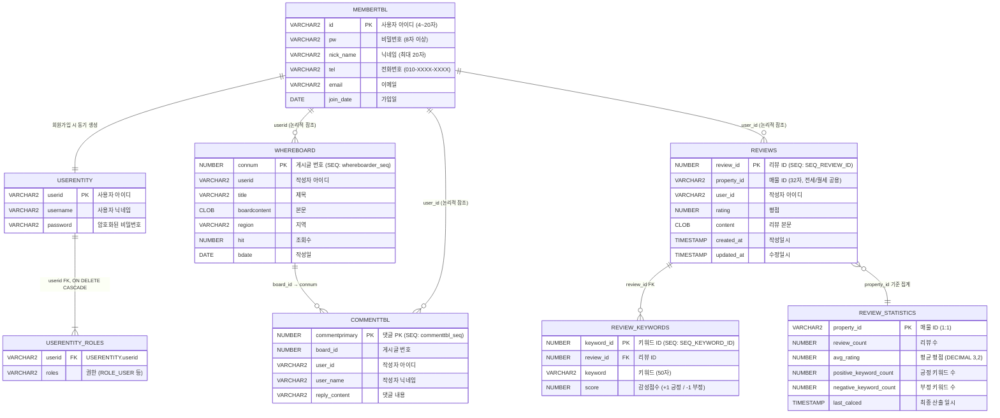

# Wherehouse ERD — 회원 관리 & 리뷰 도메인

> Entity 코드(`@Entity`, `@Table`)에서 역추출한 실제 테이블 구조

---

## 전체 테이블 목록 (회원 + 리뷰 관련)

| # | 테이블명 | Entity 클래스 | 도메인 |
|---|---------|--------------|--------|
| 1 | `MEMBERTBL` | `MembersEntity` | 회원 관리 |
| 2 | `USERENTITY` | `AuthenticationEntity` | 인증/인가 (JWT) |
| 3 | `USERENTITY_ROLES` | `@ElementCollection` (하위 테이블) | 인증/인가 (JWT) |
| 4 | `WHEREBOARD` | `BoardEntity` | 게시판 |
| 5 | `COMMENTTBL` | `CommentEntity` | 게시판 댓글 |
| 6 | `REVIEWS` | `Review` | 리뷰 |
| 7 | `REVIEW_STATISTICS` | `ReviewStatistics` | 리뷰 통계 |
| 8 | `REVIEW_KEYWORDS` | `ReviewKeyword` | 리뷰 키워드 |

---

## ERD (Mermaid)



---

## 핵심 관계 분석

### A. 회원 관리 → 인증 (이중 테이블 구조)

| 관계 | 설명 |
|------|------|
| `MEMBERTBL` ↔ `USERENTITY` | **논리적 1:1**, 물리적 FK 없음 |
| 동기화 시점 | `AuthenticationEntityConverter.toEntity()`로 회원가입 시 동시 생성 |
| 매핑 | `MEMBERTBL.id` = `USERENTITY.userid`, `MEMBERTBL.nickName` = `USERENTITY.username`, `MEMBERTBL.pw` = `USERENTITY.password` |
| 역할 분리 | `MEMBERTBL` = 회원 프로필 정보, `USERENTITY` = Spring Security 인증 전용 |

### B. 리뷰 도메인 3개 테이블 관계

```
REVIEWS (원본) ──1:N──→ REVIEW_KEYWORDS (키워드 태그)
    │
    └── property_id 기준 ──N:1──→ REVIEW_STATISTICS (집계 캐시)
```

- **REVIEWS → REVIEW_KEYWORDS**: `review_id` FK, CASCADE DELETE
- **REVIEWS → REVIEW_STATISTICS**: `property_id` 기준 집계. REVIEW_STATISTICS의 PK가 `property_id` 자체 (1:1)
- **UK 제약**: `REVIEWS(PROPERTY_ID, USER_ID)` 유니크 → 한 매물에 한 유저 하나의 리뷰만 가능

### C. 시퀀스 객체 목록

| 시퀀스 | 대상 테이블 | 컬럼 |
|--------|-----------|------|
| `SEQ_REVIEW_ID` | `REVIEWS` | `REVIEW_ID` |
| `SEQ_KEYWORD_ID` | `REVIEW_KEYWORDS` | `KEYWORD_ID` |
| `whereboarder_seq` | `WHEREBOARD` | `CONNUM` |
| `commenttbl_seq` | `COMMENTTBL` | `COMMENTPRIMARY` |

---

## 테스트 데이터 삽입 시 주의사항

### 1. 삽입 순서 (FK 의존성)

```
── 현재 삽입 대상 ──────────────────────────
① MEMBERTBL (회원)
② USERENTITY + USERENTITY_ROLES (인증 — 반드시 ①과 동시)
③ REVIEWS (리뷰 — user_id, property_id 참조)
④ REVIEW_KEYWORDS (키워드 — review_id 참조)
⑤ REVIEW_STATISTICS (통계 — property_id 기준 집계)

── 최후순위 (현재 미진행) ──────────────────
⑥ WHEREBOARD (게시판 — userid 참조)
⑦ COMMENTTBL (댓글 — board_id, user_id 참조)
```

### 2. 시퀀스 동기화 필수

Review Entity 주석에 명시된 대로, 직접 INSERT 후 시퀀스 Current Value를 반드시 동기화해야 한다:

```sql
-- 예: REVIEWS 테이블 직접 INSERT 후
SELECT MAX(REVIEW_ID) FROM REVIEWS;  -- 결과: 150
-- 시퀀스를 151 이상으로 조정
ALTER SEQUENCE SEQ_REVIEW_ID INCREMENT BY 151;
SELECT SEQ_REVIEW_ID.NEXTVAL FROM DUAL;
ALTER SEQUENCE SEQ_REVIEW_ID INCREMENT BY 1;
```

### 3. MEMBERTBL ↔ USERENTITY 정합성

회원 데이터 직접 INSERT 시 두 테이블 모두에 삽입해야 JWT 인증이 동작한다. `USERENTITY_ROLES`에 최소 하나의 권한(`ROLE_USER`)도 필수.

### 4. REVIEWS 유니크 제약

`UK_REVIEWS_PROPERTY_USER(PROPERTY_ID, USER_ID)` — 동일 매물에 동일 유저의 중복 리뷰 INSERT 시 제약 위반 에러 발생.
