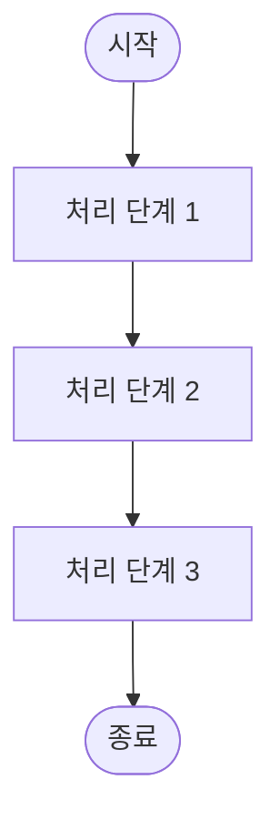
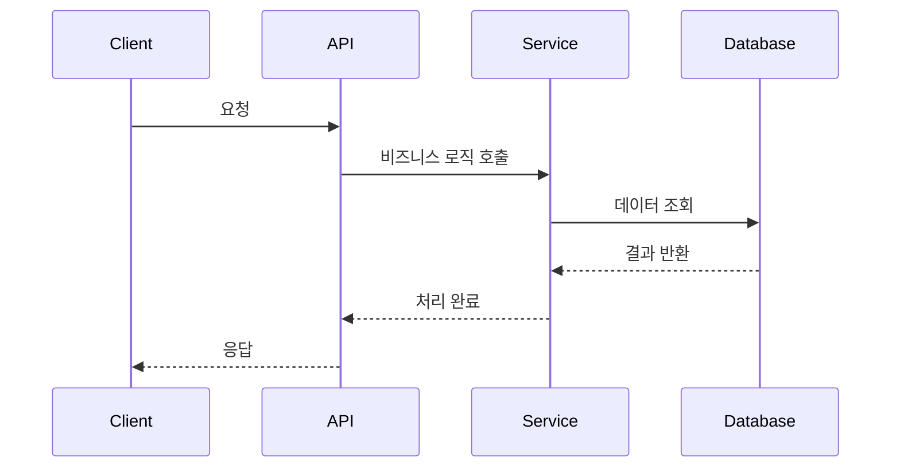

# [시스템명] 설계 명세서

프로젝트명: [프로젝트 정식 명칭]  
문서 버전: [버전 번호]  
작성일: [YYYY년 MM월 DD일]  
작성자: [작성자명]

---

## 목차

1. [개요](#1-개요)
2. [시스템 전체 개요](#2-시스템-전체-개요)
3. [일반 요구사항](#3-일반-요구사항)
4. [기존 시스템 분석](#4-기존-시스템-분석)
5. [시스템 아키텍처](#5-시스템-아키텍처)
6. [API 명세](#6-api-명세)
7. [데이터 모델](#7-데이터-모델)
8. [핵심 비즈니스 로직](#8-핵심-비즈니스-로직)
9. [배치 처리 명세](#9-배치-처리-명세)
10. [실시간 서비스 명세](#10-실시간-서비스-명세)
11. [구현 기술 스택](#11-구현-기술-스택)
12. [부록](#12-부록)

---

## 1. 개요

### 1.1 목적

[본 문서의 목적과 시스템이 해결하려는 핵심 문제를 명확하게 기술]

### 1.2 범위

[문서가 다루는 시스템의 범위와 제약사항을 명시]

---

## 2. 시스템 전체 개요

### 2.1 핵심 아키텍처 요약

[시스템의 핵심 구성요소, 데이터 흐름, 주요 처리 방식을 3-5문단으로 압축하여 설명한다. 독자가 세부 명세를 읽기 전에 시스템 전체의 큰 그림을 이해할 수 있도록 작성한다.]

**주요 구성요소**
- [컴포넌트 1]: [역할 및 책임 요약]
- [컴포넌트 2]: [역할 및 책임 요약]
- [컴포넌트 3]: [역할 및 책임 요약]

**핵심 처리 흐름**
[데이터가 시스템에 진입하여 최종 결과로 출력되기까지의 전체 프로세스를 간략히 서술]

**아키텍처 특징**
- [특징 1]: [설명]
- [특징 2]: [설명]

### 2.2 전체 데이터 처리 흐름도

[시스템의 End-to-End 데이터 흐름을 시각화한다. Mermaid 다이어그램, 플로우차트 등을 활용하여 주요 프로세스 단계와 데이터 이동 경로를 표현한다.]



**흐름도 설명**
1. **[단계 1]**: [처리 내용 및 의미]
2. **[단계 2]**: [처리 내용 및 의미]
3. **[단계 3]**: [처리 내용 및 의미]

### 2.3 주요 컴포넌트 간 상호작용

[시스템 내 주요 컴포넌트들이 어떻게 상호작용하는지 시퀀스 다이어그램 또는 컴포넌트 다이어그램으로 표현한다.]



**상호작용 설명**
- [컴포넌트 A → 컴포넌트 B]: [상호작용 내용 및 데이터 교환 방식]
- [컴포넌트 B → 컴포넌트 C]: [상호작용 내용 및 데이터 교환 방식]

---

## 3. 일반 요구사항

### 3.1 기술 요구사항

- **데이터 형식**: [예: JSON(application/json)]
- **문자 인코딩**: [예: UTF-8]
- **인증 방식**: [인증 메커니즘 설명]
- **기본 URL**: [시스템의 base URL]

### 3.2 성능 요구사항

- **응답 시간**: [목표 응답 시간]
- **동시 처리량**: [예상 TPS]
- **가용성**: [예: 99.9%]

---

## 4. 기존 시스템 분석

### 4.1 기존 아키텍처 분석

**컨트롤러 구조**
- [컨트롤러명]: [역할 및 엔드포인트 설명]
- [사용하는 DTO/VO 설명]
- [입력 검증 방식]

**서비스 레이어 구조**
- [서비스명]: [비즈니스 로직 역할]
- [공통 컴포넌트 설명]

**데이터베이스 구조**
- [주요 테이블 및 관계 설명]
- [핵심 컬럼 목록]
- [사용 중인 DB 종류 및 특징]

### 4.2 기존 비즈니스 로직의 상세 분석

**[로직명 1]**
```java
// 주요 로직의 의사코드 또는 실제 코드
// 조건 1: [조건 설명]
if ([조건]) {
    [처리 내용]
}
// 조건 2: [조건 설명]
else if ([조건]) {
    [처리 내용]
}
```

**[로직명 2]**
```java
// 추가 로직 설명
```

### 4.3 데이터 처리 흐름 분석

**[시스템명] 데이터 처리 흐름**
```[언어]
// 1단계: [처리 단계 설명]
[코드 또는 의사코드]

// 2단계: [처리 단계 설명]
[코드 또는 의사코드]

// 3단계: [처리 단계 설명]
[코드 또는 의사코드]
```

---

## 5. 시스템 아키텍처

### 5.1 아키텍처 개요

[시스템의 전체적인 구조와 주요 컴포넌트 간 관계 설명]

### 5.2 시스템 구성 요소

| 구성 요소 | 역할 | 주요 기술 |
|----------|------|----------|
| [컴포넌트 1] | [역할 설명] | [사용 기술] |
| [컴포넌트 2] | [역할 설명] | [사용 기술] |

### 5.3 데이터 흐름

```
[데이터 흐름도 또는 설명]
```

---

## 6. API 명세

### 6.1 [API 이름 1]

| 항목 | 내용 |
|------|------|
| **기능 설명** | [API의 목적과 기능 상세 설명] |
| **HTTP Method** | [GET/POST/PUT/DELETE] |
| **Endpoint URL** | [/api/path] |

#### 6.1.1 요청 (Request)

**Request Headers**

| 헤더명 | 필수 | 설명 |
|--------|------|------|
| [Header] | [Y/N] | [설명] |

**Request Body**

| 필드 | 타입 | 필수 | 설명 | 예시 |
|------|------|------|------|------|
| [field1] | [Type] | ✓ | [설명] | [예시값] |
| [field2] | [Type] | ✗ | [설명] | [예시값] |

**Request 예시**
```json
{
  "[field1]": "[value1]",
  "[field2]": "[value2]"
}
```

#### 6.1.2 응답 (Response)

**성공 응답: [HTTP 상태 코드]**

| 필드 | 타입 | 설명 |
|------|------|------|
| [field1] | [Type] | [설명] |
| [field2] | [Type] | [설명] |

**Response 예시**
```json
{
  "[field1]": "[value1]",
  "[field2]": {
    "[nested]": "[value]"
  }
}
```

#### 6.1.3 에러 응답

| HTTP 코드 | 상황 | 응답 예시 |
|-----------|------|----------|
| [400] | [상황 설명] | `{"error": "[에러 메시지]"}` |
| [500] | [상황 설명] | `{"error": "[에러 메시지]"}` |

---

## 7. 데이터 모델

### 7.1 데이터베이스 스키마

#### 7.1.1 [테이블명 1]

**용도**: [테이블의 목적과 역할]

| 컬럼명 | 데이터 타입 | 제약조건 | 설명 |
|--------|-------------|----------|------|
| [column1] | [TYPE] | [PK/FK/NOT NULL] | [설명] |
| [column2] | [TYPE] | [제약조건] | [설명] |

**인덱스**
- [인덱스명]: [인덱스 대상 컬럼 및 타입]

### 7.2 DTO 구조

#### 7.2.1 [DTO 클래스명]

**용도**: [DTO의 사용 목적]

```java
public class [DTOName] {
    private [Type] [field1];  // [설명]
    private [Type] [field2];  // [설명]
}
```

---

## 8. 핵심 비즈니스 로직

### 8.1 [비즈니스 로직 1] - [F00X 구현]

#### 8.1.1 개요

[비즈니스 로직의 목적과 핵심 기능 설명]

#### 8.1.2 처리 흐름

1. **[단계 1]**: [처리 내용]
2. **[단계 2]**: [처리 내용]
3. **[단계 3]**: [처리 내용]

#### 8.1.3 상세 로직

**[세부 처리 1]**
```
[알고리즘 또는 계산식]
```

**[세부 처리 2]**
- [상세 설명]
- [예외 처리]

#### 8.1.4 설계 원칙

- **[원칙 1] ([영문명]):** [이 원칙이 무엇이며, 왜 중요한지, 어떻게 구현되는지 설명]
- **[원칙 2] ([영문명]):** [이 원칙의 설명과 구현 방법]

### 8.2 점수 계산 로직 (예시)

#### 8.2.1 계산 공식

```
[점수] = ([항목1] × [가중치1]) + ([항목2] × [가중치2]) + ...
```

#### 8.2.2 가중치 설정

| 항목 | 가중치 | 설명 |
|------|--------|------|
| [항목1] | [%] | [가중치 근거] |
| [항목2] | [%] | [가중치 근거] |

---

## 9. 배치 처리 명세

### 9.1 배치 프로세스 개요

- **구현 클래스**: [패키지.클래스명]
- **실행 주기**: [크론 표현식 또는 주기 설명]
- **핵심 역할**: [배치의 주요 목적]

### 9.2 배치 처리 단계

| 단계 ID | 단계명 | 상세 구현 내용 |
|---------|--------|----------------|
| B-01 | [단계명] | [상세 처리 내용] |
| B-02 | [단계명] | [상세 처리 내용] |

### 9.3 배치 데이터 구조

#### 9.3.1 [데이터 구조명]

| 필드 | 타입 | 설명 |
|------|------|------|
| [field] | [Type] | [설명] |

---

## 10. 실시간 서비스 명세

### 10.1 서비스 처리 흐름

- **구현 위치**: [서비스 클래스 위치]
- **호출 시점**: [API 엔드포인트와 연결]

### 10.2 실시간 처리 단계

| 단계 ID | 단계명 | 상세 구현 내용 |
|---------|--------|----------------|
| R-01 | [단계명] | [상세 처리 내용] |
| R-02 | [단계명] | [상세 처리 내용] |

### 10.3 캐싱 전략

#### 10.3.1 캐시 구조

| 캐시 레벨 | 키 패턴 | TTL | 용도 |
|-----------|---------|-----|------|
| [Level 1] | [pattern] | [시간] | [용도] |
| [Level 2] | [pattern] | [시간] | [용도] |

---

## 11. 구현 기술 스택

### 11.1 백엔드 기술

| 구분 | 기술 | 버전 | 선정 이유 |
|------|------|------|----------|
| Framework | [Spring Boot] | [3.x] | [이유] |
| Database | [PostgreSQL] | [14.x] | [이유] |
| Cache | [Redis] | [7.x] | [이유] |

### 11.2 주요 설정

#### 11.2.1 application.yml

```yaml
[설정 카테고리]:
  [설정항목]: [값]
  [중첩설정]:
    [항목]: [값]
```

### 11.3 외부 연동

#### 11.3.1 [외부 API명]

- **Base URL**: [URL]
- **인증 방식**: [인증 설명]
- **주요 엔드포인트**: 
  - [엔드포인트 1]: [용도]
  - [엔드포인트 2]: [용도]

---

## 12. 부록

### 12.1 용어 정의

| 용어 | 정의 |
|------|------|
| [용어 1] | [설명] |
| [용어 2] | [설명] |

### 12.2 참조 문서

- [문서 1]: [설명]
- [문서 2]: [설명]

### 12.3 예외 상황 처리

#### 12.3.1 [예외 상황 1]

- **발생 조건**: [조건 설명]
- **처리 방안**: [해결 방법]
- **사용자 안내**: [메시지]

### 12.4 문서 변경 이력

| 버전 | 작성일 | 작성자 | 변경 내용 |
|------|--------|--------|----------|
| 1.0 | [날짜] | [작성자] | 초안 작성 |
| 1.1 | [날짜] | [작성자] | [변경사항] |

---

## 문서 종료

본 문서는 '[시스템명]'의 상세 설계 명세를 제공한다.

**문서 작성 완료일**: [YYYY년 MM월 DD일]  
**문서 상태**: [상태]

**© [연도] [조직명]. All rights reserved.**