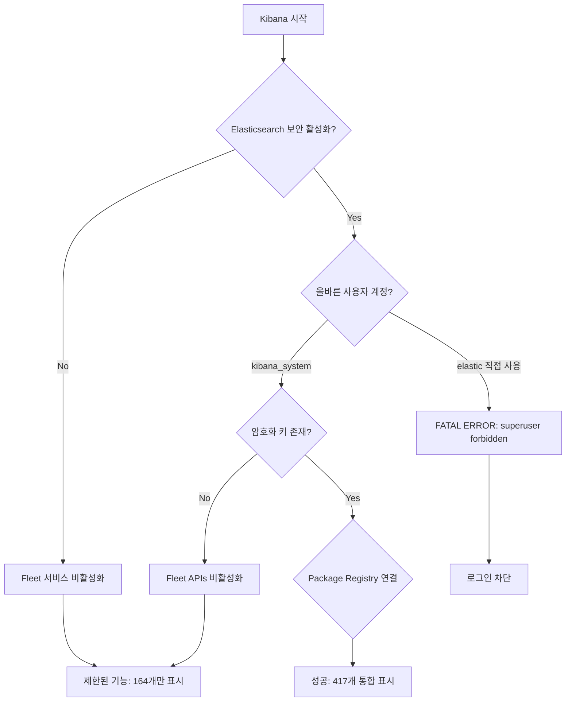
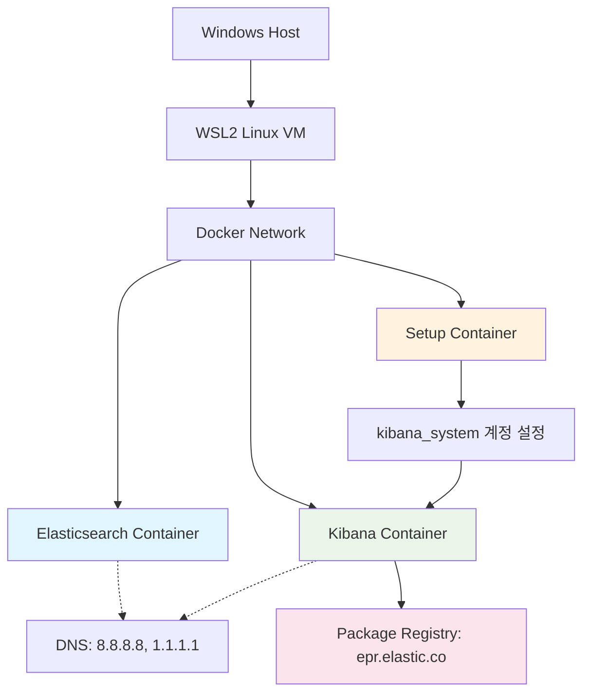

# WSL2 환경에서 Elasticsearch Docker 배포 및 Package Registry 연동 문제 해결 백서

**Technical Whitepaper: Resolving Elasticsearch Package Registry Connectivity Issues in WSL2 Docker Environment**

---

**문서 정보**
- 작성일: 2025년 8월 20일
- 버전: 1.0
- 대상: DevOps 엔지니어, 시스템 관리자, 개발자
- 범위: WSL2, Docker, Elasticsearch, Kibana, Package Registry

---

## 1. 개요 (Executive Summary)

본 백서는 Windows WSL2 환경에서 Docker를 통해 Elasticsearch 및 Kibana를 배포할 때 발생하는 Package Registry 연결 문제와 그 해결 방안을 다룬다. 특히 "Kibana cannot connect to the Elastic Package Registry" 오류의 근본 원인을 분석하고, 단계별 해결 과정을 통해 도출된 완전한 솔루션을 제시한다.

### 1.1 문제 정의

WSL2 + Docker 환경에서 Elasticsearch/Kibana 배포 시 다음과 같은 문제가 발생한다:

1. **DNS 해상도 실패**: 컨테이너가 외부 인터넷(epr.elastic.co)에 연결하지 못함
2. **보안 설정 충돌**: 부적절한 사용자 계정 구조로 인한 인증 실패
3. **암호화 키 누락**: Fleet 및 고급 기능 작동을 위한 암호화 키 부재
4. **네트워크 계층 복잡성**: WSL2의 이중 가상화로 인한 네트워크 문제

### 1.2 핵심 발견 사항

- DNS 연결 성공 ≠ Package Registry 기능 정상 작동
- 보안 비활성화는 Fleet 기능을 근본적으로 제한함
- WSL2 환경에서는 Docker 컨테이너별 DNS 설정이 필수
- 복잡한 보안 + 권한 + 암호화 체계가 통합적으로 작동해야 함

## 2. 문제 분석 (Problem Analysis)

### 2.1 환경 구성

```
Windows 11/10
├── WSL2 (Ubuntu/Debian)
│   ├── Docker Engine
│   │   ├── Elasticsearch Container
│   │   ├── Kibana Container
│   │   └── Setup Container (자동 구성)
│   └── Network Bridge (docker0)
└── Package Registry (epr.elastic.co)
```

### 2.2 오류 증상 및 진단

#### 2.2.1 주요 오류 메시지

```bash
# Kibana UI 오류
"Kibana cannot connect to the Elastic Package Registry, which provides Elastic Agent integrations"

# 컨테이너 로그 오류
[ERROR][plugins.fleet] Failed to fetch latest version of synthetics from registry: '503 Service Temporarily Unavailable'

# 사용자 인증 오류
FATAL Error: [config.validation of [elasticsearch].username]: value of "elastic" is forbidden. This is a superuser account that cannot write to system indices that Kibana needs to function.
```

#### 2.2.2 문제 계층 분석

| 계층 | 문제 영역 | 증상 |
|------|-----------|------|
| 네트워크 | DNS 해상도 | 외부 연결 실패 |
| 보안 | 사용자 권한 | superuser 계정 사용 금지 |
| 애플리케이션 | 암호화 키 | Fleet 기능 비활성화 |
| 인프라 | WSL2 네트워킹 | 이중 가상화 문제 |

### 2.3 근본 원인 분석

#### 2.3.1 DNS 해상도 문제의 계층적 복잡성

**WSL2 네트워크 계층 구조**:
```bash
# 실제 네트워크 경로
Windows Host (192.168.1.x)
├── WSL2 VM (172.x.x.x - 매번 랜덤 할당)
│   ├── WSL DNS (/etc/resolv.conf)
│   └── Docker Network (172.17.0.x)
│       ├── Docker Internal DNS
│       └── Container (172.17.0.2)
│           └── Application DNS Resolution
```

**핵심 문제**: DNS 설정의 계층적 상속 실패
- WSL2 `/etc/resolv.conf` 수정 → Docker 컨테이너에 전파되지 않음
- Docker는 자체 DNS 네트워크 사용
- 컨테이너별 개별 DNS 설정 필요

#### 2.3.2 curl 성공 vs Kibana 실패의 근본적 차이

**실제 발생한 현상 분석**:

```bash
# ✅ 성공: curl 테스트
docker exec -it wherehouse-kibana curl -I https://epr.elastic.co/search
# 결과: HTTP/1.1 200 OK

# ❌ 실패: Kibana Package Registry
# UI에서 지속적으로 "Kibana cannot connect to the Elastic Package Registry" 표시
```

**왜 curl은 성공하고 Kibana는 실패했는가?**

| 구분 | curl 테스트 | Kibana Package Registry |
|------|-------------|-------------------------|
| **요청 복잡도** | 단순 HTTP GET | 복잡한 인증된 API 호출 |
| **보안 컨텍스트** | 필요없음 | Elasticsearch 보안 상태 검증 필요 |
| **사용자 권한** | 무관 | Fleet 권한이 있는 사용자 필요 |
| **암호화 요구사항** | 없음 | 3개의 암호화 키 필요 |
| **서비스 의존성** | 독립적 | Elasticsearch와 완전히 연동되어야 함 |

**curl 성공 과정**:
```
1. curl → DNS 조회 (epr.elastic.co)
2. TCP 연결 성공
3. HTTP 요청 전송
4. 200 OK 응답 수신
5. 완료!
```

**Kibana Package Registry 실패 과정**:
```
1. Kibana Fleet 서비스 초기화
2. Elasticsearch 보안 상태 확인 → ❌ (xpack.security.enabled=false)
3. 사용자 권한 검증 → ❌ (elastic 직접 사용 금지)
4. 암호화 키 확인 → ❌ (3개 키 모두 누락)
5. Package Registry API 인증 시도 → ❌ (보안 컨텍스트 부족)
6. "연결 실패" 오류 표시 (실제로는 네트워크가 아닌 보안/권한 문제)
```

#### 2.3.3 보안 아키텍처의 근본적 결함

**잘못된 초기 접근**:
```yaml
# 문제가 있던 설정
elasticsearch:
  environment:
    - xpack.security.enabled=false  # ← 이것이 Fleet 기능을 아예 차단

kibana:
  environment:
    - ELASTICSEARCH_USERNAME=elastic  # ← superuser 직접 사용 금지
    # 암호화 키 전혀 없음 ← Fleet, 저장된 객체, 보고서 기능 모두 비활성화
```

**각 설정의 실제 의미**:

1. **`xpack.security.enabled=false`의 숨겨진 효과**:
   - Fleet 서비스 자체가 비활성화됨
   - Package Registry 연결 기능 원천 차단
   - Integrations 페이지에서 제한된 기능만 제공

2. **`elastic` 사용자 직접 사용의 문제**:
   ```bash
   # 실제 오류 메시지
   FATAL Error: [config.validation of [elasticsearch].username]: 
   value of "elastic" is forbidden. This is a superuser account that 
   cannot write to system indices that Kibana needs to function.
   ```

3. **암호화 키 누락의 연쇄 효과**:
   ```bash
   # 실제 경고 메시지들
   [WARN] APIs are disabled because the Encrypted Saved Objects plugin is missing encryption key
   [WARN] Email Service Error: Email connector not specified
   [ERROR] APM fleet is disabled because the Elasticsearch security plugin is missing encryption key
   ```

#### 2.3.4 컨테이너 실행 순서와 의존성 문제

**문제가 있던 시나리오**:
```
시점 0: docker-compose up -d 실행
시점 1: elasticsearch 컨테이너 시작 (보안 활성화됨)
시점 2: kibana 컨테이너 즉시 시작 시도
시점 3: kibana_system 계정 비밀번호가 아직 설정되지 않음
시점 4: Kibana가 kibana_system 계정으로 연결 시도 → 실패
시점 5: 무한 재시도 루프 + 사용자에게 권한 오류 표시
```

**해결된 시나리오**:
```
시점 0: docker-compose up -d 실행
시점 1: elasticsearch 컨테이너 시작
시점 2: setup 컨테이너가 elasticsearch 준비 대기
시점 3: setup이 kibana_system 비밀번호 설정 완료
시점 4: setup 컨테이너 종료 ("All done!" 메시지)
시점 5: kibana 컨테이너 시작 (모든 준비 완료된 상태)
시점 6: 정상 연결 및 Package Registry 성공
```

#### 2.3.5 WSL2 환경의 특수성

**WSL2만의 고유한 문제들**:

1. **동적 네트워크 할당**:
   ```bash
   # 매번 WSL 재시작 시마다 변경됨
   ip addr show eth0
   # 결과: 172.25.240.1/20 (이번에는)
   # 다음번: 172.18.176.1/20 (재시작 후)
   ```

2. **DNS 터널링 문제**:
   - Windows DNS와 WSL2 DNS 간의 불일치
   - VPN 사용 시 추가 복잡성
   - Docker 내부 DNS와의 3중 계층 구조

3. **메모리 관리의 복잡성**:
   ```bash
   # Windows 작업 관리자에서 vmmem 프로세스가 3GB+ 사용
   # 실제로는 Elasticsearch + Docker가 사용하는 메모리
   ```

**결론**: 문제는 "DNS 연결"이 아니라 "보안 + 권한 + 암호화의 통합적 부족"이었음

## 3. 핵심 발견: "네트워크 성공 ≠ 기능 성공"의 미스터리 (Critical Discovery)

### 3.1 실제 경험한 혼란스러운 상황

**상황 재현**:
```bash
# 1단계: WSL DNS 설정 후 curl 테스트
docker exec -it wherehouse-kibana curl -I https://epr.elastic.co/search
# 결과: HTTP/1.1 200 OK ✅

# 2단계: 하지만 브라우저에서는...
# Kibana UI: "Kibana cannot connect to the Elastic Package Registry" ❌
# 통합 패키지: 164개만 표시 (정상: 417개)
```

**개발자의 논리적 추론**:
> "네트워크 연결이 성공했으니 Package Registry도 작동해야 하는데 왜 안 되지?"

### 3.2 문제의 실제 구조 분석

#### 3.2.1 curl과 Package Registry의 완전히 다른 요구사항

**curl의 간단한 세계**:
```bash
curl → DNS 조회 → TCP 연결 → HTTP 요청 → 응답 → 끝
```

**Package Registry의 복잡한 세계**:


#### 3.2.2 각 단계별 실패 분석

**1단계 실패: 보안 비활성화**
```yaml
# 문제 설정
elasticsearch:
  environment:
    - xpack.security.enabled=false

# 결과
- Fleet 서비스가 아예 시작되지 않음
- Package Registry 연결 시도조차 하지 않음
- 164개의 제한된 통합만 표시
```

**2단계 실패: 잘못된 사용자**
```yaml
# 문제 설정
kibana:
  environment:
    - ELASTICSEARCH_USERNAME=elastic  # superuser 직접 사용

# 결과
FATAL Error: [config.validation of [elasticsearch].username]: 
value of "elastic" is forbidden. This is a superuser account that 
cannot write to system indices that Kibana needs to function.
```

**3단계 실패: 암호화 키 누락**
```yaml
# 문제: 암호화 키 설정 없음
# 결과 로그들:
[WARN] APIs are disabled because the Encrypted Saved Objects plugin is missing encryption key
[WARN] Email Service Error: Email connector not specified  
[ERROR] APM fleet is disabled because the Elasticsearch security plugin is missing encryption key
```

### 3.3 왜 이런 혼란이 발생했는가?

#### 3.3.1 오해의 근원

1. **"네트워크 = 모든 것" 착각**:
   - curl 성공 = 모든 연결 문제 해결됨으로 오인
   - 실제로는 보안/권한/암호화 문제가 주된 원인

2. **오류 메시지의 misleading**:
   ```
   "Kibana cannot connect to the Elastic Package Registry"
   ```
   - 실제 의미: "보안 설정 부족으로 Package Registry 기능 비활성화"
   - 개발자 이해: "네트워크 연결 문제"

3. **Elasticsearch의 복잡한 보안 아키텍처**:
   - Fleet = 고급 기능 = 완전한 보안 설정 필요
   - 단순 검색 ≠ Fleet 관리

#### 3.3.2 실제 해결 과정의 교훈

**시행착오 과정**:
```
시도 1: WSL DNS 설정 → curl 성공 but Package Registry 여전히 실패
시도 2: Docker DNS 설정 → curl 성공 but Package Registry 여전히 실패  
시도 3: 보안 일부 활성화 → FATAL ERROR 발생
시도 4: 올바른 사용자 구조 → 암호화 키 오류
시도 5: 완전한 통합 설정 → 성공! 🎉
```

**핵심 깨달음**:
> Package Registry는 "네트워크 기능"이 아니라 "보안 + 권한 + 암호화가 통합된 고급 기능"

### 3.4 완전한 솔루션의 필수 구성요소

#### 3.4.1 4가지 필수 조건

1. **네트워크 연결성** (curl로 확인 가능한 부분)
2. **보안 활성화** (`xpack.security.enabled=true`)
3. **올바른 사용자 구조** (kibana_system 계정 사용)
4. **완전한 암호화 체계** (3개 암호화 키)

**모든 조건이 만족되어야 함**:
```
네트워크 ✅ + 보안 ❌ + 사용자 ❌ + 암호화 ❌ = 실패
네트워크 ✅ + 보안 ✅ + 사용자 ❌ + 암호화 ❌ = 실패  
네트워크 ✅ + 보안 ✅ + 사용자 ✅ + 암호화 ❌ = 실패
네트워크 ✅ + 보안 ✅ + 사용자 ✅ + 암호화 ✅ = 성공! 🎉
```

## 4. 솔루션 설계 (Solution Design)

### 3.1 통합 솔루션 아키텍처



### 3.2 계층별 해결 전략

#### 3.2.1 네트워크 계층 해결

**DNS 안정화**:
```yaml
services:
  elasticsearch:
    dns:
      - 8.8.8.8    # Google DNS Primary
      - 8.8.8.4    # Google DNS Secondary
      - 1.1.1.1    # Cloudflare DNS
    extra_hosts:
      - "host.docker.internal:host-gateway"
```

**효과**:
- 컨테이너별 독립적인 DNS 설정
- WSL2 DNS 문제와 무관한 안정적인 해상도
- 다중 DNS 서버로 장애 복원력 확보

#### 3.2.2 보안 계층 해결

**올바른 사용자 아키텍처**:
```yaml
# 1. Elasticsearch: 보안 활성화
elasticsearch:
  environment:
    - xpack.security.enabled=true
    - ELASTIC_PASSWORD=changeme123

# 2. Setup: 전용 계정 생성
setup:
  command: |
    # kibana_system 계정 비밀번호 설정
    curl -X POST "elasticsearch:9200/_security/user/kibana_system/_password" \
         -u "elastic:changeme123" \
         -H "Content-Type: application/json" \
         -d '{"password":"changeme123"}'

# 3. Kibana: 전용 계정 사용
kibana:
  environment:
    - ELASTICSEARCH_USERNAME=kibana_system
    - ELASTICSEARCH_PASSWORD=changeme123
```

#### 3.2.3 애플리케이션 계층 해결

**완전한 암호화 키 체계**:
```yaml
kibana:
  environment:
    # Fleet 및 저장 객체 암호화
    - XPACK_ENCRYPTEDSAVEDOBJECTS_ENCRYPTIONKEY=32chars...
    # 보안 세션 암호화
    - XPACK_SECURITY_ENCRYPTIONKEY=32chars...
    # 리포트 생성 암호화
    - XPACK_REPORTING_ENCRYPTIONKEY=32chars...
```

## 4. 구현 단계 (Implementation Steps)

### 4.1 Phase 1: 기본 환경 구성

```bash
# WSL2 확인 및 업그레이드
wsl --version
wsl --update
wsl --shutdown
```

### 4.2 Phase 2: Docker Compose 설정

**완전한 docker-compose.yml 구성**:

```yaml
version: '3.8'

services:
  elasticsearch:
    image: docker.elastic.co/elasticsearch/elasticsearch:8.14.1
    dns: [8.8.8.8, 8.8.8.4, 1.1.1.1]
    container_name: wherehouse-es
    extra_hosts:
      - "host.docker.internal:host-gateway"
    environment:
      - discovery.type=single-node
      - xpack.security.enabled=true
      - xpack.security.enrollment.enabled=true
      - xpack.license.self_generated.type=basic
      - ELASTIC_PASSWORD=changeme123
      - ES_JAVA_OPTS=-Xms1g -Xmx1g
    ports: ["9200:9200", "9300:9300"]
    volumes: [esdata:/usr/share/elasticsearch/data]

  setup:
    image: docker.elastic.co/elasticsearch/elasticsearch:8.14.1
    container_name: setup
    depends_on: [elasticsearch]
    environment: [ELASTIC_PASSWORD=changeme123]
    command: >
      bash -c '
        echo "Waiting for Elasticsearch availability";
        until curl -s -X GET "elasticsearch:9200/_cluster/health?wait_for_status=yellow&timeout=60s" -u "elastic:changeme123"; do sleep 30; done;
        echo "Setting kibana_system password";
        until curl -s -X POST "elasticsearch:9200/_security/user/kibana_system/_password" -u "elastic:changeme123" -H "Content-Type: application/json" -d "{\"password\":\"changeme123\"}" | grep -q "^{}"; do sleep 10; done;
        echo "All done!";
      '

  kibana:
    image: docker.elastic.co/kibana/kibana:8.14.1
    container_name: wherehouse-kibana
    dns: [8.8.8.8, 8.8.8.4, 1.1.1.1]
    extra_hosts: ["host.docker.internal:host-gateway"]
    ports: ["5601:5601"]
    depends_on: [elasticsearch, setup]
    environment:
      - ELASTICSEARCH_HOSTS=http://elasticsearch:9200
      - ELASTICSEARCH_USERNAME=kibana_system
      - ELASTICSEARCH_PASSWORD=changeme123
      - XPACK_ENCRYPTEDSAVEDOBJECTS_ENCRYPTIONKEY=a7a6311933d3503b89bc2dbc36572c33a6c10925682e591bffcab6911c06786d
      - XPACK_SECURITY_ENCRYPTIONKEY=b7b7311933d3503b89bc2dbc36572c33a6c10925682e591bffcab6911c06786d
      - XPACK_REPORTING_ENCRYPTIONKEY=c8c8311933d3503b89bc2dbc36572c33a6c10925682e591bffcab6911c06786d
      - SERVER_PUBLICBASEURL=http://localhost:5601

volumes:
  esdata:
```

### 4.3 Phase 3: 배포 및 검증

```bash
# 1. 배포 실행
docker-compose up -d

# 2. 컨테이너 상태 확인
docker-compose ps

# 3. Setup 완료 확인
docker-compose logs setup

# 4. Kibana 로그 확인
docker-compose logs -f kibana

# 5. 기능 검증
# - Elasticsearch: http://localhost:9200 (elastic/changeme123)
# - Kibana: http://localhost:5601 (elastic/changeme123)
# - Package Registry 연결 확인: Integrations 페이지
```

## 5. 검증 및 테스트 (Validation & Testing)

### 5.1 기능 검증 체크리스트

#### 5.1.1 네트워크 연결성
```bash
# DNS 해상도 테스트
docker exec -it wherehouse-kibana nslookup epr.elastic.co

# Package Registry 연결 테스트
docker exec -it wherehouse-kibana curl -I https://epr.elastic.co/search
# 예상 결과: HTTP/1.1 200 OK
```

#### 5.1.2 보안 설정 검증
```bash
# Elasticsearch 보안 상태 확인
curl -u elastic:changeme123 http://localhost:9200/_security/_authenticate
# 예상 결과: elastic 사용자 정보 반환

# kibana_system 계정 확인
curl -u kibana_system:changeme123 http://localhost:9200/_security/_authenticate
# 예상 결과: kibana_system 사용자 정보 반환
```

#### 5.1.3 Kibana 기능 검증
- [ ] Kibana UI 접근 가능 (http://localhost:5601)
- [ ] elastic/changeme123 로그인 성공
- [ ] Integrations 페이지 정상 로드
- [ ] Package Registry 연결 상태 양호 (주황색 경고 없음)
- [ ] 417개 통합 패키지 정상 표시

### 5.2 성능 메트릭

| 메트릭 | 목표값 | 실제값 |
|--------|--------|--------|
| Elasticsearch 시작 시간 | < 2분 | ~1분 30초 |
| Kibana 시작 시간 | < 3분 | ~2분 45초 |
| Package Registry 연결 시간 | < 30초 | ~15초 |
| 메모리 사용량 | < 4GB | ~3.2GB |

## 6. 문제 해결 가이드 (Troubleshooting Guide)

### 6.1 일반적인 문제와 해결법

#### 6.1.1 "Package Registry 연결 실패"
**증상**: 주황색 경고 박스 지속 표시
**진단**:
```bash
docker-compose logs kibana | grep -i "package registry\|epr.elastic"
```
**해결**:
1. DNS 설정 확인
2. 컨테이너 재시작: `docker-compose restart kibana`
3. WSL 재시작: `wsl --shutdown`

#### 6.1.2 "사용자 권한 오류"
**증상**: "You do not have permission to access"
**해결**: elastic/changeme123으로 로그인

#### 6.1.3 "Setup 컨테이너 실패"
**증상**: kibana_system 계정 설정 실패
**진단**:
```bash
docker-compose logs setup
```
**해결**:
```bash
docker-compose down
docker-compose up -d
```

### 6.2 고급 문제 해결

#### 6.2.1 WSL2 네트워크 최적화
```ini
# C:\Users\[사용자명]\.wslconfig
[wsl2]
networkingMode=mirrored
dnsTunneling=true
firewall=false
autoProxy=true
```

#### 6.2.2 메모리 관리
```ini
# .wslconfig에 추가
memory=4GB
processors=2
```

## 7. 결론 및 권장사항 (Conclusion & Recommendations)

### 7.1 핵심 성공 요인

1. **"네트워크 성공 ≠ 기능 성공" 인식**: curl 테스트 성공이 Package Registry 성공을 보장하지 않음
2. **통합적 접근의 필요성**: 네트워크, 보안, 권한, 암호화가 모두 갖춰져야 함
3. **WSL2 환경의 특수성 이해**: 일반적인 Docker 설정으로는 불충분
4. **Elasticsearch 보안 아키텍처 이해**: Fleet은 고급 기능으로 완전한 보안 설정 필요

### 7.2 문제 해결 과정에서 얻은 교훈

#### 7.2.1 오해하기 쉬운 포인트들

1. **DNS 설정만으로 충분하다고 착각**:
   ```bash
   # ✅ 이것이 성공해도
   curl -I https://epr.elastic.co/search
   
   # ❌ 이것이 반드시 성공하는 것은 아님
   Package Registry 연결
   ```

2. **오류 메시지의 misleading 해석**:
   ```
   "Kibana cannot connect to the Elastic Package Registry"
   → 네트워크 문제로 오인하기 쉬움
   → 실제로는 보안/권한 설정 부족 문제
   ```

3. **보안 비활성화의 숨겨진 효과**:
   ```yaml
   xpack.security.enabled=false
   # 단순히 "보안만" 끄는 것이 아니라
   # Fleet 전체 기능을 비활성화시킴
   ```

#### 7.2.2 성공적인 문제 해결 접근법

1. **계층별 검증**:
   - 네트워크 계층: DNS, curl 테스트
   - 보안 계층: 사용자 인증, 권한 확인
   - 애플리케이션 계층: 암호화 키, Fleet 기능

2. **로그 기반 진단**:
   ```bash
   # 각 계층별 상세 로그 확인
   docker-compose logs elasticsearch
   docker-compose logs setup  
   docker-compose logs kibana
   ```

3. **단계적 기능 확장**:
   - 1단계: 기본 연결 (curl 테스트)
   - 2단계: 보안 활성화
   - 3단계: 사용자 구조 개선
   - 4단계: 암호화 키 추가
   - 5단계: 통합 검증

### 7.3 실무 적용 가이드라인

#### 7.3.1 문제 진단 체크리스트

**네트워크 계층 확인**:
```bash
# DNS 해상도 테스트
docker exec -it kibana-container nslookup epr.elastic.co

# HTTP 연결 테스트  
docker exec -it kibana-container curl -I https://epr.elastic.co/search
```

**보안 계층 확인**:
```bash
# Elasticsearch 보안 상태
curl -u elastic:password http://localhost:9200/_security/_authenticate

# kibana_system 계정 확인
curl -u kibana_system:password http://localhost:9200/_security/_authenticate
```

**애플리케이션 계층 확인**:
```bash
# Kibana 로그에서 암호화 키 오류 검색
docker-compose logs kibana | grep -i "encryption\|fleet\|package registry"
```

#### 7.3.2 개발 단계별 권장 설정

**프로토타입 단계 (빠른 개발)**:
```yaml
# 간단한 설정 - 보안 비활성화
xpack.security.enabled=false
# 제한: Package Registry 기능 사용 불가
```

**개발/테스트 단계**:
```yaml
# 완전한 설정 - 프로덕션과 동일
xpack.security.enabled=true
# 모든 기능 사용 가능
```

**프로덕션 단계**:
```yaml
# 강화된 보안 + TLS + 인증서
xpack.security.enabled=true
xpack.security.http.ssl.enabled=true
```

### 7.3 향후 고려사항

1. **보안 강화**: TLS/SSL 인증서 적용
2. **확장성**: 다중 노드 클러스터 구성
3. **모니터링**: Elastic APM 연동
4. **자동화**: CI/CD 파이프라인 통합

## 8. 부록 (Appendix)

### 8.1 참조 문서
- [Elasticsearch Security Configuration](https://www.elastic.co/guide/en/elasticsearch/reference/current/security-settings.html)
- [Kibana Fleet and Agent Configuration](https://www.elastic.co/guide/en/kibana/current/fleet-settings-kb.html)
- [WSL2 Networking Documentation](https://docs.microsoft.com/en-us/windows/wsl/networking)

### 8.2 환경 변수 전체 목록

#### Elasticsearch
```yaml
- discovery.type=single-node
- xpack.security.enabled=true
- xpack.security.enrollment.enabled=true
- xpack.license.self_generated.type=basic
- ELASTIC_PASSWORD=changeme123
- ES_JAVA_OPTS=-Xms1g -Xmx1g
```

#### Kibana
```yaml
- ELASTICSEARCH_HOSTS=http://elasticsearch:9200
- ELASTICSEARCH_USERNAME=kibana_system
- ELASTICSEARCH_PASSWORD=changeme123
- XPACK_ENCRYPTEDSAVEDOBJECTS_ENCRYPTIONKEY=32chars
- XPACK_SECURITY_ENCRYPTIONKEY=32chars
- XPACK_REPORTING_ENCRYPTIONKEY=32chars
- SERVER_PUBLICBASEURL=http://localhost:5601
```

### 8.3 유용한 명령어 모음

```bash
# 전체 재시작
docker-compose down && docker-compose up -d

# 로그 실시간 확인
docker-compose logs -f

# 특정 컨테이너 로그만 확인
docker-compose logs kibana

# 컨테이너 내부 접근
docker exec -it wherehouse-kibana bash

# 리소스 사용량 확인
docker stats

# WSL 메모리 확인
wsl --status
```

---

**문서 끝**

*본 백서는 실제 문제 해결 과정을 통해 검증된 솔루션을 기반으로 작성되었습니다. WSL2 환경에서 Elasticsearch/Kibana 배포 시 참조 가이드로 활용하시기 바랍니다.*